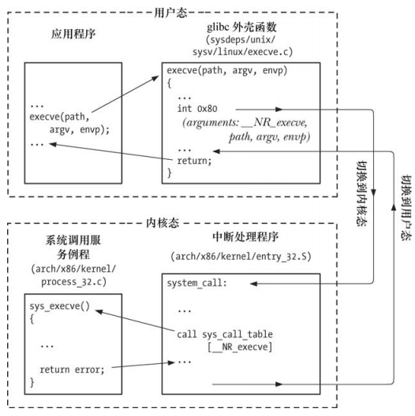

# 系统调用

系统调用是受控的内核入口，借助这个机制，进程可以请求内核以自己的名义去执行某些动作：

- 手册页 `syscalls(2)` 列出了所有的系统调用
- 系统调用将处理器从用户态切换到核心态，以便 CPU 访问受到内核保护的内核内存
- 每个系统调用都是由一个唯一的数字来标识的
- 每个系统调用可以辅之一套参数，对用户空间与内核空间之间传递消息加以规范

系统调用过程：

以 `execve()` 调用为例：

- 应用程序通过调用 C 语言的 wrapper 函数发起系统调用
- 外壳函数将参数复制到特定的寄存器
- 外壳函数将系统调用编号复制到寄存器 %eax 中，以区分是哪个系统调用
- 外壳函数执行一条中断指令(int 0x80)，将处理器从用户态切换到内核态，并执行系统中断0x80的中断矢量指向的代码
- 内核响应中断，调用 `system_call()`：
  - 在内核中保存寄存器的值
  - 审核系统调用编号的有效性
  - 以系统调用编号查找并调用指定的服务例程
  - 从内核中恢复各个寄存器的值
  - 返回外壳函数，同时将处理器切换回用户态
- 若系统调用服务例程的返回值表明调用有误，外壳函数会使用该值来设置全局的 errno，然后返回到调用程序



使用 `strace` 命令可以 跟踪系统调用。

# 库函数

库函数是构成标准 C 语言函数库的众多库函数之一：

- 大多数库函数不会使用任何系统调用
- 一些库函数构建于系统调用层之上

# 标准 C 语言函数库 glibc

GUN C 语言函数库 glibc 是linux 上最常用的 C 语言函数库实现。

查看 glibc 的版本：

```
ldd a.out | grep libc

//@ 得到 libc.so.6 的位置
libc.so.6 => /lib/x86_64-linux-gnu/libc.so.6 (0x00007f2169e88000)

//@ 执行 
/lib/x86_64-linux-gnu/libc.so.6 
```

程序中可以使用 `gnu_get_libc_version()` 。

# 处理来自系统调用和库函数的错误

## 处理系统调用的错误

系统调用失败时，会将全局变量 errno 设置为一个正值，以标识具体的错误：

-  系统调用或者库函数调用成功，errno 不会被重新设置为 0
- 查看详细的错误信息可以使用 `perror()` 或者 `strerror()`

## 处理库函数的错误

不同的库函数在调用发生错误时，返回的数据类型和值各不相同：

- 某些库函数发生错误时返回-1，并设置 errno
- 某些库函数发生错误时返回-1之外的其他值，并设置 errno
- 还有一些函数根本不使用 errno


