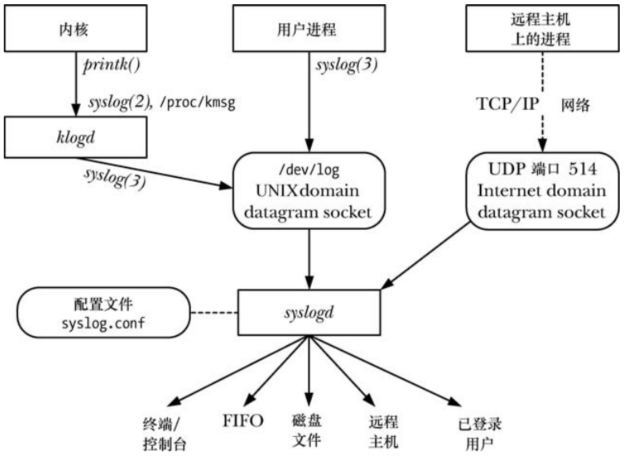
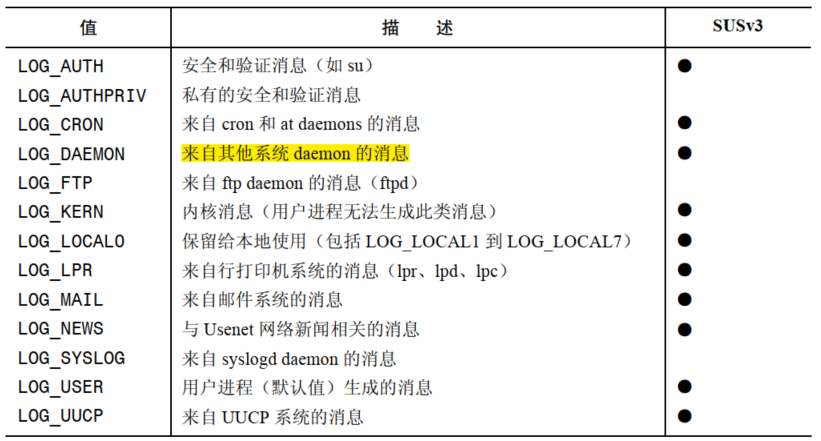
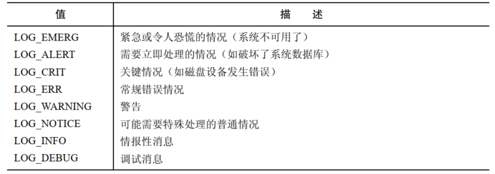

# 概述

daemon 是一种具备下列特征的进程：

- 它的生命周期很长，通常，一个 daemon 会在系统启动的时候被创建并一直运行直至关闭
- 它在后台运行并且不拥有控制终端，控制终端的缺失确保了内核永远不会为 daemon 自动生成任何任务控制信号以及终端相关的信号，如：`SIGINT`， `SIGTSTP`， `SIGHUP`，

daemon 是用来执行特殊任务的，例如：

- `cron`：一个在规定时间执行命令的 daemon
- `sshd`：安全 shell daemon，允许在远程主机上使用一个安全的通信协议登录系统
- `httpd`：HTTP 服务器 daemon，用于服务 Web 页面
- `inetd`：Internet 超级服务器 daemon，它监听从指定的 TCP/IP 端口上进入的网络连接并启动相应的服务器程序来处理这些连接

在 Linux 上，特定的 daemon 会作为内核线程运行，当使用 `ps` 列出线程时，这些 daemon 的名称会使用 `[]` 括起来。

# 创建一个 daemon

要变成  daemon，一个程序需要完成下面的步骤：

- 执行一个 `fork()`，之后父进程退出，子进程继续执行，从而 daemon 成为 init 进程的子进程。之所以这么做是因为：
  - 假设 daemon 是从命令行启动的，父进程的终止会被 shell 发现，shell 在发现之后会显示出另一个 shell 提示符并让子进程继续在后台运行
  - 子进程被确保不会成为一个进程组的首进程，因为它从其父进程那里继承了进程组 ID，并且拥有了自己的唯一的进程 ID，而这个进程 ID 与继承而来的进程组 ID 是不同的
- 子进程调用 `setsid()` 开启一个新会话并释放它与控制终端之间的所有关联关系
- 如果 daemon 从来没有打开过终端设备，那么就无需担心 daemon 会重新请求一个控制终端了，如果 daemon 后面可能会打开一个终端设备，那么必须要采取措施来确保这个设备不会成为控制终端，可以通过下面两种方式实现：
  - 在所有可能应用到一个终端设备上的 `open()` 调用中指定 `O_NOCTTY` 标记
  - 更简单地说，在 `setsid`  调用之后执行第二个 `fork()`，然后再次让父进程退出并让孙子进程继续执行
- 清除进程的 `umask` 以确保当 daemon 创建文件和目录时拥有所需要的权限
- 修改进程的当前工作目录，通常是改为根目录 `/`，这样做是有必要的，因为 daemon 通常会一直运行直至系统关闭，如果 daemon 的当前工作目录为不包含 `/` 的文件系统，那么就无法卸载该文件系统
- 关闭 daemon 从其父进程继承而来的所有打开着的文件描述符，关闭所有无用的打开着的文件描述符，之所以这样做的原因有很多：
  - 由于 daemon 失去了控制终端并且是在后台运行的，因此让 daemon 保持文件描述符 0,1,2 的打开状态是毫无意义的，因为它们指向的就是控制终端
  - 无法卸载长时间运行的 daemon 打开的文件所在的文件系统
- 在关闭了文件描述符 0,1,2 之后，daemon 通常会打开 `/dev/null` 并使用 `dup2()` 使所有这些描述符指向这个设备，这样做的原因：
  - 它确保了当 daemon 调用了在这些描述符上执行 IO 的库函数时不会出乎意料地失败
  - 它防止了 daemon 后面使用文件描述符 1 或 2打开一个文件的情况下，因为库函数会将这些描述符当做标准输出和标准错误来写入数据

```
#include <syslog.h>

int becomeDaemon(int flags);
```

- `becomeDaemon()` 将完成上面所述的步骤，将调用者变成一个 daemon
- `flags` 是一个位掩码，允许调用者有选择地执行其中的步骤

# 编写 daemon 指南

很多标准的 daemon 是通过在系统关闭时执行特定应用程序的脚本来停止的，而那些不以这种方式终止的 daemon 会收到一个 `SIGTERM` 信号，因为在系统关闭的时候 init 进程会向所有子进程发送这个信号。默认情况下，`SIGTERM` 信号会终止一个进程，如果 daemon 在终止之前需要做一些清理工作，那么就要为这个信号建立一个处理器。这个处理器必须能够快速的完成清理工作，因为 init 在发完  `SIGTERM` 信号 5 秒之后就会发送一个 `SIGKILL` 信号。

由于 daemon 是长时间运行的，因此要特别小心潜在的内存泄露问题和文件描述符泄露问题。如果此类 bug 影响到了 daemon 的运行，那么唯一的解决办法就是杀死进程，再重新启动。

# 使用 SIGHUP 重新初始化一个 daemon

由于很多 daemon 需要持续运行，因此在设计 daemon 程序时需要克服一些障碍：

- 通常 daemon 会在启动时从相关的配置文件中读取操作参数，但有些时候需要在不重启 daemon 的情况下快速修改这些参数
- 一些 daemon 会产生日志文件，如果 daemon 永远不关闭日志文件的话，那么日志文件就会无限制的增长，最终会阻塞文件系统，这里需要一个机制来通知 daemon 关闭日志文件并打开一个新文件，这样能够在需要的时候旋转日志文件

解决这两个问题的方案是让 daemon 为 `SIGHUP` 建立一个处理器，并在收到这个信号时采取所需的措施。

# 使用 syslog 记录消息和错误

## 概述

`syslog` 工具提供了一个集中式日志工具，系统中的所有应用程序都可以使用这个工具来记录日志消息。



`syslog` 工具有两个主要组件：syslogd daemon 和 `syslog(3)` 库函数。

System Log daemon syslogd 从两个不同的源接收日志消息：

- UNIX domain socket `/dev/log`，它保存本地产生的消息
- Internet domain socket，它保存通过 TCP/IP 网络发送的消息

每条由 syslogd 处理的消息都具备几个特性：

- 一个 facility，它指定了产生消息的程序类型
- 一个 level，它指定了消息的严重程度

syslogd daemon 会检查每条详细的 facility 和 level，然后根据一个相关配置文件 `/etc/syslog.conf` 中的指令消息传递到几个可能的目的地中的一个。可能的目的地包括：终端，虚拟控制台，磁盘文件，FIFO，一个或多个登录过的用户以及位于另一个系统上的通过 TCP/IP 网络连接的进程。

通常任意进程都可以使用 `syslog(3)` 库函数来记录消息，这个函数会使用传入的参数以标准的格式构建一条消息，然后将这条消息写入 `/dev/log` socket 以供 syslogd 读取。

`/dev/log` 中的消息另一个来源是 Kernel Log damon klogd，它会收集内核日志消息，这些消息的收集可以通过两个等价的 Linux 特有接口(`/proc/kmask` 文件和 `syslog(2)` 系统调用) 中的一个来完成，然后使用 `syslog(3)` 库函数将它们写入 `/dev/log`。

## syslog API

### 建立一个到系统日志的连接

```
#include <syslog.h>

void openlog(const char *ident, int option, int facility);
```

- `openlog()` 调用是可选的，它建立一个到系统日志工具的连接，并为后续的 `syslog()` 调用设置默认设置
- `ident` 是一个指向字符串的指针，`syslog()` 输出的每条消息都会包含这个字符串，这个参数的取值通常是程序名，如果 `ident` 的值是 `NULL`，那么 glibc syslog 实现会自动将程序名作为 `ident` 的值
- `option` 是一个位掩码：
  - `LOG_CONS`：当向系统日志发送消息发生错误时将消息写入到系统控制台 `/dev/console`
  - `LOG_NDELAY`：立即打开到日志系统的连接，在默认情况下，只有在首次使用 `syslog()`  记录消息的时候才会打开连接
  - `LOG_NOWAIT`：不要 `wait()` 被创建来记录日志消息的子进程，在那些创建子进程来记录日志消息的实现上，当调用者创建并等待子进程时就需要使用 `LOG_NOWAIT`，这样 `syslog()` 就不会试图等待已经被调用者毁掉的子进程，在 Linux 上，`LOG_NOWAIT` 不起任何作用，因为在记录日志消息时不会创建子进程
  - `LOG_ODELAY`：这个标记的作用与 `LOG_NDELAY` 相反，连接到日志系统的操作会被延迟至记录第一条消息时，这是默认行为，因此无需指定这个标记
  - `LOG_PERROR`：将消息写入标准错误和系统日志，通常，daemon 进程会关闭标准错误或将其重定向到 `/dev/null`，这样 `LOG_PERROR` 就没有用了
  - `LOG_PID`：在每条消息中加上调用者的进程 ID
- `facility` 参数指定了后续的 `syslog()` 调用中使用的默认的 `facility` 值，可选参数：



### 记录一条日志消息

```
#include <syslog.h>

void syslog(int priority, const char *format, ...);
```

- `priority` 参数是 `facility` 值和 `level` 值的 OR 值，`facility` 表示记录日志消息的应用程序的类别
- `level` 表示消息的严重程度：



 常用法：

```
openlog(argv[0],LOG_PID |  LOG_CONS | LOG_NOWAIT,LOG_LOCALO);
syslog(LOG_ERROR,"bad ragument :%s",argv[1]);
syslog(LOG_USER | LOG_INFO,"Exiting");
```

### 关闭日志

```
#include <syslog.h>

void closelog(void);
```

- 当完成日志记录之后，可以调用 `closelog()` 来释放分配给 `/dev/log` socket 的文件描述符

### 过滤日志消息

```
#include <syslog.h>

void setlogmask(int mask_priority);
```

- `setlogmask()` 设置了一个能过滤由 `syslog()` 写入的消息的掩码

`LOG_MASK()` 可以将 `level`  的值转换成适合传入 `setlogmask()` 的位值：

```
setlogmask(LOG_MASK(LOG_EMERG) | LOG_MASK(LOG_ALERT) | LOG_MASK(LOG_CRIT) | LOG_MASK(LOG_ERR));
```

Linux 中提供了标准中未规定的 `LOG_UPTO()` 宏，它创建一个能过滤特定级别以及以上的所有消息的位掩码，可以将上面的代码简化为：

```
setlogmask(LOG_UPTO(LOG_ERR));
```

 ## `/etc/syslog.conf` 文件

`/etc/syslog.conf` 配置文件控制 syslogd daemon 的操作，这个文件由规则和注释构成，规则的形式如下：

```
facility.level 			action
```

- `facility` 和 `level` 组合在一起称为选择器，选择需应用规则的消息
- `action` 指定了与选择器匹配的消息被发送到何处 	

每次修改 `syslog.conf` 文件之后都需要使用下面的方式让 daemon 根据这个文件重新初始化自身：

```
killall -HUP syslogd
```


 

 


