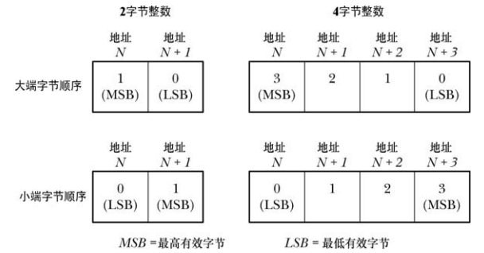
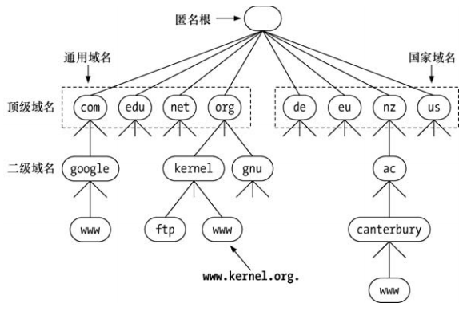
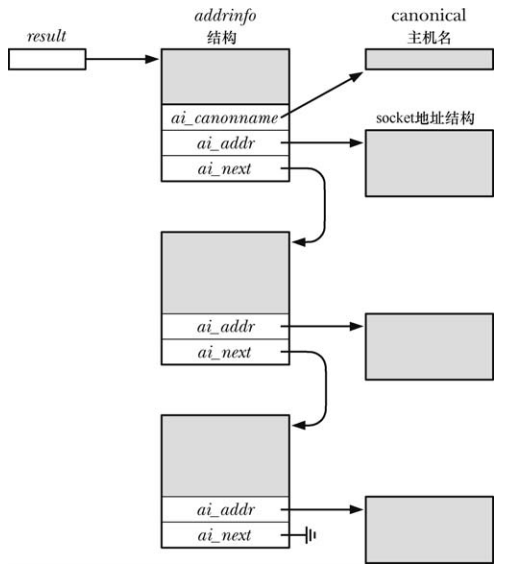
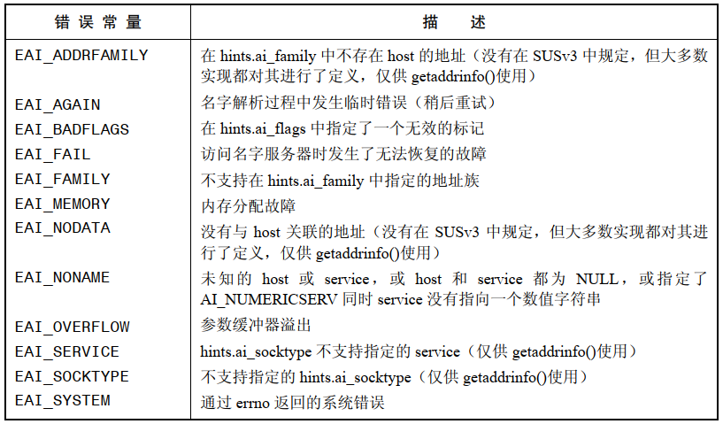

# Internet domain socket

Internet domain  流 socket 是基于 TCP 的，它们提供了可靠的双向字节流通信信道。

Internet domain 数据报 socket 是基于 UDP 的：

- UNIX domain 数据报 socket 是可靠的，但是 UDP socket 则不是可靠的，数据报可能会丢失，重复，乱序
- 在一个 UNIX domain 数据报 socket 上发送数据会在接收 socket 的数据队列为满时阻塞，与之不同的是，使用 UDP 时如果进入的数据报会使接收者的队列溢出，那么数据报就会静默地被丢弃

# 网络字节序

2 字节和 4 字节整数的大端和小端字节序：



网络字节序采用大端。

`INADDR_ANY` 和 `INADDR_LOOPBACK` 是主机字节序，在将它们存储进 socket 地址结构中之前需要将这些值转换成网络字节序。

主机序和网络字节序之间的转换：

```
#include <arpa/inet.h>

uint32_t htonl(uint32_t hostlong);
uint16_t htons(uint16_t hostshort);
uint32_t ntohl(uint32_t netlong);
uint16_t ntohs(uint16_t netshort);
```

# 数据表示

`readLine()` 从文件描述符 `fd` 引用的文件中读取字节直到碰到换行符为止。

```
ssize_t readLine(int fd, void *buffer, size_t n)
{
    ssize_t numRead;
    size_t toRead;
    char *buf;
    char ch;


    if(n <= 0 || buffer == NULL)
    {
        errno = EINVAL;
        return -1;
    }

    buf = buffer;
    toRead = 0;
    for (;;)
    {
        numRead = read(fd,&ch,1);
        if(numRead == -1)
        {
            if(errno == EINTR)
                continue;
            else
                return -1;
        }
        else if(numRead == 0)
        {
            if(toRead == 0)
                return 0;
            else
                break;
        }  
        else
        {
            if(toRead < n-1)
            {
                toRead++;
                *buf++ = ch;
            }
            if(ch == '\n')
                break;
        }       
    }

    *buf = '\0';
    return toRead;
}
```

# Internet socket 地址

Internet  domain socket 地址有两种：IPv4 和 IPv6。

## IPv4 socket 地址

IPv4 地址存储于结构体 `sockaddr_in` 中：

```
struct in_addr {
	uint32_t       s_addr;     /* address in network byte order */
};

struct sockaddr_in{
	sa_family_t sin_family;
	in_port_t sin_port;
	struct in_addr sin_addr;
	unsigned char __pad[X];
};
```

- `sin_family` 总是 `AF_INET`
- `in_port_t` 和 `in_addr` 分别是端口号和 IP 地址，它们都是网络字节序，分别是 16 位和 32 位

## IPv6 socket 地址

```
struct in6_addr{
	uint8_t s6_addr[16];
};

struct sockaddr_in6{
	sa_family_t sin6_family;
	in_port_t sin6_port;
	uint32_t  sin6_flowinfo;
	struct in6_addr sin6_addr;
	uint32_t  sin6_scope_id;
};
```

IPv6 的通配地址 `0::0`，换回地址为 `::1`。

## sockaddr_storage 结构

IPv6 socket API 中新引入了一个通用的 `sockaddr_storage ` 结构，这个结构的空间足以容纳任意类型的 socket：

```
#define __ss_aligntype uint32_t
struct sockaddr_storage{
	sa_family ss_family;
	__ss_aligntype __ss_slign;
	char __ss_padding[SS_PADSIZE];
};
```

# 主机和服务转换函数概述

主机名和连接在网络上的一个系统的符号标识符，服务名是端口号的符号表示。主机地址和端口的表示有下列两种：

主机地址和端口的表示有两种方法：

- 主机地址可以表示为一个二进制值或一个符号主机名或展现格式(IPv4 点分十进制，IPv6 是十六进制字符串)
- 端口号可以表示为一个二进制值或一个符号服务名

# `inet_pton()` 和 `inet_ntop()` 函数

```
#include <arpa/inet.h>

int inet_pton(int af, const char *src, void *dst);
const char *inet_ntop(int af, const void *src,char *dst, socklen_t size);
```

- `p` 表示展现 `presentation` ，`n` 表示 网络 `network`
- `inet_pton()` 将 `src` 包含的展现字符串转换成网络字节序的二进制 IP 地址，`af`  被指定为 `AF_INET`  或者  `AF_INET6`
-  `inet_ntop()` 执行逆向转换， `size`  被指定为缓冲器的大小，如果 `size` 太小，那么 `inet_ntop()` 会返回 `NULL` 并将 `errno` 设置成 `ENOSPC`

缓冲器大小可以使用下面两个宏指定：

```
#include <netinet/in.h>

#define INET_ADDRSTRLEN		 16
#define INET6_ADDRSTRLEN	 46
```

# 数据报 socket 客户端/服务器示例

`server`

```
int main(int argc,char* argv[])
{
    struct sockaddr_in6 svaddr, claddr;
    int sfd, j;
    ssize_t numBytes;
    socklen_t len;
    char buf[BUF_SIZE];
    char claddrStr[INET_ADDRSTRLEN];

    sfd = socket(AF_INET6,SOCK_DGRAM,0);
    if(sfd ==-1)
        errExit("socket()");

    memset(&svaddr,0,sizeof(struct sockaddr_in6));
    svaddr.sin6_family = AF_INET6;
    svaddr.sin6_addr = in6addr_any;
    svaddr.sin6_port = htons(PROT_NUM);

    if(bind(sfd,(struct sockaddr_in6*)&svaddr,sizeof(struct sockaddr_in6)) == -1)
        errExit("bind()");

    for (;;)
    {
        len = sizeof(struct sockaddr_in6);
        numBytes = recvfrom(sfd,buf,BUF_SIZE,0,(struct sockaddr*)&claddr,&len);
        if(numBytes == -1)
            errExit("recvfrom()");
        if (inet_ntop(AF_INET6, &claddr.sin6_addr, claddrStr,INET6_ADDRSTRLEN) == NULL)
            printf("could not convert client address to string\n");
        else
            printf("Sever received %ld bytes from (%s,%u)\n",(long)numBytes,claddr,ntohs(claddr.sin6_port));
        
        if(sendto(sfd,buf,numBytes,0,(struct sockaddr*)&claddr,len) != numBytes)
            errExit("sendto()");
    }
}
```

`client`

```
int main(int argc,char* argv[])
{
    struct sockaddr_in6 svaddr, claddr;
    int sfd, j;
    size_t msgLen;
    ssize_t numBytes;
    char resp[BUF_SIZE];

    if(argc < 3 | strcmp(argv[1],"--help") == 0)
    {
        printf("%s host-address msg...",argv[0]);
        exit(EXIT_SUCCESS);
    }

    sfd = socket(AF_INET6,SOCK_DGRAM,0);
    if(sfd ==-1)
        errExit("socket()");

    memset(&svaddr,0,sizeof(struct sockaddr_in6));
    svaddr.sin6_family = AF_INET6;
    svaddr.sin6_port = htons(PROT_NUM);
    if(inet_pton(AF_INET6,argv[1],&svaddr.sin6_addr) <= 0)
        errExit("inet_pton()");

    for (j = 2; j < argc;j++)
    {
        msgLen = strlen(argv[j]);
        if (sendto(sfd,argv[j],msgLen,0,(struct sockaddr*)&svaddr,sizeof(struct sockaddr_in6)) != msgLen)
            errExit("sendto()");

        numBytes = recvfrom(sfd,resp,BUF_SIZE,0,NULL,NULL);
        if(numBytes == -1)
            errExit("recvfrom()");

        printf("Respone %d : %.*s\n",j-1,(int)numBytes,resp);
    }

    exit(EXIT_SUCCESS);
}
```

# 域名系统(DNS)

DNS 出现以前，主机名和 IP 地址之间的映射关系是在一个手工维护的本地文件 `/etc/hosts`  中进行定义的：

```
127.0.0.1       localhost
::1     ip6-localhost ip6-loopback
```

`gethostbyname()` 或者 `getaddrinfo()` 通过搜索这个文件并找出与规范主机名或其中一个别名匹配的记录来获取一个 IP 地址。

DNS 设计：



- 将主机名组织在一个层级名空间中，每个节点有一个标签，该标签最多能包含 63 个字符，层级的根是一个无名的节点，称为 "匿名节点"
- 一个节点的域名由该节点到根节点的路径中所有节点的名字连接而成，各个名字之间使用 `.` 分隔
- 完全限定域名，如 `www.kernel.org.` ，标识出了层级中的一台主机，区分一个完全限定域名的方法是看名字是否以`.`结尾，但是在很多情况下这个点会被省略
- 没有一个组织或系统会管理整个层级，相反，存在一个 DNS 服务器层级，每台服务器管理树的一个分支(区域)
- 当一个程序调用 `getaddrinfo()` 来解析一个域名时，`getaddrinfo()` 会使用一组库函数来与各地的 DNS 服务器通信，如果这个服务器无法提供所需要的信息，那么它就会与位于层级中的其他  DNS 服务器进行通信以便获取信息，这个过程可能花费很多时间，DNS 采用了缓存技术以节省时间

## 递归和迭代的解析请求

DNS 解析请求可以分为：递归和迭代。

递归请求：请求者要求服务器处理整个解析任务，包括在必要时候与其它 DNS 服务器进行通信任务。当位于本地主机上的一个应用程序调用 `getaddrinfo()`  时，该函数会与本地 DNS 服务器发起一个递归请求，如果本地 DNS 服务器自己没有相关信息来完成解析，那么它就会迭代地解析这个域名。

迭代解析：假设要解析 `www.otago.ac.nz`，首先与每个 DNS 服务器都知道的一小组根名字服务器中的一个进行通信，根名字服务器会告诉本 DNS 服务器到其中一台 `nz` DNS 服务器上查询，然后本地 DNS 服务器会在 `nz` 服务器上查询名字 `www.otago.ac.nz`，并收到一个到 `ac.nz` 服务器上查询的响应，之后本地 DNS 服务器会在 `ac.nz` 服务器上查询名字 `www.otago.ac.nz` 并告知查询 `otago.ac.nz` 服务器，最后本地 DNS 服务器会在 `otago.ac.nz` 服务器上查询 `www.otago.ac.nz` 并获取所需的 IP 地址。

向  `gethostbyname()` 传递一个不完整的域名，那么解析器在解析之前会尝试补齐。域名补全规则在  `/etc/resolv.conf` 中定义，默认情况下，至少会使用本机的域名来补全，例如，登录机器 `oghma.otago.ac.nz` 并输入 `ssh octavo` 得到的 DNS 查询将会以 `octavo.otago.ac.nz` 作为其名字。

## 顶级域

紧跟在匿名根节点下面的节点称为顶级域(TLD)，TLD 分为两类：通用的和国家的。

# `/etc/services` 文件

端口号和服务名记录在 `/etc/services` 中，`getaddrinfo()` 和 `getnameinfo()` 会使用这个文件中的信息在服务名和端口号之间进行转换。

# 独立于协议的主机和服务转换

`getaddrinfo()` 将主机和服务名转换成 IP 地址和端口号，它作为过时的 `gethostbyname()` 和 `getservername()` 接替者。

`getnameinfo()` 是 `getaddrinfo()` 的逆函数，将一个 socket 地址结构转换成包含对应主机和服务名的字符串，是过时的 `gethostbyaddr()` 和 `getserverbyport()` 的等价物。

## `getaddrinfo()` 函数

```
#include <sys/types.h>
#include <sys/socket.h>
#include <netdb.h>

int getaddrinfo(const char *host, const char *service, const struct addrinfo *hints,struct addrinfo **res);
```

- 给定一个主机名和服务器名，`getaddrinfo()` 返回一个 `socket` 地址结构列表，每个结构都包含一个地址和端口号
- 成功时返回0，失败时返回非 0
- `host` 包含一个主机名或者一个以 IPv4 点分十进制标记或者 IPv6 十六进制字符串标记的数值地址字符串
- `service` 包含一个服务名或一个十进制端口号
- `hints` 指向一个 `addrinfo` 结构：

```
struct addrinfo {
    int              ai_flags;
    int              ai_family;
    int              ai_socktype;
    int              ai_protocol;
    socklen_t        ai_addrlen;
    struct sockaddr *ai_addr;
    char            *ai_canonname;
    struct addrinfo *ai_next;
};
```

- `res` 返回一个结构列表而不是单个结构，因为与在 `host`、 `service`、 `hints`、 指定的标准对应的主机和服务组合可能有多个。例如，查询多个网络接口的主机时可能返回多个地址结构，此外，如果将 `hints.ai_sockettype` 指定 为0，那么可能返回两个结构：一个用于 `SOCK_DGRAM` socket 和 `SOCKET_STREAM` socket，前提是给定的 `service` 同时对 TCP 和 UDP 可用




### `hints` 参数

`hints` 参数为如何选择 `getaddrinfo()` 返回的 socket 地址结构指定了更多标准。当用作 `hints`  参数时只能设置 `addrinfo` 结构的 `ai_flags`、`ai_family`、`ai_socktype`、`ai_protocol`  字段，其他字段未使用，并将根据具体情况初始化为 0 或者 `NULL`。

`hints.ai_family` 返回的 socket 地址结构的域，取值可以是 `AF_INET` 或者 `AF_INET6`。如果需要获取所有种类 socket 地址，那么可以将这个字段设置为 `AF_UNSPEC`。

`hints.ai_socktype` 字段指定了使用返回的 socket 地址结构的 socket 类型。如果将这个字段指定为 `SOCK_DGRAM`，那么查询将会在 UDP 服务上执行，如果指定了  `SOCK_STREAM`，那么将返回一个 TCP 服务查询，如果将其指定为 0，那么任意类型的 socket 都是可接受的。

`hints.ai_protocol` 字段为返回的地址结构选择了 socket 协议，这个字段设置为 0，表示调用者接受任何协议。

`hints.ai_flags` 字段是一个位掩码，它会改变 `getaddrinfo()` 的行为，取值为：

- `AI_ADDRCONFIG`：在本地系统上至少配置一个 IPv4 地址时返回 IPv4 地址(不是 IPv4 回环地址)，在本地系统上至少配置一个 IPv6 地址时返回 IPv6 地址(不是 IPv6 回环地址)
- `AI_ALL`：参见 `AI_V4MAPPED`
- `AI_CANONNAME`：如果 `host` 不为 `NULL`，返回一个指向 `null` 结尾的字符串，该字符串包含了主机的规范名，这个指针会在通过 `result` 返回的第一个 `addrinfo` 结构中 `ai_canoname` 字段指向的缓冲器中返回
- `AI_NUMERICHOST`：强制将 `host` 解释成一个数值地址字符串，这个常量用于在不必要解析名字时防止进行名字解析，因为名字解析可能会花费比较长的时间
- `AI_NUMERICSERV`：将 `service` 解释成一个数值端口号，这个标记用于防止调用任意的名字解析服务，因为当  `service` 为一个数值字符串时这种调用是没有必要的
- `AI_PASSIVE`：返回一个适合进行被动式打开(即一个监听 socket)的 socket 地址结构，此时，`host` 应该是 `NULL`，通过 `result` 返回的 socket 地址结构 IP 地址部分将会包含一耳光通配 IP 地址(`INADDR_ANY` 或者 `IN6ADDR_ANY_INIT`)。如果没有设置这个标记，那么通过 `res` 返回的地址结构中的 IP 地址将会被设置成回环 IP 地址(`INADDR_LOOPBACK` 或者 `IN6ADDR_LOOPBACK_INIT`)
- `AI_V4MAPPED`：如果在 `hints` 的 `ai_family` 中指定了 `AF_INET6`，那么在没有找到匹配的 IPv6 地址时应该在 `res` 返回 IPv4 映射的 IPv6 地址。如果同时指定了`AI_ALL`  和 `AI_V4MAPPED`，那么 `res` 中同时返回 IPv6 和 IPv4 地址，IPv4 地址会被返回成 IPv4 映射的 IPv6 地址

## 释放 `addrinfo` 列表 `freeaddrinfo()`

```
#include <sys/types.h>
#include <sys/socket.h>
#include <netdb.h>

void freeaddrinfo(struct addrinfo *res);
```

-  `getaddrinfo()` 函数会动态地为 `res` 引用的所有结构分配内存，其结果是调用者必须要在不需要使用这些结构时释放它们，使用 `freeaddrinfo()` 来执行释放的任务

## 错误诊断 `gai_strerror()`

`getaddrinfo()` 在发生错误时返回下面的一个错误码：



```
#include <sys/types.h>
#include <sys/socket.h>
#include <netdb.h>

const char *gai_strerror(int errcode);
```

- `gai_strerror()` 返回一个描述错误的字符串

# `getnameinfo()` 函数

`getnameinfo()`  是 `getaddrinfo()` 的逆函数。给定一个 socket 地址结构它会返回一个包含对应的主机和服务名的字符串或者无法解析名字时返回一个等价的数值。

```
#include <sys/socket.h>
#include <netdb.h>

int getnameinfo(const struct sockaddr *addr, socklen_t addrlen,char *host, socklen_t hostlen,char *service, socklen_t servlen, int flags);
```

- `addr` 指向待转换的 socket 地址结构，长度为 `addrlen`

- 得到的主机和服务名是以 `null` 结尾的字符串，它们会被存储在 `host` 和 `service` 指向的缓冲器中，调用者必须要为这些缓冲器分配空间并将它们的大小传入  `hostlen` 和 `servlen` ，`NI_MAXHOST` 指出了返回的主机名字符串的最大字节数，其取值为 `1025`，`NI_MAXSERV` 指出了返回服务名字符串的最大字节数，其取值为 `32`

- 如果不想获取主机名，可以将 `host` 指定为 `NULL` 并且将 `hostlen`  指定为 0，如果不想获取服务名，可以将 `service` 指定为 `NULL` 并且将 `servlen`  指定为 0，但是 `host` 和 `service` 中至少有一个必须非 `NULL`

- `flags` 是一个掩码，控制着 `getnameinfo()` 的行为，取值为：

  - `NI_DGRAM`：默认情况下，`getnameinfo()`  返回 TCP 服务对应的名字，`NI_DGRAM` 标记强制返回 UDP 服务的名字

  - `NI_NAMEREQD`：默认情况下，如果无法解析主机名，那么在 `host` 中返回一个数值地址字符串，如果指定了 `NI_NAMEREQD`，就会返回一个错误 `EAI_NONAME`

  - `NI_NOFQDN`：在默认情况下会返回主机的完全限定域名，指定 `NI_NOFQDN` 标记会导致当主机位于局域网中时只返回名字的第一部分(即主机名)

  - `NI_NUMERICHOST`：强制在 `host` 中返回一个数值地址字符串，这个标记在需要避免可能耗时较长的 DNS 服务器调用时是比较有用的

  - `NI_NUMERICSERV`：强制在 `service` 中返回一个十进制端口号字符串，这个标记在知道端口号不对应于服务器名时，如它是一个由内核分配给 socket 的临时端口号，以及需要避免不必要的搜索 `/etc/service`  的低效性时是比较有用的

# 流式 socket 客户端/服务器示例

 `server`

```
int main(int argc,char* argv[])
{
    uint32_t seqNum;
    char reqLenStr[INT_LEN];
    char seqNumStr[INT_LEN];
    struct sockaddr_storage claddr;
    int lfd, cfd, optval, reqLen;
    socklen_t addrlen;
    struct addrinfo hints;
    struct addrinfo *result, *rp;

    #define ADDRSTRLEN (NI_MAXHOST + NI_MAXSERV +10)

    char addrStr[ADDRSTRLEN];
    char host[NI_MAXHOST];
    char service[NI_MAXSERV];

    if(argc  > 1 && strcmp(argv[1],"--help") == 0)
    {
        printf("%s [init-seq-num]\n",argv[0]);
        exit(EXIT_SUCCESS);
    }

    seqNum = (argc > 1) ? atoi(argv[1]) : 0;
    if(signal(SIGPIPE,SIG_IGN) == SIG_ERR)
        errExit("signal()");

    memset(&hints,0,sizeof(struct addrinfo));
    hints.ai_canonname = NULL;
    hints.ai_addr = NULL;
    hints.ai_next = NULL;
    hints.ai_socktype = SOCK_STREAM;
    hints.ai_family = AF_UNSPEC;
    hints.ai_flags = AI_PASSIVE | AI_NUMERICSERV;

    if(getaddrinfo(NULL,PORT_NUM,&hints,&result) != 0)
        errExit("getaddrinfo()");

    optval = 1;
    for (rp = result; rp != NULL;rp = rp->ai_next)
    {
        lfd = socket(rp->ai_family,rp->ai_socktype,rp->ai_protocol);
        if(lfd == -1)
            continue;
        
        if(setsockopt(lfd,SOL_SOCKET,SO_REUSEADDR,&optval,sizeof(optval)) == -1)
            errExit("setsockopt()");
        
        if(bind(lfd,rp->ai_addr,rp->ai_addrlen) == 0)
            break;

        close(lfd);
    }

    if(rp == NULL)
        errExit("could not bind socket any address");
    
    if(listen(lfd,BACKLOG) == -1)
        errExit("listen()");

    freeaddrinfo(result);

    for (;;)
    {
        addrlen = sizeof(struct sockaddr_storage);
        cfd = accept(lfd,(struct sockaddr*)&claddr,&addrlen);
        if(cfd == -1)
        {
            printf("accept\n");
            continue;
        }

        if(getnameinfo((struct sockaddr*)&claddr,addrlen,host,NI_MAXHOST,service,NI_MAXSERV,0) == 0)
            snprintf(addrStr,ADDRSTRLEN,"(%s,%s)",host,service);
        else
            snprintf(addrStr,ADDRSTRLEN,"(?UNKNOWN?)");
        
        if(readLine(cfd,reqLenStr,INT_LEN) <= 0)
        {
            close(cfd);
            continue;
        }

        snprintf(seqNumStr,INT_LEN,"%d\n",seqNum);
        if(write(cfd,&seqNumStr,strlen(seqNumStr)) != strlen(seqNumStr))
            printf("Error on write\n");

        seqNum += reqLen;
        if(close(cfd) == -1)
            printf("Error on close");
    }
}
```

`client`

```
int main(int argc,char* argv[])
{
    char *reqLenStr;
    char seqNumStr[INT_LEN];
    int cfd;
    ssize_t numRead;
    struct addrinfo hints;
    struct addrinfo *result, *rp;

    if(argc < 2 || strcmp(argv[1],"--help") == 0)
    {
        printf("%s server-host [sequence-len]\n",argv[0]);
        exit(EXIT_SUCCESS);
    }

    memset(&hints,0,sizeof(struct addrinfo));
    hints.ai_canonname = NULL;
    hints.ai_addr = NULL;
    hints.ai_next = NULL;
    hints.ai_socktype = SOCK_STREAM;
    hints.ai_family = AF_UNSPEC;
    hints.ai_flags = AI_NUMERICSERV;

    if(getaddrinfo(NULL,PORT_NUM,&hints,&result) != 0)
        errExit("getaddrinfo()");

    for (rp = result; rp != NULL;rp = rp->ai_next)
    {
        cfd = socket(rp->ai_family,rp->ai_socktype,rp->ai_protocol);
        if(cfd == -1)
            continue;
        
        if(connect(cfd,rp->ai_addr,rp->ai_addrlen) != -1)
            break;

        close(cfd);
    }

    if(rp == NULL)
        errExit("could not bind socket any address");
    
    freeaddrinfo(result);

    reqLenStr = (argc > 2) ? argv[2] : "1";
    if(write(cfd,reqLenStr,strlen(reqLenStr)) != strlen(reqLenStr))
        errExit("write()");
    
    if(write(cfd,"\n",1) != 1)
        errExit("write()");

    numRead = readLine(cfd, seqNumStr, INT_LEN);
    if(numRead == -1)
        errExit("readLine()");
    if(numRead == 0)
        errExit("Unexpected EOF from server");

    printf("Sequence number: %s\n",seqNumStr);
    exit(EXIT_SUCCESS);    
}
```


