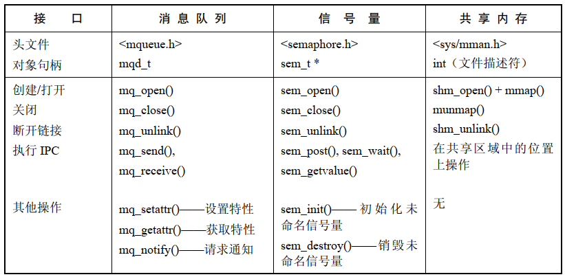

POSIX.1b 实时扩展定义了一组 IPC 机制（POSIX.1b 的开发者的其中一个目标是设计出一组能弥补 System V IPC 工具的不足之处的 IPC 机制)。这些IPC机制被称为 POSIX IPC。这三种 POSIX IPC 机制具体如下：

- 消息队列可以用来在进程间传递消息。与 System V 消息队列一样，消息边界被保留了下来，这样读者和写者就以消息为单位进行通信了。POSIX 消息队列允许给每个消息赋一个优先级，这样在队列中优先级较高的消息就会排在优先级较低的消息前面
- 信号量允许多个进程同步各自的动作。 System V 信号量一样，POSIX 信号量也是一个由内核维护的整数，其值永远都不会小于 0。与 System V 信号量相比，POSIX 信号量在用法上要简单一些：它们是逐个分配的（与 System V 信号量集相比），并且在单个信号量上只能使用两个操作来将信号量的值加 1 或减 1（与 `semop()` 系统调用能原子地在一个 System V 信号量集中的多个信号量上加上或减去一个任意值相比）
- 共享内存使得多个进程能够共享同一块内存区域，与 System V 共享内存一样，POSIX 共享内存提供了一种快速 IPC，一旦进程更新了共享内存之后，所发生的变更立即对共享同一区域的其他进程可见

# API 概述



命名信号量：它们通过一个名字来标识，并且所有具备在该对象上合适权限的进程都能够访问该对象

未命名信号量：没有关联的标识符，而是会被放置在由一组进程或单个进程中的多个线程共享的内存区域中

## IPC 对象名字

要访问一个 POSIX IPC 对象就必须通过某种方式来识别出它。SusV3 规定的唯一一种用来标识 POSIX IPC 对象的可移植方式是使用以斜线打头后面跟着一个或者多个非斜线字符的名字，比如 `/myproject`。Linux 和其他一些实现（如 Solaris）允许采用这种可移植的命名方式来给 IPC 对象命名。

在 Linux上，POSIX 共享内存和消息队列的名字的最大长度为 `NAME_MAX(255)` 个字符，而信号量的名字的最大长度要少 4 个字符，这是因为实现会在信号量名字前面加上字符串`sem.`。

SUSv3 并没有禁止使用形式不为 `/myobject` 的名字，但表示这种名字的语义是由实现定义的。在一些系统上，创建 IPC 对象名字的规则是不同的。可移植的应用程序中应该将 IPC 对象名的生成工作放在一个根据目标裁剪过的单独的函数会在头文件中。

## 创建或打开 IPC 对象

每种 IPC 机制都有一个关联的 `open` 调用（`mq_open()`、`sem_open()` 以及 `shm_open()`），它与用于打开文件的传统的 UNIX `open()` 系统调用类似。给定一个IPC 对象名，IPC `open` 调用会完成下面两个任务中的一个：

- 使用给定的名字创建一个新对象，打开该对象并返回该对象的一个句柄
- 打开一个既有对象并返回该对象的一个句柄

IPC `open` 调用返回的句柄与传统的 `open()` 系统调用返回的文件描述符类似——它在后续的调用中被用来引用该对象。

IPC `open` 调用返回的句柄的类型依赖于对象的类型。对于消息队列来讲返回的是一个消息队列描述符，其类型为 `mqd_t`。对于信号量来讲，返回的是一个类型为 `sem_t *` 的指针。对于共享内存来讲返回的是一个文件描述符。

所有 IPC `open` 调用都至少接收三个参数——`name`、`oflag` 以及 `mode`——如下面的 `shm_open()` 调用所示：

```
fd = shm_open("/mymen", O_CREAT | O_RDWR, S_IRUSR | S_IWUSR);
```

这些参数与传统的 UNIX `open()` 系统调用接收的参数类似。`name` 参数标识出了待创建或待打开的对象。`oflag` 参数是一个位掩码，在这个参数中至少可以包含下列几种标记：

- `O_CREAT` ：如果对象不存在，那么就创建一个对象。如果没有指定这个标记并且对象不存在，那么就返回一个错误（`ENOENT`）
- `O_EXCL` ：如果同时也指定了 `O_CREAT` 并且对象已经存在，那么就返回一个错误（`EEXIST`）。这两步——检查是否存在和创建——是原子操作。这个标记在不指定 `O_CREAT` 时是不起作用的。

根据对象的类型，`oflag` 还可能会包含 `O_RDONLY`、`O_WRONLY` 以及 `O_RDWR` 这三个值中的一个，其含义与它们在 `open()` 中含义相同。一些 IPC 机制还支持额外的标记。

剩下的参数 `mode` 是一个位掩码，它指定了在对象被创建时（即指定了 `O_CREAT` 并且对象不存在）施加于新对象之上的权限。

## 关闭 IPC 对象

对于 POSIX 消息队列和信号量来讲，存在一个 IPC `close` 调用来表明调用进程已经使用完该对象，系统可以释放之前与该对象关联的所有资源了。POSX 共享内存对象的关闭则是通过使用 `munmap()` 解除映射完成的。

IPC 对象在进程终止或者执行 `exec()` 时会自动关闭。

## IPC 对象权限

IPC 对象上的权限掩码与文件上的权限掩码是一样的。访问一个 IPC 对象的权限与访问文件的权限是类似的，但对于 POSIX IPC 对象来讲，执行权限是没有意义的。

从内核 2.6.19 起，Linux 支持使用访问控制列表（ACL）来设置 POSIX 共享内存对象和命名信号量上的权限。目前，在 POSIX 消息队列上不支持 ACL。

## IPC 对象删除和对象持久性

与打开文件一样，POSIX IPC 对象也有引用计数，内核会维护对象上的打开引用计数。与 System V IPC 对象相比，这种方式可以使应用程序能够更加准确的确定何时可以安全的删除一个对象。

每个 IPC 对象都有一个对应的 `unlink` 调用。`unlink()` 调用会记录删除对象的名字，然后在引用计数等于 0 时销毁该对象。对于消息队列和信号量来讲，这意味着当所有进程都关闭对象之后对象会被销毁；对于共享内存来讲，当所有进程都使用 `munmap()` 解除与对象之间的映射关系之后就会销毁对象。

与 System V IPC 一样，POSIX IPC 对象也拥有内核持久性。对象一旦被创建，就会一直存在直到被断开链接或者系统被关闭。这样一个进程就能够创建一个对象、修改其状态，然后退出并将对象留给后面某个时刻启动的一些进程访问。

## 通过命令行列出和删除 POSIX IPC 对象

System V IPC 提供了两个命令  `ipcs` 和 `ipcrm` 来列出和删除  IPC 对象，对于 POSIX IPC 对象来讲，不存在标准的命令来执行类似的任务，但是在很多系统上，IPC 对象是在一个挂载在根目录 `/` 下某处的真实或虚拟文件系统中实现的，因此可以使用 `ls` 或者 `rm` 来列出和删除 IPC 对象。

## 在 Linux 上编译使用 POSIX IPC 的程序

在 Linux 上，使用 POSIX IPC 机制的程序必须要与实时库 `librt` 链接起来，这可以通过在 `cc`  命令中指定 `–lrt`  选项来完成。

# System V IPC 与 POSIX IPC 比较

与 System V IPC 相比，POSIX IPC 拥有下列常规优势

- POSIX IPC 的接口比 System V IPC 接口简单
- POSIX IPC 模型——使用名字替代键、使用 `open`、`close` 以及 `unlink` 函数——与传统的 UNIX 文件模型更加一致
- POSIX IPC 对象是引用计数的。这就简化了对象删除，因为可以断开一个 POSIX IPC 对象的链接，并且知道当所有进程都关闭该对象之后对象就会被销毁

然而 System V IPC 具备一个显著的优势：可移植性。


