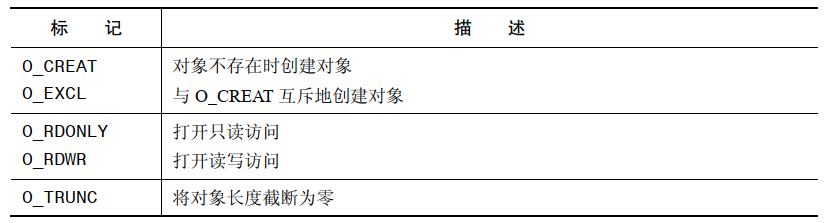

System V 共享内存和共享文件映射允许无关进程共享内存区域以便执行 IPC 技术，这两种技术都存在一些不足：

- System V 共享内存模型使用的是 `key` 和标识符，这与标准的 Unix IO 模型使用文件名和描述符的做法是不一致的。这种差异意味着使用 System V 共享内存段需要一整套系统调用和命名
- 使用一个共享文件映射来进行 IPC 要求创建一个磁盘文件，即使无需对共享区域进行持久存储也需要这样做。除了因为需要创建文件所带来的的不便之外，这种技术还会带来一些文件 IO 开销

# 概述

POSIX 共享内存能够让无关进程共享一个映射区域而无需创建一个相应的映射文件。Linux 从内核2.4开始支持 POSIX 共享内存。

要使用 POSIX 共享内存对象需要完成下列任务：

- 使用 `shm_open()` 函数打开一个与指定的名字对应的对象。`shm_open()` 函数与 `open()` 系统调用类似，它会创建一个新共享对象或打开一个既有对象。作为函数结果，`shm_open()` 会返回一个引用该对象的文件描述符
- 将上一步中获得的文件描述符传入 `mmap()` 调用并在其 `flags` 参数中指定 `MAP_SHARED`。这将共享内存对象映射进进程的虚拟地址空间。与 `mmap()` 一样，一旦映射了对象之后就能够关闭该文件描述符而不会影响到这个映射。然而，有可能需要将这个文件描述符保持在打开状态以便后续的 `fstat()` 和 `ftruncate()` 调用使用这个文件描述符

由于共享内存对象的引用是通过文件描述符来完成的，因此可以直接使用 Unix 系统中已经定义好的各种文件描述符系统调用（如 `ftruncate()`）而无需增加新的用途特殊的系统调用（System V 共享内存就需要这样做）。

# 创建共享内存对象

`shm_open()` 创建和打开一个新共享内存对象或者打开一个既有对象。传入 `shm_open()` 的参数与传入 `open()` 的参数类似。

```
#include <sys/mman.h>
#include <sys/stat.h>        /* For mode constants */
#include <fcntl.h>           /* For O_* constants */

int shm_open(const char *name, int oflag, mode_t mode);
```

- `name` 参数标识出了待创建或待打开的共享内存对象。`oflag` 参数是一个改变调用行为的位掩码，取值如下：



- `oflag` 参数的用途之一是确定是打开一个既有的共享内存对象还是创建并打开一个新对象。如果 `oflag` 中不包含 `O_CREAT`，那么就打开一个既有对象。如果指定了 `O_CREAT`，那么在对象不存在时就创建对象。同时指定 `O_EXCL` 和 `O_CREAT` 能够确保调用者是对象的创建者，如果对象已经存在，那么就返回一个错误（`EEXIST`）
- `oflag` 参数还表明了调用进程在共享内存对象上的访问模式，其取值为 `O_RDONLY` 或 `O_RDWR`
- 剩下的标记值 `O_TRUNC` 会导致在成功打开一个既有共享内存对象之后将对象的长度截断为零
- 对象权限将会根据 `mode` 参数中设置的掩码值来设定。在调用 `shm_open()` 时总是需要 `mode` 参数，在不创建新对象时需要将这个参数值指定为 0。
- `shm_open()` 返回的文件描述符会设置 `chose-on-exec` 标记，因此当程序执行了一个 `exec()` 时文件描述符会被自动关闭。即在执行 `exec()` 时映射会被解除
- 一个新共享内存对象被创建时其初始长度会被设置为0。这意味着在创建完一个新共享内存对象之后通常在调用 `mmap()` 之前需要调用 `ftruncate()` 来设置对象的大小。在调用 `mmap()` 之后可能还需要使用 `ftruncate()` 来根据需求扩大或者缩小共享内存对象，在扩展一个共享内存对象时，新增加的字节会被初始化为0
- 在任何时候都可以在 `shm_open()` 返回的文件描述符上使用 `fstat()` 获取一个 `stat` 结构，这个结构中包含这个共享对象相关的信息，包括其大小（`st_size`）、权限（`st_mode`）、所有者（`st_uid`）以及组（`st_gid`）
- 使用 `fchmod()` 和 `fchown()` 能够分别修改共享内存对象的权限和所有权

# 删除共享内存对象

SUSv3 要求 POSIX 共享内存对象至少具备内核持久性，即它们会持续存在直到被显示删除或者系统重新。当不再需要一个共享内存对象就应该使用 `shm_unlink()` 删除它。

```
#include <sys/mman.h>
#include <sys/stat.h>
#include <fcntl.h>

int shm_unlink(const char *name);
```

- `shm_unlink()` 函数会删除通过 `name` 指定的共享内存对象。删除一个共享内存对象不会影响对象的既有映射（它会保持有效直到相应的进程调用 `munmap()`或终止），但会阻止后续的 `shm_open()` 调用打开这个对象。一旦所有进程都解除映射这个对象，对象就会被删除，其中的内容会丢失

# 共享内存 API 比较

对于这些无关进程间(System V 共享内存、共享文件映射、POSIX共享内存映射)共享内存区域技术，其共同点：

- 它们提供了快速IPC，应用程序通常必须要使用一个信号量(或者其他同步原语)来同步对共享区域的访问
- 一旦共享内存对象被映射进进程的虚拟地址空间后，它就与进程的内存空间中的其他部分无异了
- 系统会以类似的方式将共享内存区域防止进进程的虚拟地址去空间。Linux 特有的/proc/PID/maps 文件会列出与所有种类的共享内存区域相关的信息
- 假设不会讲一个共享内存区域映射到一个固定地址处，那么就需要确保所有对区域中的位置的引用使用偏移量来表示，而不是使用指针来标识。因为这个区域在不同进程中所处的虚拟地址可能不同

在这些共享内存技术之间还存在一些显著的差异

- 一个共享文件映射的内容会与底层映射文件同步意味着存储在共享内存区域中的数据能够在系统重启之间得到持久保存
- System V 和 POSIX 共享内存使用了不同的机制来标识和引用共享内存对象。System V使用了其自己的键和标识符模型，它们与标准的 UNIX I/O 模型是不匹配的并且需要单独的系统调用（如 shmctl()）和命令（ipcs 和 ipcrm）。与之形成对比的是，POSIX共享内存使用了名字和文件描述符，其结果是使用各种既有的 UNIX 系统调用（如fstat()和 fchmod()）就能够查看和操作共享内存对象了。
- System V 共享内存段的大小在创建时（shmget()）就确定了。与之形成对比的是，在基于文件的映射和 POSIX 共享内存对象上可以使用 ftruncate()来调整底层对象的大小，然后使用 munmap()和 mmap()（或 Linux 特有的 mremap()）重建映射。
- 因为历史原因，System V 共享内存受支持程度比 mmap()和 POSIX 共享内存对象广得多，尽管现在大多数 UNIX 实现都已经提供所有这些技术。

因此，优先使用POSIX而非System V共享内存。至于选择哪个接口则取决于是否需要一个持久性存储。共享文件映射提供了持久性存储，而 POSIX 共享内存对象则避免了在无需持久存储时使用磁盘文件所产生的开销。


