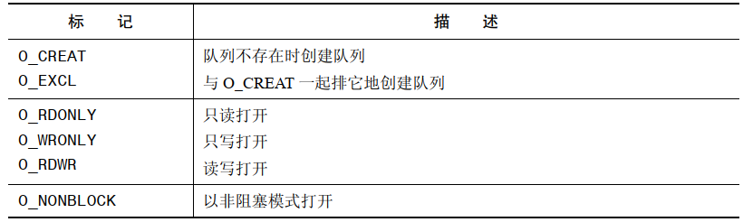
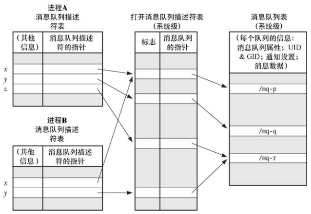

# 概述

POSIX 消息队列 API 的主要函数如下：

- `mq_open()` 函数创建一个新消息队列或打开一个既有队列，返回后续调用中会用到的消息队列描述符
- `mq_send()` 函数向队列写入一条消息
- `mq_receive()` 函数从队列中读取一条消息
- `mq_close()` 函数关闭进程之前打开的一个消息队列
- `mq_unlink()` 函数删除一个消息队列并当所有进程关闭该队列时对队列进程标记以便删除

此外，POSIX 消息队列 API 还具备一些特别的特性：

- 每个消息队列都有一组关联的特性，其中一些特性可以在使用 `mq_open()` 创建或者打开时进行设置。获取和修改队列特性的工作是由 `mq_getattr()` 和`mq_setaddr()` 来完成的
- `mq_notify()` 函数允许一个进程向一个队列注册时接收消息通知。在注册完之后，当一条消息可用时会通过发送一个信号或者在一个单独的线程中调用一个函数来通知进程

# 打开、关闭和断开链接消息队列

## 打开一个消息队列

```
#include <fcntl.h>           /* For O_* constants */
#include <sys/stat.h>        /* For mode constants */
#include <mqueue.h>

mqd_t mq_open(const char *name, int oflag);
mqd_t mq_open(const char *name, int oflag, mode_t mode,struct mq_attr *attr);
```

- `mq_open()` 函数创建一个新消息队列或打开一个既有队列
- `name` 参数标识出了消息队列
- `oflag` 参数是一个位掩码，它控制着 `mq_open()` 操作的各个方面，取值如下：



- `oflag` 参数的其中一个用途是，确定是打开一个既有队列还是创建和打开一个新队列，`oflag`  不包含 `O_CREAT` 时，那么将会打开一个既有队列，如果 `oflag`  中包含了 `O_CREAT` 并且给定的 `name` 不存在时将会创建一个新的空队列，如果`oflag`  同时包含了 `O_CREAT` 和 `O_EXCL`，并且给定的 `name` 对应的队列已经存在，那么 `mq_open()` 就会失败
- `mode` 参数是一个位掩码，它指定了施加于新消息队列之上的权限
- `attr` 参数是一个 `mq_attr` 结构，它指定了新消息队列的特性。如果 `attr` 为 `NULL`，那么将使用实现定义的默认特性创建队列

## `fork()`、`exec()` 以及进程终止对消息队列描述符的影响

在 `fork()` 中子进程会接受其父进程在消息队列描述符的副本，并且这些描述符会引用同样的打开的消息队列描述。子进程不会继承父进程的任何消息通知注册。

当一个进程执行了一个 `exec()` 或终止时，所有其打开的消息队列描述符会被关闭。关闭消息队列描述符的结果是进程在相应队列上的消息通知注册会被注销。

 ## 关闭一个消息队列

```
#include <mqueue.h>

int mq_close(mqd_t mqdes);
```

- `mq_close()` 函数关闭了消息队列描述符 `mqdes`

如果调用进程已经通过 `mqdes` 在队列上注册了消息通知，那么通知注册会自动被删除，并且另一个进程可以随后向该队列注册消息通知。

当进程终止或者调用 `exec()` 时，消息队列描述符会被自动关闭。问问价描述符一样，应用程序应该在不再使用消息队列描述符的时候显示的关闭消息队列描述符以防止进程耗尽消息队列描述符的情况。

与文件上的 `close()` 一样，关闭一个消息队列并不会删除该队列。要删除队列必须显示的调用 `mq_unlink()`，它是 `unlink()` 在消息队列上的版本。

## 删除一个消息队列

`mq_unlink()` 函数删除通过 `name` 标识的消息队列，并将队列标记为在所有进程使用完该队列之后销毁该队列。

```
#include <mqueue.h>

int mq_unlink(const char *name);
```

# 描述符和消息队列之间的关系

消息队列是一个进程级别的句柄，它引用了系统层面的打开的消息队列描述符中的一个条目，而该条目引用了一个消息队列对象，如下图：



- 一个打开的消息队列描述拥有一组关联的标记。SUSv3 只规定了一种这样的标记，即 `NONBLOCK`，它确定了 IO 是否是非阻塞的
- 两个进程能够持有引用同一个打开的消息队列描述的消息队列描述符。当一个进程在打开了一个消息队列之后调用 `fork()` 时就会发生这样的情况。这些描述符会共享 `O_NONBLOCK` 标记的状态
- 两个进程能够持有引用不同消息队列描述(它们引用了同一个消息队列)的打开的消息队列描述（如进程 A 中的描述符 z 和进程 B 中的描述符 y 都引用了/mq-r）。当两个进程分别使用 `mq_open()` 打开同一个队列时就会发生这种情况

# 消息队列特性

`mq_open()`、`mq_getattr()` 以及 `mq_setattr()` 函数都会接收一个参数，它是一个指向 `mq_attr` 结构的指针。这个结构是在 `<mqueue.h>` 中进行定义的，其形式如下：

```
struct mq_attr
{
    long mq_flags;	/* Message queue flags.  */
    long mq_maxmsg;	/* Maximum number of messages.  */
    long mq_msgsize;	/* Maximum message size.  */
    long mq_curmsgs;	/* Number of messages currently queued.  */
};
```

## 在创建队列时设置消息队列特性

在使用 `mq_open()` 创建消息队列时可以通过下列 `mq_attr` 字段来确定队列的特性：

- `mq_maxmsg` 字段定义了使用 `mq_send()` 向消息队列添加消息的数量上限，其取值必须大于0
- `mq_msgsize` 字段定义了加入消息队列的每条消息的大小的上限，其取值必须大于 0

内核根据这两个值来确定消息队列所需的最大内存量。

`mq_maxmsg` 和 `mq_msgsize` 特性是在消息队列被创建时就确定下来的，并且之后也无法修改这两个特性。

## 获取消息队列特性

```
#include <mqueue.h>

int mq_getattr(mqd_t mqdes, struct mq_attr *attr);
```

- `mq_getattr()` 函数返回一个包含与描述符 `mqdes` 相关联的消息队列描述和消息队列的相关信息的 `mq_attr` 结构

除了上面已经介绍的 `mq_maxmsg` 和 `mq_msgsize` 字段之外，`attr` 指向的返回结构中还包含下列字段：

- `mq_flags` ：其取值只有一个 `O_NONBLOCK`。这个标记是根据 `mq_open()` 的 `oflag` 参数来初始化的，并且使用 `mq_setattr()` 可以修改这个标记
- `mq_curmsgs`：这个当前位于队列中的消息数。这个信息在 `mq_getattr()` 返回时可能已经发生了改变，前提是存在其他进程从队列中读取消息或向队列写入消息

## 修改消息队列特性

```
#include <mqueue.h>

int mq_setattr(mqd_t mqdes, const struct mq_attr *newattr,struct mq_attr *oldattr);
```

- `mq_setattr()` 函数设置与消息队列描述符 `mqdes` 相关联的消息队列描述的特性，并可选地返回与消息队列有关的信息
- `mq_setattr()` 函数执行下列任务：
  - 它使用 `newattr` 指向的 `mq_attr` 结构中的 `mq_flags` 字段来修改与描述符 `mqdes` 相关联的消息队列描述的标记
  - 如果 `oldattr` 不为 `NULL`，那么就返回一个包含之前的消息队列描述标记和消息队列特性的 `mq_attr` 结构（即与 `mq_getattr()`执行的任务一样）

SUSv3 规定使用 `mq_setattr()` 能够修改的唯一特性是 `O_NONBLOCK` 标记的状态。如下代码可以启用 `O_NONBLOCK`：

```
if(mq_getattr(mqd, &attr) == -1){
	errExit("mq_getattr");
}
attr.mq_flags != O_NONBLOCK;
if(mq_setattr(mqd, &attr, NULL) == -1){
	errExit("mq_setattr()");
}
```

# 交换消息

## 发送消息

```
#include <mqueue.h>

int mq_send(mqd_t mqdes, const char *msg_ptr,size_t msg_len, unsigned int msg_prio);
```

- `mq_send()` 函数将位于 `msg_ptr` 指向的缓冲区中的消息添加到描述符 `mqdes` 所引用的消息队列中

- `msg_len` 参数指定了 `msg_ptr` 指向的消息的长度，其值必须小于或者等于队列的 `mq_msgsize` 特性，否则 `mq_send()` 就会返回`EMSGSIZE` 错误。长度为零的消息是允许的
- 每个队列都拥有一个用非负整数表示的优先级，它通过 `msq_prio` 指定。0表示优先级最低，数值越大优先级越高。当一个消息被添加到队列中时，他会被放置在队列中具有相同优先级的所有消息之后。如果一个应用程序无需使用消息优先级，那么只需要将`msg_prio` 指定为 0 即可
- SUSv3 允许一个实现为消息优先级规定一个上限，这可以通过定义常量 `MQ_PRIO_MAX` 或通过规定 `sysconf(_SC_MQ_PRIO_MAX)` 的返回值来完成
- 如果消息队列已经满了（即已经达到了队列的 `mq_maxmsg` 限制），那么后续的 `mq_send()` 调用会阻塞直到队列中存在可用空间为止或者在 `O_NONBLOCK` 标记起作用时立即失败并返回 `EAGAIN` 错误

## 接收消息

```
#include <mqueue.h>

ssize_t mq_receive(mqd_t mqdes, char *msg_ptr,size_t msg_len, unsigned int *msg_prio);
```

- `mq_receive()` 从 `mqdes` 引用的消息队列中删除一条优先级最高、存在时间最长的消息并将删除的消息放置在 `msq_ptr` 指向对的缓冲区
- 调用者通过 `msq_len` 指定 `msg_ptr` 指向的缓冲区中可用字节数
- 不管消息的实际大小是什么，`msg_len`（即 `msg_ptr` 指向的缓冲区的大小）必须要大于或等于队列的 `mq_msgsize` 特性，否则 `mq_receive()` 就会失败并返回 `EMSGSIZE` 错误
- 如果 `msg_prio` 不为 `NULL`，那么接收到的消息的优先级会被复制到 `msg_prio` 指向的位置处
- 如果消息队列当前为空，那么 `mq_receive()` 会阻塞直到存在可用的消息或在 `O_NONBLOCK` 标记起作用时会立即失败并返回 EAGAIN 错误

## 在发送和接收消息时设置超时时间

```
#include <time.h>
#include <mqueue.h>

int mq_timedsend(mqd_t mqdes, const char *msg_ptr,size_t msg_len, unsigned int msg_prio,const struct timespec *abs_timeout);

ssize_t mq_timedreceive(mqd_t mqdes, char *msg_ptr,size_t msg_len, unsigned int *msg_prio,const struct timespec *abs_timeout);
```

- `mq_timedsend()` 和 `mq_timedreceive()` 函数与 `mq_send()` 和 `mq_receive()` 几乎是完全一样的，它们之间唯一的差别在于如果操作无法立即被执行，并且该消息队列描述上的 `O_NONBLOCK` 标记不起作用，那么 `abs_timeout` 参数就会为调用阻塞的时间指定一个上限
- 如果 `mq_timedsend()` 或 `mq_timedreceive()` 调用因超时而无法完成操作，那么调用就会失败并返回 `ETIMEDOUT` 错误
- 在 Linux 上将 `abs_timeout` 指定为 `NULL` 表示永远不会超时，但这种行为并没有在 SUSv3中得到规定，因此可移植的应用程序不应该依赖这种行为

# 消息通知

POSIX 消息队列区别于 System V 消息队列的一个特性是 POSIX 消息队列能够接收之前为空的队列上有可用消息的异步通知（即队列从空变成了非空）。这个特性意味着已经无需指向一个阻塞的调用或者将消息队列描述符标记为非阻塞并在队列上定期指向 `mq_receive()` 消息了，进程可以选择通过信号的形式或者通过在一个单独的线程中调用一个函数的形式来接受通知。

`mq_notify()` 函数注册调用进程在一条消息进入描述符 `mqdes` 引用的空队列时接收通知：

```
#include <mqueue.h>

int mq_notify(mqd_t mqdes, const struct sigevent *sevp);
```

- 在任意时刻都只有一个进程(“注册进程”)能够向一个特定的消息队列注册接收通知。如果一个消息队列上已经存在注册线程了，那么后续在该队列上的注册请求将会失败（`mq_notify()` 返回 `EBUSY` 错误）
- 只有当一条新消息进入空队列时才会发送通知。如果队列不空就不会发送通知消息
- 当向注册进程发送一个通知之后就会删除注册消息，之后任何进程就能够向队列注册接收通知了。换句话说，只要一个进程想要持续的接收通知，那么它就必须要在每次接收通知之后再次调用 `mq_notify()` 注册自己
- 注册进程只有在当前不存在其他在该队列上调用 `mq_receive()` 而发生阻塞的进程时才会收到通知。如果其他进程在 `mq_receive()`调用中被阻塞了，那么该进程会读取消息，注册进程会保持注册状态
- 一个进程可以通过在调用 `mq_notify()` 时传入一个值为 `NULL` 的 `notification` 参数来撤销自己在消息通知上的注册信息

`sigevent` 中与 `mq_notify()` 相关的字段：

```
union sigval{
	int sival_int;
	void *sival_ptr;
};

struct sigevent{
	int sigev_notify;
	int sigev_signo;
	union sigval sifev_value;
	void (*sigev_notify_function)(union sigval);
	void *sigev_notify_attributes;
};
```

- `sigev_notify` 字段将会被设置成下列值中的一个
  - `SIGEV_NONE`：注册这个进程接收通知，但当一条消息进入空队列时不通知该进程。与往常一样，当新消息进入空队列之后注册信息会被删除
  - `SIGEV_SIGNAL`：通过生成一个在 `sigev_signo` 字段中指定的信号来通知进程。如果 `sigev_signo` 是一个实时信号，那么`sigev_value` 字段将会指定信号都带的数据。通过传入信号处理器的 `siginfo_t` 结构中的 `si_value` 字段或通过调用 `sigwaitinfo()` 或 `sigtimedwait()` 返回值能够取得这部分数据。`siginfo_t` 结构中的下列字段也会被填充：`si_code`，其值为 `SI_MESGQ`；`si_signo`，其值是信号编号；`si_pid`，其值是发送消息的进程的进程 ID；以及 `si_uid`，其值是发送消息的进程的真实用户 ID。（`si_pid` 和 `si_uid` 字段在其他大多数实现上不会被设置
  - `SIGEV_THREAD`：通过调用在 `sigev_notify_function` 中指定的函数来通知进程，就像是在一个新线程中启动该函数一样。`sigev_notify_attributes` 字段可以为 `NULL` 或是一个指向定义了线程的特性的 `pthread_ attr_t` 结构的指针。`sigev_value` 中指定的联合 `sigval` 值将会作为参数传入这个函数

# Linux 特有的特性

POSIX 消息队列在 Linux 上的实现提供了一些非标准的却相当有用的特性。

## 通过命令行显示和删除消息队列对象

POSIX IPC 对象被实现成了虚拟文件系统中的文件，并且可以使用 `ls` 和 `rm` 来列出和删除这些文件。为列出和删除 POSIX 消息队列就必须要使用乤命令来将消息队列挂载到文件系统中：

```
mount  -t mqueue source target
```

source 可以是任意一个名字（通常将其指定为字符串 `none`），其唯一的意义是它将出现在 `/proc/mounts` 中并且 `mount` 和 `df` 命令会显示出这个名字。`target ` 是消息队列文件系统的挂载点。

下面的 shell 会话显示了如何挂载消息队列文件系统和显示其内容。首先为文件系统创建一个挂载点并挂载它：

```
$ su

$ mkdir /dev/mqueue
$ mount -t mqueue node /dev/mqueue
$ exit
$ cat /proc/mounts | grep mqueue
node /dev/mqueue mqueue rw,relatime 0 0
$ ls -ld /dev/mqueue
drwxr-xr-x 2 root root 0 Aug  9 21:28 /dev/mqueue
```

## 获取消息队列的相关信息

```
cat /dev/mqueue/mq
QSIZE:7		NOTIFY:0 	SIGNO:0		NOTIFY_PID:0
```

`QSIZE` 字段的值为队列中所有数据的总字节数，剩下的字段则与消息通知相关，如果 `NOTIFY_PID` 为非零，那么进程 ID 为该值得进程已经向该队列注册接收消息通知剩下的字段则这种通知相关的信息。

- `NOTIFY` 是一个与其中一个 `sigev_notify` 常量对应的值：
  - 0 表示 `SIGEV_SIGNAL`
  - 1 表示 `SIGEV_NONE`
  - 2 表示 `SIGEV_THREAD`
- 如果通知方式是 `SIGEV_SIGNAL`，那么 `SIGNO` 字段指出了哪个信号会用来分发消息通知

## 使用另一种 I/O 模型操作消息队列

在 Linux 中，消息队列描述符实际上是一个文件描述符，因此可以使用 IO 多路复用系统调用（`select()` 和 `poll()`）或 `epoll()` API 来监控这个文件描述符。

# 消息队列限制

SUSv3 为 POSIX 消息队列定义了两个限制：

- `MQ_PRIO_MAX`：定义了一条消息的最大优先级
- `MQ_OPEN_MAX`：一个实现可以定义这个限制来指明一个进程最多能打开的消息队列数量。SUSv3 要求这个限制最小为`_POSIX_MQ_OPEN_MAX`（8）。Linux 并没有定义这个限制，相反，由于 Linux 将消息队列描述符实现成了文件描述符，因此适用于文件描述符的限制将适用于消息队列描述符。（换句话说，在 Linux 上，每个进程以及系统所能打开的文件描述符的数量限制实际上会应用于文件描述符数量和消息队列描述符数量之和。）

下面这三个文件位于 `/proc/sys/fs/mqueue` 目录中：

- `msg_max`：这个限制为新消息队列的 `mq_maxmsg` 特性的取值规定了一个上限，默认值是 10，最小值是1，最大值由内核常量 `HARD_MSGMAX` 定义
- `msgsize_max`：这个限制为非特权进程创建的新消息队列的 `mq_msgsize` 特性的取值规定了一个上限(即使用 `mq_open()` 创建队列时  `attr.mq_msgsize` 字段的上限值 )，默认值是 8192最小值是 128，当一个非特权进程 `CAP_SYS_RESOURCE` 调用 `mq_open()` 时会忽略这个限制
- `queues_max`：这是一个系统级别的限制，它规定了系统上最多能够创建的消息队列的数量，一旦达到这个限制，就只有特权进程 `CAP_SYS_RESOURCE` 才能够创建新队列，默认值是 256，取值范围是 `[0,INT_MAX]`

# POSIX 和 System V 消息队列比较

POSIX 消息队列与 System V 消息队列的相似之处在于数据的交换单位是整个消息，但它们之间存在一些显著的差异：

- POSIX 消息队列是引用计数的。只有当所有当前使用队列的进程都关闭了之后才会对队列进程标记以便删除
- 每个 System V 消息都有一个整数类型，并且通过 `msgrcv()` 可以以各种方式选择消息。而 POSIX 消息由一个管理的优先级，并且消息之间是严格按照优先级顺序排队(以及接收)的
- POSIX 消息队列提供了一个特性允许在队列中的一条消息可用时异步的通知进程
- POSIX 消息通知特性运行一个进程能够在一条消息进入空队列时异步通知信号或者线程的实例化来接受通知
- 在Linux上可以使用 `poll`、`select`、`epoll` 来监听 POSIX 消息队列。System V 消息没有这个特性

但与 System V 消息队列相比，POSIX 消息队列也具备以下劣势：

- POSIX 消息队列的可移植性稍差
- 与 POSIX 消息队列严格按照优先级排序相比，System V 消息队列能够根据类型来选择消息的功能的灵活性更强。

POSIX 消息队列支持是一个通过 `CONFIG_POSIX_MQUEUE` 选项配置的可选内核组件。


