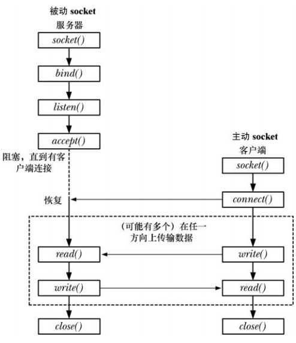
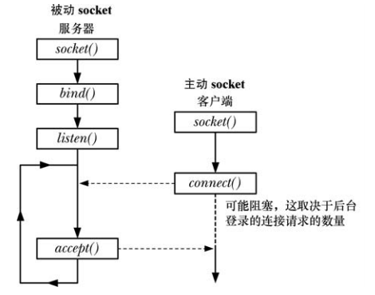
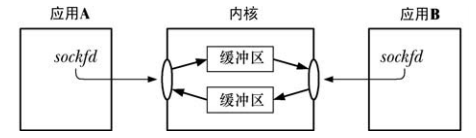
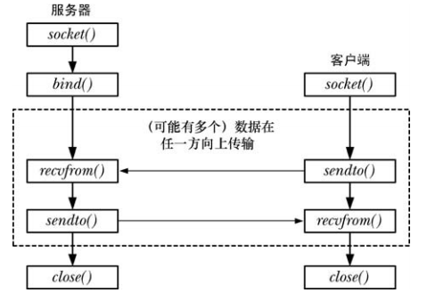

# 概述

在一个典型的客户端/服务器场景中，应用程序使用 socket 进行通信的方式如下：

- 各个应用程序创建一个 socket，socket 是一个允许通信的 "设备"，两个应用程序都要用到它
- 服务器将自己的 socket 绑定到一个众所周知的地址上使得客户端能够定位到它的位置

## 通信 domain

socket 存在于一个通信 domain 中，它确定：

- 识别出一个 socket 的方法
- 通信范围(同一主机还是不同主机)

现代操作系统至少支持下列 domain：

- UNIX(AF_UNIX) domain 允许在同一主机上的应用程序之间进行通信
- IPv4(AF_INET) domain 允许在使用 IPv4 网络连接起来的主机上的应用程序之间进行通信
- IPv6(AF_INET6) domain 允许在使用 IPv6 网络连接起来的主机上的应用程序之间进行通信


## socket 类型

每个 socket 实现都至少提供了两种 socket：流和数据报。


流 socket (SOCK_STRAEAM) 提供了一个可靠的双向的字节流通信信道：

- 可靠的：表示可以保证发送者传输的数据会完整无缺地到达接收应用程序，或收到一个传输失败的通知
- 双向的：表示数据可以在两个 socket 之间的任意一个方向上传输
- 字节流：表示与管道一样不存在消息边界的概念

流 socket 的正常工作需要一对相互连接的 socket，因此 socket 通常被称为面向连接的。一个流 socket 只能与一个对等的 socket 进行连接。

数据报 socket (SOCK_DGRAM) 允许以数据报的消息格式进行交换，消息边界得以保留，但是数据传输是不可靠的，消息的达到可能是无序的，重复的，甚至根本无法到达。

一个数据报 socket 在使用时无需与另一个 socket 连接。

## socket 系统调用

- `socket()` 创建一个新 socket
- `bind()` 将一个 socket 绑定到一个地址上
- `listen()` 允许一个 流 socket 接受来自其他 socket 的接入连接
- `accept()` 在一个监听流 socket 上接受来自一个对等应用程序的连接，并可选地返回对等 socket 地址
- `connect()` 建立与另一个 socket 之间的连接

socket IO 可以使用传统的 `read()`，`write()` 或者使用 socket 特有的系统调用 `send()`，`recv()`，`sendto()`，`recvfrom()` 来完成。默认情况下，这些系统调用在 IO 操作无法立即完成时将会阻塞，通过使用 `fcntl() F_SETFL O_NONBLOCK` 设置非阻塞。

# 创建一个 socket

```
#include <sys/types.h>
#include <sys/socket.h>

int socket(int domain, int type, int protocol);
```

- `socket()` 创建一个新 socket
- `domain` 指定了 socket 的通信 domain
- `type` 指定了 socket 类型：
  - 创建流 socket 时会被指定为 `SOCK_STREAM`
  - 创建数据报 socket 时会被指定为 `SOCK_DGRAM`
- `protocol` 一般设置为 0

# 将 socket 绑定到地址

```
#include <sys/types.h> 
#include <sys/socket.h>

int bind(int sockfd, const struct sockaddr *addr,socklen_t addrlen);
```

- `bind()` 将一个 socket 绑定到一个地址上
- `sockfd` 是  `socket()` 调用中获得的文件描述符
- `addr` 指向绑定的地址结构
- `addrlen` 是绑定地址结构的大小

一般来讲，会将一个服务器的 socket 绑定到一个众所周知的地址，即一个固定的与服务器进行通信的客户端应用程序提前知道的地址。

# 通用 socket 地址结构

不同的 socket domain 使用不同的地址结构，对于各种 socket domain 都需要定义一个不同的结构类型来存储 socket 地址，但是 `bind()` 之类的系统调用适用于所有的 socket domain，因此它们必须要能够接受任意类型的地址结构。因而定义了一个通用的地址结构 `socket sockaddr`。这个类型的唯一用途是将各种 domain 特定的地址结构转换成单个类型以供 socket 系统调用使用。

```
struct sockaddr {  
    sa_family_t sin_family;		// 地址族
    char sa_data[14]; 			/ /14字节，包含套接字中的目标地址和端口信息               
}; 
```

这个结构是所有 domain 特定的地址结构的模板。

# 流 socket



通过一个流 socket 通信类似于一个电话通信：

- `socket()` 将会创建一个 scoket，等价于安装一个电话，为使得两个应用程序能够通信，每个应用程序都必须要创建一个 socket
- 两个应用程序在相互通信之前必须相互连接：
  - 一个应用程序调用 `bind()` 将 socket 绑定到一个重所周知的地址上，然后调用 `listen()` 通知内核它愿意接受连接
  - 其他应用程序通过调用 `connect()` 建立连接，通知指定需连接的 socket 地址，这个过程类似于电话拨号
  - 调用 `listen()` 的应用程序使用 `accept()` 接受连接，类似于电话响起并接听
- 一旦建立了一个连接之后就可以在应用程序之间进行双向数据传输，直到其中一端使用 `close()` 关闭连接为止，通信可以使用 `read()/write()` 或者 `recv()/send()`

主动和被动 socket：

流 socket 通常可以分为主动和被动两种：

- 默认情况下，使用 `socket()` 创建的 socket 是主动的，一个主动 socket 可用 `connect()` 调用中来建立一个到一个被动 socket 的连接。这种行为被称为执行一个主动的打开
- 一个被动 socket，也称为监听 socket 是一个通过调用 `listen()` 以被标记成允许接入连接的 socket，接受一个接入连接通常被称为执行一个被动的打开

在大多数使用流 socket 的应用程序中，服务器会执行被动式打开，客户端执行主动式打开。

## 监听接入连接

```
#include <sys/types.h>
#include <sys/socket.h>

int listen(int sockfd, int backlog);
```

- `listen()` 系统调用将文件描述符 `sockfd` 引用的流 socket 标记为被动，这个 socket 后面会被用来接受来自其他 socket 的连接
- 无法在一个已连接的 socket 即已经成功执行 `connect()` 的 socket 和 `accept()` 调用返回的 socket 上执行 `listen()`
- 客户端可能会在服务器调用 `accept()` 之前调用 `connect()`，如果服务器可能正忙于处理其他客户端，这将产生一个未决连接，内核必须记录所有未决连接请求的相关信息，这样后续的 `accept()` 就能够处理这些请求：



- `backlog` 限制了未决连接的数量，在这个限制之内的连接请求会立即成功，之外的连接请求就会阻塞直到一个未决连接被 `accept()` 并从未决连接队列中删除为止，Linux 下特有的 `/proc/sys/net/core/somaxconn` 文件用来调整这个限制

## 接受连接

```
#include <sys/types.h>
#include <sys/socket.h>

int accept(int sockfd, struct sockaddr *addr, socklen_t *addrlen);
```

- `accept()` 系统调用在文件描述符 `sockfd` 引用的监听流 socket 上接受一个接入连接，如果在调用 `accept()` 时不存在未决连接，那么调用就会阻塞直到有连接请求到达为止
- `accept()` 会创建一个新 socket，并且正是这个新 socket 会与执行  `connect()` 对等 socket 进行连接，其返回的结果是已连接的 socket 的文件描述符
- 传入 `accept()` 的剩余参数会返回对端 socket 的地址，`addr` 返回相应的地址结构
- `addrlen` 是一个值-结果参数，它指向一个整数，在调用被执行前必须将这个值初始化为 `addr` 指向的缓冲区大小，这样内核就知道有多少空间可以用于返回  socket 地址，当 `accept()` 返回之后，这个整数会被设置成实际被复制进缓冲区中的数据的字节数
- 如果不关心对等 socket 地址，那么可以将 `addr` 和 `addrlen` 指定为 `NULL` 和 0

## 连接到对等 socket

```
#include <sys/types.h>  
#include <sys/socket.h>

int connect(int sockfd, const struct sockaddr *addr,socklen_t addrlen);
```

- `connect()` 将文件描述符 `sockfd` 引用的主动 socket 连接到地址通过 `addr` 和 `addrlen` 指定的监听 socket
- 如果 `connect()` 失败并且希望重新连接，SUSV3 规定完成这个任务的可移植方法是关闭这个 socket，创建一个新 socket，在该新 socket 上重新进行连接

## 流 socket IO

一对连接的流 socket 在两个端点之间提供了一个双向通信信道。



- 要执行 IO 需要使用 `read()` 和 `write()` 系统调用，或者 `recv()` 和 `send()`
- 一个 socket 可以使用 `close()` 关闭或在应用程序终止之后关闭，之后当对等应用程序试图从连接的另一端读取数据时将会收到文件结束，如果对等应用程序试图向其 socket 写入数据，那么它就会收到 `SIGPIPE` 信号，并且系统调用会返回 `EPIPE` 错误

## 连接终止

终止一个流 socket 连接的常见方式是调用 `close()`。如果多个文件描述符引用了同一个 socket，那么当所有描述符被关闭后连接就会终止。

# 数据报 socket



数据报 socket 的运作类似于邮政系统：

- `socket()` 等价于创建一个邮箱，所有需要发送和接收数据报的应用程序都需要使用 `socket()` 创建一个数据报 socket
- 为允许另一个应用程序发送其数据报，一个应用程序需要使用 `bind()` 将其 socket 绑定到一个众所周知的地址上
- 要发送一个数据报，一个应用程序需要调用 `sendto()`，它接收的其中一个参数是数据报发送到的 socket 的地址
- 为接收一个数据报，一个应用程序需要调用 `recvfrom()` ，它在没有数据报到达时将会阻塞
- 当不需要 socket 时，应用程序需要使用 `close()` 关闭 socket

## 交换数据报

```
#include <sys/types.h>
#include <sys/socket.h>

ssize_t recvfrom(int sockfd, void *buf, size_t len, int flags,struct sockaddr *src_addr, socklen_t *addrlen);
ssize_t sendto(int sockfd, const void *buf, size_t len, int flags, const struct sockaddr *dest_addr, socklen_t addrlen);
```

- `recvfrom()` 和 `sendto()` 在数据报 socket 上接收和发送数据
- `flags` 是一个位掩码，控制着 socket 特定的 IO 特性
- `src_addr` 和 `addrlen` 用来获取或指定与之通信的对等 socket 的地址，如果不关心可以设置为 `NULL` 和 0
- 不管 `length` 的参数值是多少， `recvfrom()` 只会从一个数据报 socket 中读取一条消息，如果消息的长度超过了 `length`，那么消息将会静默被截断为 `length` 字节
- `dest_addr` 和 `addrlen` 指定数据报发送到的 socket

Linux 上可以使用 `sendto()` 发送长度为 0 的数据报，但不是所有的 UNIX 实现都是如此。

## 在数据报 socket 上使用 `connect()`

尽管数据报 socket 是无连接的，但是在数据报 socket 上应用 `connect()` 调用仍然起作用，这将导致内核记录这个 socket 的对等 socket 的地址。已连接的数据报 socket 就是此种类型。非连接的数据报 socket 指的就是没有调用 `connect()`  的 数据报 socket，这也是默认行为。

当一个数据报 socket 已连接之后：

-  数据报的发送可在 socket 上使用 `write()` 和 `send()` 来完成并且会自动发送到同样的对等 socket上。与 `sendto()` 一样，每个 `write()` 发送一个独立的数据报


​	


