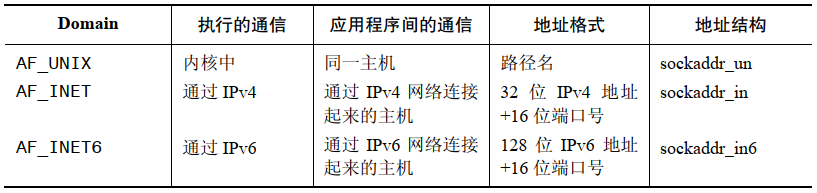
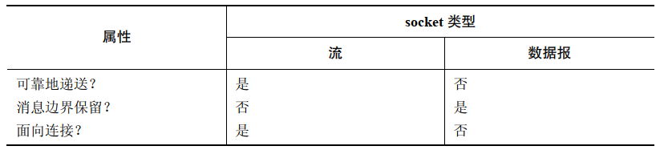

# 概述

在一个典型的客户端/服务器场景中，应用程序使用 socket 进行通信的方式如下：

- 各个应用程序创建一个 socket，socket 是一个允许通信的 "设备"，两个应用程序都要用到它
- 服务器将自己的 socket 绑定到一个众所周知的地址上使得客户端能够定位到它的位置

## 通信 domain

socket 存在于一个通信 domain 中，它确定：

- 识别出一个 socket 的方法
- 通信范围(同一主机还是不同主机)

现代操作系统至少支持下列 domain：

- UNIX(AF_UNIX) domain 允许在同一主机上的应用程序之间进行通信
- IPv4(AF_INET) domain 允许在使用 IPv4 网络连接起来的主机上的应用程序之间进行通信
- IPv6(AF_INET6) domain 允许在使用 IPv6 网络连接起来的主机上的应用程序之间进行通信

## socket 类型

每个 socket 实现都至少提供了两种 socket：流和数据报。

流 socket (SOCK_STRAEAM) 提供了一个可靠的双向的字节流通信信道：

- 可靠的：表示可以保证发送者传输的数据会完整无缺地到达接收应用程序，或收到一个传输失败的通知
- 双向的：表示数据可以在两个 socket 之间的任意一个方向上传输
- 字节流：表示与管道一样不存在消息边界的概念

流 socket 的正常工作需要一对相互连接的 socket，因此 socket 通常被称为面向连接的。一个流 socket 只能与一个对等的 socket 进行连接。

数据报 socket (SOCK_DGRAM) 允许以数据报的消息格式进行交换，消息边界得以保留，但是数据传输是不可靠的，消息的达到可能是无序的，重复的，甚至根本无法到达。

一个数据报 socket 在使用时无需与另一个 socket 连接。

## socket 系统调用

- `socket()` 创建一个新 socket
- `bind()` 将一个 socket 绑定到一个地址上
- `listen()` 允许一个 流 socket 接受来自其他 socket 的接入连接
- `accept()` 在一个监听流 socket 上接受来自一个对等应用程序的连接，并可选地返回对等 socket 地址
- `connect()` 建立与另一个 socket 之间的连接

socket IO 可以使用传统的 `read()`，`write()` 或者使用 socket 特有的系统调用 `send()`，`recv()`，`sendto()`，`recvfrom()` 来完成。默认情况下，这些系统调用在 IO 操作无法立即完成时将会阻塞，通过使用 `fcntl() F_SETFL O_NONBLOCK` 设置非阻塞。

​	

