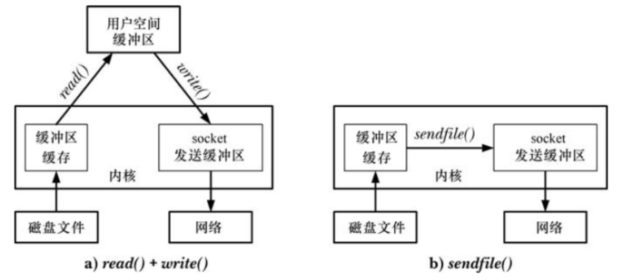
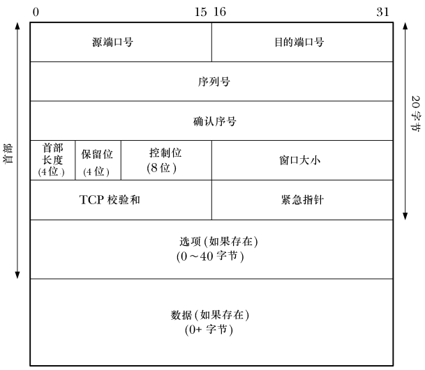
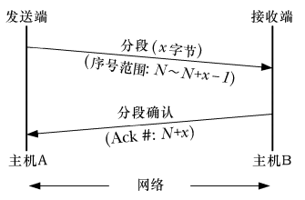
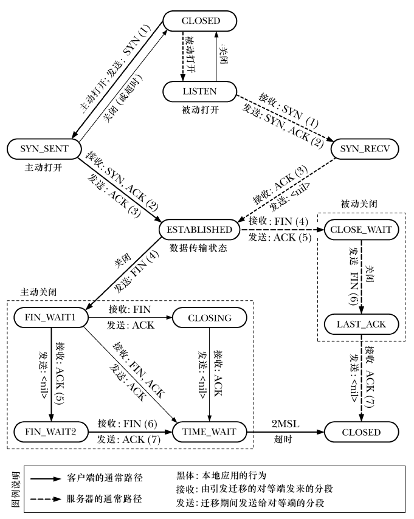
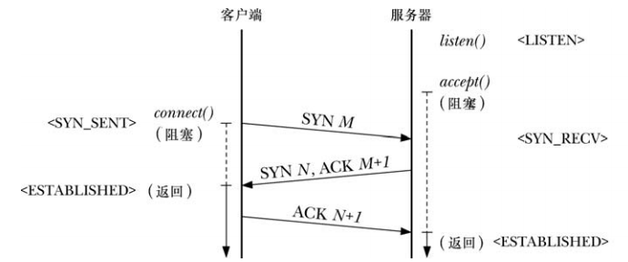
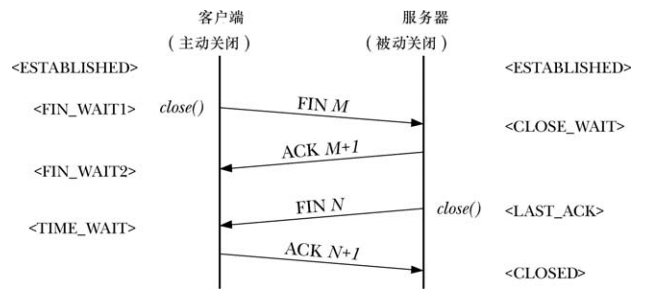
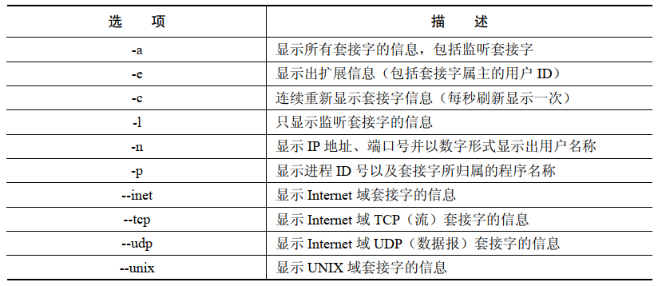

# 流式套接字上的部分读和部分写

如果套接字上可用的数据比在 `read()` 调用中请求的数据要少，那就可能会出现部分读的情况，` read()` 将返回可用的字节数。

如果没有足够的缓冲区空间来传输所有请求的字节，并且满足下面的一条，就可能会出现部分写的情况：

- `write()` 调用传输了部分请求的字节后被信号处理例程中断
- 套接字工作在非阻塞模式下，可能当前只能传输一部分请求的字节
- 在部分请求的字节已经完成传输后出现了一个异步错误，比如，由于 TCP 连接出现问题，可能会使对端应用程序崩溃

如果出现了部分 IO 现象，那么有时候需要重新调用系统调用来完成数据的传输。

```
ssize_t readn(int fd,void* buffer,size_t count)
{
    ssize_t numRead;
    size_t totRead;
    char* buf;

    buf = buffer;
    for(totRead = 0;totRead < count;)
    {
        numRead = read(fd,buf,count- totRead);

        if(numRead == 0)
            return totRead;
        if(numRead == -1)
        {
            if(errno == EINTR)
                continue;
            else
                return -1;
        }

        totRead += numRead;
        buf += numRead;
    }

    return totRead;
}

ssize_t writen(int fd,void* buffer,size_t count)
{
    ssize_t numWritten;
    size_t totWritten;
    const char* buf;

    buf = buffer;
    for(totWritten = 0;totWritten < count;)
    {
        numWritten = write(fd,buf,count - totWritten);

        if(numWritten <= 0)
        {
            if(numWritten == -1 && errno == EINTR)
                continue;
            else
                return -1;
        }

        totWritten += numWritten;
        buf += numWritten;
    }

    return totWritten;
}
```

# `shutdown()` 系统调用

在套接字上调用 `close()` 会将双向通信通道的两端都关闭，系统调用 `shutdown()` 提供了只关闭一端的功能。

```
#include <sys/socket.h>

int shutdown(int sockfd, int how);
```

-  `how` 参数的选项：

  - `SHUT_RD`：关闭连接的读端，之后的读操作将返回文件尾，数据仍然可以写入都套接字上，在 UNIX domain 流式 socket 上执行了此操作之后，对端应用程序将接收到一个 `SIGPIPE` 信号，如果继续尝试在对端套接字上做写操作将导致 `EPIPE` 错误
  - `SHUT_WR`：关闭连接的写端，一旦对端的应用程序已经将所有剩余的字节读取完毕，它就会检测到文件结尾，后续对本地套接字的写操作将产生 `SIGPIPE` 信号以及 `EPIPE` 错误，而由对端写入的数据仍然可以在套接字上读取
  - `SHUT_RDWR`：关闭连接的读端和写端

  需要注意的是：

  - 无论套接字是否还关联有其他的文件描述符，`shutdown()` 都会关闭套接字通道

  - `shutdown()` 不会关闭文件描述符，要关闭文件描述符，必须调用 `close()`

# 专用于套接字的 IO 系统调用: `recv()` 和 `send()`

```
#include <sys/types.h>
#include <sys/socket.h>

ssize_t recv(int sockfd, void *buf, size_t len, int flags);
ssize_t send(int sockfd, const void *buf, size_t len, int flags);
```

-  `flags` 参数是一个位掩码，用来修改 IO 操作的行为，对于 `recv()` 来说，参数可以是下列的值：

  - `MSG_DONTWAIT`：让 `recv()` 以阻塞方式执行，如果没有数据可用，那么 `recv()` 不会阻塞而是立即返回，伴随错误码 `EAGAIN`，也可以通过 `fcntl() O_NONBLOCK` 从而达到相同效果
  - `MSG_OOB`：在套接字上接收带外数据
  - `MSG_PEEK`：从套接字缓冲区中获取一份请求字节的副本，但不会将请求的字节从缓冲区中实际移除，这份数据稍后可以由其他的  `recv()` 和 `read()` 调用重新读取
  - `MSG_WAITALL`：通常 `recv()` 调用返回的字节数要比请求的字节数少，指定了  `MSG_WAITALL` 标记后将导致系统调用阻塞，直到成功的接收到请求的字节数。但是，就算指定了这个标记，当出现下列情况时，该调用返回的字节数可能还是会少于请求的字节：
    - 捕获到一个信号
    - 流式套接字的对端终止了连接
    - 遇到了带外数据字节
    - 从数据报套接字接收到的消息长度小于 `len` 个字节
    - 套接字上出现了错误

- `send()` 可以指定的 `flags` 参数：

  - `MSG_DONTWAIT`：让 `send()` 以非阻塞方式执行，如果数据不能立刻传输(因为套接字发送缓冲区已满)，那么调用就不会阻塞，而是调用失败，伴随错误码 `EAGAIN`
  - `MSG_MORE`：在 TCP 套接字上，这个标记实现的效果同套接字选项 `TCP_CORK`  完成相同的功能，区别在于该标记可以在每次调用中对数据进行栓塞处理。这个标记也可以用于数据报套接字，在连续的 `send()` 或者 `sendto()` 调用中传输的数据，如果指定了该标志，那么数据会打包成一个单独的数据报，仅当下一次调用中没有指定该标记时数据才会传输出去。该标记对于 UNIX 域套接字没有任何效果 
  - `MSG_NOSIGNAL`：当在已连接的流式套接字上发送数据时，如果；连接的另一端已经关闭了，指定该标记后将不会产生 `SIGPIPE` 信号，相反，`send()` 调用会失败，伴随的错误码为 `EPIPE`
  
  - `MSG_OOB`：在流式套接字上发送带外数据
  
  # `sendfile()` 系统调用
  
  将磁盘上的文件内容不做修改地通过已连接套接字传输出去：
  
  ```
  while((n = read(diskfilefd,buf,BUF_SIZE)) > 0)
  	write(sockfd,buf,n);
  ```
  
  但是如果频繁的传输大文件的话，这种技术就显得不很高效，为了传输文件，必须使用两个系统调用：
  
  - 一个用来将文件内容从内核缓冲区 cache 中拷贝到用户空间
  - 另一个用来将用户空间缓冲区拷贝回内核空间中
  
  `sendfile()` 可以直接将文件内容传输到套接字上，而不会经过用户空间，这种技术成为零拷贝传输：



```
#include <sys/sendfile.h>

ssize_t sendfile(int out_fd, int in_fd, off_t *offset, size_t count);
```

- `out_fd` 必须指向一个套接字，`in_fd` 必须是可以进行 `mmap()` 操作的
- 可以使用 `sendfile()` 将数据从文件传递到套接字上，但是反过来不行
- 如果 `offset` 指定为 `NULL`  的话，那么从 `in_fd` 传输的字节就从当前的文件偏移量处开始，且在传输时会更新文件偏移量以反映出已传输的字节数
- `count` 指定了请求传输的字节数，如果在 `count` 个字节完成传输前就遇到了文件结尾符，那么只有文件结尾之前的那些字节能够被传输，调用之后，`sendfile()` 返回实际传输的字节数

## TCP_CORK 套接字选项

要进一步提高 TCP 应用使用 `sendfile()`  时的性能，采用 Linux 专有的套接字选项 `TCP_CORK` 常常会有帮助。

当在 TCP 套接字上启用了 `TCP_CORK` 选项之后，所有的输出都会缓冲到一个单独的 TCP 报文段中，直到满足以下条件为止：已达到报文段的大小上限，取消了 `TCP_CORK` 选项，套接字被关闭，或者当启用 `TCP_CORK` 之后，写入达到了超时时间。

可以通过 `setsockopt()` 系统调用来启用或者取消 `TCP_CORK` 选项。

# 获取套接字地址

```
#include <sys/socket.h>

int getsockname(int sockfd, struct sockaddr *addr, socklen_t *addrlen);
int getpeername(int sockfd, struct sockaddr *addr, socklen_t *addrlen);
```

- `getsockname()` 可以返回套接字地址族，以及套接字所绑定到的地址，当隐式绑定到一个 Internet  域套接字上事，如果想获取内核分配给套接字的临时端口号，那么调用 `getsockname()` 也是有用的，内核会在出现如下情况时执行一个隐式绑定：
  - 已经在 TCP 套接字上执行了 `connect()`  或者 `listen()` 调用，但是还没有通过 `bind()` 绑定一个地址上
  - 当在 UDP 套接字上首次调用 `sendto()`  时，该套接字之前还没有绑定到地址上
  - 调用 `bind()` 时将端口号指定为 0，这种情况下 `bind()` 会为套接字指定一个 IP 地址，但内核会选择一个临时端口号
-  `getpeername()` 返回流式套接字中对端套接字的地址，如果服务器想找出发出连接的客户端地址，这个调用就特别由于，主要用于 TCP 套接字上

# TCP 协议

## TCP 报文的格式



- 源端口号：TCP 发送端的端口号
- 目的源端口号：TCP 接收端的端口号
- 序列号：报文的序列号，标识从 TCP 发端向 TCP 收端发送的数据字节流，它表示在这个报文段中的第一个数据字节上
- 确认序号：如果设定了 ACK 位，那么这个字段包含了接收方期望从发送方接收到的下一个数据字节的序列号
- 首部长度：该字段用来表示 TCP 报文首部的长度，首部长度单位是 32 位，由于这个字段只占 4 个比特位，因此首部总长度最大可达到 60 字节，该字段使得 TCP 接收端可以确定变长的选项字段的长度，以及数据域的起始点
- 保留位：该字段包含 4 个未使用的比特位，目前应该设置为 0
- 控制位：包含 8 个比特位组成，能够进一步指定报文的含义：
  - `CWR`：拥塞窗口减小标记，congestion window reduced flag
  - `ECE`：显式的拥塞通知回显标记，explicit congestion notification echo flag
  - `URG`：如果设置了这个位，那么紧急指针字段包含的信息将是有效的
  - `ACK`：如果设置了该位，那么确认序号字段包含的信息是有效的
  - `PSH`：将所有收到的数据发送给接收的进程
  - `RST`：重置连接，用于处理多种错误情况
  - `SYN`：同步序列号，在连接连接时，双方需要交换设置了该位的报文，这样使得 TCP 连接的两端可以指定初始序号，在稍后可以双向传输数据
  - `FIN`：发送端提示完成了发送任务
- 窗口大小，该字段用在接收端发送 `ACK` 确认时提示自己可接受数据的空间大小
- 校验和：16 位的检验和包括 TCP 首部和 TCP 的数据域
- 紧急指针：如果设置了 `URG` 位，那么就表示从发送端到接收端传输的数据为紧急数据
- 选项：变长字段，包含了控制 TCP 连接操作的选项
- 数据：这个字段包含了该报文段中传输的用户数据，如果报文段没有包含任何数据，这个字段的长度为 0

## TCP 序列号和确认机制

每个通过 TCP 连接传输的字节都由 TCP 协议分配了一个逻辑序列号，在一条连接上，双向数据流都有各自的序列号。当传送一个报文时，该报文的序列号字段被设定为该传输方向上的报文段数据域第一个字节的逻辑偏移，这样 TCP 接收端就可以按照正确的顺序对接收到的报文段重新组装，并且当发送一个确认报文给发送端时就表明自己接收到的是哪一个数据。



为了实现可靠的通信，TCP 采用了主动确认的方式，确认号字段被设置为接收方所期望接收的下一个数据字节的逻辑序列号，也就是，确认号字段的值就是上一个成功接收到的数据字节的序列号加 1。

当 TCP 发送端发送报文时会设置一个定时器，如果在定时器超时时没有接收到确认报文，那么该报文会重新发送。

## TCP 协议状态机以及状态迁移

维护一个 TCP 连接需要同步协调连接的两端，为了减小这项任务的复杂度，TCP 节点以状态机的方式来建模。

TCP 的状态有以下几种：

- `LISTEN`：TCP 正等待从对端 TCP 节点发来的连接请求
- `SYN_SENT`：TCP 发送了一个 SYN 报文，代表应用程序执行了一个主动打开的操作，并等待对端回应以此完成连接的建立
- `SYN_RECV`：之前处于 `LISTEN` 状态的 TCP 节点收到了对端发送的 SYN 报文，并已经通过发送 `SYN/ACK` 报文做出了响应
- `ESTABLISHED`：与对端 TCP 节点间的连接建立完成，数据报文此时可以在两个 TCP 节点间双向交换
- `FIN_WAIT1`：应用程序关闭了连接，TCP 节点发送了一个 `FIN` 报文到对端，以此终止本端的连接，并等待对端发来的 `ACK` 
- `FIN_WAIT2`：之前处于 `FIN_WAIT1` 状态的 TCP 节点现在已经收到了对端 TCP 节点发来的 `ACK`
- `CLOSING`：之前处于 `FIN_WAIT1` 状态的 TCP 节点正在等待对端发送 `ACK`，但却收到了 `FIN`，这表示对端也在尝试执行一个主动关闭，也就是说，这两个 TCP 节点几乎同一时刻发送了 `FIN` 报文，这种情况极为罕见
- `TIME_WAIT`：完成主动关闭后，TCP 节点接收到了 `FIN` 报文，这表示对端执行了被动关闭，此时 TCP 节点将在 `TIME_WAIT` 状态中等待一个固定的时间，这是为了确保 TCP 连接能够可靠的终止，同时也是为了确保任何老的重复报文在重新建立同样的连接之前在网络中超时消失，在这个固定的时间段之后，连接关闭，相关的内核资源释放 
- `CLOSE_WAIT`：节点从对端接收到了 `FIN` 报文后将处于 `CLOSE_WAIT` 状态，该状态以及接下来的一个状态都同应用程序执行的被动关闭有关，也就是第二个执行关闭操作的应用
- `LAST_ACK`：应用程序执行被动关闭，而之前处于 `CLOSE_WAIT` 状态的 TCP 节点发送另一个 `FIN` 报文给对端，并等待对端的确认，当收到对端发来的确认 `ACK` 报文时，连接关闭，相关的内核资源都会得到释放
- `CLOSED`：虚拟状态，表示没有连接的状态



## TCP 连接的建立

- 服务器调用 `listen()` 在套接字上执行被动打开，然后调用 `accept()` 阻塞服务器进程直到连接建立完成
- 客户端调用 `connect()` 在套接字上执行主动打开，以此来同服务器端的被动打开套接字之间建立连接
- `connect()` 调用导致客户端 TCP 节点发送一个 `SYN` 报文到服务器端 TCP 节点，这个报文将告知服务器有关客户端 TCP 节点的初始序列号，这个信息是必要的，因为序列号不是从 0 开始的
- 服务器端 TCP 节点必须确认客户端发送来的  `SYN` 报文，并告知客户端自己的初始序列号，服务器端 TCP 节点返回一个同时设定了 `SYN`  和 `ACK` 控制位的报文，这样就能同时执行两种操作
- 客户端 TCP 节点发送一个 `ACK` 报文来确认服务器端 TCP 节点的 `SYN` 报文 



## TCP 连接的终止

关闭一个 TCP 的连接通常会使用下列几种方式：

- 在一个 TCP 连接上，其中一端的应用程序执行 `close()` 调用，通常称为应用程序正在执行一个主动关闭
- 连接另一端的服务器也执行 `close()` 调用，通常称为被动关闭

客户端主动关闭：

- 客户端执行一个主动关闭，这将导致客户端 TCP 节点发送一个 `FIN` 报文给服务器
- 在接收到 `FIN` 之后，服务器 TCP 节点发出 `ACK` 报文作为响应，之后再服务器端，任何 `read()` 操作的尝试都会产生文件尾
- 稍后，服务器关闭自己的这端的连接时，服务器端发送 `FIN` 报文到客户端
- 客户端 TCP 节点发送 `ACK` 报文作为响应，以此来确认服务器发来的 `FIN` 报文




## 在TCP 套接字上调用 `shutddown()`

`close()` 将 TCP 套接字的发送和接收端全部关闭，`shutdown()` 可以用来关闭连接中的一个通道。

将 `shutdown()` 中的 `how`  参数指定为 `SHUT_WR` 或者 `SHUT_RDWR` 时：将开始 TCP 的终止步骤，TCP 节点将迁移至 `FIN_WAIT1` 状态，然后进入 `FIN_WAIT2` 状态，同时对端 TCP 节点迁移到 `CLOSE_WAIT` 状态。如果是 `SHUT_WR` ，那么由于套接字文件描述符还保持合法，而且连接的读端仍旧打开，因此对端可以继续发送数据。

`SHUT_RD` 在 TCP 套接字中是没有实际意义的，`SHUT_RD` 在不同的实现中各有不同，可移植程序应该避免使用。

## `TIME_WAIT` 状态

`TIME_WAIT` 主要基于两个目的：

- 实现可靠的连接终止
- 让老的重复的报文段在网络中过期失效，这样在建立新的连接时将不接收它们

`TIME_WAIT` 状态迁移到其他状态时需要满足超时条件，这个超时时间是 2 倍的 MSL(报文最大生存时间)。

IP 首部中有一个 8 位的生存时间字段 `TTL`，如果在报文从源主机到目的主机之间传递时，在规定的跳数(经过的路由器)内报文没有到达目的地，那么该字段用来确保所有的 IP 报文最终都会被丢弃。`MSL` 是 IP 报文在超过 `TTL` 限制前可在网络中生存的最大估计时间，由于 `TTL` 只有 8 位，因此允许最大的跳数为 255 跳。

Linux 上 `TIME_WAIT` 状态将持续 60 秒，但是 RFC 1122 建议 `MSL` 的值为 2 分钟。


**确保能可靠地终止连接**

为了确保可靠的终止连接需要交换 4 个报文，其中最后一个 `ACK` 报文是从执行主动关闭的一方发往被动关闭的一方，如果这个 `ACK` 包在网络中被丢弃，那么执行 TCP 被动关闭的一方最终会重传它的 `FIN` 报文，让执行 TCP 主动关闭的一方保持 `TIME_WAIT` 状态一段时间，可以确保它在这种情况下可以重新发送最后的 `ACK`  确认报文。如果执行主动关闭的一方已经不存在了，那么由于它不再持有关于连接的任何状态信息，TCP 协议将针对对端重发的 `FIN` 发送一个 `RST` 给执行被动关闭的一方以作为响应，而这个 `RST`  将被解释为错误。这也是 `TIME_WAIT` 状态持续 2 倍 MSL 的原因：

- 1 个 MSL 时间留给最后的 `ACK` 确认报文到达对端的 TCP 节点
- 1 个 MSL 时间留给必须发送的 `FIN` 报文

**确保老的重复的报文在网络中过期失效**

TCP 重传算法可能会产生重复的报文，并且根据路由的选择，这些重复的报文可能会再连接已经终止后才到达，比如 `204.152.189.116:21` 和 `200.0.0.1:50000` 之间的连接已经关闭了，之后使用同样的 IP 地址和端口重新建立连接，这可以看做是原来连接的新化身，在这种情况下，TCP 必须确保上一次连接中老的重复报文不会在新连接中被当成合法数据接收，当有 TCP 节点处于 `TIME_WAIT` 状态时是无法通过该节点创建新的连接的。

# 监视套接字：`netstat`

`netstat` 程序可以显示系统中 Internet 和 UNIX 域套接字的状态，常用的命令选项：



对于每个 Internet 域套接字，可以看到如下信息：

- `Proto`：套接字使用的协议类型：TCP 或者 UDP
- `Recv-Q`：表示套接字接收缓冲区中还没有被本地应用读取的字节数，对于 UDP 套接字来说，该字段不只包含数据，还包含 UDP 首部以及其他元数据所占的字节
- `Send-Q`：表示套接字发送缓冲区中排队等待发送的字节数，对于 UDP 套接字，该字段还包含了 UDP 首部和其他元数据所占的字节
- `Local Address`：表示套接字绑定到的地址，以 `主机名:端口号` 的形式表示，`*` 表示这是一个通配 IP 地址
- `Foreign Address`：对端套接字所绑定的地址，`：`  表示没有对端地址
- `State`：表示当前套接字所处的状态

# 使用 `tcpdump` 来监视 TCP 流量 

`tcpdump` 可以用来显示所有类型的 TCP/IP 数据包流量。

`tcpdump` 显示的方式：

```
src > dst:flags data-seqno ack window urg <options>
```

- `src`：表示源 IP 地址和端口号
- `dst`：表示目的 IP 地址和端口号
- `flags`：S(SYN)，F(FIN)，P(PSH)，R(RST)，E(ECE)，C(CWR)
- `data-seqno`：表示整个数据包中的序列号范围
- `ack`：表示连接的另一端所期望的下一个字节的序列号
- `window`：表示对端用于传输的接收缓冲区的空间大小
- `urg`：表示报文段在指定的偏移上包含紧急数据
- `options`：描述包含在该报文段中的任意 TCP 选项

# 套接字选项

```
#include <sys/types.h> 
#include <sys/socket.h>

int getsockopt(int sockfd, int level, int optname,void *optval, socklen_t *optlen);
int setsockopt(int sockfd, int level, int optname,const void *optval, socklen_t optlen);
```

- `level` 指定套接字选项所适用的协议，比如，IP 或者 TCP，`SOL_SOCKET` 表示选项作用于套接字 API 层
- `optname` 表示希望设定或者取出的套接字选项
- `optval` 指向缓冲区的指针，用来指定或者返回选项的值
- `optlen` 指定了 `optval` 所指向的缓冲区空间大小，对于 `setsockopt()` 来说，这个参数是按值传递的，对于 `getsockopt()` 来说，`optlen` 是一个保存结果值的参数

套接字选项的一个简单例子是 `SO_TYPE`，可以用来找出套接字的类型：

```
int optval;
socklent_t optlen;

optlen = sizeof(optval);
if(getsockopt(sfd,SOL_SOCKET,SO_TYPE,&optval,&optlen) == -1)
	errExit("getsockopt()");
```

`optval` 就会包含了比如 `SOCK_STREAM` 或者 `SOCK_DGRAM`。

# `SO_REUSEADDR` 套接字选项

`SO_REUSEADDR` 套接字选项有多种用途，其中之一就是：避免当 TCP 服务器重启时，尝试将套接字绑定到当前已经同 TCP 节点相关联的端口上时出现的 `EADDRINUSE` 错误，这个问题可能是会在下面两个情况中出现：

- 之前连接到客户端的服务器要么通过 `close()`，要么是因为崩溃而执行了一个主动关闭，这就使得 TCP 节点将处于 `TIME_WAIT` 状态，直到 2 倍的 MSL 超时过期为止
- 之前，服务器先创建一个子进程来处理客户端的连接，稍后，服务器终止，而子进程继续服务客户端，因而使得维护的 TCP 节点使用了服务器的知名端口号

以上两种情况下，剩下的 TCP 节点无法接受新的连接。

一个已连接的 TCP 套接字由一个 4 元组来唯一标识：

```
{local-IP-address,local-port,foreign-IP-address,foreign-port}
```

大多数实现都强制施加了一个更为严格的约束：如果主机上有任何可匹配到本地端口的 TCP 连接，则本地端口不能被重用，启用 `SO_REUSEADDR` 套接字选项可以解放这个限制，使得更接近 TCP 的需求，默认情况下该选项的值为 0，表示被关闭，可以在绑定套接字之前为该选项设定一个非 0 值来启用它。

# 在 `accept()` 中继承标记和选项

多种标记和设定都可以同打开的文件描述和文件描述符相关联起来，可以为套接字设置多个选项，如果这些标记和选项设置在监听套接字上，它们会通过 `accept()` 返回的新套接字继承吗？

在 Linux 上，如下属性是不会被 `accept()` 返回的新的文件描述符所继承：

- 同打开的文件描述符相关的状态标记，即可以通过 `fcntl()`  的 `F_SETFL` 操作所修改的标记，例如 `O_NONBLOCK` 和 `O_ASYNC`
- 文件描述符标记，可以通过 `fcntl()`  的 `F_SETFD` 操作所修改的标记，唯一的一个标记就是 `FD_CLOEXEC`
- 与信号驱动 IO 相关联的文件描述符属性，如 `fcntl()` 的 `F_SETOWN`（属主进程 ID）以及 `F_SETSIG`(生成信号)操作

也就是说 `accept()` 返回的新套接字继承了大部分套接字选项。

# TCP vs. UDP

UDP 的优势：

- UDP 服务器能从多个客户端接收数据报并可以向它们发送回复，而不必为每个客户端创建和终止连接，也就是说 UDP 传送单条信息的开销比 TCP 小
- 对于简单的请求——响应式通信，UDP 要比 TCP 快，因为 UDP 不需要建立和终止连接
- UDP 套接字上可以进行广播和组播处理：
  - 广播允许发送端发送的数据报能在接入该网络中的所有主机的相同端口上接收到
  - 组播与广播类似，但是只允许数据报发送到指定的一组主机上
- 某些特定类型的应用，例如音视频流等，不需要 TCP 提供的可靠性也能工作在可接受范围内

如果想使用 UDP 但是又需要保证可靠性那么应用程序必须自行实现可靠性保证，至少包括序列号，确认机制，丢包重传，重复报文检测等。

# 高级功能


 


 


