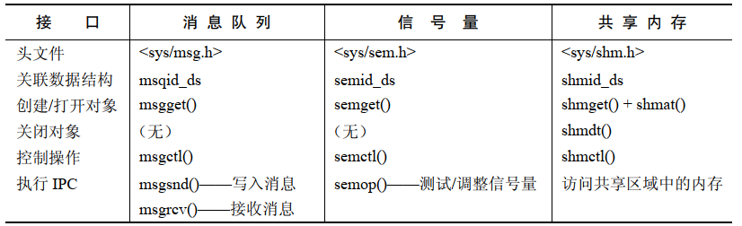
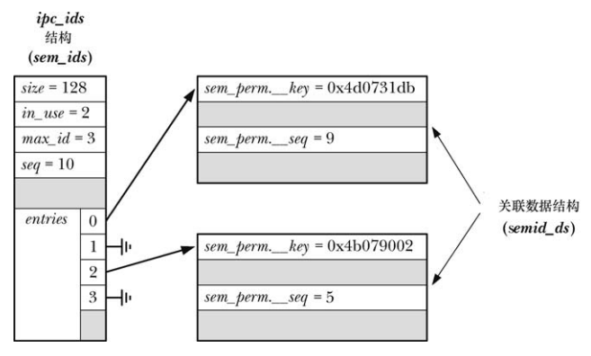

System IPC包括三种不同的进程间通信机制：

- 消息队列用来在进程之间传递消息：消息队列和管道有点像，但存在两个重大差别：
  - 第一是消息队列是存在边界的，这样读者和写者之间以消息进行通信，而不是通过无分隔符的字节流进行通信的
  - 第二是每条消息包括一个整形的 type 字段，并且可以通过类型类选择消息而无需以消息被写入的顺序来读取消息
- 信号量允许多个进程同步它们的动作：一个信号量是一个由内核维护的整数值，它对所有具备相应权限的进程可见。一个进程通过对信号量的值进行相应的修改来通知其他进行它正在执行某个动作
- 共享内存：使得多个进程能够共享内存(即同被映射到多个进程的虚拟内存的页帧)的同一块区域(称为一个段)。由于访问用户空间内存的操作是非常快的，因此共享内存是其中一种速度最快的 IPC 方法：一旦进程更新了共享内存，那么这个变更会立即对共享同一个内存段的其他进程可见

System V IPC 是一个通过 `CONFIG_SYSVIPC` 选项进行配置的内核选项。

# 概述



## 创建和打开一个System V IPC对象

每个 System V IPC 机制都有一个相关的 `get` 系统调用（`msgget()`、`semget()` 或 `shmget()`），它与文件上的 `open()` 系统调用类似。给定一个整数 `key` (类似文件名)，`get` 调用完成下列某个操作：

- 使用给定 `key` 创建一个新的 IPC 对象并返回一个唯一的标识符来标识该对象
- 返回一个拥有给定的 key 的既有 IPC 对象的标识符，即打开一个既有 IPC 对象。在这种情况下，`get` 调用所做的事情是将一个数字 (`key`) 转换为另一个数字（标识符）

IPC 标识符与文件描述符类似，在后继所有引用该 IPC 对象的系统调用中都需要用到它。但这两者之间存在一个重要的语义上的差别。文件描述符是一个进程特性，而 IPC 标识符则是对象本身的一个属性并且对系统全局可见。所有访问同一对象的进程使用同样的标识符。这意味着如果知道一个 IPC 对象已经存在，那么可以跳过 `get` 调用，只要能够通过某种机制来获得对象的标识符即可。比如，创建对象的进程可以将标识符写入一个可供其他进程读取的文件。

下面的例子展示了如何创建一个System V 消息队列：

```cpp
id = msgget(key, IPC_CREAT | S_IRUSR | S_IWUSR);
if(id == -1){
	perror("msgget");
	exit(EXIT_FAILURE);
}
```

如果没有与给定的 `key` 对应的 IPC 对象存在并且在 `flags` 参数中指定了 `IPC_CREAT`（与 `open()` 的 `O_CREAT` 标记类似），那么  `get`  调用会创建一个新的 IPC 对象。如果不存在相应的 IPC 对象并且没有指定 `IPC_CREAT`（并且没有将 `key` 指定为 `IPC_PRIVATE`），那么 `get` 调用会失败并返回 `ENOENT` 错误。

一个进程可以通过指定 `IPC_EXCL` 标记（类似于 `open()` 的 `O_EXCL` 标记）来确保它是创建 IPC 对象的进程。如果指定了 `IPC_EXCL` 并且与给定 `key`  对应的 IPC 对象已经存在，那么 `get`  调用会失败并返 `EEXIST` 错误。

## IPC 对象删除和对象持久

各种 System V IPC 机制的 `ctl` 系统调用（`msgctl()`、`semctl()`、`shmctl()`）在对象上执行一组控制操作，其中很多操作都是特定于某种 IPC 机制的，但是有一些是适用于所有的 IPC 机制的，其中一个就是 `IPC_RMID` 控制操作，他可以用来删除一个对象。比如下面可以删除一个共享内存对象：

```
if(shmctl(id, IPC_RMID, NULL) == -1){
	exit(EXIT_FAILURE);
}
```

对于消息队列和信号量来讲，IPC 对象的删除是立即生效的，对象中包含的所有信息都会被销毁，不管是否有其他进程仍然在使用该对象(这也是 System IPC 对象的操作与文件的操作不同的一个地方。在文件操作中，如果删除了指向文件的最后一个链接，那么实际上只有当所有引用该文件的打开着的文件描述符都被关闭了之后才会删除该文件)

共享内存对象的删除操作是不相同的，在 `shmctl(id,IPC_RMID, NULL)` 调用之后，只有当所有使用该内存段的进程与该内存段分离之后（使用 `shmdt()`）才会删除该共享内存段。

System V IPC 具有持久性。一旦被创建之后，一个对象就一直存在直到它被显示的删除或者系统被关闭。System V IPC 对象的这个属性是非常有用的，因为一个进程可以创建一个对象、修改其状态、然后退出并使得在后面某个时刻启动的进程可以访问这个对象。但是这种属性也是存在缺点的，其原因如下：

- 系统对每种类型的 IPC 对象的数量是有限制的。如果没有删除不用的对象，那么应用程序最终可能会因达到这个限制而发送错误
- 在删除一个消息队列或者信号量时，多进程应用程序可能难以确定哪个进程是最后一个需要访问对象的进程，从而导致难以确定何时可以安全的删除对象。这里的问题是这些对象是无连接的，内核不会记录哪个进程打开了对象（共享内存段不存在这个确定，因为它们的删除操作的语义不同）

# IPC Key

System V IPC key 是一个整数值，其数据类型为 `key_t`。IPC `get` 调用将一个 `key` 转换成相应的整数 IPC 标识符。这些调用能够确保如果创建的是一个新 IPC 对象，那么对象能够得到一个唯一的标识符，如果指定了一个既有对象的 `key`，那么总是会取得该对象的（同样的）标识符。（在内部，内核会为各种 IPC 机制维护这一个数据结构将key映射成标识符）

那么如何产生唯一的 `key` 呢？这个问题存在三种解决方案：

- 随机地选取一个整数值作为 `key` 值，这些整数值通常会被放在一个头文件中，所有使用 IPC 对象的程序都需要包含这个头文件。这个方法的难点在于可能会无意中选取了一个已被另一个应用程序使用的值
- 在创建 IPC 对象的 `get` 调用中将 `IPC_PRIVATE` 常量作为 `key` 的值，这样就会导致每个调用都会创建一个全新的 IPC 对象，从而确保每个对象都拥有一个唯一的 `key`
- 使用 `ftok()` 函数生成一个(接近唯一) `key`

## 使用 IPC_PRIVATE 产生一个唯一的 key

在创建一个新 IPC 对象时必须要像下面这样将 `key` 指定为 `IPC_PRIVATE`：

```cpp
id = msgget(IPC_PRIVATE, S_IRUSR | S_IWUSR);
```

在上面的代码中无需指定 `IPC_CREAT` 和 `IPC_EXCL` 标记。

## 使用 ftok()产生一个唯一的 key

`ftok()` 函数返回一个适合在后继对某个 System V IPC `get`系统调用进行调用时使用的 `key`值：

```
#include <sys/types.h>
#include <sys/ipc.h>

key_t ftok(const char *pathname, int proj_id);
```

`key` 值是使用实现定义的算法根据提供的 `pathname` 和 `proj_id` 值生成的。SusV3要求如下：

- 算法只使用 `proj_id` 的最低的 8 个有效位
- 应用程序必须要确保 `pathname` 引用一个可以应用 `stat()` 的既有文件（否则 `ftok()` 会返回 −1）
- 如果将引用同一个文件（即 `i-node`）不同的路径名（链接）传递给了 `ftok()` 并且指定了同样的 `proj_id` 值，那么函数必须要返回同样的 `key`  值

`ftok()` 使用 `i-node` 号来生成 `key` 值，而并没有使用文件名来生成 `key` 值（由于 `ftok()` 算法依赖于 `i-node` 号，因此在应用程序的生命周期中不应该将文件删除和重新创建，因为重新创建文件时可能会分配到一个不同的 `i-node`号）。

`proj_id` 的目的仅仅是允许从同一个文件中生成多个 `key`，这对于需要创建同种类型的多个 IPC 对象的应用程序来讲是有用的。

通常，传递给 `fork()` 的 `pathname` 会引用构成应用程序或者由应用程序创建的文件或者目录之一，协同运行的进程会将同样的 `pathname` 传递给 `ftok()`。

在 Linux 上，`ftok()` 返回的 `key` 是一个 32 位的值，它通过取 `proj` 参数的最低 8 个有效位、包含该文件所属的文件系统的设备的设备号（即次要设备号）的最低 8 个有效位以及 `pathname` 所引用的文件的 `i-node` 号的最低 16 个有效位组合而成。（后两项信息通过在 `pathname` 上调用 `stat()` 获得。

glibc `ftok()` 的算法与其他 UNIX 实现所采用的算法类似，它们都存在一个类似的限制：两个不同的文件可能会产生同样的 `key` 值（可能性非常小）。之所以会发生这样的情况是因为不同文件系统上的两个文件的 `i-node` 号的最低有效位可能会相同，并且两个不同的磁盘设备可能有同样的次要设备号号。但在实践中，不同的应用程序产生同样的 `key`  值的可能性非常非常小以至于使用 `ftok()` 产生 `key`  已经是一项可靠的技术了。

`ftok()` 的典型用法如下所示：

```
key_t key;
int id;


key = ftok("mydir/myfile", 'x');
if(key == -1){
	exit(EXIT_FAILURE);
}

id = msgget(key, IPC_CREAT | S_IRUSR | S_IWUSR);
if(id == -1){
	perror("msgget");
	exit(EXIT_FAILURE);
}
```

# 关联数据结构和对象权限

内核为 System V IPC 对象的每个实例都维护这一个关联数据结构。这个数据结构的形式因 IPC 机制(消息队列、信号量、或共享内存)的不同而不同，它是在各个 IPC 机制对应的头文件中对应的。

一个 IPC 对象的关联数据结构会再通过相应的 `get` 系统调用创建对象时进行初始化。对象一旦被创建之后，程序就可以通过指定 `IPC_STAT` 操作类型使用合适的`ctl` 系统调用来获取这个数据结构的一个副本。使用 `IPC_SET` 操作可以修改这个数据结构中的部分数据。

除了各种 IPC 对象特有的数据结构外，所有三种 IPC 机制的关联数据结构都包含一个子结构 `ipc_perm`，它保存了用于确定对象之上的权限的信息。

```
struct ipc_perm{
	key_t         __key;
	uid_t         uid;           // owner's user ID
	git_t         gid;           // owner's group ID
	uid_t         cuid;          // creator's user ID
	gid_t         cgid;          // creator's group ID
	unsigned short mode;         // permission
	unsigned short _seq;         // squence number   
};
```

SUSv3 要求 `ipc_perm` 结构中除 `__key`  和 `__seq` 字段之外的所有其他字段都要具备。大多数 UNIX 实现都提供了相应的字段。

- `uid` 和 `gid` 字段指定了 IPC 对象的所有权
- `cuid` 和 `cgid` 字段保存着创建该对象的进程的用户 ID 和组 ID

一开始，相应的用户和创建者 ID 字段的值是一样的，它们都源自调用进程的有效ID。创建者 ID 是不可变的，而所有者 ID 可以通过 `IPC_SET` 操作进行修改。下面代码演示了如何修改共享内存段的 `uid`：

````
struct shmid_ds shmds;

if(shmctl(id, IPC_STAT, &shmds) == -1) {  // fetch from kernel
	exit(EXIT_FAILURE);
}
shmds.shm_perm.uid = newuid;
if(shmctl(id, IPC_SET, &shmds) == -1) { // update kernet copy
	exit(EXIT_FAILURE);
}
````

`ipc_perm` 子结构的 `mode` 字段保存着 IPC 对象的权限掩码。这些权限是使用在创建该对象的 `get` 系统调用中指定的 `flags` 参数的低 9 位初始化的，但后面使用 `IPC_SET` 操作则可以修改这个字段的值。

与文件一样，权限被分成了三类：`owner`（也称为 `user`）、`group` 以及 `other`，并且可以为各个类别指定不同的权限。但 IPC 对象的权限模型与文件权限模型存在一些显著差别：

- 对于 IPC 对象来讲只有读和写权限有意义。（对于信号量来讲，写权限通常被称为修改（alter）权限。）执行权限是没有意义的，在执行大多数访问检测时通常会忽略这个权限。
- 权限检测会根据进程的有效用户 ID、有效组 ID 以及辅助组 ID 来进行。（这与 Linux上文件系统权限检测不同，它使用的是进程的文件系统 ID

IPC 对象上的进程权限分配的准确规则如下：

- 如果进程是特权进程（`CAP_IPC_OWNER`），那么所有权限都会被赋予 IPC 对象
- 如果进程的有效用户 ID 与 IPC 对象的所有者或创建者 ID 匹配，那么会将对象的 `owner`（`user`）的权限赋予进程
- 如果进程的有效用户 ID 或任意一个辅助组 ID 与 IPC 对象的所有者组 ID 或创建者组ID 匹配，那么会将对象的 `group` 的权限赋予进程
- 否则会将对象的 `other` 的权限赋予进程

在内核代码中，只有当一个进程没有通过其他测试被赋予所需的权限时才会去测试该进程是否是一个特权进程。之所以这样做是为了避免不必要的设置 ASU 进程标记，该标记用于指示进程是否使用超级用户权限。

注意 `IPC_PRIVATE key` 值的使用和 `IPC_EXCL` 标记的存在不会影响进程对 IPC 对象的访问，这种访问权限只由对象的所有者和权限来确定。

当需获取一个既有 IPC 对象的标识符而执行一个 `get` 调用时会进行初次权限检测以确定在 `flags`  参数中指定的权限与既有对象上的权限是否匹配。如果不匹配，那么 `get` 调用会失败并返回 `EACCES` 错误。

其他常见操作所需的权限如下所述：

- 从对象中获取信息（如从消息队列中读取一条消息，获取一个信号量的值，或因读取而附上一个共享内存段）需要读权限
- 更新对象中的信息（如向消息队列写入一条消息，修改一个信号量的值，或因写入而附上一个共享内存段）需要写权限
- 获取一个 IPC 对象的关联数据结构的副本（`IPC_STAT ctl` 操作）需要读权限
- 删除一个 IPC 对象（`IPC_RMID ctl` 操作）或修改其关联数据结构（`IPC_SET ctl` 操作）不需要读或写权限，相反，调用进程必须是特权进程（`CAP_SYS_ADMIN`）或有效用户 ID 与对象的所有者用户 ID 或创建者用户 ID 匹配（否则返回错误 `EPERM`）

# System V IPC  `get` 调用使用的算法




上图给出了内核内部使用的一些表示 System V IPC 对象(上面是信号量，但是其他 IPC 机制类似)相关信息的结构，包括用于计算 IPC `key` 的字段。对于每种 IPC机制，内核都会维护一个管理的 `ipc_ids` 结构，它记录着该 IPC 机制的所有实例的各种全局信息，包括一个大小会动态变化的指针数组 `entries`，数组中的每个元素执行一个对象实例的关联数据结构（在信号量中是 `semid_ds` 结构）。`entries` 数组的当前大小记录在 `size` 字段中，`max_id` 字段记录着当前使用中的元素的最大下标。

在执行一个 IPC `get` 调用时，Linux 所采用的算法近似如下：

- 在关联数据结构列表( `entries` 数组中的元素指向的结构)中搜索 `key` 字段与 `get` 调用中指定的参数匹配的结构：
  - 如果没有找到匹配的结构并且没有指定 `IPC_CREAT`，那么返回 `ENOENT` 错误
  - 如果找到了一个匹配的结构，但同时指定了 `IPC_CREAT` 和 `IPC_EXCL`，那么返回 `EEXIST`  错误
  - 找到一个匹配的结构，直接返回，跳过下面的步骤
- 如果没有找到匹配的结构并指定了 `IPC_CREAT`，那么会分配一个新的与所采用的机制对应的关联数据结构(上图是 `semid_ds`)并对其进行初始化：更新 `pid_ids` 中的各个字段段，并且可能还会重新设定 `entries` 数组的大小。指向新结构的指针会被放在 `entries` 中第一个未被占用的位置处。在这个初始化过程中包含两个子步骤：
  - 传递给 `get` 调用的 `key` 值被复制到新分配的结构的 `xxx_perm.__key` 字段中
  - `ipc_ids` 结构中 `seq` 字段的当前值被复制到管理数据结构的 `xxx_perm.__seq` 字段中，将 `seq`  字段的值加 1
- 使用下面的公式计算 IPC 对象的标识符。其中：
  - `index` 表示对象实例在 `entries` 数组中的下标
  - `SEQ_MULTIPLIER` 是一个值为 32768 的常数（内核源文件 `include/linux/ipc.h` 中的 `IPCMNI`）

```cpp
identifier = idex+xxx_perm.__seq *SEQ_MULTIPLIER
```

对于 `get` 调用所采用的算法需要注意如下几点：

- 即使使用同样的 `key` 创建了一个新 IPC 对象也几乎可以肯定对象被分配到的标识符是不同的，因为标识符的计算是根据保存在关联数据结构中的 `seq` 字段的值来进行的，而在同种类型的对象的创建过程中都会递增这个值
- 算法为 `entries` 数组的每个下标都生成一组不同的标识符值
- 由于常量 IPCMNI 为每种类型的 system V 对象的数量设定了一个上限，因此算法确保所有既有 IPC 对象都拥有一个唯一的标识符
- 给定一个标识符，使用下面这个等式可以快速计算出它在 `entries` 数组中对应的下标：

```
index = identifier % SEQ_MULTIPLIER
```

内核所采用的算法在 `seq`  的值达到(`INT_MAX / IPCMNI`) 即 `2147483647 / 32768 = 65535` 时会将 seq 的值重置为 0。因此如果在系统运行期间已经创建了 65535 个对象，那么新 IPC 对象可能会与之前的对象拥有同样的标识符，从而导致新对象会重用之前的对象在 `entries` 数组中的位置（即在系统运行期间必须要释放之前的对象）。但发生这种情况的可能性非常小。

# ipcs 和 ipcrm 命令

`ipcs` 和 `ipcrm ` 命令是 System V IPC 领域中类似 `ls` 和 `rm` 文件命令的命令。

## ipcs

默认情况下，`ipcs` 只显示出拥有读权限的 IPC 对象的信息，而不管是否拥有这些对象：

```
ipcs

------ Message Queues --------
key        msqid      owner      perms      used-bytes   messages

------ Shared Memory Segments --------
key        shmid      owner      perms      bytes      nattch     status
0x00000000 65536      lightdm    600        524288     2          dest
0x00000000 163841     lightdm    600        524288     2          dest
0x00000000 294915     lightdm    600        524288     2          dest
0x00000000 327684     lightdm    600        1048576    2          dest

------ Semaphore Arrays --------
key        semid      owner      perms      nsems
```

常用的命令：

```
ipcs -a 是默认的输出信息 打印出当前系统中所有的进程间通信方式的信息
ipcs -m 打印出使用共享内存进行进程间通信的信息
ipcs -q 打印出使用消息队列进行进程间通信的信息
ipcs -s 打印出使用信号进行进程间通信的信息
```

## ipcrm

`ipcrm` 命令移除一个消息对象，或者共享内存段，或者一个信号集，同时会将与 `ipc` 对象相关联的数据也一起移除。当然，只有超级管理员，或者 `ipc` 对象的创建者才有这项权利。
常用的命令：

```
ipcrm -M shmkey 移除用shmkey创建的共享内存段
ipcrm -m shmid 移除用shmid标识的共享内存段
ipcrm -Q msgkey 移除用msqkey创建的消息队列
ipcrm -q msqid 移除用msqid标识的消息队列
ipcrm -S semkey 移除用semkey创建的信号
ipcrm -s semid 移除用semid标识的信号


```


