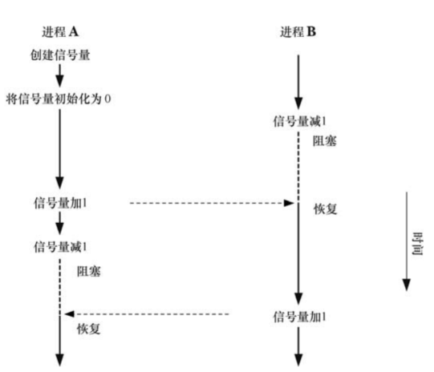
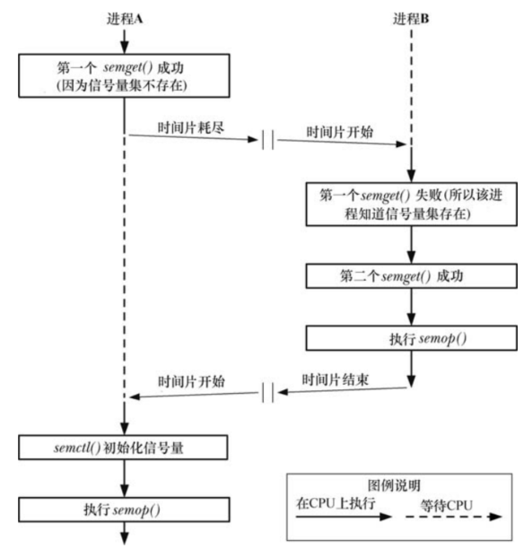

System V 信号量不是用来在进程间传输数据的，而是用来同步进程的动作。信号量的一个常见用途是同步对一块共享内存的访问以防止出现一个进程在访问共享内存的同时另一个进程更新这块内存的情况。

一个信号量是一个由内核维护的整数，其值被限制为大于或者等于0。在一个信号量上可以执行各种操作(即系统调用)，包括：

- 将一个信号设置成一个绝对值
- 在信号量当前值的基础上加上一个数量
- 在信号量当前值的基础上减去一个数量
- 等待信号量的值等于 0

上面操作中的后两个可能会导致调用进程阻塞。当减小一个信号量的值时，内核会将所有试图将信号量值降低到 0 之下的操作阻塞。类似的，如果信号量的当前值不为 0，那么等待信号量的值等于 0 的调用进程将会发生阻塞。不管是何种情况，调用进程会一直保持阻塞直到其他一些进程将信号量的值修改为一个允许这些操作继续向前的值，在那个时刻内核会唤醒被阻塞的进程。下图显示了使用一个信号量来同步两个交替将信号量的值在 0 和 1 之间切换的进程的动作：



# 概述

使用 System V 信号量的常规步骤如下：

- 使用 `semget()` 创建或者打开一个信号量集
- 使用 `semctl() SETVAL` 或 `SETALL` 操作初始化集合中的信号量(只有一个进程需要完成这个任务)
- 使用 `semop()` 操作信号量的值。使用信号量的进程通常会使用这些操作来标识一种共享资源的获取和释放
- 当所有进程都不再需要使用信号量集之后 `semctl() IPC_RMID` 操作删除这个集合(只有一个进程需要完成这个任务)

大多数操作系统都为应用程序提供了一些信号量原语。但 System V 信号量表现出了不同寻常的复杂性，因为它们的分配是以被称为信号量集的组为单位进行的。在使用 `semget()` 系统调用创建集合的时候需要指定集合中的信号量数量。虽然同一时刻通常只会操作一个信号量，但通过 `semop()` 系统调用可以原子的在同一个集合中的多个信号量之上执行一组操作。

# 创建或者打开一个信号量集

```
#include <sys/types.h>
#include <sys/ipc.h>
#include <sys/sem.h>

int semget(key_t key, int nsems, int semflg);
```

- `semget()` 系统调用创建一个新信号量集或者获取一个既有集合的标识符
- 如果 `semget()` 创建一个新信号集，那么 `nsems` 会指定集合中信号量的数量，并且其值必须大于 0，如果 `semget()` 是获取一个既有集的标识符，那么 `nsems` 必须小于等于集合的大小（否则会发生 `EINVAL` 错误）。无法修改一个既有集中的信号量数量
- `semflg` 是一个位掩码，它指定了施加于新信号量集之上的权限或需检查一个既有集合的权限。指定权限的方式与为文件指定权限的方式是一样的。此外，在 `semflg` 中可以通过对下列标记中的零个或多个取 `OR` 来控制 `semget()` 的操作：
  - `IPC_CREAT` ：如果不存在与指定的 `key` 相关联的信号量集，那么就创建一个新集合
  - `IPC_EXCL` ：如果同时指定了 `IPC_CREAT` 并且与指定的 `key` 关联的信号量集已经存在，那么返回 `EEXIST` 错误
- `semget()` 在成功时会返回新信号量集中既有信号量集的标识符。后续引用单个信号量的系统调用必须要同时指定信号量标识符和信号量在集合中的序号。一个集合中的信号量从0开始计数

# 信号量控制操作

```
#include <sys/types.h>
#include <sys/ipc.h>
#include <sys/sem.h>

int semctl(int semid, int semnum, int cmd, ... /* union semun arg*/);
```

- `semctl()` 系统调用在一个信号量集或集合中的单个信号量上执行各种控制操作
- `semid` 是操作所施加的信号量集的标识符，对于那些在单个信号量上执行的操作，`semnum` 标识出了集合中的具体信号量，对于其他操作则会忽略这个参数，并且可以将其设置为 0
- `cmd` 指定要执行的操作
- 一些特定的操作需要向 `semctl()` 传入第四个参数 `arg`，这个操作是一个 `union`。在程序中必须要显示的定义这个 `union`：

```
#ifndef SEMUN_H
#define SEMUN_H             

#include <sys/types.h>  
#include <sys/sem.h>

union semun {   
    int                 val;
    struct semid_ds *   buf;
    unsigned short *    array;
#if defined(__linux__)
    struct seminfo *    __buf;
#endif
};

#endi
```

## 常规控制操作

下面这些操作都会忽略 `semnum` 参数：

- `IPC_RMID`：立即删除信号量集及其关联的 `semid_ds` 数据结构，所有因在 `semop()` 调用中等待这个集合中的信号量而阻塞的进程都会立即被唤醒，`semop()` 会报告错误 `EIDRM`。这个操作无需 `arg` 参数
- `IPC_STAT` ：`arg.buf` 指向的缓冲器中放置一份与这个信号量集相关联的 `semid_ds` 数据结构的副本
- `IPC_SET`：使用 `arg.buf` 指向的缓冲器中的值来更新与这个信号量集相关联的 `semid_ds` 数据结构中选中的字段

## 获取和初始化信号量值

下面的操作可以获取或初始化一个集合中的单个或所有信号量的值，获取一个信号量的值需具备在信号量上的读权限，而初始化该值则需要修改 (写) 权限。

- `GETVAL`：`semctl()` 返回由 `semid` 指定的信号量集中第 `semnum个` 信号量的值。这个操作无需 `arg` 参数
- `SETVAL`：将由 `semid` 指定的信号量集中第 `semnum` 个信号量的值初始化为 `arg.val`
- `GETALL`：获取由 `semid` 指向的信号量集中所有信号量的值并将它们放在 `arg.array` 指向的数组中。必须要确保该数组具备足够的空间(通过由 `IPC_STAT` 操作返回的 `semid_ds` 数据结构中的 `sem_nsems` 字段可以获取集合中的信号量数量)。这个操作将忽略 `semnum` 参数
- `SETALL`：使用 `arg.array` 指向的数组中的值初始化 `semid` 指向的集合中的所有信号量。这个操作将忽略 `semnum`  参数

如果存在一个进程正在等待在由 `SETVAL`  或 `SETALL`  操作所修改的信号量上执行一个操作并且对信号量所做的变更将允许该操作继续向前执行，那么内核就会唤醒该进程。

使用 `SETVAL`  或 `SETALL` 修改一个信号量的值会在所有进程中清除该信号量的撤销条目。

注意 `GETVAL` 和 `GETALL ` 返回的信息在调用进程使用它们时可能已经过期了。所有依赖由这些操作返回的信息保持不变这个条件的程序都可能会遇到检查时（time-of-check）和使用时（time-of-use）的竞争条件。

## 获取单个信号量的信息

- `GETPID` 返回上一个在该信号量上执行 `semop()` 的进程的进程 ID；这个值被称为 `sempid` 值，如果还没有进程在该信号量上执行过 `semop()`，那么就返回 0
- `GETNCNT` 返回当前等待该信号量的值增长的进程数；这个值被称为 `semncnt` 值
- `GETZCNT` 返回当前等待该信号量的值变成 0 的进程数；这个值被称为 `semzcnt` 值

与上面介绍的 `GETVAL` 和 `GETALL` 操作一样，`GETPID`、`GETNCNT` 以及 `GETZCNT` 操作返回的信息在调用进程使用它们时可能已经过期了。

#  信号量关联数据结构

每个信号量集都有一个关联的 `semid_ds` 数据结构，其形式如下：

```
struct semid_ds
{
    struct ipc_perm sem_perm;		/* operation permission struct */
    time_t sem_otime;			    /* last semop() time */
    time_t sem_ctime;			    /* last time changed by semctl() */
    unsigned long sem_nsems;		/* number of semaphores in set */
};

struct ipc_perm
{
    __key_t __key;			/* Key.  */
    __uid_t uid;			/* Owner's user ID.  */
    __gid_t gid;			/* Owner's group ID.  */
    __uid_t cuid;			/* Creator's user ID.  */
    __gid_t cgid;			/* Creator's group ID.  */
    unsigned short int mode;		/* Read/write permission.  */
    unsigned short int __pad1;
    unsigned short int __seq;		/* Sequence number.  */
    unsigned short int __pad2;
};
```

各种信号量系统调用会隐式地更新 `semid_ds` 结构中的字段，使用 `semctl() IPC_SET` 操作能够显式地更新 `sem_perm` 字段中的特定子字段：

- `sem_perm` 创建信号量时会初始化这个子结构中的字段。通过 `IPC_SET` 能够更新 `uid`、`gid`、`mode` 子字段
- `sem_otime` 创建信号量集时会将这个字段设置为0，然后每次成功的 `semop()` 调用或者当信号量指应该 `SEM_UNDO` 操作而发生变更时将这个字段设置为当前时间，这个字段和 `sem_ctime` 的类型为 `time_t`，它们存储自新纪元到现在的秒数。
- `sem_ctime` 在创建信号量时以及每个成功的 `IPC_SET`、`SETALL` 和 `SETVAL` 操作执行完毕之后将这个字段设置为当前时间。（在一些 UNIX 实现上，`SETALL ` 和 `SETVAL`  操作不会修改 `sem_ctime`。
- `sem_nsems` 在创建集合时将这个字段的值初始化为集合中信号量的数量。

# 信号量初始化

```
/* Create a  set contaiong 1 semaphore*/
semid = semget(key,1,IPC_CREAT | IPC_EXCL | perms);
if(semid != -1)
{
	union semun arg;
	
	arg.val = 0;
	if(semctl(semid,0,SETVAL,arg) == -1)
		errExit("semctl()");
}
else
{
    if(errno != EEXIST)
        errExit("semget()");
    
    semid = semget(key,1,perms);
    if(semid == -1)
        errExit("semget()");    
}

/* Now perform some operation on the semaphore */

sops[0].sem_op = 1;
sops[0].sem_num = 0;
sops[0].sem_flg = 0;

if(semop(semid,sops,1) == -1)
    errExit("semop()");
```

上面的代码存在的问题是如果两个进程同时执行，可能发生竞争条件：



为了确保一个集合中的多个信号量能被正确地初始化以及一个信号量被初始化为一个非零值，可以使用下面的代码：

```
semid = semget(key,1,IPC_CREAT | IPC_EXCL | perms);
if(semid != -1)
{
	union semun arg;
    struct sembuf sop;
	
	arg.val = 0;
	if(semctl(semid,0,SETVAL,arg) == -1)
		errExit("semctl()");
    
    /* perform a  "no-op" semaphore operation - changes sem_otime so other process can see we've initialized the set.*/
    
    sops[0].sem_op = 0;
    sops[0].sem_num = 0;
    sops[0].sem_flg = 0;

    if(semop(semid,sops,1) == -1)
        errExit("semop()");
}
else
{
    const int MAX_TRIES = 10;
    int j;
    union semun arg;
    struct semid_ds ds;

    if(errno != EEXIST)
        errExit("semget()");
    
    semid = semget(key,1,perms);
    if(semid == -1)
        errExit("semget()");   

    /* Wait until another process has called semop() */

    arg.buf = &ds;
    for(j = 0;j < MAX_TRIES;j++)
    {
        if(semctl(semid,0,IPC_STAT,arg) == -1)
            errExit("semctl()");
        if(ds.sem_otime != 0)
            break;
        sleep(1);
    }

    if(ds.sem_otime == 0)
        errExit("Existing semaphore not initialized");

}

/* Now perform some operation on the semaphore */
```

# 信号量操作

```
#include <sys/types.h>
#include <sys/ipc.h>
#include <sys/sem.h>

int semop(int semid, struct sembuf *sops, unsigned nsops);
```

- `semop()` 系统调用在 `semid`  标识的信号量集中的信号量上执行一个或多个操作
- `sops` 参数是一个指向数组的指针，数组中包含了需要执行的操作，`nsops` 参数给出了数组的大小（数组至少需包含一个元素）。操作将会按照在数组中的顺序以原子的方式被执行

```
struct sembuf
{
    unsigned short int sem_num;	/* semaphore number */
    short int sem_op;		/* semaphore operation */
    short int sem_flg;		/* operation flag */
};
```

- `sem_num` 字段标识了了在集合中的哪个信号量上执行操作。`sem_op`  字段指定了需执行的操作：
  - 如果 `sem_op` 大于0，那么就将 `sem_op` 的值加到信号量值上，其结果是其他等待减小信号量值的进程可能会被唤醒并执行它们的操作。调用进程必须要具备在信号量上的修改（写）权限。
  - 如果 `sem_op` 等于 0，那么就对信号量值进行检查以确定它当前是否等于 0。如果等于0，那么操作将立即结束，否则 `semop()` 就会阻塞直到信号量值变成 0 为止。调用进程必须要具备在信号量上的读权限
  - 如果 `sem_op` 小于 0，那么就将信号量值减去 `sem_op`。如果信号量的当前值大于或等于 `sem_op` 的绝对值，那么操作会立即结束。否则 `semop()` 会阻塞直到信号量值增长到在执行操作之后不会导致出现负值的情况为止。调用进程必须要具备在信号量上的修改权限

从语义上来讲，增加信号量值对应于使一种资源变得可用以便其他进程可以使用它，而减小信号量值则对应于预留（互斥地）进程需使用的资源。在减小一个信号量值时，如果信号量的值太低，即其他一些进程已经预留了这个资源，那么操作就会被阻塞。

当 `semop()` 调用阻塞时，进程会保持阻塞直到发生下列某种情况为止：

- 另一个进程修改了信号量值使得待执行的操作能够继续向前
- 一个信号中断了 `semop()` 调用。发生这种情况时会返回 `EINTR` 错误（`semop()`在被一个信号处理器中断之后是不会自动重启的）
- 另一个进程删除了 `semid` 引用的信号量。发生这种情况时 `semop()` 会返回 `EIDRM`  错误

在特定信号量上执行一个操作时可以通过在相应的 `sem_flg` 字段中指定 `IPC_NOWAIT` 标记来防止 `semop()` 阻塞。此时，如果 `semop()` 本来要发生阻塞的话就会返回 `EAGAIN` 错误。

尽管通常一次只会操作一个信号量，但也可以通过一个 `semop()` 调用在一个集合中的多个信号量上执行操作。这里需要指出的关键一点是这组操作的执行是原子的，即 `semop()` 要么立即执行所有操作，要么就阻塞直到能够同时执行所有操作。

```
#define _GNU_SOURCE
#include <sys/types.h>
#include <sys/ipc.h>
#include <sys/sem.h>

int semtimedop(int semid, struct sembuf *sops, unsigned nsops,struct timespec *timeout);
```

- `semtimedop()` 系统调用与 `semop()` 执行的任务一样，但它多了一个 `timeout` 参数，通过这个参数可以指定调用所阻塞的时间上限

- 如果在信号量操作完成之前所等待的时间已经超过了规定的时间间隔，那么 `semtimedop()` 会返回 `EAGAIN` 错误
- 如果将 `timeout` 指定为 `NULL`，那么 `semtimedop()` 就与 `semop()` 完全一样了

# 多个阻塞信号量操作的处理

如果多个因减少一个信号量值而发生阻塞的进程对该信号量减去的值是一样的，那么当条件允许时到底哪个进程会先被允许执行操作是不确定的。

另一方面，如果多个因减少一个信号量而发生阻塞的进程对该信号量减去的值是不同的，那么会按照先满足条件先满足的顺序来进行：

- 假设一个信号量的当值为 0，进程 A 请求将信号量值减去 2，然后进程 B 请求将信号量值减去 1。如果第三个进程将信号量值加上了 1，那么进程 B 首先会被解除阻塞并执行它的操作
- 在一个糟糕的应用程序设计中，这种场景可能会导致饿死情况的发生，即一个进程因信号量的状态无法满足所请求的操作继续往前执行的条件而永远保持阻塞

当一个进程因试图在多个信号量上执行操作而发生阻塞时也可能会出现饿死的情况。考虑下面的这些在一组信号量上执行的操作，两个信号量的初始值都为 0：

- 进程 A 请求将信号量 0 和 1 的值减去 1（阻塞）。
- 进程 B 请求将信号量 0 的值减去 1（阻塞）
- 进程 C 将信号量 0 的值加上 1

此刻，进程 B 解除阻塞并完成了它的请求，即使它发出请求的时间要晚于进程 A。

# 信号量撤销值

假设一个进程在调整完一个信号量值之后主动或被动的终止了，这样可能会给其他使用这个信号量的进程带来问题，因为它们可能因等待这个信号量而被阻塞着，即等待已经被终止的进程撤销对信号量所做的变更。

为了避免这种问题的发生，在通过 `semop()` 修改一个信号量值时可以使用 `SEM_UNDO` 标记。当指定这个标记时，内核会记录信号量操作的效果，然后在进程终止(主动或被动)时撤销这个操作。

内核无需为私有使用 `SEM_UNDO` 的操作都保存一份记录。只需要记录一个进程在一个信号量上使用 `SEM_UNDO` 操作所做出的调整总和即可，它是一个被称为`semadj`（信号量调整）的整数。当进程终止后，所有需要做的就是从信号量的当前值上减去这个总和。

当使用 `semctl() SETVAL` 或者 `SETALL` 操作设置一个信号量时，所有使用这个信号量的进程中相应的 semadj 会被清空（即设置为 0）。这样做是合理的，因为直接设置一个信号量的值会破坏与 `semadj` 中维护的历史记录相关联的值。

通过 `fork()` 创建的子进程不会继承其父进程的 `semadj` 值，因为对于子进程来讲撤销其父进程的信号量操作毫无意义。另一方面，`semadj` 值会在 `exec()` 中得到保留。这样就能在使用 `SEM_UNDO` 调整一个信号量值之后通过 `exec()` 执行一个不操作该信号量的程序，同时在进程终止时原子地调整该信号量。（这项技术可以允许另一个进程发现这个进程何时终止。）

## SEM_UNDO 的限制

最后需要指出的是，`SEM_UNDO` 其实并没有其一开始看起来那样有用，原因有两个。一个原因是由于修改一个信号量通常对应于请求或释放一些共享资源，因此仅仅使用 `SEM_UNDO` 可能不足以允许一个多进程应用程序在一个进程异常终止时恢复。除非进程终止会原子地将共享资源的状态返回到一个一致的状态（在很多情况下是不可能的），否则撤销一个信号量操作可能不足以允许应用程序恢复。

第二个影响 `SEM_UNDO` 的实用性的因素是在一些情况下，当进程终止时无法对信号量进行调整。考虑下面应用于一个初始值为 0 的信号量上的操作：

- 进程 A 将信号量值增加 2，并为该操作指定了 `SEM_UNDO` 标记
- 进程 B 将信号量值减去 1，因此信号量的值将变成 1
- 进程 A 终止

此时就无法完全撤销进程 A 在第一步中的操作中所产生的效果，因为信号量的值太小了。解决这个问题的潜在方法有三种：

- 强制进程阻塞直到能够完成信号量调整
- 尽可能地减小信号量的值（即减到 0）并退出
- 退出，不执行任何信号量调整操作

第一个解决方案是不可行的，因为它可能会导致一个即将终止的进程永远阻塞。Linux 采用了第二种解决方案。其他一些 UNIX 实现采纳了第三种解决方案。

# 实现一个二元信号量协议

一个二元信号量有两个值：可用（空闲）或预留（使用中）。二元信号量有两个操作：

- 预留：试图预留这个信号量以便互斥的使用。如果信号量已经被另一个进程预留了，那么将会阻塞直到信号量被释放为止
- 释放：释放一个当前被预留的信号量，这样另一个进程就可以预留这个信号量了

有时还会定义第三个操作：

- 有条件的预留：非阻塞的尝试预留这个信号量以便互斥的使用。如果信号量已经被预留了，那么立即返回一个状态标识这个信号量不可用。、

实现这个协态的最佳方式是使用值 1 表示空闲和值 0 表示预留，同时预留和释放操作分别为将信号量的值减 1 和加 1。

```
Boolean bsUseSemUndo = False;
Boolean bsRetryInEintr = True;

/* Initialize semaphore to 1 */
int initSemAvaiable(int semId,int semNum)
{
    union semun arg;
    arg.val = 1;
    return semctl(semId,semNum,SETVAL,arg);
}

/* Initialize semaphore to 0 */
int initSemInUse(int semId,int semNum)
{
    union semun arg;

    arg.val = 0;
    return semctl(semId,semNum,SETVAL,arg);
}

/* Reserve semaphore(blocking),return 0 on success,or -1 with 'errno' set to EINTR if operation was interrupted by signal hander */
int reserveSem(int semId,int semNum)
{
    struct sembuf sops;

    sops.sem_num = semNum;
    sops.sem_op = -1;
    sops.sem_flg = bsUseSemUndo ? SEM_UNDO :  0;

    while(semop(semID,&sops,1) == -1)
    {
        if(errno != EINTR || !bsRetryInEintr)
            return -1;
    }

    return 0;
}

/* Release semaphore - increment it by 1*/
int releaseSem(int semId,int semNum)
{
     struct sembuf sops;

    sops.sem_num = semNum;
    sops.sem_op = 1;
    sops.sem_flg = bsUseSemUndo ? SEM_UNDO :  0;
    return semop(semId,&sops,1);
}
```

# 信号量限制

下面列出了 Linux 上信号量的限制。括号中给出了当限制达到时会受影响的系统调用及其所返回的错误：

- `SEMAEM` 在 `semadj` 总和总能够记录的最大值。与 `SEMVMX` 的值是一样的（`semop()`，` ERANGE`）
- `SEMMNI` 这是系统级别的一个限制，它限制了所能创建的信号量标识符的数量（`semget()`， `ENOSPC`）
- `SEMMSL` 一个信号量集中能分配的信号量的最大数量。（`semget()`， `EINVAL`）
- `SEMMNS` 这是系统级别的一个限制，它限制了所有信号量集中的信号量数量。系统上信号量的数量还受 `SEMMNI` 和 `SEMMSL` 的限制。实际上，`SEMMNS` 的默认值是这两个限制的默认值的乘积。（`semget()`， `ENOSPC`）
- `SEMOPM`：每个 `semop()` 调用能够执行的操作的最大数量。（`semop()`，`E2BIG`）
- `SEMVMX` ：一个信号量能取的最大值。（`semop()`，`ERANGE`）

一些 UNIX 实现（不包括 Linux）在信号量撤销操作方面还定义了下面的限制：

- `SEMMNU` 这是系统级别的一个限制，它限制了信号量撤销结构的总数量。撤销结构是分配用来存储 `semadj` 值的
- `SEMUME` 每个信号量撤销结构中撤销条目的最大数量

在系统启动时，信号量限制会被设置成默认值。不同的内核版本中的默认值可能会不同。其中一些限制可以通过修改存储在 Linux 特有的 `/proc/sys/kernel/sem` 文件中的值来改变。这个文件包含了四个用空格分隔的数字，它们按序定义了 `SEMMSL`、`SEMMNS`、`SEMOPM` 以及 `SEMMNI` 限制。（`SEMVMX` 和 `SEMAEM` 限制是无法修改的，它们的值都被定义成 32767。）

Linux 特有的 `semctl() IPC_INFO` 操作返回一个类型为 `seminfo` 的结构，它包含了各种信号量限制的值：

```
union semun arg;
struct seminfo info;

arg._buf = &buf;
semctl(0, 0, IPC_INFO, arg);
```

# System V 信号量的缺点

System V 信号量存在的很多缺点与消息队列的缺点是一样的，包括以下几点：

- 信号量是通过标识符而不是文件描述符引用的。这使得执行一些操作变得比较麻烦
- 使用 `key` 而不是文件名来标识信号量增加了额外的编程复杂度
- 创建和初始化信号量需要单独的系统调用意味着在一些情况下必须要做一些额外的工作来防止竞争条件
- 内核不会维护引用一个信号量集的进程数量，这就给确定何时删除一个信号量集增加了难度，而且无法确保一个不再使用的信号量集被删除
- System V 提供的编程接口过于复杂。在通常情况下，一个程序只会操作一个信号量。同时操作集合中多个信号量的能力有时侯是多余的
- 信号量的操作存在诸多限制。这些限制是可配置的，但如果一个应用程序超出了默认限制的范围，那么在安装应用程序时就需要完成额外的工作了

不管怎样，与消息队列所面临的情况不同，替代 System V 信号量的方案不多，其结果是在很多情况下都必须要用到它们。信号量的一个替代方案是记录锁。此外，从内核 2.6 以及之后的版本开始，Linux 支持使用 POSIX 信号量来进行进程同步。


3


