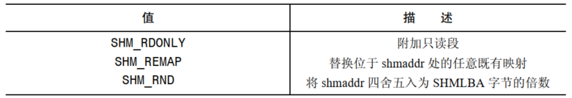
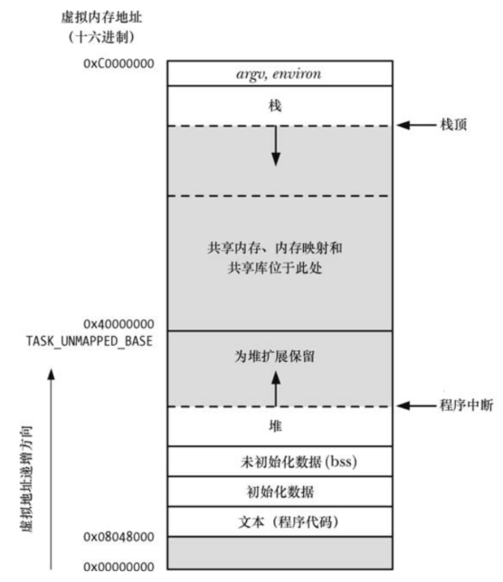
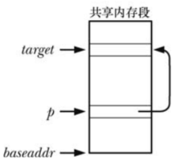

共享内存允许两个或多个进程共享物理内存的同一块区域（通常被称为段）。由于一个共享内存段会成为一个进程用户空间内存的一部分，因此这种 IPC 机制无需内核介入。所有需要做的就是让一个进程将数据复制进共享内存中，并且这部分数据会对其他所有共享同一个段的进程可用。速度比起管道或者消息队列更快。

另一方面，共享内存这种 IPC 机制不由内核控制意味着需要通过某些同步方法使得不会出现同时访问共享内存的情况。System V 信号量就是天生用来实现这种同步的方法。当然，还可以使用其他方法，比如 POSIX 信号量和文件锁。

# 概述

为使用一个共享内存段通常需要执行下面的步骤：

- 调用 `shmget()` 创建一个新共享内存段或者取得一个既有共享内存段的标识符
- 使用 `shmat()` 来附上共享内存段，即令该段成为调用进程的虚拟内存的一部分
- 此时在程序中就可以向对待其他可用内存那样对待这个共享内存段。为引用这块共享内存，程序需要使用由 `shmat()` 调用返回的 `addr` 值。它是一个指向进程的虚拟地址空间中该共享内存段的起点的指针
- 调用 `shmdt()` 来分离这个共享段。在这个调用之后，进程就无法再引用这块共享内存了。这一步是可选的，并且在进程终止时会自动完成这一步
- 调用 `shmctl()` 来删除共享内存段。只有当当前所有附加内存段的进程都与之分离之后内存段才会被销毁。只有一个进程需要执行这一步

# 创建或打开一个共享内存段

```
#include <sys/ipc.h>
#include <sys/shm.h>

int shmget(key_t key, size_t size, int shmflg);
```

- `shmget()` 系统调用创建一个新共享内存或获取一个既有段的标识符。新创建的内存段中的内容会被初始化为 0
- `key`：通常是值 `IPC_PRIVATE` 或 `ftok()` 返回的一个键
- `size`：当使用 `shmget()` 创建一个新共享内存段时，`size` 则是一个正整数，它表示需分配的段的字节数。内核是以系统分页大小的整数倍来分配共享内存的，因此实际上 `size` 会提升到最近的系统分页大小的整数倍。如果使用 `shmget()` 来获取一个既有段的标识符，那么 `size` 对段不会产生任何效果，但是它必须小于等于段的大小
- `shmflg` 参数执行的任何与其他 IPC `get` 调用中执行的任务一样，即指定施加于新共享内存段上的权限或需检查的既有内存段的权限。此外，在 `shmflg` 中还可以对下列标记中的零个或多个取 `OR` 来控制 `shmget()` 的操作：
  - `IPC_CREAT` ：如果不存在与指定的 `key` 对应的段，那么就创建一个新段。
  - `IPC_EXCL` ：如果同时指定了 `IPC_CREAT` 并且与指定的 `key` 对应的段已经存在，那么返回 `EEXIST` 错误
  - `SHM_HUGETLB` ：特权（`CAP_IPC_LOCK`）进程能够使用这个标记创建一个使用巨页（huge page）的共享内存段。巨页是很多现代硬件架构提供的一项特性用来管理使用超大分页尺寸的内存。（如 x86-32 允许使用 4MB 的分页大小来替代 4KB 的分页大小。）在那些拥有大量内存的系统上并且应用程序需要大量内存块时，使用巨页可以降低硬件内存管理单元的超前转换缓冲区器（translation look-aside buffer，TLB）的数量
  - `SHM_NORESERVE`：这个标记在 `shmget()` 中所起的作用与 `MAP_NORESERVE` 标记在 `mmap()` 中所起的作用一样
- `shmget()` 在成功时返回新或既有共享内存段的标识符

# 使用共享内存

```
#include <sys/types.h>
#include <sys/shm.h>

void *shmat(int shmid, const void *shmaddr, int shmflg);
```

- `shmat()` 系统调用将 `shmid` 标识的共享内存段附加到调用进程的虚拟地址空间中
- `shmaddr` 参数和 `shmflg` 位掩码参数中 `SHM_RND` 位的设置控制着段是如何被附加上去的
- 如果 `shmaddr` 是 `NULL`，那么段会被附加到内核所选择的一个合适的地址处。这是附加一个段的优选方法
- 如果 `shmaddr` 不为 `NULL` 并且没有设置 `SHM_RND`，那么段会被附加到由 `shmaddr` 指定的地址处，它必须是系统分页大小的一个倍数（否则会发生 `EINVAL` 错误）
- 如果 `shmaddr` 不为 `NULL` 并且设置了 `SHM_RND`，那么段会被映射到的地址为在 `shmaddr` 中提供的地址被舍入到最近的常量 `SHMLBA`（shared memory low boundary address）的倍数。这个常量等于系统分页大小的某个倍数。将一个段附加到值为 `SHMLBA` 的倍数的地址处在一些架构上是有必要的，因为这样才能够提升 CPU 的快速缓冲性能和防止出现同一个段的不同附加操作在 CPU 快速缓冲中存在不一致的视图的情况

为 `shmaddr` 指定一个非 `NULL` 值（即上面列出的第二种和第三种情况）不是一种推荐的做法，其原因如下：

- 它降低了一个应用程序的可移植性。在一个 UNIX 实现上有效的地址在另一个实现上可能是无效的
- 试图将一个共享内存段附加到一个正在使用中的特定地址处的操作会失败。例如，当一个应用程序（可能在一个库函数中）已经在该地址处附加了另一个段或创建一个内存映射时就会发生这种情况

`shmat()` 函数上的返回结果是返回附加共享内存段的地址。开发人员可以像对待普通的 C 指针那样对待这个值，段与进程的虚拟内存的其他部分看起来毫无差异。通常会将 `shmat()` 的返回值赋给一个指向某个由程序员定义的结构的指针以便在该段上设定该结构。

要附加一个共享内存段以供只读访问，那么就需要在 `shmflg` 中指定 `SHM_RDONLY` 标记。试图更新只读段中的内容会导致段错误（`SIGSEGV` 信号）的发生。如果没有指定 `SHM_ RDONLY`，那么就既可以读取内存又可以修改内存。

在一个进程中可以多次附加同一个共享内存段，即使一个附加操作是只读的而另一个是读写的也没有关系。每个附加点上的内存内容都是一样的，因为进程虚拟内存页表中的不同条目引用的是同样的虚拟物理页面。

最后一个可以在 `shmflg` 中指定的值是 `SHM_REMAP`。在指定了这个标记之后 `shmaddr` 的值必须为非 `NULL`。这个标记要求 `shmat()` 调用替换起点在 `shmaddr` 处长度为共享内存段的长度的任何既有共享内存段或内存映射。一般来讲，如果试图将一个共享内存段附加到一个已经在用的地址范围时将会导致 `EINVAL` 错误的发生。`SHM_REMAP` 是一个非标准的 Linux 扩展。

`shmat()` 的 `shmflg` 位掩码值：



```
#include <sys/types.h>
#include <sys/shm.h>

int shmdt(const void *shmaddr);
```

- 当一个进程不再需要访问一个共享内存段时就可以调用 `shmdt()` 来将该段分离出其虚拟地址空间了。`shmaddr` 参数标识出了待分离的段，它应该是之前由`shmat()` 调用返回的一个值
- 分离一个共享内存段与删除它是不同的。删除是 `shmctl() IPC_ RMID` 操作来完成的
- 通过 `fork()` 创建的子进程会继承其父进程附加的共享内存段。因此，共享内存为父进程和子进程之间的通信提供了一种简单的 IPC 方法
- 在一个 `exec()` 中，所有附加的共享内存段都会被分离。在进程终止后共享内存段也会自动被分离

# 共享内存在虚拟内存中的位置

段被附加在向上增长的堆和向下增长的栈之间未被分配的空间中。为给栈和堆的增长腾出空间，附加共享内存段的虚拟地址从`0x4000000` 开始。内存映射和共享库也是被放置在这个区域中的（共享内存映射和内存段默认被放置的位置可能会有些不同，这依赖于内核版本和进程的 `RLIMIT_STACK` 资源限制的设置。）



地址 `0x40000000` 被定义成了内核常量 `TASK_UNMAPPED_BASE`。通过将这个常量定义成一个不同的值并且重建内核可以修改这个地址的值。

如果在调用 `shmat()`（或 `mmap()`）时采用了不推荐的方法，即显式地指定一个地址，那么一个共享内存段（或内存映射）可以被放置在低于 `TASK_UNMAPPED_BASE` 的地址处。

通过 Linux 特有的 `/proc/PID/maps` 文件能够看到一个程序映射的共享内存段和共享库的位置。

# 在共享内存中存储指针

每个进程可能会用到不同的共享库和内存映射，并且可能附加不同的共享内存段集。因此如果遵循推荐的做法，让内核来选择将共享内存段附加到何处，那么一个段在各个进程中可能会被附加到不同的地址上。正因为这个原因，在共享内存段中存储指向段中其他地址的引用时应该使用（相对）偏移量，而不是（绝对）指针。

假设一个共享内存段的起始地址为 `baseaddr`。再假设需要在 `p` 指向的位置处存储一个指针，该指针指向的位置与 `target` 指向的位置相同。如下图所示：



那么设置 `*p`：

```
*p = target; //error
```

这段代码存在的问题是当共享内存段被附加到另一个进程中时 `target` 指向的位置可能会位于一个不同的虚拟地址处，这意味着在那个进程中那个策划中存储在 `*p` 中的值是是无意义的。正确的做法是在 `*p` 中存储一个偏移量：

```
*p = (target - baseaddr);
```

在解引用这种指针时需要颠倒上面的步骤：

```
target = baseaddr + *p;
```

# 共享内存控制操作

```
#include <sys/ipc.h>
#include <sys/shm.h>

int shmctl(int shmid, int cmd, struct shmid_ds *buf);
```

- `shmctl()` 系统调用在 `shmid` 标识的共享内存段上执行一组控制操作
- `cmd` 参数规定了待执行的控制操作(`buf` 参数是 `IPC_STAT` 和 `IPC_SET` 操作会用到的，并且在执行其他操作时需要将这个参数的值指定为 `NULL`)

## 常规控制操作

- `IPC_RMID` 标记这个共享内存段以及其关联的 `shmid_ds` 数据结构以便删除。如果当前没有进程附加该段，那么就会执行删除操作，否则就在所有进程都已经与该段分离（即当 `shmid_ds` 数据结构中 `shm_nattch` 字段的值为 0 时）之后再执行删除操作
- `IPC_STAT` 将与这个共享内存段关联的 `shmid_ds` 数据结构的一个副本防止到 `buf` 指向的缓冲区中
- `IPC_SET` 使用 `buf` 指向的缓冲区中的值来更新与这个共享内存段相关联的 `shmid_ds` 数据结构中被选中的字段

## 加锁和解锁共享内存

一个共享内存段可以被锁进 RAM 中，这样它永远不会被交换出去了。这种做法能带来性能上的提升，因为一旦段中的所有分页都驻留在内存中，就能确保一个应用程序在访问分页时永远不会因发生分页故障而被延迟。通过 `shmctl()` 可以完成两种锁操作：

- `SHM_LOCK` 操作将一个共享内存段锁进内存
- `SHM_UNLOCK` 操作为共享内存段解锁以允许它被交换出去

锁住一个共享内存段无法确保 `shmctl()` 调用结束时段的所有分页都驻留在内存中，非驻留分页会在附加该共享内存段的进程引用这些分页时因分页故障而一个一个地被锁进内存。一旦分页因分页故障而锁进了内存，那么分页就会一直驻留在内存中直到被解锁为止，即使所有进程都与该段分离之后也不会改变。

# 共享内存关联数据结构

每个共享内存段都有一个关联的 `shmid_ds` 数据结构，其形式如下：

```
struct shmid_ds
  {
    struct ipc_perm shm_perm;			 /* operation permission struct */
    size_t shm_segsz;					/* size of segment in bytes */
    __time_t shm_atime;					/* time of last shmat() */
#ifndef __x86_64__
    unsigned long int __unused1;
#endif
    __time_t shm_dtime;					/* time of last shmdt() */
#ifndef __x86_64__
    unsigned long int __unused2;
#endif
    __time_t shm_ctime;					/* time of last change by shmctl() */
#ifndef __x86_64__
    unsigned long int __unused3;
#endif
    __pid_t shm_cpid;					/* pid of creator */
    __pid_t shm_lpid;					/* pid of last shmop */
    shmatt_t shm_nattch;				/* number of current attaches */
    __syscall_ulong_t __unused4;
    __syscall_ulong_t __unused5;
  };
```

各种共享内存系统调用会隐式地更新 `shmid_ds` 结构中的字段，使用 `shmctl() IPC_SET` 操作可以显式地更新 `shm_perm` 字段中的特定子字段。

- `shm_perm` 在创建共享内存段之后这个结构中的字段被初始化，`uid`，`gid` 以及 `mode` 子字段是通过 `IPC_SET` 来更新的。除了常规的权限位之外，`shm_perm.mode` 字段还有两个只读位掩码标记：
  - `SHM_DEST` 表示当所有进程的地址空间都与该段分离之后是否将该段标记为删除
  - `SHM_LOCKED` 表示是否将段锁进物理内存中
- `shm_segsz` 在创建共享内存段时这个字段会被设置成段所需要的字节数
- `shm_atime` 在创建共享内存段时会将这个字段设置为0，当一个进程附加该段时，会将这个字段设置为当前时间
- `shm_dtime` 在创建共享内存段时会将这个字段设置为0，当一个进程与该段分离之后，会将这个字段设置为当前时间
- `shm_ctime` 当段被创建时以及每个成功的 `IPC_SET` 操作都会将这个字段设置为当前时间
- `shm_cpid` 这个字段会被设置成使用 `shmget()` 创建这个段的进程的进程 ID
-  `shm_lpid` 在创建共享内存段时会将这个字段设置为0，后续每个成功的 `shmat()` 或者 `shdmt()` 调用会将这个字段设置成调用进程的进程 ID
-   `shm_nattch` 这个字段统计当时附加该段的进程数，在创建该段时将这个字段初始化为 0

# 共享内存的限制

下面是一份 Linux 共享内存的限制列表。括号中列出了当限制达到时受影响的系统调用及其返回的错误：

- `SHMMNI`：这是一个系统级别的限制，它限制了所能创建的共享内存标识符（换句话说是共享内存段）的数量。（`shmget()`，`ENOSPC`）
- `SHMMIN` ：这个一个共享内存段的最小大小（字节数）。这个限制的值被定义成了 1（无法修改这个值），但实际的限制是系统分页大小（`shmget()`， `EINVAL`）
- `SHMMAX` ：这个是一个共享内存段的最大大小（字节数）。SHMMAX 的实际上限依赖于可用的 RAM和交换空间。（`shmget()`，`EINVAL`）
- `SHMALL` 这是一个系统级别的限制，它限制了共享内存中的分页总数。其他大多数 UNIX 实现并没有提供这个限制，`SHMALL` 的实际上限依赖于可用的 RAM 和交换空间。（`shmget()`， `ENOSPC`）

Linux 特有的 `shmctl() IPC_INFO` 操作返回一个类型为 `shminfo` 的结构，它包含了各个共享内存限制的值。


