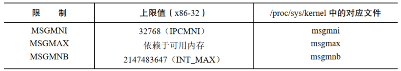

消息队列允许进程以消息的形式交换数据。尽管消息对象在某些方面与管道和 FIFO 类似，但是它们之间扔存在显著差别：

- 用来引用消息队列的句柄是一个由  `msgget()` 调用返回的标识符。这些标识符与 Unix 系统上的大多数其他形式的 IO 所使用的文件描述符是不同的
- 通过消息对象进行的通信是面向消息的，即读者接收到由写者写入的整条消息。读取一条消息的一部分而让剩余部分遗留在队列中或者一次读取多条消息都是不可能的。这一点和管道不同，管道提供的是一个无法进程区分的字节流(即使用管道时读者一次可以读取任意数量的字节数，而不管写者写入的数据块大小)
- 除了包含数据之外，每条消息还有一个用整数表示的类型。从消息对象中读取消息既可以按照先入先出的顺序，也可以根据类型来读取数据

# 创建或打开一个消息队列

```
#include <sys/types.h>
#include <sys/ipc.h>
#include <sys/msg.h>

int msgget(key_t key, int msgflg);
```

- `msgget()` 系统调用创建一个新消息队列或者取得一个既有队列的标识符
- `msgflg` 参数是一个指定施加于新消息队列之上的权限或检查一个既有队列的权限的位掩码。此外，在 `msgflg` 参数中还可以将下列标记中的零个或多个标记取 `OR(|)`以控制 `msgget()` 的操作：
  - `IPC_CREAT` ：如果没有与指定的 `key` 对应的消息队列，那么就创建一个新队列
  - `IPC_EXCL` ：如果同时还指定了 `IPC_CREAT` 并且与指定的 `key` 对应的队列已经存在，那么调用就会失败并返回 `EEXIST` 错误

- `msgget()` 系统调用首先会在所有既有消息队列中搜索与指定的键对应的队列。如果找到了一个匹配的队列，那么就会返回该对象的标识符（除非在 `msgflg` 中同时指定了 `IPC_CREAT` 和 `IPC_EXCL`，那样的话就返回一个错误）。如果没有找到匹配的队列并且在 `msgflg` 中指定了 `IPC_CREAT`，那么就会创建一个新队列并返回该队列的标识符

# 交换消息

`msgsnd()`和`msgrcv()`系统调用执行消息队列上的IO。这两个系统调用接收的参数：

- 第一个参数：消息队列的标识符
- 第二个参数：`msgp` 是一个自定义的结构的指针，该结构用于存放被发送或者接收的信息，常见形式：

```
struct mymsg{
	long mtype;   /* message type*/
	char mtext[];	/* message body*/
};
```

## 发送消息

```
#include <sys/types.h>
#include <sys/ipc.h>
#include <sys/msg.h>

int msgsnd(int msqid, const void *msgp, size_t msgsz, int msgflg);
```

- `msgsnd()` 系统调用向消息队列写入一条消息
- 必须要将消息结构中的 `mtype` 字段的值设为一个大于 0 的值，并将所需传递的信息复制到程序员定义的 `mtext` 字段中，`msgsz` 参数指定了 `mtext` 字段中包含的字节数
- 在使用 `msgsnd()` 发送消息时并不存在 `write()` 所具备的部分写的概念，这也是成功的 `msgsnd()` 只需要返回0而不是所发送的字节数的原因
- 参数 `msgflg` 是一组标记的位掩码，用于控制 `msgsnd()` 的操作，目前只定义了一个这样的标记：
  - `IPC_NOWAIT`：执行一个非阻塞的发送操作，通常，当消息队列满时，`msgsnd()` 会阻塞直到队列中有足够的空间来存放这条消息。但如果指定了这个标记，那么 `msgsnd()` 就会立即返回 `EAGAIN` 错误

- 当 `msgsnd()` 调用因队列满而发生阻塞时可能会被信号处理器中断。当发生这种情况时，`msgsnd()` 总是会返回 `EINTR` 错误（`msgsnd()`系统调用永远不会自动重启，不管在建立信号处理器时是否设置了 `SA_RESTART` 标记）
- 向消息队列中写消息要求具备在该队列上的写权限

## 接收消息

```
#include <sys/types.h>
#include <sys/ipc.h>
#include <sys/msg.h>

ssize_t msgrcv(int msqid, void *msgp, size_t msgsz, long msgtyp,int msgflg);
```

- `msgrcv()` 系统调用从消息队列中读取（以及删除）一条消息并将其内容复制进 `msgp` 指向的缓冲区中

- `msgp` 缓冲区中 `mtext` 字段的最大可用空间是通过 `msgsz` 参数来指定的。如果队列中待删除的消息体的大小超过了 `msgsz` 字节，那么就不会从队列中删除消息，并且 `msgrcv()` 会返回错误 `E2BIG`。（这是默认行为，可以使用 `MSG_NOERROR` 标记来改变这种行为）

- 读取消息的顺序无需与消息被发送的一致。可以根据 `mtype` 字段的值来选择消息，而这个选择过程是由 `msgtyp` 参数来控制的，具体如下所述：

  - 如果 `msgtyp` 等于 0，那么会删除队列中的第一条消息并将其返回给调用进程
  - 如果 `msgtyp` 大于 0，那么会将队列中第一条 `mtype` 等于 `msgtyp` 的消息删除并将其返回给调用进程。通过指定不同的 `msgtyp ` 值，多个进程能够从同一个消息队列中读取消息而不会出现竞争读取同一条消息的情况。比较有用的一项技术是让各个进程选取与自己的进程 ID 匹配的消息
  - 如果 `msgtyp` 小于 0，那么就会将等待消息当成优先队列来处理。队列中 `mtype` 最小并且其值小于或等于 `msgtyp` 的绝对值的第一条消息会被删除并返回给调用进程

  - `msgflg` 参数是一个位掩码，它的值通过将下列标记中的零个或多个取 `OR` 来确定：
    - `IPC_NOWAIT`：执行一个非阻塞接收，通常如果队列中没有匹配 `msgtyp` 的消息，那么 `msgrcv()` 会阻塞直到队列中存在匹配的消息为止。指定 `IPC_NOWAIT` 标记会导致 `msgrcv()` 立即返回 `ENOMSG` 错误
    - `MSG_EXCEPT`：只有当 `msgtyp` 大于 0 时这个标记才会起作用，它会强制对常规操作进行补足，即将队列中第一条 `mtype` 不等于 `msgtyp` 的消息删除并将其返回给调用者，这个标记是 Linux 特有的，只有当定义了 `_GNU_SOURCE` 之后才会在 `<sys/msg.h>` 中提供这个标记
    - `MSG_NOERROR`：在默认情况下，当消息的 `mtext` 字段的大小超过了可用空间时（由 `maxmsgsz` 参数定义），`msgrcv()` 调用会失败。如果指定了 `MSG_ NOERROR` 标记，那么 `msgrcv()` 将会从队列中删除消息并将其 `mtext` 字段的大小截短为 `maxmsgsz`  字节，然后将消息返回给调用者。被截去的数据将会丢失
  - `msgrcv()` 成功完成之后会返回接收到的消息的 `mtext` 字段的大小，发生错误时则返回 −1
  - 与 `msgsnd()` 一样，如果被阻塞的 `msgrcv()` 调用被一个信号处理器中断了，那么调用会失败并返回 `EINTR` 错误，不管在建立信号处理器时是否设置了 `SA_RESTART` 标记
  - 从消息队列中读取消息需要具备在队列上的读权限

# 消息队列控制操作

```
#include <sys/types.h>
#include <sys/ipc.h>
#include <sys/msg.h>

int msgctl(int msqid, int cmd, struct msqid_ds *buf);
```

- `msgctl()` 系统调用在标识符 `msqid` 的消息队列上执行控制操作
- `cmd` 参数指定了在队列上执行的操作，其取值是下列值中的一个：
  - `IPC_RMID`：立即删除消息队列对象及其关联的 `msqid_ds` 数据结构。队列中所有剩余的消息都会丢失，所有被阻塞的读者和写者进程会立即醒来，`msgsnd()` 和 `msgrcv()` 会失败并返回错误 `EIDRM`。这个操作会忽略传递给 `msgctl()` 的第三个参数。也就是说，第三个参数应为 `NULL`
  - `IPC_STAT`：将与这个消息队列关联的 `msqid_ds` 数据结构的副本放到 `buf` 指向的缓冲区中
  - `IPC_SET`：使用 `buf` 指向的缓冲区提供的值更新与这个消息队列关联的 `msqid_ds` 数据结构中被选中的字段

# 消息队列关联数据结构

```
struct msqid_ds {
    struct ipc_perm msg_perm;     /* Ownership and permissions */
    time_t          msg_stime;    /* Time of last msgsnd(2) */
    time_t          msg_rtime;    /* Time of last msgrcv(2) */
    time_t          msg_ctime;    /* Time of last change */
    unsigned long   __msg_cbytes; /* Current number of bytes in queue (nonstandard) */
    msgqnum_t       msg_qnum;     /* Current number of messages in queue */
    msglen_t        msg_qbytes;   /* Maximum number of bytes allowed in queue */
    pid_t           msg_lspid;    /* PID of last msgsnd(2) */
    pid_t           msg_lrpid;    /* PID of last msgrcv(2) */
};

struct ipc_perm {
    key_t          __key;       /* Key supplied to msgget(2) */
    uid_t          uid;         /* Effective UID of owner */
    gid_t          gid;         /* Effective GID of owner */
    uid_t          cuid;        /* Effective UID of creator */
    gid_t          cgid;        /* Effective GID of creator */
    unsigned short mode;        /* Permissions */
    unsigned short __seq;       /* Sequence number */
};
```

- `msg_perm`：在创建消息队列之后会初始化这个结构中的字段，`uid`，`gid` 以及 `mode` 子字段可以通过 `IPC_SET` 更新
- `msg_stime`：在队列被创建之后这个字段会被设置为0，后续每次成功的 `msgsnd()` 调用都会将这个字段设置为当前时间，这个字段和 `msqid_ds` 结构中其他时间戳字段的类型都是 `time_t`；它们存储自新纪元到现在的秒数
- `msg_rtime`：在消息队列被创建之后这个字段会被设置为0，然后每次成功的 `msgrcv()` 调用都会将这个字段设置为当前时间
- `msg_ctime`：当消息队列被创建或成功执行了 `IPC_SET` 操作之后会将这个字段设置为当前时间
- `__msg_cbytes`：当消息队列被创建之后会将这个字段设置为0，然后每次成功的 `msgsnd()` 和 `msgrcv()` 调用都会对这个字段进行调整以反映出队列中所有消息的 `mtext` 字段包含的字节数总和
-  `msg_qnum`：当消息队列被创建之后会将这个字段设置为0，后续每次成功的 `msgsnd()` 调用会递增这个字段的值，并且每次成功的 `msgrcv()` 调用会递减这个字段的值以便反映出队列中的消息总数

- `msg_qbytes`：这个字段的值为消息队列中所有消息的 `mtext` 字段的字节总数定义了一个上限，在队列被创建之后会将这个字段的值初始化为 `MSGMNB`。特权进程可以使用 `IPC_SET` 操作将 `msg_qbytes` 的值调整为 0 字节到 `INT_MAX` 字节之间的任意一个值，特权进程可以修改 Linux 下特有的  `/proc/sys/kernel/msgmnb` 文件包含的值以修改所有后续创建的消息队列的初始 `msg_qbytes` 设置 
- `msg_lspid`：当队列被创建之后会将这个字段设置为0，后续每次成功的 `msgsnd()` 调用会将其设置为调用进程的进程 ID
- `msg_lrpid`：当队列被创建之后会将这个字段设置为0，后续每次成功的 `msgrcv()` 调用会将其设置为调用进程的进程 ID

# 消息队列的限制

Linux 会对队列操作施加下列限制，括号中列出的是系统调用以及当达到限制时所产生的错误：

- `MSGMNI`：这是系统级别的一个限制，它规定了系统中所能创建的消息队列标识符的数量，(`msgget()`，`ENOSPC`)
- `MSGMAX`：这是系统级别的一个限制，它规定了单条消息中最多可写入的字节数，(`msgsnd()`，`EINVAL`)
- `MSGMNB`：一个消息队列中一次最多保存的字节数，这个限制是一个系统级别的参数，它用来初始化与消息队列相关联的 `msqid_ds` 数据结构的 `msg_qbytes` 字段，如果达到了一个队列的 `msg_qbytes` 限制，那么 `msgsnd()` 会阻塞或在 `IPC_NOWAIT` 被设置时返回 `EAGAIN` 错误

一些 UNIX 实现还定义了下列限制：

- `MSGTQL`：这是系统级别的一个限制，它规定了系统中所有消息队列所能存放的消息总数
- `MSGTQL`：这是系统级别的一个限制，它规定了用来存放系统中所有消息队列中的数据的缓冲池的大小




Linux 特有的  `msgctl() IPC_INFO`  操作能够获取一个类型为 `msginfo` 的结构，其中包含了各种消息队列限制的值。

# System V 消息队列的缺点

System V消息队列的一个与众不同的特性是它能够为每个消息队列加上一个数字类型。应用程序可以读取进程可以根据类型来选择消息或者它们可以采用一种优先队列策略以便优先读取高优先级的消息。

但 System V 消息队列也存在几个缺点：

- 消息队列是基于标识符引用的，而不是像大多数其他 Unix IO 机制那样使用文件描述符，这意味着那些基于文件描述符的 IO 技术比如 `select`、`poll`、`epoll` 将无法应用于消息队列上。此外，在程序中编写同时处理消息队列的输入和基于文件描述符的 I/O 机制的代码要比编写只处理文件描述符的代码更加复杂
- 使用 `key` 而不是文件名来标识消息队列会增加额外的程序设计复杂性，同时还需要使用 `ipcs` 和 `ipcrm` 来替换 `ls` 和 `rm`。`ftok()` 函数通常能产生一个唯一的键，但却无法保证一定能产生。使用 `IPC_PRIVATE` 键能够确保产生唯一的队列标识符，但是需要使这个标识符对需要用到它的其他进程可见
- 消息队列是无连接的，内核不会像对待管道、FIFO 以及 socket 那样维护引用队列的进程数。因此就难以回答下列问题：
  - 一个应用程序何时能够安全地删除一个消息队列？
  - 应用程序如何确保不再使用的队列会被删除呢
- 消息队列的总数、消息的大小以及单个队列的容量都是有限制的。这些限制都是可配置的，但如果一个应用程序超出了这些默认限制的范围，那么在安装应用程序的时候就需要完成一些额外的工作了

由于存在这些限制，新应用程序应该尽可能的避免使用System V 消息队列，而应该使用其他形式的 IPC 机制，如 POSIX 消息队列、FIFO 以及 socket。


'