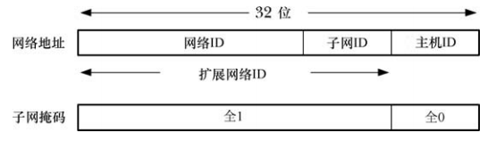
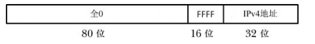

# 互联网

互联网络将不同的计算机网络连接起来并允许位于网络中的主机相互之间进行通信。子网络或者子网，指的是因特网的其中一个网络。

互联网的目标是隐藏不同物理网络的细节以便向互联网络中的所有主机呈现一个统一的网络架构。


# 互联网协议和层

一个联网协议是定义如何在一个网络上传输信息的一组规则，网络协议一般会组织成一系列的层，每一层都构建于下层之上并提供特性以供上层使用。

协议分层可以使得每一个协议层都对上层隐藏下层的操作和复杂性。


## 封装

封装是分层联网协议中的一个重要原则。

封装中的关键概念是低层会将高层向低层传递的信息当成不透明的数据来处理。也就是说，低层不会对高层发送过来的信息进行解释，而只会将这些信息放到低层所使用的包中并在将这个包下传递到低层之前添加自身这一层的信息。

当数据从低层传递到高层时将会进行一个逆向的解包过程。


# 数据链路层

数据链路层由设备驱动和到底层物理媒介(如电线，同轴电缆，光纤)的硬件接口(网卡)构成。

数据链路层关注的是在一个网络的物理连接上传输数据。要传输数据，数据链路层需要将网络层传递过来的数据报封装进被称为帧的一个一个单元。除了需要传输数据之外，每个帧都会包含一个头，头中可能包含了目标地址和帧的大小。

这一层可能会进行错误检测、重传以及流量控制。一些数据链路层还可能会将大的网络包分隔成多个帧并在接收者端对这些帧进行重组。

数据链路层比较重要的一个特点是最大传输单元(MTU)，MTU 是该层所能传输的帧大小的上限。

`netstat -i` 可以列出系统中的网络接口，包括 MTU。

# 网络层

网络层关注的是如何将包从源主机发送到目标主机。

这一层的主要任务：

- 将数据分解成足够小的片段以便数据链路层进行传输
- 在因特网上路由数据
- 为传输提供服务

TCP/IP 协议套件中，网络层的主要协议是 IP。IP 协议的主要版本有：

- IPv4，使用 32 位地址来标识子网和主机
- IPv6，使用 128 位地址，从而为主机提供更大的地址范围

## IP 传输数据报

IP 以数据报(包)的形式来传输数据。在两个主机之间发送的每一个数据报都是在网络上独立传输的，它们经过的路径可能会不同。

一个 IP 数据报包含一个头，范围是 20-60 字节，包含了目标主机的地址，包的源地址。

一个 IP 实现可能会给它所支持的数据报的大小设定一个上限，在 IPv4 中这个限制是 576 字节，在 IPv6 中这个限制是 1500 字节。

## IP 是无连接和不可靠的

IP 是一种无连接协议，因为并没有在两个相互连接的主机之间提供一个虚拟电路。

IP 也是一种不可靠协议，它尽最大可能将数据报从发送者传输给接收者，但并不保证到达的顺序会与它们被传输的顺序一致，也不保证包是否重复，甚至不保证包是否到达接受者。

IP 也没有提供错误恢复，头信息错误的包会被静默地丢弃。

## IP 可能会对数据报进行分段

IPv4 数据报的最大大小是 65535 字节。默认情况下，IPv6 允许一个数据报的最大大小为 65575 字节，并且为更大的数据报提供了一个选项。

当一个 IP 数据报的大小大于 MTU 时，IP 会将数据报分段成一个个大小合适在网络上传输的单元，这些分段在达到最终目的地之后会被重组成原始数据报。每个 IP 分段本身就是包含了一个偏移量字段的 IP 数据报，该字段给出了一个该分段在原始数据报中的位置。

# IP 地址

一个 IP 地址包含两个部分：

- 一个是网络 ID，它指定了主机所属的网络
- 另一个是主机 ID，它标识出了位于该网络中的主机

## IPv4 地址

IPv4 地址包含 32 位，采用点分十进制标记法，将地址的 4 个字节写成一个十进制数字，中间以点号隔开：


网络掩码在二进制形式中，最左边的位由 1 构成，剩余的用 0 填充，这些 1 表示地址中哪些部分包含了所分配到的网络 ID，而这些 0 则表示地址中哪些部分可供组织来为网络中的主机分配唯一的 ID。掩码中网络 ID 部分的大小会再分配地址时确定，由于网络 ID 部分总是占据着掩码最左边的部分，因此可以通过下面的方法来指定分配的地址范围：

```
204.152.189.0/24
```

`/24` 表示分配的地址网络 ID 由最左边的 24 位构成，剩余的 8 位用于指定主机 ID，或者在这种情况下也可以说网络掩码是：

```
255.255.255.0
```

拥有这个地址的组织可以将 `204.152.189.1`  到 `204.152.189.254` 之间的地址分配给计算机，注意两个地址无法分配给计算机：

- 地址的主机 ID 的位 都是 0，它用来标识网络本身
- 主机 ID 都是 1，在本例中 `204.152.189.255`，它是子网广播地址

`127.0.0.1` 一般被定义为回环地址，通常会被分配给主机名 `localhost`。发送到这个地址的数据实际上不会到达网络，它会回环变成发送主机的输入。

`INADDR_ANY` 表示 IPv4 通配地址，一般来讲希望位于一台多宿主主机上的应用程序能够接收任意一个主机 IP 地址的数据报和连接请求，可以将 socket 绑定到通配 IP 地址。一般将 `INADDR_ANY` 定义为 `0.0.0.0`。



IPv4 一般是划分子网的，即将主机 ID 分为：子网 ID 和主机 ID。

子网掩码的作用与网络掩码的角色一样，并且可以使用类似的标记法来表示分配给一个特定子网的地址范围。

假设分配的网络ID：`204.152.189.0/24`，这样可以将主机 ID 的 8 位中的 4 位划分成子网 ID 并将剩余的 4 位划分成 主机 ID。

 ## IPv6 地址

IPv6 地址由 128 位构成，其中地址中的前面一些位是一个格式前缀，表示地址类型。

通常被写成冒号分隔开的 16 进制数字：

```
F000:0:0:0:0:0:A:1
```

当有多个连续的 0 序列可以使用 `::`，例如：

```
F000::A:1
```

但是只能出现一次 `::` 否则会造成歧义。

IPv6 的环回地址：`::1`，通配地址：`::`。

IPv6 到 IPv4 的映射：



书写 IPv4 的 IPv6 地址时，地址的 IPv4部分会写成点分十进制的标记：

```
::FFFF:204.152.189.116
```

# 传输层

传输层协议：

- 用户数据报协议 UDP 是数据报 socket 所使用的协议
- 传输控制协议 TCP 是流 socket 所使用的协议

## 用户数据报协议

UDP 仅仅在 IP 上添加了两个特性：端口号和一个进行检测传输数据错误的数据校验和。

UDP 是无连接的，不可靠的，基于 UDP 的应用程序若要保证可靠性，必须在应用程序中予以实现。

UDP 和 TCP 使用的校验和长度只有 16 位，只能做简单的总结性校验和，无法检测出特定的错误。

### 避免 IP 分段

使用 UDP 时如果传输的数据报的大小超过了本地数据连接的 MTU，那么很容易导致 IP 分段。

因为基于UDP 的应用程序不知道主机和目的主机之间的路径的 MTU，一般基于 UDP 的应用程序会采用保守的方法避免 IP 分段，即确保传输的 IP 数据报的大小小于 IPv4 的组装缓冲区的大小的最小值 576 字节。在这576 字节中：

- 8 个字节用于存放 UDP 的头
- 至少 20 个字节存放 IP 头
- 剩余部分是数据

一般实践中，会采取更小的值 512 字节来存放数据报。

## 传输控制协议

TCP 在两个断点之间提供了可靠的，面向连接的，双向字节流通信信道。


### 连接建立

在开始通信之前，TCP 需要在两个端点之间建立一个通信信道。在连接建立期间，发送者和接收者需要交换选项来协商通信的参数。

### 数据打包成段

数据被分解成段，每个段都包含一个校验和，从而能够检测出端到端的传输错误，每个段使用单个 IP 数据报来传输。

### 确认、重传和超时

当一个 TCP 段无错地达到目的地时，接收 TCP 会向发送者发送一个确认，通知它数据发送传递成功了。如果一个段在到达时存在错误，那么这个段就会被丢弃，确认信息也不会发送。

为处理段永远不到达或被丢弃的情况，发送者在发送每个段时都会开启一个定时器，如果在定时器超时之前没有收到确认，那么就会重传这个段。

由于所使用的网络以及当前的流量负载会影响传输一个段和接收其确认所需的时间，因此 TCP 采用了一个算法来动态地调整重传超时时间 RTO 的大小。

接收 TCP 可能不会立即发送确认，而是会等待几个毫秒来观察下是否可以将确认塞进接收者返回给发送者的响应中，这种被称为延迟 ACK 的技术的目的是能少发送一个 TCP 段，从而降低网络中包的数量以及降低发送和接收主机的负载。

### 排序

在 TCP 连接上传输的每一个字节都会分配到一个逻辑序号，这个数字指出了该字节在这个连接的数据流中所处的位置。当传输一个 TCP 分段时会在其中一个字段中包含这个段的第一个字节的序号。

在每一个段中加上一个序号有几个作用：

- 这个序号使得 TCP 分段能够以正确的顺序在目的地进行组装，然后以字节流的形式传递给应用层(在任意一个时刻，在发送者和接收者之间可能存在多个正在传输的 TCP 分段，这些分段的到达顺序可能与被发送的顺序是不同的)
- 由接收者返回给发送者的确认信息可以使用序号来标识出收到了哪个 TCP 分段
- 接收者可以使用序号来移除重复的分段，发生重复的原因可能是因为 IP 数据段重复，也可能是因为 TCP 自己的重传算法会在一个段的确认丢失或没有按时收到时重传一个成功递送出去的段

一个流的初始序号 ISN 不是从 0 开始的，而是通过一个算法生成的，该算法会递增分配给后续 TCP 连接的 ISN。序号是一个 32 位的值，当达到最大值时会回到 0。

### 流量控制

流量控制防止一个快速的发送者将一个慢速的接收者压垮，要实现流量控制，接收 TCP 就必须要为进入的数据维护一个缓冲区。每个 TCP 在连接建立阶段会通告其缓冲区的大小。当从发送 TCP 端收到数据时会将数据累积在这个缓冲区中，当应用程序读取数据时会从缓冲区中删除数据，在每个确认中，接收者会告知发送者其进入数据缓冲区的可用空间，也就是发送者可以发送多少个字节。

TCP 流量控制算法采用了所谓的滑动窗口算法，它允许包含总共 N 字节的未确认段同时在发送者和接收者之间传输。如果接收  TCP 的进入数据缓冲区完全被填满了，那么窗口就会关闭，发送 TCP 就会停止传输数据。

接收者可以使用 `SO_RCVBUF` socket 选项来覆盖进入缓冲区的默认大小。 

###　拥塞控制：慢启动和拥塞避免算法

TCP 的拥塞控制算法被设计用来防止快速发送者压垮整个网络。如果一个发送 TCP 发送包的速度要快于一个中间路由器转发的速度，那么该路由器就开始丢包，这将导致较高的丢包率，其结果是如果 TCP 保持以相同的速度发送这些被丢弃的分段的话就会极大地降低性能。TCP 的拥塞控制算法在下列场景中是比较重要的：

- 在连接建立之后：此时(或当传输在一个已经空闲了一段时间的连接上恢复时)，发送者可以立即向网络中注入尽可能多的分段，只要接收者公告的窗口大小允许即可，这里的问题是，如果无法处理分段洪范泛，那么发送者会存在立即压垮整个网络的风险
- 当拥塞被检测到时：如果发送 TCP 检测到发生了拥塞，那么它就必须要降低传输速率，TCP 是根据分段丢失来监测是否发生了拥塞，因为传输错误率是非常低的，即如果一个包丢失了，那么就认为发生了拥塞

TCP 的拥塞控制策略采用了两种算法：慢启动和拥塞避免。


＃请求注解 RFC


