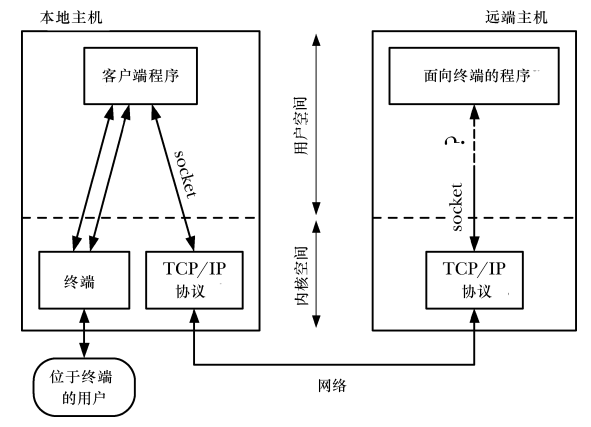
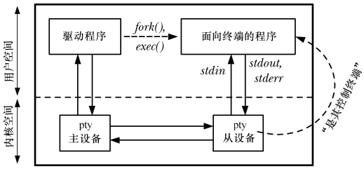

伪终端是一个虚拟设备，它提供了一个 IPC 通道。通道的一端是一个期望连接到终端设备的程序。通道的另一端也是一个程序，这个程序通过 IPC 通道来发送其输入并读取输出以此来驱动面向终端的程序。

# 整体概览

通过网络通信，套接字提供了解决这个问题的驱动部分。但是，我们无法直接面向终端程序的标准输入，输出和错误信息连接到套接字上。这是因为面向终端程序期望连接的是一个终端，以此才能执行例如将终端置为非规范程序，将回显打开或关闭，以及设定终端前台进程组等操作。如果某个程序尝试在一个套接字上执行这样的操作，那么相关的系统调用将失败。

此外，面向终端的程序期望终端驱动程序对其输入和输出做特定类型的处理。举个例子，在规范模式下，当终端驱动程序在一行的开始处发现文件结尾(`Ctrl+D`),
  将导致下一次 `read()` 调用不会返回任何数据。

最后，面向终端的程序必须有一个控制终端。这样允许程序通过打开 `/dev/tty` 来获取一个控制终端的文件描述符，并且也使得产生针对该程序的作业控制和相关的信号成为可能。

## 伪终端主从设备

伪终端提供了网络连接和面向终端程序之间那缺失的一环。伪终端是一对互联的虚拟设备：主伪终端和从伪终端，有时被共称为伪终端对。伪终端对提供了一条
  IPC 通道，这有点像双向管道：两个进程能分别打开主端和从端，并通过伪终端双向传输数据。

关于伪终端，关键点在于从设备表现的像一个标准终端一样。所以施加于终端设备的操作同样也可以施加于伪终端从设备上。这里面有些操作对伪终端来说没有
什么意义(例如，设定终端的线速或者奇偶校验)，但这并无大碍，因为伪终端从设备会悄悄忽略它。

## 如何使用伪终端

pty 是伪终端的常用缩写形式。面向终端的程序的标准输入，输出以及错误都连接到伪终端从设备上，它也是程序的控制终端。在伪终端的另一侧，驱动程序作为用户的代理，提供面向终端程序的输入并读取程序的输出。

通常驱动程序同时读取输入并将输出写入到另外一个 IO 通道中。它的行为像一个中继，在伪终端和另外一个程序间双向传递数据。为了实现这一点，驱动程序必须同时监控 2 个方向上的输入。这通常由 IO 多路复用来实现，也可以采用一对进程或线程在两个方向上传递数据。
一般情况下使用伪终端的应用进程会按照如下步骤来做：

- 驱动程序打开伪终端主设备
- 驱动程序调用 `fork()` 创建一个子进程。子进程执行如下操作：
  - 调用 `setsid()` 来启动一个新的会话，使该子进程称为会话的头领进程。该操作也使得子进程失去它的控制终端
  - 打开同伪终端主设备相对应的从设备。由于子进程是会话的头领进程，且没有控制终端，伪终端从设备就变成了子进程的控制终端
  - 调用 `dup()` 为从设备复制标准输入，输出，错误的文件描述符
  - 调用 `exec()` 启动要连接到伪终端从设备的面向终端程序

此时这2个程序就可以通过伪终端进行通信了。任何由驱动程序写到主设备的信息，都会在从设备这端作为面向终端程序的输入。任何由面向终端的程序写到从设备的信息，
  都可以在主设备由驱动程序读取。

    伪终端也可以能够用来连接任意的进程对(即，不一定是父子进程)。所有要做的就是打开伪终端主设备的进程需要将相关联的从设备名称通知给另一个进程即可，可能是

  将名称写到一个文件上又或者是通过其他 IPC 机制来传递。

