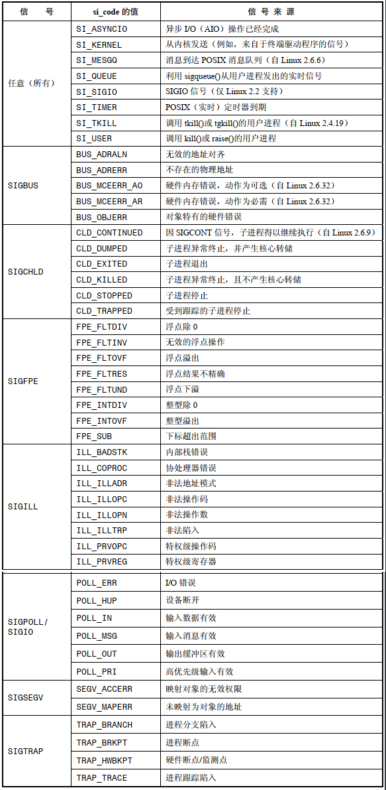

# 设计信号处理器函数

一般信号处理器函数设计得越简单越好，一个重要的原因就在于：这将降低引发竞争条件的风险，下面是针对信号处理器函数的两种常见设计：

- 信号处理器函数设置全局性标志变量并退出，主程序对此标志进行周期性检查，一旦置位随即采取相应动作
- 信号处理器函数执行某种类型的清理动作，接着终止进程或者使用非本地跳转将栈解开并将控制返回到主程序中的预订位置

## 再论信号的非队列化处理

在执行某信号的处理器函数时会阻塞同类信号的传递(除非在调用 `sigaction()` 时指定了 `SA_NODEFER` 标志)。

如果在执行处理器函数时，再次产生同类信号，那么会将该信号标记为等待状态，并在处理函数返回之后再进行传递。

在处理器函数执行期间，如果多次产生同类信号，那么仍然会将其标记为等待状态，但稍后只会传递一次。

因此需要注意：

- 无法对信号产生的次数进行可靠计数
- 在位信号处理器函数编码时可能需要考虑处理同类信号多次产生的情况

## 可重入函数和异步信号安全函数

### 可重入和非可重入函数

如果同一进程的多条线程都可以同时安全地调用某一函数，那么该函数就是可重入的，这里的安全指的是，无论其他线程调用该函数的执行状态如何，函数均可以产生预期结果。

更新全局变量或者静态数据结构的函数，一般是不可重入的。

### 标准的异步信号安全函数

异步信号安全的函数是指当从信号处理器函数调用时，可以保证其实现是安全的。

如果一个函数是可重入的，又或者信号处理器函数无法将其中断，就成该函数是异步信号安全的。

异步信号安全的函数：


信号处理器函数的选择：

- 确保信号处理器函数代码本身是可重入的，其只调用异步信号安全的函数
- 当主程序执行不安全函数或是去操作信号处理器函数也可能更新的全局数据结构时，阻塞信号的传递

### 信号处理器函数内部对 errno 的使用

由于可能会更新 `errno`，有一种变通的方法：

```
void handler(int sig)
{
	int savedErrno;
	savedErrno = errno;
	
	//@ do sth
	
	errno = savedErrno;
}
```

## 全局变量和 `sig_atomic_t`  数据类型

有时需要主程序和信号处理函数之间共享全局变量，一种常见的设计是，信号处理器函数只做一件事情，设置全局标志，主程序则会周期性地检查这个标志，采取相应动作来响应信号传递，应该在声明变量时，使用 `volatile` 关键字，从而防止编译器将其优化到寄存器中，除此之外还应该保证原子性：

```
volatile sig_atomic_t flag; 
```

在使用 `sig_atomic_t` 变量时，唯一能做的就是在信号处理器中进行设置，在主程序中检查，`++` 和 `--`  操作，可能是非原子的，不在保障范围内。

`<stdint.h>` 中定义了 `SIG_ATOMIC_MIN`  和 `SIG_ATOMIC_MAX`，用于表示 `sig_atomic_t` 类型的取值范围。

# 终止信号处理器函数的其他方法

从信号处理器函数中终止的其他一些方法：

- 使用 `_exit()` 终止进程，处理器函数事先可以做一些清理工作，不要使用 `exit()` 来终止信号处理函数，因为它不属于安全函数，在该函数调用 `_exit()` 之前刷新 `stdio`  的缓冲区
- 使用 `kill()` 发送信号来杀掉进程，即信号的默认动作是终止进程
- 从信号处理器函数中执行非本地跳转
- 使用 `abort()` 函数终止进程，产生核心转储

## 在信号处理器函数中执行非本地跳转

```
#include <setjmp.h>

int sigsetjmp(sigjmp_buf env, int savesigs);
void siglongjmp(sigjmp_buf env, int val);
```

- `sigsetjmp()` 和 `longjmp()` 的操作与 `setjmp()` 和 `longjmp()` 类似，区别是，`env` 的类型不同，并且多出 `sigsetjmp()` 多出一个参数 `savesigs`：
  - 如果 `savesigs` 为非0值，那么会将调用 `sigsetjmp()` 时进程的当前信号掩码保存于 `env`  中，之后通过指定相同的 `env`  参数的 `siglongjmp()` 调用进行恢复
  - 如果 `savesigs` 为0值， 则不会保存和恢复进程的信号掩码
- `longjmp()` 和 `siglongjmp()` 都不是安全函数，因为在信号处理器中调用这些函数，在执行非本地跳转之后去调用任何非异步信号安全函数也需要冒着同样的风险，为了规避这一问题，借助 `sigprocmask()` 临时将信号阻塞起来

## 异常终止进程

```
#include <stdlib.h>

void abort(void);
```

- `abort()` 产生 `SIGABRT` 信号来终止调用进程并产生核心转储文件
- 无论阻塞或者忽略 `SIGABRT` 信号，`abort()` 调用均不受影响，同时规定，除非进程捕获 `SIGABRT` 信号后信号处理器函数尚未返回，否则 `abort()` 必须终止进程
- 终止时可确保发生：若进程在发出一次 `SIGABRT` 信号后仍未终止，则 `abort()`  会对 `SIGABRT`  信号的处置重置为 `SIGDFL`,并再度发出 `SIGABRT` 信号，从而确保将进程杀死
- `abort()` 如果成功终止了进程，那么还将刷新 `stdio` 流，并将其关闭

# 在备选栈中处理信号

在调用信号处理器函数时，内核通常会再进程栈中为其创建一帧，不过，如果进程对栈的扩展突破了对栈的大小限制时，这种方法就不可行：

- 栈的扩展触及到一片映射内存或者向上增长的堆
- 栈的大小已经直逼 `RLIMIT_STACK`  资源限制

当进程对栈的扩展试图突破其上限时，内核将为该进程产生 `SIGSEGV` 信号，不过因为栈空间已然耗尽，内核将无法为进程已安装的 `SIGSEGV` 处理器函数创建栈帧，结果是，处理器函数得不到调用，而进程也就终止了(`SIGSEGV` 的默认动作)。

如果希望在这种情况下确保对 `SIGSEGV` 信号处理器函数的调用，则需要做如下工作：

- 分配一块被称为 "备选信号栈" 的内存区域，作为信号处理器函数的栈帧
- 调用 `sigaltstack()`  告知内核备选信号栈的存在
- 在创建信号处理函数时，指定 `SA_ONSTACK` 标志，即告知内核在备选栈上为处理器函数创建栈帧

```
#include <signal.h>

int sigaltstack(const stack_t *sigstack, stack_t *old_sigstack);
```

- `sigaltstack()` 既可以创建一个备选信号栈，也可以将已创建备选信号栈的相关信息返回
- `sigstack` 指向的数据结构描述了新备选信号栈的位置和属性，`old_sigstack` 指向的结构返回上一备选信号栈的相关信息(如果存在)，两个参数都可以是 `NULL`，将 `sigstack` 设置为 `NULL`  可以发现备选信号栈，并且不将其改变
- 备选信号栈既可以静态分配，也可以在堆上分配，`SIGSTKSZ` 定义备选栈的典型值大小， `MINSSIGSTKSZ` 定义为调用信号处理器函数所需的最小值
- 内核不会重新划分备选栈的大小，如果栈溢出了给它分配的空间，就会产生混乱
- `stack_t`：

```
typedef struct {
    void  *ss_sp;     /* Base address of stack */
    int    ss_flags;  /* Flags */
    size_t ss_size;   /* Number of bytes in stack */
} stack_t;
```

- `ss_sp` 指向备选信号栈的位置，实际使用时，内核会将 `ss_sp`  自动对齐为与硬件架构相适宜的地址边界`ss_size` 指明备选信号栈的大小
- `ss_flags` 的可选值：
  - `SS_ONSTACK`：如果在获取已创建备选信号栈的当前信息时该标志已然置位，就表明进程正在备选信号栈上执行，当进程已经在备选信号栈上执行时，试图调用 `sigaltstack()`  来创建一个新的备选信号栈将会产生错误  `EPERM`
  - `SS_DISABLE`：在 `old_sigstack` 中返回，表示当前不存在已创建的备选信号栈，如果在 `sigstack`  中指定，则会禁用当前已创建的备选信号栈

# `SA_SIGINFO` 标志

如果在 `sigaction()` 创建处理器函数时设置了 `SA_SIGINFO` 标志，那么在收到信号时处理器函数可以获取该信号的一些附加信息，为获取这一信息，需要将处理器函数声明如下：

```
void handler(int sig,siginfo_t* siginfo,void* ucontext);
```

- `sig` ： 表示信号编号
- `siginfo`：用于提供信号附加信息的一个结构

此时需要使用 `sa_sigaction` 字段来指定处理器函数地址。

```
siginfo_t {
               int      si_signo;     /* Signal number */
               int      si_errno;     /* An errno value */
               int      si_code;      /* Signal code */
               int      si_trapno;    /* Trap number that caused hardware-generated signal (unused on most architectures) */
               pid_t    si_pid;       /* Sending process ID */
               uid_t    si_uid;       /* Real user ID of sending process */
               int      si_status;    /* Exit value or signal */
               clock_t  si_utime;     /* User time consumed */
               clock_t  si_stime;     /* System time consumed */
               sigval_t si_value;     /* Signal value */
               int      si_int;       /* POSIX.1b signal */
               void    *si_ptr;       /* POSIX.1b signal */
               int      si_overrun;   /* Timer overrun count;  POSIX.1b timers */
               int      si_timerid;   /* Timer ID; POSIX.1b timers */
               void    *si_addr;      /* Memory location which caused fault */
               long     si_band;      /* Band event (was int in glibc 2.3.2 and earlier) */
               int      si_fd;        /* File descriptor */
               short    si_addr_lsb;  /* Least significant bit of address (since Linux 2.6.32) */
               void    *si_call_addr; /* Address of system call instruction  (since Linux 3.5) */
               int      si_syscall;   /* Number of attempted system call (since Linux 3.5) */
               unsigned int si_arch;  /* Architecture of attempted system call (since Linux 3.5) */
           }
```

- `si_signo` ： 需要为所有信号设置，内含引发处理器函数调用的信号编号，与处理器函数 `sig` 参数值相同
- `si_code` ：需要为所有信号设置，所含代码提供了关于信号来源的深入信息
- `si_value` ：该字段包含调用 `sigqueue()` 发送信号时的伴随数据
- `si_pid`：对于经由 `kill()` 或 `sigqueue()` 发送的信号，该字段保存了发送进程的进程 ID
- `si_uid`：对于经由 `kill()` 或 `sigqueue()` 发送的信号，该字段保存了发送进程的进程的真实用户 ID
- `si_errno`：如果将该字段置为非 0 值，则其包含为一错误号，标志信号的产生原因
- `si_addr`：仅针对由硬件产生的 `SIGBUG`，`SIGSEGV`, `SIGILL`， `SIGFPE` 信号设置该字段，对于 `SIGILL` 和 `SIGFPE` 信号，包含的时导致信号产生的程序指定地址，对于  `SIGBUG`，`SIGSEGV`,包含引发无效内存引用的地址
- `si_timerid`：内含供内核使用的 ID，用以标识定时器
- `si_overrun`：设置该字段为定时器的溢出次数
- `si_band` ：该字段包含与 IO 事件相关的 "带事件" 值
- `si_fd` ：该字段包含 IO 事件相关的文件描述符编号
- `si_status`：该字段包含了子进程的退出状态或者发送给子进程的信号编号
- `si_utime`：该字段包含子进程使用的用户 CPU 时间
- `si_stime`：该字段包含了子进程使用的系统 CPU 时间



- `ucontext`：以 `SA_SIGINFO` 标志所创建的信号处理器函数，其最后一个参数是 `ucontext`，一个指向 `ucontext_t` 类型结构体的指针，该结构提供了所谓的用户上下文信息，用于描述调用信号处理器函数前的进程状态，其中包括上一进程信号掩码以及寄存器器的保存值，例如程序计数器(cp)和栈指针寄存器(sp)

# 系统调用的中断和重启

考虑如下场景：

- 为某信号创建处理器函数
- 发起一个阻塞的系统调用
- 当系统调用遭到阻塞时，之前创建了处理器函数的信号传递过来，随机引发对处理器函数的调用

当信号处理器返回后，默认情况下，系统调用失败，并将 `errno` 设置为 `EINTR`，但是更为常见的情况是希望遭到中断的系统调用得以继续运行，为此：

```
#define NO_EINTR(stmt) while((smt) == -1 && errmo == EINTR);

NO_EINTR(cnt = read(fd,buf,BUF_SIZe));

if(cnt == -1)
	errExit("read");
```

GNU C 库提供了一个非标准宏 `TEMP_FAILURE_RETRY`，作用与 `NO_EINTR` 类似：

```
#define _GNU_SOURCE

#include <unistd.h>

TEMP_FAILURE_RETRY(...)
```

还可以指定 `SA_RESTART` 标志的 `sigaction()`  来创建信号处理器函数，从而令内核代表进程自动重启系统调用，还无需处理系统调用可能返回的 `EINTR`  错误。

`SA_RESTART` 是针对每个信号设置的，可以允许某些信号的处理器函数中断阻塞的系统调用，而其他系统调用则可以自动重启。

## `SA_RESTART`  标志对哪些系统调用和库函数有效

不是所有的系统调用和库函数都可以指定 `SA_RESTART`  来达到自动重启的目的。

在 Linux 系统中，如果采用 `SA_RESTART` 标志来创建系统处理器函数，则如下阻塞的系统调用以及构建于其上的库函数在遭到中断时是可以自动重启的：

- `wait()`，`waitpid()`，`wait3()`，`wait4()`，`waittid()`
- 访问慢速设备时的 IO 系统调用：`read()`,`readv()`,`write()`,`writev()`,`ioctl()` ，如果在收到信号时已经传递了部分数据，那么还是会中断输入输出系统调用，但会返回成功状态：一个整型值，表示已经成功传递数据的字节数，慢速设备：
  - 包括：终端，管道，FIFO 以及套接字
  - 磁盘 IO 并非慢速设备之列，因为借助缓冲区高速缓存，磁盘 IO 请求一般都可以立即得到满足，当出现磁盘 IO 请求时，内核会令该进程休眠，直至完成 IO 动作为止
- 系统调用 `open()`，在可能阻塞的情况下，例如打开 `FIFO` 时
- 用于套接字的各种系统调用：`accept()`， `accept4()`，`connect()`，`send()`，`accept()`，`sendmsg()`，`sendto()`，`recv()`，`recvfrom()`，`recvmsg()`，但是如果使用 `setsocketopt()` 来设置超时，这些系统调用将不会自动重启
- 对 POSIX 消息队列进行IO 操作的系统调用：`mq_receive()`，`mq_timedreceive()`，`mq_send()`，`mq_timedsend()`
- 用于设置文件锁的系统调用和库函数：`flock()`，`fcntl()`，`lockf()`
- Linux 特有的系统调用 `futex()` 的 `FUTEX_WAIT` 操作
- 用于递减 POSIX 信号量的 `sem_wait()` 和 `sem_timedwait()` 函数
- 用于同步 POSIX 线程的函数：`pthread_mutex_lock()`，`pthread_mutex_trylock()`，`pthread_mutex_timedlock()`，`pthread_cond_wait()`，`pthread_cond_timedwait()`

以下阻塞的系统调用和库函数则绝不会自动重启，即便指定了 `SA_RESTART` 标志：

- IO 多路复用调用：`poll`，`epoll`，`select`，`pselect`
- Linux 特有的 `epoll_wait()` 和 `epoll_pwait()`
- Linux 特有的 `io_getevents()` 系统调用
- 操作 System V 消息队列和信号量的阻塞系统调用： `semop()`，`semtimedop()`，`msgrcv()`，`msgsnd()`
- 对 `inotify` 文件描述符发起的 `read()` 调用
- 用于将进程挂起指定时间的系统调用和库函数：`sleep()`，`nanosleep()`，`clock_nanosleep()`
- 


