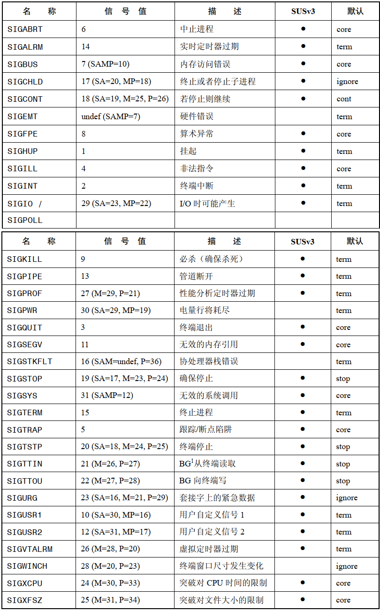
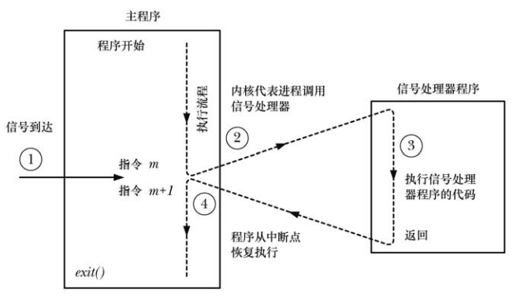
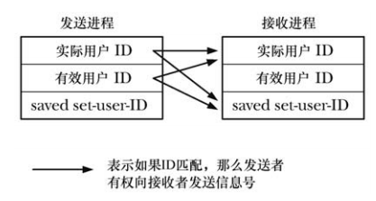

# 概念和概述

信号是事件发生时对进程的通知机制，有时称为软件中断，信号与硬件中断类似之处是：打断了程序执行的正常流程，大多数情况下，无法预测信号到达的准确时间。

一个具有合适权限的进程可以向另一个进程发送信号，进程也可以给自身发送信号，但多数信号源于内核，内核为进程产生信号的各类事件：

- 硬件异常，例如：被除0，引用了无法访问的内存区域
- 用户键入能够产生信号的终端字符，例如：Control+c，Control+z
- 发生软件事件，例如：定时器到期，进程执行的 CPU 时间超限，子进程退出

针对每个信号都定义了唯一一个小整数，从1开始顺序展开，`<signal.h>`  以 `SIGXXXXX`  形式的符号命名。

信号分为两大类：

- 第一组用于内核向进程通知事件，构成所谓传统或者标准信号，Linux 中标准信号的范围 1~31
- 另一组由实时信号构成

信号由于某些事件产生，产生信号后，会于稍后被传递给某一进程，而进程也会采取某些措施来响应信号，在产生和到达之间，信号处于等待状态。

通常，一旦内核接下来要调度该进程运行，等待信号将马上送达，或者如果进程正在运行，则会立即传递信号。如果一段代码不想被信号打断，则可以将该信号添加到进程信号掩码中，从而阻塞信号到达，直到信号从掩码中移除，才会送达。

信号到达后，进程的默认行为：

- 忽略信号，内核将丢弃信号，该信号对进程没有任何影响
- 终止进程，有时指的是进程异常终止，而不是进程调用 `exit()` 发生的正常终止
- 产生核心转储文件，同时终止进程，核心转储文件包含对进程虚拟内存的镜像，可将其加载到调试器检查进程终止时的状态
- 停止进程，暂停进程的执行
- 恢复之前停止的进程

除了默认行为，程序也可以改变信号到达时的响应行为：

- 采取默认行为
- 忽略信号
- 执行信号处理器函数

注意，无法将信号处理设置为终止进程或者转储核心，除非这是信号的默认处置，效果最为近似的是为信号安装一个处理器程序，并于其中调用 `exit()` 或者 `abort()` ，`abort()` 为进程产生一个 `SIGABRT` 信号，该信号将引发转储核心文件并终止进程。

# 信号类型和默认行为

- `SIGABRT` ：进程调用 `abort()` ，系统向进程发送该信号，默认情况下，该信号会终止进程，并产生核心转储文件
- `SIGALARM` ：经过 `alarm()`  或者 `setitimer()` 设置的定时器到期时，内核将产生该信号
- `SIGBUS` ：产生该信号表示发生了某种内存访问错误
- `SIGCHILD`：父进程的某一子进程终止时，内核向父进程发送该信号，父进程的某一子进程收到信号而停止或者恢复时，也可能向父进程发送该信号
- `SIGCLD` ：与 `SIGCHILD` 信号同义
-  `SIGCONT`：将该信号发送给已停止的进程，进程将恢复运行，当接收信号的进程当前不处于停止状态时，默认情况下将忽略该信号
- `SIGEMT`：UNIX 系统通常用该信号来标识一个依赖于实现的硬件错误
- `SIGFPE` ：该信号因特定类型的算法错误而产生，比如：除以 0
- `SIGHUP` ：当终端断开(挂机)时，将发送该信号给终端控制进程
- `SIGILL`：试图执行非法，即格式不正确的机器语言指令，系统将向进程发送该信号
- `SIGINFO`：该信号与 `SIGPWR` 信号同义
- `SIGINT`：用户终端输入中断字符 `control+c` ，终端驱动程序将发送该信号给前台进程组，该信号的默认行为是终止进程
- `SIGIO`：利用 `fcntl()`  系统调用，可于特定类型(诸如终端和套接字)的打开文件描述符发生 IO 事件时产生该信号
- `SIGTOT`：该信号与 `SIGABRT` 信号同义
- `SIGKILL`：此信号为 "必杀" 信号，处理器程序无法将其阻塞，忽略或者捕获，故而总能终止进程
- `SIGLOST`：未加以使用
- `SIGPIPE`：当某一进程试图向管道、FIFO或者套接字中写入信息时，如果这些设备并无相应的阅读进程，那么系统将产生该信号
- `SIGPOLL`：该信号从 System V 派生而来，与 Linux 中的 `SIGIO`  信号同义
- `SIGPROF`：由 `setitimer()` 调用所设置的性能分析定时器刚一过期，内核就将产生该信号
- `SIGPWR`：电源故障信号
- `SIGQUIT`：用户在 终端输入 `control+\` ，该信号静发送到前台进程组，默认情况下，该信号终止进程，并生成可核心转储文件
- `SIGSEGV`：对内存引用无效时，产生该信号，例如：要引用的页不存在，试图修改只读内存，用户态访问内核态内存
- `SIGSTKFLT`：协处理器栈错误，Linux 对该信号作了定义，但未加以使用
- `SIGSTOP`：这是一个必停信号，处理器无法将其阻塞、忽略或者捕获，故而总能停止进程
- `SIGSYS`：如果进程发起的系统调用有误，那么将产生该信号
- `SIGTERM`：终止进程的标准信号，也是 `kill`  和 `killall` 命令的默认信号
- `SIGTRAP`：实现断点调试功能以及 `strace` 命令所执行的跟踪系统调用功能
- `SIGTSTP`：作业控制的停止信号，在终端输入 `control+z` 时，将该信号送给前台进程组，使其停止运行
- `SIGTTIN`：在作业控制 shell 下运行，若后台进程组试图对终端进行 `read()` 操作，终端驱动程序将向该进程组发送该信号，该信号默认将停止进程
- `SIGTTOU`：与 `SIGTTIN`  类似，但针对的是后台终端输出，如果终端启用了 `TOSTOP` 选项，而某一后台进程组视图对终端进行 `write()` 操作，终端驱动程序将向该进程组发送 `SIGTTOUT` 信号，该信号默认停止进程
- `SIGNUSED`：该信号没有使用
- `SIGURG`：系统发送该信号给一个进程，表示调节字存在带外数据
- `SIGUSR1`：用于自定义信号使用，内核绝不会为进程产生这个信号，进程可以使用这个信号来相互通知事件的发生，或是彼此同步
- `SIGUSR2`：用于自定义信号使用，内核绝不会为进程产生这个信号，进程可以使用这个信号来相互通知事件的发生，或是彼此同步
- `SIGVTALRM`：调用 `setitimer()`  设置的虚拟定时器刚一到期，内核就会产生该信号
- `SIGWINCH`：在窗口环境中，当终端窗口尺寸发生变化时会想前台进程组发送该信号
- `SIGXCPU`：当进程的 CPU 时间超出对应的资源限制时，将发送该信号给进程
- `SIGXFSZ`：如果试图增大文件而突破了对进程文件大小的资源限制，那么将发送该信号给进程



# 改变信号处置

```
#include <signal.h>

typedef void (*sighandler_t)(int);
sighandler_t signal(int signum, sighandler_t handler);
```

- `signum` 表示希望处理的信号编号，`handler` 表示信号抵达时所调用处理函数的地址

- 指定 `handler` 参数时可以使用下面的值来代替函数地址：

  - `SIG_DFL` ： 将该信号重置为默认值
  - `SIG_IGN`：忽略该信号
  
- 调用成功，返回的是之前的信号处置，调用失败，将返回 `SIG_ERR`
# 信号处理器简介

调用信号处理器程序，可能会随时打断主程序流程，内核代表进程来调用处理器程序，当处理器返回时，主程序会在处理器打断的位置恢复执行。

  

# 发送信号

```
#include <sys/types.h>
#include <signal.h>

int kill(pid_t pid, int sig);
```

- `pid` 标识一个或多个目标进程：
  - `pid > 0` ：发送信号给 `pid` 指定的进程
  - `pid == 0` ：发送信号给调用进程的同组的每一个进程，包括调用进程本身
  - `pid < 0` ：发送信号给：调用进程有权将信号发往的每个目标进程，除去  `init` 进程和调用进程本身
- `sig` 表示要发送的信号
- 如果没有进程与指定 `pid`  匹配，将调用失败，设置错误 `ESRCH`
- 进程要发送信号给另一进程，还需要适当的权限，其规则如下：
  - 特权级进程可以向任何进程发送信号
  - 以 `root`  用户和组运行的 `init` 进程，是一个特例，仅能接收已安装了处理器函数的信号，这可以防止系统管理员以外杀死 `init` 进程
  - 如果发送者的实际或有效用户 ID 匹配于接受者的实际用户 ID 或者保存设置用户 ID，那么非特权进程也可以向另一进程发送信号
  - `SIGCONT` 信号需要特殊处理，无论对用户 ID 的检查结果如何，非特权进程可以向同一会话中的任何其他进程发送这一信号




  

  

  


