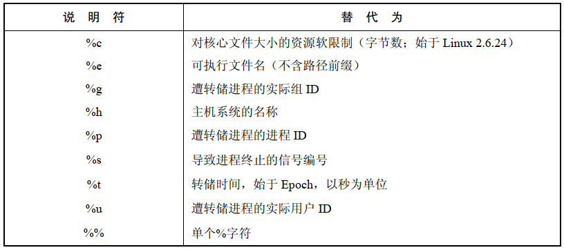
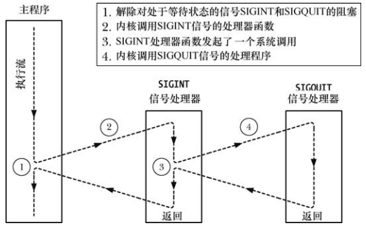

# 核心转储文件

所谓的核心转储是内含进程终止时内存映像的一个文件。术语 `core` 源于老迈的内存技术，将该内存映像加载到调试器中，即可查明信号到达时程序代码和数据的状态。

生成 `core` 文件：

```
ulimit -c unlimited
sleep 30

Type control+\  # 产生 SIFQUIT 信号，必杀之
Quit (core dumped)
ls -l core
-rw------- 1 ubuntu ubuntu 389120 7月   7 19:49 core
```

- 核心转储文件创建于进程的当前工作目录中，名为 `core` ，这是核心转储文件的默认位置和名称

## 不产生核心转储文件的情况

- 进程对于核心转储文件没有写权限，造成这种情况的原因有：进程对将要创建核心转储文件的所在目录没有写权限，或者因为存在同名(且不可写，亦或是非常规类型)文件
- 存在一个同名、可写的普通文件，但指向该文件硬链接数超过一个
- 将要创建核心转储文件的所在目录并不存在
- 把进程 "核心转储文件大小" 这一资源限制为 0
- 将进程 "可创建文件大小"这一资源限制为 0
- 对进程正在执行的二进制可执行文件没有读权限，这样就防止了用户借助于核心转储文件来获取本无法读取的程序代码
- 以只读方式挂载当前工作目录所在的文件系统，或者文件系统空间已满，又或者 `i-node` 资源耗尽，还有一种情况，即用户已经达到其在该文件系统上的配额限制
- `Set-user-ID` (`Set-group-ID`) 程序在由非文件属主(属组)执行时，不会产生核心转储文件，这可以防止恶意用户将一个安全程序的内存转储出来，再针对诸如密码之类的敏感信息进行刺探

`/proc/PID/coredump_filter` 可以对写入核心转储文件的内存映射类型施以进程级控制，该文件中的值是一个 4 位掩码，分别对应于 4 种类型的内存映射：

- 私有匿名映射
- 私有文件映射
- 共享匿名映射
- 共享文件映射

默认仅对匿名映射和共享匿名映射进行转储。

## 为核心转储文件命名

`/proc/sys/kernel/core_pattern` 文件所包含的格式化字符串来控制对系统上生成的所有核心转储文件的命名，默认情况下是 `core`。

文件说明符：



替换所有格式说明符后，由此生成的路径名字符长度最多可达 128 个字符。

# 传递、处置及处理的特殊情况

## SIGKILL 和 SIGSTOP

`SIGKILL ` 信号的默认行为是终止一个进程，`SIGSTOP` 信号的默认行为是停止一个进程，二者的默认行为均无法改变。当试图调用 `signal()` 和 `sigaction()` 来改变对这些信号的处置时，将总是返回错误。同样，也不能将这两个信号阻塞。

## SIGCONT 和停止信号

`SIGCONT ` 信号来使 因接收  `SIGSTOP`，`SIGTSTP`，`SIGTTIN`，`SIGTTOU` 等信号而处于停止状态的进程得以继续运行。

如果一个进程处于停止状态，那么当 `SIGCONT` 信号到达时总是会使其恢复运行，即使该进程正在阻塞或者忽略 `SIGCONT` 信号。

如果有任一其他信号发送给一个已经停止的进程，那么在进程收到 `SIGCONT` 信号而恢复运行之前，信号实际上并未传递，`SIGKILL` 信号则属于例外，因为该信号总是会杀死进程，即使进程当前处于停止状态。

## 由终端产生的信号若已被忽略，则不应改变其信号处置

如果程序在执行时发现，已将对由终端产生信号的处置置为 `SIG_IGN`，那么程序通常不应该试图去改变信号处置，这并非系统硬性规定，而是惯例，与之相关的信号有：`SIGHUP`，`SIGINT`，`SIGQUIT`，`SIGTTIN`，`SIGTTOU`，`SIGTSTP`。

# 可中断和不可中断的进程睡眠状态

内核经常需要令进程进入休眠，而休眠状态又分为两种：

- `TASK_INTERRUPTIBLE`：进程正在等待某一事件，例如：正在等待输入，等待数据写入当前的空管道，等待 System V 信号量的增加，如果为这种状态下的进程产生一个信号，那么操作将被中断，而传递来的信号将唤醒进程，`ps` 的  `STAT` 字段标记为 `S`
- `TASK_UNINTERRNPTIBLE`：进程正在等待某些特定类型的事件，比如磁盘 IO 的完成，如果为这种状态下的进程产生一个信号，那么在进程摆脱这种状态之前，系统不会把信号传递给进程，`ps` 的  `STAT` 字段标记为 `D`，在极少数情况下，由于硬件故障、NFS 问题或者内核缺陷而在该状态下保持挂起，这时，`SIGKILL` 将不会终止挂起进程，如果无法解决诱因，那么只能通过重启系统来消灭该进程
- `TASK_KILLABLE`：该状态类似于 `TASK_UNINTERRNPTIBLE`，但是会在进程收到一个致命信号时将其唤醒

# 硬件产生的信号

硬件异常可以产生：`SIGBUS`，`SIGFPE`，`SIGILL`，`SIGSEGV`，也可以直接调用 `kill()` 发送这些信号。

在硬件异常的情况下，如果进程从此类信号的处理器函数中返回，或者进程忽略或阻塞此类信号，那么进程的行为是未定义的：

- 从信号处理器函数中返回：当从信号处理器函数正常返回后，程序会再次尝试从其中断处恢复执行，可当初就是这条指令引发了引号，从而导致程序重复调用信号处理器函数，陷入无限循环
- 忽略信号：忽略因硬件而产生的信号是不合理的，例如，算术异常之后，程序如何执行呢？无法确定。程序会强制传递此信号，即使程序已经请求忽略此类信号
- 阻塞信号：阻塞因硬件而产生的信号是不合理的，不清楚程序随后应当如何执行，如果遭到阻塞，信号总会立即杀死进程，即使进程已经为此信号安装了处理器函数

正确处理硬件产生信号的方法：

- 接受信号的默认行为
- 为其编写不会正常返回的处理器函数，例如：调用 `_exit()` 终止进程，或者调用 `siglongjmp()` 确保将控制传递回程序中的某一位置

# 信号的同步生成和异步生成

异步信号：引发信号产生的事件，其发生与进程的执行无关，例如：用户输入中断字符，子进程终止

同步信号：进程本身的执行造成的，信号会立即传递，除非该信号遭到阻塞：

- 执行特定的机器语言指令，可导致硬件异常：`SIGBUS`，`SIGFPE`,`SIGILL`,`SIGSEGV`,`SIGEMT`
- 进程可以使用 `raise()`，`kill()` ,`killpg()` 向自身发送信号

同步信号的产生，不但可以预测，还应该可以重现。

同步和异步是针对信号产生的方式而言的，信号本身既可以同步产生(进程本身使用 `kill()` 发送信号)也可以异步产生(另一个进程使用 `kill()` 发送信号)。

# 信号传递的时机和顺序

## 何时传递一个信号？

同步产生的信号会立即传递，例如：硬件异常会触发一个即时信号，当使用 `raise()`  向自身发送信号时，信号在调用 `raise()` 返回前就已经发出

异步产生的信号，即使未将其阻塞，实际产生和传递之间也可能存在一个延迟，在此期间，信号处于等待状态，这是因为内核将等待信号传递给进程的时机是，该进程正在执行，且发发生由内核态到用户态的下一次切换，即：

- 进程在前一个时间片结束后，再次获得调度时，即一个时间片的开始处
- 系统调用完成时，信号的传递可能引起正在阻塞的系统调用过早结束

## 解除多个信号的阻塞时，信号的传递顺序

如果进程使用 `sigprocmask()` 解除对多个等待信号的阻塞，那么所有这些信号会立即传递给该进程。

同时解除阻塞后，无论信号产生的次序如何，内核总是按照信号的升序顺序依次传递，例如，`SIGINT(2)`  和  `SIGQUIT(3)` 同时解除，将先传递 `SIGINT`，再传递 `SIGQUIT`。

当多个解除了阻塞的信号正在等待传递时，如果在信号处理器函数执行期间发生了内核和用户态之间的切换，那么将中断此处理器函数的执行，转而去调用第二个信号处理器函数：



# `signal()`  的实现及可移植性

由于历史沿革和 UNIX 实现之间的差异，`signal()` 曾具有不同的语义，尤其是，信号的早期实现并不可靠：

- 刚已进入信号处理器，会将信号处置重置为其默认行为。要想在同一信号 "再度光临" 时再次调用该信号处理器函数，必须在信号处理器内部调用 `signale()`，以显式重建处理器函数，这种情况存在的问题是：在进入信号处理器和重建处理器之间存在一个短暂的窗口期，而如果同一信号在此期间再度来袭，那么只能按照信号的默认处理方式进行处理
- 在信号处理器执行期间，不会对产生的信号阻塞。如果某一信号处理器函数执行期间，同类信号再度光临，那么将对该处理器函数进行递归调用，假设一串信号中彼此的时间间隔足够短，那么对处理器函数的递归调用可能将导致堆栈溢出

除了不可靠之外，早期的 UNIX 实现并未提供系统调用的自动重启功能，即 `SA_RESTART` 标志的相关行为。

如果编译时带有 `-DOLD_SIGNAL` 选项，那么将提供早期的不可靠信号语义，且不能启用系统调用的自动重启功能。

## glibc 的一些细节

Linux 内核将 `signal()` 实现为系统调用，并提供较老的、不可靠语义，glbc 库则利用 `sigaction()` 实现了 `signal()`  库函数，从而将 `signal()`  系统调用旁路。

若想在现代 glibc 版本中使用不可靠语义，可以显式以 `sysv_signal()` 来代替 `signal()`：

```
#define _GNU_SOURCE         /* See feature_test_macros(7) */
#include <signal.h>

typedef void (*sighandler_t)(int);
sighandler_t sysv_signal(int signum, sighandler_t handler);
```

- `sysv_signal()` 的参数与  `signal()` 相同
- 默认情况下会定义 `_BSD_SOURCE`，但是如果编译程序时定义了 `_SVID_SOURCE` 或者 `_XOPEN_SOURCE` 之类的测试宏，那么对 `_BSD_SOURCE`  的默认定义将会失效，如果没有定义 `_BSD_SOURCE` 测试宏，gblic 会隐式将所有  `signal()` 调用重新定义为 `sysv_signal()`

## `sigaction()`  是建立信号处理器的首选 API

应当坚持使用 `sigaction()` 来建立信号处理器函数。

# 实时信号

定义于  POSIX.1b 中的实时信号意在弥补对标准信号的诸多限制，相比于标准信号，其优势：

- 实时信号的信号范围有所扩大，可应用于应用程序自定义的目的，而标准信号中可供随意使用的信号只有两个：`SIGUSR1` 和  `SIGUSR2`
- 对实时信号所采取的是队列化管理，如果某一实时信号的多个多个实例发送给一进程，那么将会多次传递信号，相反，标准信号传递的次数是不可靠的
- 当发送一个实时信号时，可为信号指定伴随数据(一个整型数或者指针值)，供接收进程的信号处理器获取
- 不同实时信号的传递顺序得到保障，相反。标准信号如果多个存在等待，信号传递时按信号升序依次传递

Linux 内核定义了 32 个不同的实时信号，编号范围 32~63，`<signal.h>` 头文件所定义的 `RTSIG_MAX` 常量则表征实时信号的可用数量，`SIGRTMIN`  和 `SIGRTMAX` 分别表示实时信号编号的最小值和最大值。

实时信号的编号可以采用：`SIGRTMIN+x` 的方式：

```
SIGRTMIN+1  //@ 表示第二个实时信号
```

## 对排队信号的数量限制

排队的实时信号及其相关数据需要内核维护相应的数据结构，用于罗列每个进程的排队信号，由于这些数据结构会消耗内存，所以对排队实时信号数量设置了限制。

```
lim = sysconf(_SC_SIGQUEUE_MAX);
```

资源限制用 `RLIMIT_SIGPENDING` ，针对某个特定用户下辖的所有进程，该进程限定了其可排队信号的总数。正在等待某一进程的实时信号数量可以从 `/proc/PID/status` 中的 `SigQ` 字段获取。

## 使用实时信号

为了能让一对进程收发实时信号：

- 发送进程使用 `sigqueue()`  系统调用来发送信号及其伴随数据
  - 使用 `kill()`，`killpg()`，`raise()` 也能发送实时信号，然而系统是否会对利用此类接口发送的信号进行排队处理视具体的实现而定，情况不一
- 要为该信号建立一个处理器函数，接收进程以 `SA_SIFINFO` 标识发起对 `sigaction()` 的调用，因此，调用信号处理器时就会附带额外的参数，其中之一就是实时信号的伴随数据
  - 在 Linux 中，即使接收进程在建立信号处理器函数时未指定 `SA_SIGINFO` 标志，也能对实时信号进行队列化管理，其他的实现则不保证


 


