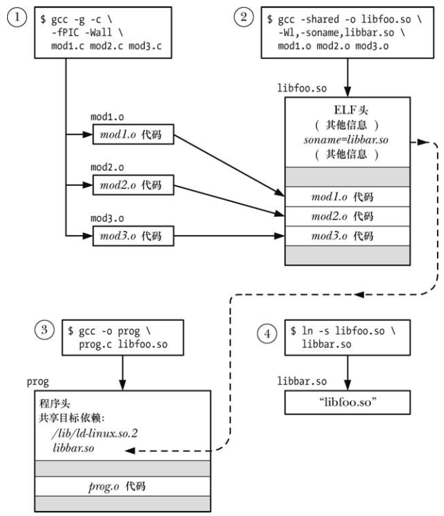

# 目标库

编译程序的一种简单方式是简单地将每一个源文件编译成目标文件，然后将这些目标链接在一起组成可执行程序：

```
gcc -g prog.c mod1.c mod2.c mod3.c
gcc -g prog_nolib prog.o mod1.o mod2.o mod3.o
```

链接实际上是用链接器 `ld` 来完成的，使用 `gcc` 命令链接一个程序时，编译器会再幕后调用 `ld`。

为了解决共享的问题，可以将一组目标文件组织成一个对象库，对象库分为两种：

- 静态库
- 共享库，比静态库更具优势

# 静态库

静态库也称为归档文件，有点：

- 可以将一组经常被调用到的目标文件组织成单个库文件，这样避免构建多个程序时反复编译原来代码的问题
- 链接命令变得更加简单，链接时只需要指定静态库的名称即可，不需要列出一个个目标文件

## 创建和维护静态库

使用 `ar` 命令能够创建和维护静态库，静态库的名称一般为 `libname.a`：

```
ar options archive object-filr...
```

- `options` 参数由一系列的字母构成，其中一个是操作码，其他是可能影响操作的执行修饰符：
  - `r` ： 替换，将一个目标文件插入到归档文件中并取代同名的目标文件
  -  `t` ：目录表，显示归档中的目录表，默认情况下只会列出归档文件中目标文件的名称，添加 `v` 修饰之后可以看到记录在归档文件中的各个目标文件的其他特性
  - `d` ： 从归档文件中删除一个模块

### 使用静态库

程序和静态库链接起来存在的两种方式：

- 在连接命令中指定静态库的名称

```
gcc -g -c prog.c
gcc -g -o prog prog.o libdemo.a
```

- 或者将静态库放在链接器搜索的其中一个标准目录中 ，例如`/usr/lib`，然后使用 `-l` 选项指定库名，库名需要去除 `lib`  前缀和 `.a` 后缀：

```
gcc -g -o prog prog.o -ldemo
```

- 如果库不在链接器的搜索目录中，则需要使用 `-L` 指定额外的目录：

```
gcc -g -o prog prog.o -Llibdir -ldemo
```

# 共享库概述

多个程序使用同一个静态库时，每个程序都有自己的目标模块的副本，这种代码冗余存在的缺点：

- 存储同一个目标模块的多个副本会浪费磁盘空间，并且所浪费的空间是比较大的
- 如果使用了同一模块的程序在同一时刻执行，每个程序都有自己独立的虚拟地址空间，其中保存了一份目标代码副本，这将会提供系统中虚拟内存的整体使用量
- 如果需要修改一个静态库的一个目标模块，那么所有使用这个模块的可执行程序都必须重新进行链接合并这个变更

共享库就是为了克服静态库的诸多缺点，它还具有的优势有：

- 由于整个程序的大小变得更小了，一些情况下，程序可以完全被加载到内存中，从而能够更快的启动程序，这一点只有在大型共享库正被其他程序使用时才成立，第一个加载共享库的程序实际上会在启动时花费更长的时间，因为必须要先找到共享库并将其加载到内存中
- 目标模块修改是 ，不需要重新编译程序就可以看到变更，甚至当运行着的程序正在使用共享库的现有版本时也能够进行这样的变更

共享库的额外开销：

- 创建共享库和构建使用共享库的程序比静态库更复杂
- 共享库在编译时需要使用位置独立代码，这在大多数架构上会带来性能开销，因为它需要使用一个额外的寄存器
- 在运行时必须要执行符号重定位，符号重定位期间，需要对共享库中的每个符号(变量或函数)的引用修改成符合在虚拟内存中的实际运行时位置，这个重定位的过程需要花费一定的时间

虽然共享库的代码是多个进程共享的，但是其中的变量不是，每个使用库的进程会拥有自己的在库中定义的全局和静态变量的副本。

# 创建和使用共享库

## 创建一个共享库

```
gcc -g -c -fPIC -Wall mod1.c mod2.c mod3.c
gcc -g -shared libfoo.so mod1.o mod2.o mod3.o
```

- 贡献库的命名方式一般为 `libname.so`
- 可以向之前构建的共享库中添加单个目标模块，也可以从中删除单个目标模块
- 也可以将编译共享库的命令放在一行：

```
gcc -g -fPIC -Wall mod1.c mod2.c mod3.c -shared -o libfoo.so
```

## 位置独立的代码

`-fPIC`  选项指定编译器应该生成位置无关代码，这会改变编译器生成执行文件特定操作的代码方式，包括访问全局、静态和外部变量，访问字符串常量，以及获取函数的地址，这些改变使得代码可以在运行时放在任意虚拟地址处，这一点对于共享库来说是必须的，因为链接的时候是无法知道共享库代码位于内存何处。

在 linux/x86-32 上，可以使用不加 `-fPIC` 选项编译的模块来创建共享库，为了确定一个既有目标文件在编译时是否使用了 `-fPIC` 选项，可以使用检查目标文件符号表中是否存在 `_GLOBAL_OFFSET_TABLE`：

```
nm mod1.o | grep _GLOBAL_OFFSET_TABLE
readelf -s  mod1.o | grep _GLOBAL_OFFSET_TABLE
```

下面的命令中如果产生了输出，则说明指定的共享库中至少存在一个目标模块在编译时没有指定 `-fPIC`：

```
objdump --all-headers libfoo.so | grep TEXTREL
objdump --all-headers libfoo.so | grep TEXTREL
```

`TEXTREL` 表示存在一个目标模块，其文本段中包含需要运行时重定位的引用。

## 使用一个共享库

为了使用共享库需要做两件事情，而使用静态库则无需完成这两件事情：

- 可执行文件中不包含它所需要的目标文件的副本，因此需要通过某种机制找到运行时所需要的共享库：链接阶段将共享库名称嵌入可执行文件中，一个程序所依赖的所有共享库列表称为程序的动态依赖表
- 在程序运行时需要某种机制解析嵌入的库名，即找出与在可执行文件中指定的名称对应的共享库文件，如果库不再内存中的话就将库加载进内存

运行时解析内嵌库名的工作由动态链接器(也称为动态链接加载器或运行时加载器)来完成，动态链接器本身也是一个共享库，其名称为 `lib/ld-linux.so.2`，所有使用共享库的 ELF 可执行文件都会用到这个共享库。

 `lib/ld-linux.so.2` 通常是指向动态链接器可执行文件的符号链接，这个文件的名称为 `ld-version.so`。

动态链接器会检查程序所需的共享库清单并使用一组预先定义好的规则来在文件系统上找出相关的库文件。其中一些规则指定了一组存放共享库的标准目录，如 `/lib`，`/usr/lib`。

### LD_LIBRARY_PATH 环境变量

通知动态链接器一个共享库位于一个非标准目录中的一种方法是将该目录添加到 `LD_LIBRARY_PATH `  环境变量中以分号分隔的目录列表中，如果定义了 `LD_LIBRARY_PATH `，那么动态链接器在查找标准库目录前会先查找该环境变量列出的目录中的共享库。

```
LD_LIBRARY_PATH=. ./prog # 告知动态链接器在当前工作目录中搜索共享库
```

### 静态链接和动态链接的比较

术语链接通常指的是使用链接器 `ld` 将一个或多个编译过的目标文件合成一个可执行程序，也称为静态链接。

在运行时使用共享库的可执行程序需要经历额外的动态链接阶段。

## 共享库 soname

嵌入到可执行程序以及动态链接器在运行时搜索的名称除了使用真实名称，还经常使用别名来创建共享库，这种别名称为 `soname`，ELF 中的  `DT_SONAME`  标签。

如果共享库拥有一个 `soname`，那么在静态链接阶段会将 `soname` 嵌入到可执行文件中，而不会使用真实名称，同时后面的动态链接器在运行时也会使用这个 `soname` 来搜索库，引入 `soname` 的目的是为了提供一个间接层，使得可执行程序能够在运行时使用与链接时使用不同的但兼容的共享库。

```
 gcc -g -c -fPIC -Wall mod1.c mod2.c mod3.c
 gcc -g -shared -W1,-soname,libbar.so -o libfoo.so mod1.o mod2.o mod3.o
```

- `-W1,-soname,libbar.so` 等选项都是传给链接器的指令，以将共享库 `libfoo.so` 的 `soname` 设置为 `libbar.so`

使用一下命令中的任意一个，可以确定既有共享库的 `soname`：

```
objdump -p libz.so | grep SONAME
  SONAME               libz.so.1
  
readelf -d libz.so | grep SONAME
0x000000000000000e (SONAME)             Library soname: [libz.so.1]
```

使用 `soname`  创建程序：

```
gcc -g -Wall -o prog prog.c libfoo.so
```

链接器检查到库 `libfoo.so` 包含了 `soname` ： `libbar.so`，就将这个 `soname` 嵌入到可执行文件中。

使用共享库时必须要创建一个符号链接，将 `soname` 指向库的真实名称，并且必须要将这个符号链接放在动态链接器搜索的其中一个目录中。




