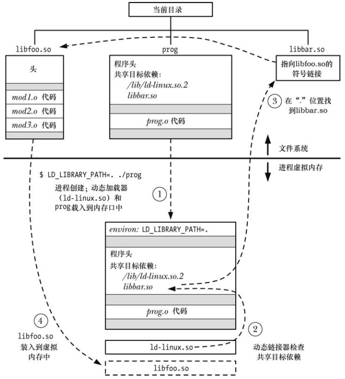
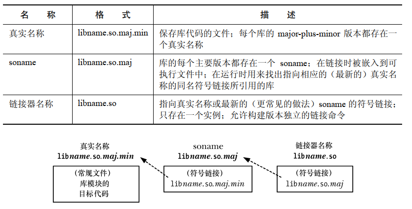
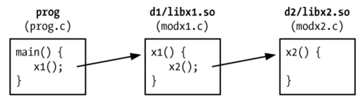
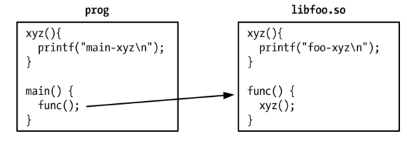

# 目标库

编译程序的一种简单方式是简单地将每一个源文件编译成目标文件，然后将这些目标链接在一起组成可执行程序：

```
gcc -g prog.c mod1.c mod2.c mod3.c
gcc -g prog_nolib prog.o mod1.o mod2.o mod3.o
```

链接实际上是用链接器 `ld` 来完成的，使用 `gcc` 命令链接一个程序时，编译器会再幕后调用 `ld`。

为了解决共享的问题，可以将一组目标文件组织成一个对象库，对象库分为两种：

- 静态库
- 共享库，比静态库更具优势

# 静态库

静态库也称为归档文件，有点：

- 可以将一组经常被调用到的目标文件组织成单个库文件，这样避免构建多个程序时反复编译原来代码的问题
- 链接命令变得更加简单，链接时只需要指定静态库的名称即可，不需要列出一个个目标文件

## 创建和维护静态库

使用 `ar` 命令能够创建和维护静态库，静态库的名称一般为 `libname.a`：

```
ar options archive object-filr...
```

- `options` 参数由一系列的字母构成，其中一个是操作码，其他是可能影响操作的执行修饰符：
  - `r` ： 替换，将一个目标文件插入到归档文件中并取代同名的目标文件
  -  `t` ：目录表，显示归档中的目录表，默认情况下只会列出归档文件中目标文件的名称，添加 `v` 修饰之后可以看到记录在归档文件中的各个目标文件的其他特性
  - `d` ： 从归档文件中删除一个模块

### 使用静态库

程序和静态库链接起来存在的两种方式：

- 在连接命令中指定静态库的名称

```
gcc -g -c prog.c
gcc -g -o prog prog.o libdemo.a
```

- 或者将静态库放在链接器搜索的其中一个标准目录中 ，例如`/usr/lib`，然后使用 `-l` 选项指定库名，库名需要去除 `lib`  前缀和 `.a` 后缀：

```
gcc -g -o prog prog.o -ldemo
```

- 如果库不在链接器的搜索目录中，则需要使用 `-L` 指定额外的目录：

```
gcc -g -o prog prog.o -Llibdir -ldemo
```

# 共享库概述

多个程序使用同一个静态库时，每个程序都有自己的目标模块的副本，这种代码冗余存在的缺点：

- 存储同一个目标模块的多个副本会浪费磁盘空间，并且所浪费的空间是比较大的
- 如果使用了同一模块的程序在同一时刻执行，每个程序都有自己独立的虚拟地址空间，其中保存了一份目标代码副本，这将会提供系统中虚拟内存的整体使用量
- 如果需要修改一个静态库的一个目标模块，那么所有使用这个模块的可执行程序都必须重新进行链接合并这个变更

共享库就是为了克服静态库的诸多缺点，它还具有的优势有：

- 由于整个程序的大小变得更小了，一些情况下，程序可以完全被加载到内存中，从而能够更快的启动程序，这一点只有在大型共享库正被其他程序使用时才成立，第一个加载共享库的程序实际上会在启动时花费更长的时间，因为必须要先找到共享库并将其加载到内存中
- 目标模块修改是 ，不需要重新编译程序就可以看到变更，甚至当运行着的程序正在使用共享库的现有版本时也能够进行这样的变更

共享库的额外开销：

- 创建共享库和构建使用共享库的程序比静态库更复杂
- 共享库在编译时需要使用位置独立代码，这在大多数架构上会带来性能开销，因为它需要使用一个额外的寄存器
- 在运行时必须要执行符号重定位，符号重定位期间，需要对共享库中的每个符号(变量或函数)的引用修改成符合在虚拟内存中的实际运行时位置，这个重定位的过程需要花费一定的时间

虽然共享库的代码是多个进程共享的，但是其中的变量不是，每个使用库的进程会拥有自己的在库中定义的全局和静态变量的副本。

# 创建和使用共享库

## 创建一个共享库

```
gcc -g -c -fPIC -Wall mod1.c mod2.c mod3.c
gcc -g -shared libfoo.so mod1.o mod2.o mod3.o
```

- 贡献库的命名方式一般为 `libname.so`
- 可以向之前构建的共享库中添加单个目标模块，也可以从中删除单个目标模块
- 也可以将编译共享库的命令放在一行：

```
gcc -g -fPIC -Wall mod1.c mod2.c mod3.c -shared -o libfoo.so
```

## 位置独立的代码

`-fPIC`  选项指定编译器应该生成位置无关代码，这会改变编译器生成执行文件特定操作的代码方式，包括访问全局、静态和外部变量，访问字符串常量，以及获取函数的地址，这些改变使得代码可以在运行时放在任意虚拟地址处，这一点对于共享库来说是必须的，因为链接的时候是无法知道共享库代码位于内存何处。

在 linux/x86-32 上，可以使用不加 `-fPIC` 选项编译的模块来创建共享库，为了确定一个既有目标文件在编译时是否使用了 `-fPIC` 选项，可以使用检查目标文件符号表中是否存在 `_GLOBAL_OFFSET_TABLE`：

```
nm mod1.o | grep _GLOBAL_OFFSET_TABLE
readelf -s  mod1.o | grep _GLOBAL_OFFSET_TABLE
```

下面的命令中如果产生了输出，则说明指定的共享库中至少存在一个目标模块在编译时没有指定 `-fPIC`：

```
objdump --all-headers libfoo.so | grep TEXTREL
objdump --all-headers libfoo.so | grep TEXTREL
```

`TEXTREL` 表示存在一个目标模块，其文本段中包含需要运行时重定位的引用。

## 使用一个共享库

为了使用共享库需要做两件事情，而使用静态库则无需完成这两件事情：

- 可执行文件中不包含它所需要的目标文件的副本，因此需要通过某种机制找到运行时所需要的共享库：链接阶段将共享库名称嵌入可执行文件中，一个程序所依赖的所有共享库列表称为程序的动态依赖表
- 在程序运行时需要某种机制解析嵌入的库名，即找出与在可执行文件中指定的名称对应的共享库文件，如果库不再内存中的话就将库加载进内存

运行时解析内嵌库名的工作由动态链接器(也称为动态链接加载器或运行时加载器)来完成，动态链接器本身也是一个共享库，其名称为 `lib/ld-linux.so.2`，所有使用共享库的 ELF 可执行文件都会用到这个共享库。

 `lib/ld-linux.so.2` 通常是指向动态链接器可执行文件的符号链接，这个文件的名称为 `ld-version.so`。

动态链接器会检查程序所需的共享库清单并使用一组预先定义好的规则来在文件系统上找出相关的库文件。其中一些规则指定了一组存放共享库的标准目录，如 `/lib`，`/usr/lib`。

### LD_LIBRARY_PATH 环境变量

通知动态链接器一个共享库位于一个非标准目录中的一种方法是将该目录添加到 `LD_LIBRARY_PATH `  环境变量中以分号分隔的目录列表中，如果定义了 `LD_LIBRARY_PATH `，那么动态链接器在查找标准库目录前会先查找该环境变量列出的目录中的共享库。

```
LD_LIBRARY_PATH=. ./prog # 告知动态链接器在当前工作目录中搜索共享库
```

### 静态链接和动态链接的比较

术语链接通常指的是使用链接器 `ld` 将一个或多个编译过的目标文件合成一个可执行程序，也称为静态链接。

在运行时使用共享库的可执行程序需要经历额外的动态链接阶段。

## 共享库 soname

嵌入到可执行程序以及动态链接器在运行时搜索的名称除了使用真实名称，还经常使用别名来创建共享库，这种别名称为 `soname`，ELF 中的  `DT_SONAME`  标签。

如果共享库拥有一个 `soname`，那么在静态链接阶段会将 `soname` 嵌入到可执行文件中，而不会使用真实名称，同时后面的动态链接器在运行时也会使用这个 `soname` 来搜索库，引入 `soname` 的目的是为了提供一个间接层，使得可执行程序能够在运行时使用与链接时使用不同的但兼容的共享库。

```
 gcc -g -c -fPIC -Wall mod1.c mod2.c mod3.c
 gcc -g -shared -Wl,-soname,libbar.so -o libfoo.so mod1.o mod2.o mod3.o
```

- `-Wl,-soname,libbar.so` 等选项都是传给链接器的指令，以将共享库 `libfoo.so` 的 `soname` 设置为 `libbar.so`

使用一下命令中的任意一个，可以确定既有共享库的 `soname`：

```
objdump -p libz.so | grep SONAME
  SONAME               libz.so.1
  
readelf -d libz.so | grep SONAME
0x000000000000000e (SONAME)             Library soname: [libz.so.1]
```

使用 `soname`  创建程序：

```
gcc -g -Wall -o prog prog.c libfoo.so
```

链接器检查到库 `libfoo.so` 包含了 `soname` ： `libbar.so`，就将这个 `soname` 嵌入到可执行文件中。

使用共享库时必须要创建一个符号链接，将 `soname` 指向库的真实名称，并且必须要将这个符号链接放在动态链接器搜索的其中一个目录中。


程序载入内存以设备执行时发生的事情：



要找出一个进程当前使用的共享库则可以列出相应的 Linux 特有的 `/proc/PID/maps` 文件中的内容。  

# 使用共享库的有用工具

## ldd

`ldd`  ： 列出动态依赖，显示一个程序运行时所需要的共享库。

`ldd`  会解析出每个库引用，使用的搜索方式与动态链接器一样，并以下面的形式显示结果：

```
library-name => resolves-to-path
```

对于多数的 ELF 文件，`ldd` 至少会列出与 `ld-linux.so.2`、动态链接器以及标准 C 库 `lib.so.6` 相关的条目。

## objdump 和 readelf

`objdump`  ：用来从可执行文件、编译过的目标、以及共享库中获取各类信息，包括反汇编的二进制机器码，还可以用来显示这些文件各个 ELF 节的头部信息，当这样使用时，它就类似于 `readelf`，`readelf` 能显示类似的信息，但是格式不同。

## nm 

`nm` 命令会列出目标库或可执行文件中定义的一组符号，常用来寻找哪些库定义了一个符号。

# 共享库版本和命名规则

命名形式：

```
libname.so major-id.minor-id
```

- `major-id` ：主要版本标识符，区分两个不兼容的版本
- `minor-id` ：次要版本可以是任意字符串，但是通常的形式是两个由点分隔的数字，第一个数字表示次要版本，第二个数字表示该次要版本的补丁号或者修订号

 ```
 libdemo.so.1.0.1
 libdemo.so.1.0.2
 libdemo.so.2.0.0
 ```

共享库的 `soname` 包括相应的主版本标识符，但是不包含次要版本标识符，因此  `soname` 的命名形式为：

```
libname.so.major-id
```

通常，会将 `soname`  创建为包含真实名称的目录的一个相对符号链接：

```
libdemo.so.1      ->  libdemo.so.1.0.2
libdemo.so.2      ->  libdemo.so.2.0.0
```

共享库的一个主要版本可能有多个不同的次要版本，通常每个库的主要版本的  `soname`  会指向主要版本中最新的次要版本，由于静态链接阶段会将 `soname`  的副本(独立于次要版本)嵌入到可执行文件中，并且 `soname` 符号链接后面可能会被修改为指向更新的次要版本，从而确保在执行期间能够加载库的最新的次要版本。

同一个库的不同主要版本也能够同时存在，被需要它们的程序分别访问。

除了真实名称和 `soname` 之外，通常还会为每个共享库定义第三个名称：链接器名称，将可执行文件与共享库链接起来时会使用这个名称，链接器名称是一个只包含库名称不包含主要版本和次要版本标识符的符号链接，其形式为 `libname.so`，有了链接器名称之后就可以构建能够自动使用共享库最新版本的链接命令。

链接器名称一般与它所引用的文件位于同一个目录中，它既可以链接到真实名称，也可以链接到库的最新主要版本的 `soname`。通常最好使用指向 `soname`  的链接，从而对 `soname` 的修改会自动反应到链接器名称。

如果需要使用一个旧版本的共享库，就不能使用链接器名称，要使用真实名称或者 `soname` 来指示出需要的版本。



## 使用标准规范创建一个共享库

- 创建目标文件

```
gcc -g -c -fPIC -Wall mod1.c mod2.c mod3.c
```

- 创建共享库，指定真实名称和 `soname`

```
gcc -g -shared -Wl,-soname,libdemo.so.1 -o libdemo.so.1.0.1 mod1.o mod2.o mod3.o
```

- 为 `soname` 和链接器名称创建恰当的符号链接

```
ln -s libdemo.so.1.0.1 libdemo.so.1
ln -s libdemo.so.1 libdemo.so
```

-  使用链接器名称构建可执行文件

```
gcc -g -Wall -o prog prog.c -L. -ldemo
LD_LIBRARY_PATH=. ./prog
```

# 安装共享库

共享库及其关联的符号链接一般会被安装到一个标准目录中，标准目录包括：

- `/usr/lib` ：是大多数标准库安装的目录
- `/lib` ：应该将系统启动时用到的库安装到这个目录，因为系统启动时可能还没有挂载 `/usr/lib`
- `/usr/local/lib` ：应该将非标准或者实验性质的库安装到这个目录
- `/etc/ld.so.conf` 中列出的目录

安装完成后一般需要创建 `soname`  和链接器名称的符号链接：

```
mv libdemo.so.1.0.1 /usr/lib
cd /usr/lib
ln -s libdemo.so.1.0.1 libdemo.so.1 # 创建 soname 
ln -s libdemo.so.1 libdemo.so	# 创建链接器名称
```

## ldconfig

 `ldconfig` 解决了共享库的两个潜在问题：

- 共享库可以位于各种目录中，如果动态链接器需要通过搜索这些目录来找一个库并加载这个库，整个过程将非常慢
- 当安装了新版本的库或者删除了旧版本的库，那么  `soname` 符号链接就不是最新的

 `ldconfig` 可以通过执行两个任务来解决这些问题：

- 它搜索一组标准的目录并创建或更新一个缓存文件 `/etc/ld.so.cache` 使之包含在所有这些目录中的主要版本(每个库的主要版本的最新的次要版本)列表，动态链接器在运行时解析库名称时会轮流使用这个缓存文件：
  - 为了构建这个缓存，`ldconfig` 会搜索在 `/etc/ld.so.conf` 中指定的目录，然后搜索 `/lib` 和 `/usr/lib`
  - ``/etc/ld.so.conf` 文件由一个目录路径名（应该是绝对路径名）列表构成，其中路径名之间用换行、空格、制表符、逗号或冒号分隔
  - 在一些发行版中， `/usr/local/lib` 目录也位于这个列表中
  - `ldconfig -p` 会显示 `/etc/ls.so.cache` 的当前内容
- 它检查每个库的各个主要版本的最新次要版本以找出嵌入的 `soname`，然后在同一目录中为每个 `soname` 创建（或更新）相对符号链接：
  - 为了能够正确执行这些动作，`ldconfig` 要求库的名称要根据前面介绍的规范来命名：库的真实名称包含主要和次要标识符，它们随着库的版本的更新而恰当的增长
  - 可以使用命令行选项来指定它执行其中一个动作： `-N` 选项会防止缓存的重建，` -X ` 选项会阻止 `soname` 符号链接的创建。 此外， `-v `(verbose)
    选项会使得 `ldconfig` 输出描述其所执行的动作的信息

每当安装了一个新的库，更新或者删除一个既有库，以及 `/etc/ld.so.conf` 中的目录列表被修改后，都运行相应的 `ldconfig`。

安装一个库的两个不同主要版本：

```
mv libdemo.so.1.0.1 libdemo.so.2.0.0 /usr/lib
```

为链接器名称创建符号链接：

```
ln -s libdemo.so.2 libdemo.so
```

如果更新库的一个次要版本，由于链接器名称指向了最新的 `soname`，因此 `ldconfig` 还能取得保持链接器名称的最新效果：

```
mv libdemo.so.2.0.1 /usr/lib
```

如果使用的是私有库，即没有安装在上述的标准目录中的库，那么可以使用 `-n` 选项让 `ldconfig` 创建 `soname` ，这个选项指定了只处理在命令行中列出的目录的库，无需更新缓存文件。

使用 `ldconfig` 来处理当前工作目录中的库：

```
gcc -g -c -fPIC -Wall mod1.c mod2.c mod3.c
gcc -g -c -shared -Wl,-soname,libdemo.so.1 -o libdemo.so.1.0.1 mod1.o mod2.o mod3.o
/sbin/ldconfig -nv .
```

# 兼容与不兼容库比较

满足下列条件时表示修改过的库与既有版本兼容：

- 库中所有公共方法和变量的语义保持不变
- 没有删除库的公共 API 中的函数和变量，但向公共 API 中添加新函数和变量
- 每个函数分配的结构以及没和函数的返回结构保持不变

如果这些条件都满足，更新库时只需要调增既有库的次要版本号，否则就要创建新的主版本。

# 升级共享库

共享库的优点之一就是当一个运行着的程序正在使用共享库的一个既有版本时，也能够安装新的主要版本或者次要版本的库，需要做的是：

- 创建新的库版本，将其安装到恰当的目录
- 根据需要更新 `soname` 和链接器名称符号链接，或者使用 `ldconfig` 完成这部分工作

更新次要版本：

```
gcc -g -c -fPIC -Wall mod1.c mod2.c mod3.c
gcc -g -c -shared -Wl,-soname,libdemo.so.1 -o libdemo.so.1.0.2 mod1.o mod2.o mod3.o
mv libdemo.so.1.0.2 /usr/lib
ldconfig -v | grep libdemo
```

更新主要版本：

```
gcc -g -c -fPIC -Wall mod1.c mod2.c mod3.c
gcc -g -c -shared -Wl,-soname,libdemo.so.2 -o libdemo.so.2.0.0 mod1.o mod2.o mod3.o
mv libdemo.so.2.0.0 /usr/lib
ldconfig -v | grep libdemo
cd /usr/lib
ln -sf libdemo.so.2 libdemo.so
```

# 在目标文件中指定库搜索目录

通知动态链接器共享库的位置的方式：

- `LD_LIBRARY_PATH` 环境变量中指定
- 将共享库安装到标准库目录：`/lib`，`/usr/lib`，`/etc/ls.so.conf` 中列出的其中一个目录

第三种方式：在静态编辑阶段可以在执行文件中插入一个在运行时搜索共享库的目录列表，这种方式对于库位于一个固定的但不属于动态链接器搜索标准位置时非常有用，在创建文件时需要增加 `-rpath` 链接器选项。

```
gcc -g -Wall,-rpath,/home/mtk/pdir -o prog prog.c libdemo.so
```

将字符串 `/home/mtk/pdir` 复制到可执行 文件 `prog` 的运行时库路径列表中，在程序运行时，动态链接器在解析共享库引用时还会搜索这个路径。

指定多个目录：

- 多次指定 `-rpath` 选项，所有这些列出的目录会被链接成一个放到可执行文件中的有序 `-rpath`  列表
- 在一个 `-rpath` 选项中可以指定多个由分号分隔开的目录列表，运行时，动态链接器会按照 `-rpath` 选项中指定的目录顺序来搜索目录

`-rpath` 的一个可替代方案就是使用 `LD_RUN_PARH` 环境变量，可以将由一个逗号分隔开的目录的字符串赋值给该变量，只有当构建可执行文件时没有指定 `-rpath` 选项才会使用 `LD_RUN_PATH`

## 在构建贡献库时使用 `-rpath` 链接器选项

假设有一个库 `lib1.so` 依赖于另一个共享库 `lib2.so` ，另外再假设这些库分别位于非标准目录 `d1` 和 `d2`中：



首先在 `pdir/d2` 目录中构建 `libx2.so`，这里省略了库的版本号和 `soanme`：

```
cd  /home/mtk/pdir/d2
gcc -g -c -fPIC -Wall modx2.c
gcc -g -shared -o libx2.so modx2.o
```

接着在 `pdir/d1` 目录中构建 `libx1.so`。由于 `libx1.so` 依赖于 `lib2.so`，并且 `libx2.so` 位于一个非标准目录中，因此在指定 `libx2.so` 的运行时位置时需要使用 `-rpath` 链接器选项。这个选项的取值与库的链接时位置可以不同：

```
cd /home/mtk/pdir/d1
gcc -g -c -Wall modx1.c
gcc -g -shared -o libx1.so modx1.o -Wl,-rpath,/home/mtk/pdir/d2 -L/home/mtk/pdir/d2 -lx2
```

 `pdir` 目录中构建主程序，由于主程序使用了  `libx1.so` 并且这个库位于一个非标准目录中，因此还需要使用 `-rpath` 链接器选项：

```
cd /home/mtk/pdir
gcc -g -Wall -o prog prog.c -Wl,-rpath,/home/mtk/pdir/d1 -L/home/mtk/pdir/d1 -lx1
```

在链接主程序是，无需指定 `libx2.so`，由于链接器能够分析 `libx1.so` 中的 `rpath` 列表，因此它能够找到 `libx2.so`，同时在静态链接阶段解析出所有的符号。

可以通过 `readelf --dynamic` 或者等价的 `readelf -d` 命令的输出来查看 `rpath` 列表。

## `ELF DT_RPATH` 和 `DT_RUNPATH` 条目

第一版 ELF 规范中，只有一种 `rpath` 列表能够被嵌入到可执行文件或共享库中，对应  ELF  文件中的 `DT_RPATH` 标签。后续的 ELF 舍弃了 `DT_RPATH` ，同时引入 `DT_RUNPATH` 来表示 `rpath` 列表，两者的差别在于动态链接器在运行时搜索共享库时它们相对于 `LD_LIBRARY_PATH` 环境变量的优先级，`DT_RPATH` 的优先级更高，`DT_RUNPATH` 的优先级更低。

默认情况下，链接器将 `rpath` 列表创建为 `DT_RPATH` 标签。为了让链接器将 `rpath` 列表创建为 `DT_RUNPATH` 条目必须使用 `--enable-new-dtags`。

## 在 `rpath` 中使用 `$ORIGIN`

应用程序中使用了自身的共享库，但同时不希望强制要求将这些库安装在其中一个标准目录中，可以在构建链接器的时候，增加 `$ORIGIN`，动态链接器将这个字符串解释成 "包含应用程序的目录"：

```
gcc -Wl,-rpath,'ORIGIN'/lib ...
```

# 在运行时找出共享库

在解析库依赖时，动态链接器首先会检查各个依赖字符串以确定它是否包含 `/`，如果找到了一个斜线，那么依赖字符串就会被解释成一个路径名，并且会使用该路径名加载库，否则动态链接器会使用下面的规则来搜索共享库：

- 如果可执行文件的 `DT_RPATH` 运行时库路径列表中包含目录并且不包含 `DT_RUNPATH` 列表，那么就搜索这些目录，按照链接程序时指定的目录顺序
- 如果定义了 `LD_LIBRARY_PATH` 环境变量，那么就会轮流搜索该变量值中以冒号分隔的各个目录，如果可执行文件是一个 set-user-ID 或者 set-group-ID 程序，那么就会忽略 `LD_LIBRARY_PATH` 变量。这项安全措施就是为了防止用户欺骗动态链接器让其加载一个与可执行文件所属的库的名称一样的私有库
- 如果可执行文件 `DT_RUNPATH` 运行时库路径列表中包含目录，那么就搜索这些目录，按照链接程序时指定的目录顺序
- 检查 `/etc/ld.so.cache` 文件以确认它是否包含了与库相关的条目
- 搜索 `/lib` 和 `/usr/lib` 目录

# 运行时符号解析

假设现在有一个主程序和一个共享库，它们两个都定义了一个全局函数 `xyz()`，并且共享库中的另一个函数调用了 `xyz()`：



```
gcc -g -c -fPIC -Wall -c foo.c
gcc -g -shared -o libfoo.so foo.o
gcc -g -o prog prog.c libfoo.so
LD_LIBRARY_PATH=.
./prog
```

- 主程序中的 `xyz()` 定义将覆盖共享库中的定义
- 如果一个全局符号在多个库中进行了定义，那么对该符号的引用会绑定在扫描库时找到的第一个定义，扫描顺序是按照这些库在静态链接命令行中列出时从左到右的顺序

如果想使用共享库中的  `xyz()` 调用，需要指定 `-Bsymbolic`  链接器选项：

```
gcc -g -c -fPIC -Wall -c foo.c
gcc -g -shared -Wl,-Bsymbolic -o libfoo.so foo.o
gcc -g -o prog prog.c libfoo.so
LD_LIBRARY_PATH=.
./prog
```

 `-Bsymbolic`  链接器选项指定了共享库中对全局符号的应用应该优先绑定到库中的相应定义(如果存在)。

# 使用静态库取代共享库

默认情况下，当链接器能够选择名称一样的共享库和静态库时，会优先使用共享库：

```
-Lsomedir -ldemo
```

并且 `libdemo.so` 和 `libdemo.a` 都存在的话，会优先使用 `libdemo.a`。

如果要强制使用静态库：

- 在 gcc 命令中指定静态库的路径名，包括  `.a`  扩展
- 在 gcc 命令行中指定 `-static` 选项
- 使用 `-Wl,-Bstatic` 和 `-Wl,Bdynamic` gcc 选项来显示指定链接到静态库还是动态库


