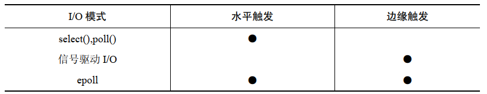
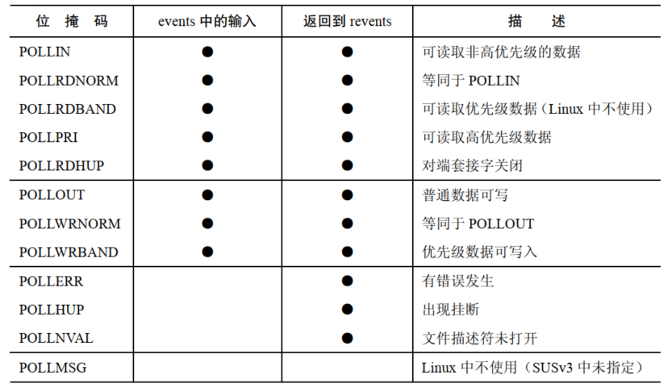
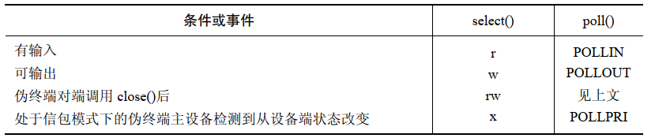
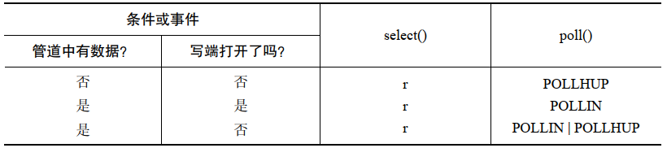
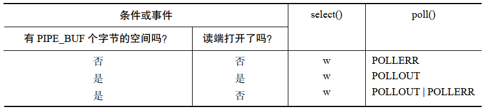
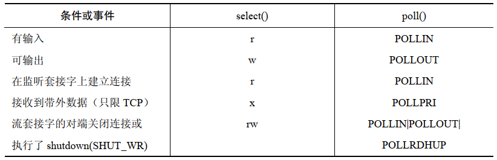
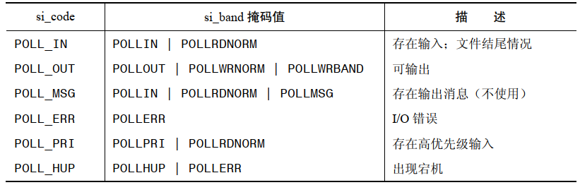

# 整体概览

对于一般应用，传统的阻塞式 IO 模型已经足够了，但这不代表所有的应用都能得到满足。特别地，有些应用需要处理以下某项任务，或者两者都要兼顾：

- 如果可能的话，以非阻塞的方式检查文件描述符上是否可进行 IO 操作
- 同时检查多个文件描述符，看它们中的任何一个是否可以执行 IO 操作

解决方案有两种：非阻塞式 IO 和多进程或多线程技术，它们的局限：

- 非阻塞式 IO 可以周期性的检查某个文件描述符上是否可执行 IO 操作，但是紧凑的循环中做轮询就是在浪费 CPU
- 多进程的劣势是比较大开销，创建及维护进程对系统来说都有开销，而一般来说子进程需要使用某种 IPC 机制来通知父进程有关 IO 操作的状态
- 使用多线程可以占用较少资源，但是线程之间仍然需要通信，这将使得编程工作变得复杂

由于非阻塞 IO 和多线程多进程技术的局限，下列的方案更加可取：

- IO 多路复用允许进程同时检查多个文件描述符以找出它们的任何一个是否可执行 IO 操作，系统调用 `select()` 和 `poll()` 用来执行 IO 多路复用
- 信号驱动 IO 是指当有输入或者数据可以写到指定的文件描述符上时，内核向请求数据的进程发送一个信号，当同时检查大量的文件描述符时，信号驱动 IO 相比于 `select()` 和 `poll()` 有显著的性能提升
- `epoll()` 是 Linux 专有特性，当同时检查大量文件描述符时，`epoll()` 能够提供更好的性能

IO 多路复用，信号驱动 IO 以及 epoll 都是为了实现：同时检查多个文件描述符，看他们是否准备好了执行 IO 操作，也可以理解为，看 IO 系统调用是否可以非阻塞地执行。文件描述符就绪状态的转化是通过一些 IO 事件来触发的，比如：输入数据到达，套接字建立完成，满载的套接字发送缓冲区在 TCP 队列中的数据传输到对端之后有了剩余空间。

## 选择哪种技术

`select()` 和 `poll()` 的优点是可移植性，主要缺点是同时检查大量的(数百或者数千)文件描述符时性能延展性不佳。

`epoll()` 优势在于它能让应用程序高效地检查大量的文件描述符，缺点是它是 Linux 专有的系统 API。

信号驱动 IO 也能如 `epoll()` 一样让应用程序高效地检查大量的文件描述符，但是 `epoll()` 有一些信号驱动 IO 所没有的优点：

- 避免了处理信号的复杂性
- 可以指定想要检查的事件类型(如读就绪还是写就绪)
- 可以选择水平触发还是边缘触发的方式来通知进程

## 水平触发和边缘触发

两种文件描述符准备就绪的通知模式：

- 水平触发通知：如果文件描述符上可以非阻塞地执行 IO 系统调用，此时认为它已经就绪
- 边缘触发通知：如果文件描述符自上次状态检查以来有了新的 IO 活动，此时需要触发通知



当采用水平触发通知时，可以在任意时刻检查文件描述符的就绪状态，这表示当确定了文件描述符处于就绪，就可以对其执行一些 IO 操作，然后重复检查文件描述符，看是否处于就绪状态。

当采用边缘触发时，只有当 IO 事件发生时才会收到通知，在另一个 IO 事件到来之前不会收到任何新的通知。另外，当文件描述符收到 IO 事件通知时，通常并不知道要处理多少 IO，因此采用边缘触发通知的程序，需要按照如下规则来设计：

- 当接收到一个 IO 事件通知后，程序在某个时刻应该在相应的文件描述符上尽可能多地执行 IO，如果程序没有这么做，那么可能就会失去执行 IO 的机会。因为直到产生另一个 IO 事件为止，在此之前程序不会再接收到通知，因此也就不知道此时应该执行 IO 操作，这将导致数据丢失或者程序中出现阻塞
- 如果程序采用循环来对文件描述符执行尽可能多的 IO，而文件描述符又被设置为可阻塞的，那么最终当没有更多的 IO 可执行时，IO 系统调用就会阻塞，基于这个原因，每个被检查的文件描述符通常都应该设置为非阻塞模式，在得到 IO 事件通知后重复执行 IO 操作，直到相应的系统调用(如 `read()`  或者 `write()` ) 以错误码 `EAGAIN` 或者 `EWOULDBLOCK`  的形式失败

## 在备选的 IO 模型中采用非阻塞 IO

非阻塞 IO(`O_NONBLOCK` 标志)的好处：

- 非阻塞 IO 通常和提供有边缘触发通知机制的 IO 模型一起使用
- 如果多个进程或者多个线程在同一个打开的文件描述符上执行 IO 操作，那么从某个特定进程的角度来看，文件描述符的就绪状态可能会在通知就绪和执行后续 IO 调用之间发生改变。结果就是一个阻塞式的 IO 调用将阻塞，从而防止进程检查其他的文件描述符
- 尽管水平触发模式的 API 比如 `select()` 或 `poll()` 通知流式套接字的文件描述符已经写就绪了，如果在单个 `write()` 或者 `send()` 调用中写入足够大块的数据，那么该调用将阻塞
- 在非常罕见的情况下，水平触发型的 API 比如 `select()` 和 `poll()`，会返回虚假的就绪通知，它们会错误地通知文件描述符已经就绪了，这可能是由内核 bug 造成的，或者非普通情况下的设计方案所期望的行为

# IO 多路复用

IO 多路复用允许同时检查多个文件描述符，可以在普通文件、终端、伪终端、管道、FIFO、套接字以及一些其他类型的字符型设备上使用 `select()` 和 `poll()` 来检查文件描述符。

这两个系统调用都允许进程要么一直等待文件描述符称为就绪状态，要么在调用中指定一个超时时间。

##  `select()` 系统调用

```
#include <sys/time.h>
#include <sys/types.h>
#include <unistd.h>

int select(int nfds, fd_set *readfds, fd_set *writefds,fd_set *exceptfds, struct timeval *timeout);
```

- `select()` 会一直阻塞，直到一个或者多个文件描述符集合成为就绪态

### 文件描述符集合

`readfds`，`writefds`，`exceptfds` 都是指向文件描述符集合的指针，所指向的数据类型是 `fd_set`，这些参数按照如下方式使用：

- `readfds`：用来检测输入是否就绪的文件描述符集合
- `writefds`：用来检测输出是否就绪的文件描述符集合
- `exceptfds`：用来检测异常情况是否发生的文件描述符集合

在 Linux 上，一个异常情况只会在下面两种情况下发生：

- 连接到处于信包模式下的伪终端主设备上的从设备状态发生了改变
- 流式套接字上接收到了带外数据

`fd_set` 以位掩码的形式来实现，通过四个宏来实现：

```
#include <sys/select.h>

void FD_ZERO(fd_set *fdset);
void FD_SET(int fd, fd_set *fdset);
void FD_CLR(int fd, fd_set *fdset);
int  FD_ISSET(int fd, fd_set *fdset);
```

- `FD_ZERO()`：将 `fdset` 指向的集合初始化为空
- `FD_SET()`：将 `fd` 添加到 `fdset` 所指向的集合中
- `FD_CLR()`：将 `fd` 从 `fdset` 所指向的集合中移除
- `FD_ISSET()`：如果文件描述符 `fd` 是 `fdset` 所指向的集合中的成员，返回 `true`

文件描述符集合有一个最大容量限制，有常量 `FD_SETSIZE` 来决定，在 Linux 上，该常量的值为 1024。

`readfds`，`writefds`，`exceptfds` 所指向的结构体都是保存结果值得地方，在调用 `select()` 之前，这些参数指向的结构体必须初始化(通过 `FD_ZERO()` 和 `FD_SET()` )以包含感兴趣的文件描述符集合。之后 `select()` 调用会修改这些结构体，当 `select()`  返回时，它们包含的就是已处于就绪的文件描述符集合了，如果要在循环中重复调用 `select()`，必须保证每次都要重新初始化它们，之后这些结构体可以通过 `FD_ISSET()` 来检查。如果对某一类的事件不感兴趣，那么相应的 `fd_set` 参数可以指定为 `NULL`。

`nfds` 必须设置为 3 个文件描述符集合中所包含的最大文件描述符号还要大1，该参数让 `select()` 变得更加有效率，因为此时就不用去检查大于这个值得文件描述符符号是否属于这些文件描述符集合。

### `timeout`  参数

`timeout` 指向结构 `timeval`：

``` 
struct timeval {
    long    tv_sec;         /* seconds */
    long    tv_usec;        /* microseconds */
};
```

如果 `timeval` 的两个域都是 0 的话，那么 `select()` 将不会阻塞，只是简单地轮询指定的文件描述符集合，看看其中是否有就绪的文件描述符并立刻返回，否则，`timeout` 将为 `select()` 指定一个等待时间的上限值。

SUSv 3要求最大允许的超时时间间隔至少为 31 天。Linux /x86-32 使用 32 位整数作为 `time_t` 的类型，因此上限值可达数年。

`timeout` 指定为 `NULL` 或者指向的结构体字段非零时，`select()` 将阻塞直到有下列事件发生：

- `readfds`，`writefds`，`exceptfds`  中指定的文件描述符中至少有一个称为就绪态
- 该调用被信号处理例程中断
- `timeout` 中指定的时间上限已超时

如果 `select()` 因为有一个或多个文件描述符成为就绪态而返回，且如果参数 `timeout` 非空，那么 `select()` 会更新 `timeout` 所指向的结构体以此来表示剩余的超时时间，但是，这种行为是与具体的实现有关，有的实现上不会修改这个结构体。

SUSv3 中规定由  `timeout` 所指向的结构体只有在 `select()` 调用成功返回后才有可能被修改，但是，在 Linux 上如果 `selece()` 被一个信号处理例程中断的话，因此 `select()` 会产生 `EINTR` 错误码，那么该结构体也会被修改以表示剩余的超时时间。

### `select()` 的返回值

`select()` 会返回如下几种情况下的一种：

- 返回 -1表示有错误发生，可能的错误码包括 `EBADF` 和 `EINTR` ：
  -  `EBADF` 表示 `readfds`，`writefds` 或者 `exceptfds` 中有一个文件描述符是非法的
  - `EINTR` 表示该调用被信号处理例程中断了
- 返回 0 表示在任何文件描述符成为就绪之前 `select()` 调用已经超时，在这种情况下，每个返回的文件描述符集合都将被清空
- 返回一个正整数表示有 1 个或多个文件描述符已达到就绪态，返回值表示处于就绪态的文件描述符的个数，在这种情况下，每个返回的文件描述符集合都需要检查(通过 `FD_ISSET()`)，此时找出发生的 IO 事件是什么，如果同一个文件描述符在  `readfds`，`writefds` ， `exceptfds`  中同时被指定，且对于多个 IO 事件都处于就绪状态的话，那么就会被统计多次，换句话说，`selec()` 返回所有在 3 个集合中被标记为就绪态的文件描述符总数。

## `poll()` 系统调用

```
#define _GNU_SOURCE
#include <signal.h>
#include <poll.h>

int ppoll(struct pollfd *fds, nfds_t nfds,const struct timespec *tmo_p, const sigset_t *sigmask);
```

-  `poll()` 需要提供一系列的描述符，并在每个文件描述符上标明感兴趣的事件，`fds` 列出了需要 `poll()`  来检查的文件描述符，该参数为 `pollfd` 结构体数组，`nfds` 指定了数组 `fds` 中元素的个数

```
struct pollfd {
    int   fd;         /* file descriptor */
    short events;     /* requested events */
    short revents;    /* returned events */
};
```

- `events` 和 `revents`  字段都是位掩码，调用者初始化 `events` 来指定需要为描述符 `fd` 做检查的事件，当 `poll()` 返回时，`revents` 被设定以此来表示该文件描述符上实际发生的事件



- 第一组位掩码 `POLLIN`， `POLLRDNORM`， `POLLRDBAND`， `POLLPRI`， `POLLRDHUP`  同输入事件相关
- 第二组位掩码 `POLLOUT`， `POLLWRNORM`， `POLLWRBAND` 同输出事件相关
- 第三组位掩码 `POLLERR`， `POLLHUP`， `POLLNVAL` 是设定在 `revents` 字段中用来返回有关文件描述符的附加信息
- 在 Linux 中，`poll()` 不会用到最后一个位掩码 `POLLMSG`

 如果对某个特定的文件描述符上的事件不感兴趣，可以将 `events` 设置为 0。给 `fd` 字段指定一个负值将导致对应的 `events`  字段被忽略，并且 `revents` 字段将总是返回 0，这两种方法都可以用来关闭单个文件描述符的检查，而不需要重新建立整个 `fds` 列表。

Linux 的实现：

- `POLLIN` 和 `POLLRDNORM` 是同义词
- `POLLOUT` 和 `POLLWRNORM` 是同义词
- `POLLRDBAND` 一般是不被使用的，也就是说在 `events` 字段中会被忽略
- 不会出现当 `POLLOUT`  和 `POLLWRNORM` 没有设定，而设定了 `POLLWRBAND` 的情况
- 必须定义 `_XOPEN_SOURCE` 测试宏，这样才能在头文件 `<poll.h>` 中得到常量 `POLLRDNORM`，`POLLRDBAND`，  `POLLWRNORM` 以及 `POLLWRBAND` 的定义
- `POLLRDHUP`  是 Linux 专有标志位，要在头文件 `<poll.h>` 中得到它的定义，必须定义 `_GNU_SOURCE` 测试宏
- 如果指定的文件描述符在调用 `poll()`  时关闭了，则返回 `POLLNVAL`

### timeout  参数

- 如果 `timeout` 等于 -1，`poll()` 会一直阻塞直到 `fds` 数组中列出的文件描述符有一个达到就绪态或者捕获到一个信号
- 如果 `timeout` 等于0，`poll()` 不会阻塞，只是执行一次检查看看哪个文件描述符处于就绪态
- 如果 `timeout` 大于0，`poll()` 至多阻塞 `timeout` 毫秒，直到 `fds` 列出的文件描述符中有一个达到就绪态，或者直到捕获一个信号为止

### `poll()` 的返回值

- 返回 -1 表示有错误发生，一种可能的错误是 `EINTR`，表示该调用被一个信号处理例程中断，`poll()`  绝不会自动恢复
- 返回 0 表示该调用在任意一个文件描述符就绪态之前就超时了
- 返回正整数表示有 1个或多个文件描述符处于就绪态，返回值表示数组 `fds` 中拥有非零 `revents`  字段的 `pollfd` 结构体数量

## 文件描述符何时就绪

文件描述符就绪：如果对 IO 函数调用不会阻塞，而不论该函数是否能够实际传输数据，此时文件描述符(未指定 `O_NONBLOCK`) 被认为是就绪的。

`select()` 和 `poll()` 只会告诉我们 IO 操作是否会阻塞，而不是告诉我们到底能否成功传输数据。

### 普通文件

代表普通文件的文件描述符总是被 `select()` 标记为可读和可写，对于 `poll()` 来说，则会在 `revents`  字段中返回 `POLLIN` 和 `POLLOUT` 标志：

- `read()` 总是会立刻返回数据，文件结尾符或者错误
- `write()` 总是会立刻传输数据或者因出现某些错误而失败

### 终端和伪终端

终端和伪终端上 `select()` 和 `poll()` 所表示的意义：



当伪终端对其中一端处于关闭时，另一端由 `poll()` 返回的 `revents` 将取决于具体实现。

### 管道和 FIFO

`select()` 和 `poll()` 在管道和 FIFO 读端上所表示的意义：



`select()` 和 `poll()` 在管道和 FIFO 写端上所表示的意义：



### 套接字

套接字上 `select()` 和 `poll()` 所表示的意义：



## 比较 `select()` 和 `poll()`

### 实现细节

在 Linux 内核层面，`select()` 和 `poll()` 都使用了相同的内核 `poll()` 例程集合。

为了实现 `select()`，我们使用一组宏将内核 `poll()` 例程返回的信息转化为由  `select()` 返回的与之对应的事件类型：

```
#define POLLIN_ST (POLLRDNORM | POLLRDBAND | POLLIN | POLLHUP | POLLERR)  // ready for reading
#define POLLOUT_ST (POLLWRBAND | POLLWRNORM | POLLOUT | POLLERR)	// ready for writing
#define POLLEX_ST (POLLPRI)	// exception condition
```

唯一一点需要额外增加的是，如果被检查的文件描述符中有一个关闭了，`poll()` 会在 `revents` 字段中返回 `POLLNVAL`，而 `select()` 会返回 -1 且将错误码设置为 `EBADF`。

### API  之间的区别

- `select()` 所使用的数据类型 `fd_set` 对于被检查的文件描述符数量有一个上限限制(`FD_SETSIZE`)，在 Linux 下，这个上限值默认是  1024，修改这个上限需要重新编译应用程序，与之相反，`poll()` 对于被检查的文件描述符数量本质上是没有限制的
- 由于 `select()` 的参数 `fd_set`  同时也是保存调用结果的地方，如果在循环中重复调用 `select()` 的话，必须每次都要重新初始化 `fd_set`，而 `poll()` 通过独立的两个字段 `events`(针对输入) 和 `revents` (针对输出)来处理，从而避免每次都要重新初始化参数
- `select()`  提供的超时精度(微秒)比 `poll()` 提供的超时精度(毫秒)高，但是这两个系统调用的超时精度都受软件时钟粒度的限制
- 如果其中一个被检查的文件描述符关闭了，通过在对应的 `revents`  字段中设定 `POLLNVAL` 标记，`poll()` 会准确告诉是哪一个文件描述符关闭了，与之相反，`select()` 只会返回 -1，并设置错误码 `EBADF`，通过在描述符上执行  IO 系统调用并检查错误码来判断哪个文件描述符被关闭了

### 可移植性

历史上，`select()` 比 `poll()` 使用的更加广泛。

`poll()`  在不同的实现中行为上会有一些差别。

### 性能

当如满足如下两条中的任意一条时，`poll()` 和 `select()`  将具有相似的性能表现：

- 待检查的文件描述符范围较小
- 有大量的文件描述符待检查，但是它们分布得很密集

如果被检查额度文件描述符集合很稀疏的话，`poll()`  的性能表现优于 `select()` ，在 `select()` 中，传递一个或多个文件描述符集合，以及比待检查的集合中最大的文件描述符号还要大于 1 的 `nfds`，不管是否要检查范围 0 到 `nfds-1` 之间的所有文件描述符，`nfds` 的值都不变，无论何种情况，内核都必须在每个集合中检查 `nfds` 个元素，以此来查明到底需要检查哪个文件描述符。与之相反，当使用 `poll()` 时，只需要指定感兴趣的文件描述符即可，内核只会去检查这些指定的文件描述符。 

## `select()` 和 `poll()` 存在的问题

当检查大量的文件描述符时，`select()` 和 `poll()` 存在的问题：

- 每次调用 `select()` 和 `poll()`，内核必须检查所有被指定的文件描述符，看它们是否处于就绪态，当检查大量处于密集范围内的文件描述符时，该操作的耗时将大大超过接下来的操作
- 每次调用 `select()` 或者 `poll()` 时，程序都必须传递一个表示所有需要被检查的文件描述符的数据结构到内核，内核检查过描述符后，修改这个数据结构并返回给程序(对于 `select()`  来说，每次调用之前都必须初始化这个数据结构)，对于 `poll()` 来说，随着待检查的文件描述符数量的增加，传递给内核的数据结构大小也会随之增加，当检查大量文件描述符时，从用户空间到内核空间来回拷贝这个数据结构将占用大量的 CPU 时间，对于 `select()` 这个数据结构的大小固定为 `FD_SETSIZE`，与待检查的文件描述符数量无关
- `select()` 或者 `poll()` 调用完成之后，程序必须检查返回的数据结构中的每个元素，以此查明哪个文件描述符处于就绪态

# 信号驱动 IO

在信号驱动 IO 中，当文件描述符上可执行 IO 操作时，进程请求内核为自己发送一个信号。之后进程就可以执行任何其他的任务直到 IO 就绪为止，此时内核会发送信号给进程，要使用信号驱动 IO，程序需要按照如下步骤执行：

- 为内核发送的通知信号安装一个信号处理例程，默认情况下，这个通知信号为 `SIGIO`
- 设定文件描述符的属主，也就是当文件描述符上可执行 IO 时会接收到通知信号的进程或进程组，通常让调用进程成为属主，设定属主可通过 `fcntl() F_SETOWN`  操作来完成：

```
fcntl(fd,F_SETOWN,pid);
```

- 通过设定 `O_NONBLOCK` 标志使能非阻塞 IO
- 通过打开 `O_ASYNC` 标志使能信号驱动 IO，这可以和上一步合并为一个操作，因为它们都需要用到 `fcntl() F_SETFL` 操作：

```
flags = fcntl(fd,F_GETFL);
fcntl(fd,F_SETFL,flags | O_ASYNC | O_NONBLOCK);
```

- 调用进程现在可以执行其他的任务了，当 IO 操作就绪时，内核为进程发送一个信号，然后调用在之前安装好的信号处理例程
- 信号驱动 IO 提供的边缘触发通知，这表示一旦进程被通知 IO 就绪，它就应该尽可能多地执行 IO，假设文件描述符是非阻塞的，这表示需要在循环中执行 IO 系统调用直到失败为止，此时错误码为 `EAGAIN` 或者 `EWOULDBLOCK`

**在启动信号驱动 IO 前安装信号处理例程：**

由于接收到 `SIGIO` 信号的默认行为是终止进程运行，因此应该在启动信号驱动 IO 前为 `SIGIO` 信号安装处理例程，如果安装 `SIGIO` 信号处理例程之前先启动了信号驱动 IO，那么存在一个时间间隙，此时如果 IO 就绪的话内核发送过来的 `SIGIO` 信号就会使进程终止运行。

**设定文件描述符属主：**

使用 `fcntl()` 设定描述符的属主：

```
fcntl(fd,F_SETOWN,pid);
```

可以指定一个单独的进程或者进程组中的所有进程在文件描述符 IO 就绪时收到信号通知。

如果 `pid` 为正数，就解释为进程 ID 号，如果 `pid` 是负数，它的绝对值就指定了进程组的 ID 号。

当指定的文件描述符上可执行 IO 时，`fcntl() F_GETOWN` 操作会返回接收到信号的进程或者进程组 ID 号：

```
id = fcntl(fd,F_GETOWN);
if(id == -1)
	errExit("fcntl()");
```

 进程组 ID 号以负数的形式由该调用返回。

## 何时发送 IO 就绪信号

### 终端和伪终端

对于终端和伪终端，当产生新的输入时会产生一个信号，即使之前的输入还没有被读取也是如此。如果终端上出现文件结尾的情况，此时也会发送 "输入就绪" 的信号，但是伪终端上不会。

对于终端来说，没有 "输出就绪"  的信号，当终端断开了连接时也不会发出信号。

### 管道和 FIFO

对于管道或 FIFO 的读端，信号会在下列情况中产生：

- 数据写入到管道中
- 管道的写端关闭

对于管道或 FIFO 的写端，信号会在下列情况中产生：

- 对管道的读操作增加了管道中的空余空间大小，因此现在可以写入 `PIPE_BUF` 个字节而不被阻塞
- 管道的读端关闭

### 套接字

信号驱动 IO 可适用于 UNIX 和 Internet 域下的数据报套接字，信号会在下列情况中产生：

- 一个输入数据报到达套接字
- 套接字上发生了异步错误

信号驱动 IO 可适用于 UNIX 和 Internet 域下的流式套接字，信号会在下列情况中产生：

- 监听套接字上接收到了新的连接
- TCP `connect()` 请求完成，也就是 TCP 连接的主动端进入 `ESTABLISHED` 状态，对于 UNIX 域套接字，类似情况下是不会发出信号的
- 套接字上接收到了新的输入
- 套接字对端使用 `shutdown()` 关闭了写连接(半关闭)或者通过 `close()` 完全关闭
- 套接字上输出就绪
- 套接字上发生了异步错误

### inotify 文件描述符

当 inotify 文件描述符成为可读状态时会产生一个信号，也就是由 inotify 文件描述符监视的其中一个文件上有事件发生时。

## 优化信号驱动 IO 的使用

在需要同时检查大量文件描述符(比如数千个)的应用程序中，同 `select()` 和 `poll()` 相比，信号驱动 IO 能显著提升性能优势。信号驱动 IO 能达到这么高的性能是因为内核可以记住要检查的文件描述符，且仅当 IO 事件实际发生在这些描述符上时才会向程序发送信号。结果就是采用信号驱动 IO 的程序性能可以根据发生的  IO 事件的数量来扩展，而与被检查的文件描述符的数量无关。

要想全部利用信号驱动 IO 的优点，必须执行下面的步骤：

- 通过 Linux 专有的 `fcntl() F_SETSIG` 操作来指定一个实时信号，当文件描述符上的 IO 就绪时，这个实时信号应该取代 `SIGIO`  被发送
- 使用 `sigaction()` 安装信号处理例程时，为前一步中使用的实时信号指定 `SA_SIGINFO` 标记

`fcntl() F_SETSIG` 操作指定了一个可选的信号，当文件描述符上的 IO 就绪时就会取代 `SIGIO` 信号被发送：

```
if(fcntl(fd,F_SETSIG,sig) == -1)
	errExit("fcntl()");
```

`fcntl() F_GETSIG` 取回当前为文件描述符指定的信号。

使用 `F_SETSIG` 来改变用于通知 IO 就绪的信号有两个理由：

- 默认的 IO 就绪信号 `SIGIO` 是标准的非排队信号之一，如果有多个 IO 事件发送了信号，而 `SIGIO`  被阻塞了，比如因为 `SIGIO` 信号的处理例程已经被调用了，除了第一个通知外，其他后序的通知都会丢失。如果通过 `F_SETSIG` 来指定一个实时信号作为 IO 就绪的通知信号，那么多个通知就能排队处理
- 如果信号处理例程是通过 `sigaction()` 来安装的，且在 `sa.sa_flags` 字段中指定了 `SA_SIGINFO` 标志，那么结构体 `siginfo_t` 会作为第二个参数传递给信号处理例程，这个结构体包含的字段标识出了在哪个文件描述符上发生了事件，以及事件的类型

需要同时使用 `F_SETSIG` 以及 `SA_SIGINFO` 才能将一个合法的 `siginfo_t` 结构体传递到信号处理例程中。

如果 `F_SETSIG` 操作时将参数 `sig` 指定为 0，那么将导致退回到默认的行为：发送的信号仍然是 `SIGIO`，而且结构体 `siginfo_t` 将不会传递给信号处理例程。

对于 IO 就绪事件，传递给信号处理例程的结构体 `siginfo_t` 中与之相关的字段如下：

- `si_signo`：引发信号处理例程得到调用的信号值，这个值同信号处理例程的第一个参数一致
- `si_fd`：发生 IO 事件的文件描述符
- `si_code`：表示发生事件类型的代码，该字段中可出现的值以及它们的描述如下所示
- `si_band`：一个位掩码，其中包含的位和系统调用 `poll()` 中返回 `revents`  字段中的位相同



在一个纯输入驱动的应用程序中，可以进一步优化使用 `F_SETSIG`，可以阻塞待发出的 IO 就绪信号，然后通过 `sigwaitinfo()` 或者 `sigtimedwait()` 来接收排队中的信号，这些系统调用返回的 `siginfo_t` 结构体所包含的信息同步传递信号处理例程的 `siginfo_t` 结构体一样，以这种方式接收信号，实际是以同步的方式在处理事件，但同 `select()` 和 `poll()` 相比，这种方法能够高效地获知文件描述符上发生的 IO 事件。

### 信号队列溢出的处理

可以排队的实时信号的数量是有限的，如果达到了这个上限，内核对于 IO 就绪的通知将恢复为默认的 `SIGIO` 信号，出现这种现象表示信号队列溢出了。当出现这种情况时，将失去有关文件描述符上发生 IO 事件的信息，因为 `SIGIO` 信号是不会排队的。

可以通过增加可排队的实时信号的数量的限制来减小信号队列溢出的可能性。但是这不可能完全消除溢出的可能。一个良好的设计是采用 `F_SETSIG` 来建立实时信号作为 IO 就绪通知的程序必须也要为信号 `SIGIO` 安装处理例程。如果发送了 `SIGIO` 信号，那么应用程序可以先通过 `sigwaitinfo()` 将队列中的实时信号全部获取，然后临时切换到 `select()` 或者  `poll()`，通过它们获取剩余的 IO 事件的文件描述列表。

### 在多线程程序中使用信号驱动 IO

Linux 提供了两个新的非标准 `fcntl()` 操作，可用于设定 IO 就绪信号的目标，它们是 `F_SETOWN_EX` 和 `F_GETOWN_EX`。

`F_SETOWN_EX` 操作类似于 `F_SETOWN`，但是除了允许指定进程或者进程组作为接收信号的目标外，它还可以指定一个线程作为 IO 就绪信号的目标，对于这个操作，`fcntl()` 的第三个参数为指向如下结构体的指针：

```
struct f_owner_ex{
	int type;
	pid_t pid;
};
```

`type` 字段定义了 `pid` 类型，它可以是如下值：

- `F_OWNER_PGRP`：字段 `pid` 指定了作为接收 IO 就绪信号的进程组 ID，与 `F_SETOWN` 不同的是，这里的进程组 ID 指定为一个正整数

- `F_OWNER_PID`：字段 `pid` 指定了作为接收 IO 就绪信号的进程 ID

- `F_OWNER_TID`：字段 `pid` 指定了作为接收 IO 就绪信号的线程 ID，这里的 `pid` 可以是 `clone()` 或者 `getpid()` 的返回值

# `epoll()` 编程接口

`epoll()` 主要优点：

- 当检查大量的文件描述符时，`epoll()` 的性能延展性比 `selece()`  和 `poll()` 高很多
- `epoll()` 既支持水平触发也支持边缘触发，而 `selece()`  和 `poll()` 只支持水平触发，信号驱动 IO 只支持边缘触发

性能上，`epoll()` 同信号驱动 IO 相似，但是，`epoll()` 有一些胜过信号驱动 IO 的优点：

- 可以避免复杂的信号处理流程
- 灵活性高，可以指定希望检查的事件类型

`epoll()` 的核心数据结构称为 `epoll` 实例，它和一个打开的文件描述符相关联，这个文件描述符不是用来做 IO 操作的，相反，它是内核数据结构的句柄，这些内核数据结构实现了两个目的：

- 记录了在进程中声明过的感兴趣的文件描述符列表，interest list
- 维护了处于 IO 就绪态的文件描述符列表，ready list

ready list  的成员是 interest list 的子集。

对于 `epoll()` 检查的每个文件描述符，可以指定一个位掩码来表示感兴趣的事件，这些位掩码同 `poll()` 使用的位掩码有着紧密的关联。

epoll API 由以下 3 个系统调用组成：

- 系统调用 `epoll_create()`  创建一个 epoll 实例，返回代表该实例的文件描述符
- 系统调用 `epoll_ctl()` 操作同 epoll 实例相关联的兴趣列表，通过 `epoll_ctl()`可以增加新的描述符到列表中，将已有的文件描述符从列表中移除，以及修改代表文件描述上事件类型的位掩码
- 系统调用 `epoll_wait()` 返回与 epoll  实例相关联的就绪列表中的成员

## 创建 epoll 实例

```
#include <sys/epoll.h>

int epoll_create(int size);
```

- `epoll_create()` 创建一个新的 epoll 实例，其对应的兴趣列表初始化为空
- `size` 指定了想要通过 epoll 实例来检查的文件描述符个数，该参数并不是一个上限，而是告诉内核应该如何为内部数据结构划分初始大小
- `epoll_create()` 返回了代表新创建的 epoll 实例的文件描述符，这个文件描述符在其他几个 epoll 系统调用中用来表示 epoll 实例，当这个文件描述符不再需要时，应该通过 `close()`  来关闭，当所有的 epoll 实例相关的文件描述符都被关闭时，实例被销毁，返还相关的资源

## 修改 epoll 的兴趣列表

```
#include <sys/epoll.h>

int epoll_ctl(int epfd, int op, int fd, struct epoll_event *event);
```

- `epoll_ctl()` 能够修改由文件描述符 `epfd` 所代表的 epoll 实例中的感兴趣列表
- `fd` 表明了要修改兴趣列表中的哪一个文件描述符的设定，该参数可以代表管道，FIFO，套接字，POSIX 消息队列，inotify 实例，终端，设备，甚至是另一个 epoll 实例的文件描述符，但是不能是普通文件或目录的文件描述符，否则会出现 EPERM 错误
- `op` 用来指定需要执行的操作，可以是如下的几种值：
  - `EPOLL_CTL_ADD`：将描述符 `fd`  添加到 epoll 实例 `epfd` 中的兴趣列表中去，对于 `fd` 感兴趣的事件，都指定在 `ev` 所指向的结构体中，添加一个已经 存在的文件描述符，将出现 `EEXIST` 错误
  - `EPOLL_CTL_MOD`：修改描述符 `fd` 上设定的事件，需要用到 `ev` 所指向的结构体中的信息，如果视图修改不在兴趣列表中的文件描述符，将出现 `ENOENT` 错误
  - `EPOLL_CTL_DEL`：将文件描述符 `fd` 从 `epfd` 的兴趣列表中移除，该操作忽略参数 `ev`，如果视图移除一个不在 `epfd` 的兴趣列表中的文件描述符，将出现 `ENOENT`  错误。关闭一耳光文件描述符会自动将其从所有的 epoll 实例的兴趣列表中移除
- `ev`  指向  `epoll_event` 结构：

```
struct epoll_event {
    uint32_t     events;      /* Epoll events */
    epoll_data_t data;        /* User data variable */
};

typedef union epoll_data {
    void        *ptr;
    int          fd;
    uint32_t     u32;
    uint64_t     u64;
} epoll_data_t;
```

### max_user_watches 上限

因为每个注册到 epoll 实例上的文件描述符需要占用一小段不能被交换的内核内存空间，因此内核提供了一个接口用来定义每个用户可以注册到 epoll 实例上的文件描述符总数。这个上限值可以通过 `max_user_watches ` 来查看和修改。`max_user_watches ` 是专属于 Linux 系统的 `/proc/sys/fd/epoll` 目录下的一个文件。

## 事件等待


## 深入探究 epoll 语义


## epoll 同  IO 多路复用的性能对比


## 边缘触发通知


 


# 在信号和文件描述符上等待


## `pselect()` 系统调用


## self-pipe 技巧


