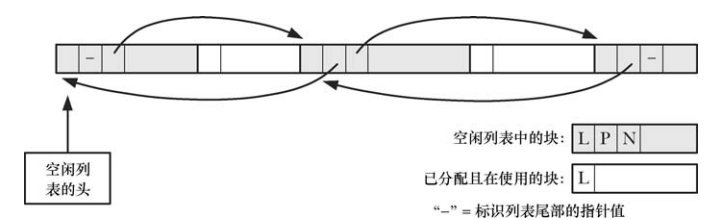

# 在堆上分配内存

堆是长度可变的连续虚拟内存，始于进程未初始化数据段的末尾，将堆当前的内存边界称为 "program break"。

##  调整 program break

改变堆的大小，其实就像命令内核改变晋城的 program break 位置一样，最初，program break 的位置正好位于未初始化数据段末尾之后。

```
#include <unistd.h>

int brk(void *end_data_segment);

void *sbrk(intptr_t increment);
```

- `brk()` 会将 program break 设置为参数 end_data_segment  所指定的位置，由于虚拟内存以页为分配单位，end_data_segment 实际会四舍五入到下一个内存页的边界处：
  - 试图将 program break 设置为一个低于其初始值的位置时，有可能导致无法预知的行为
  - program break 可以设置的额精确上限取决于一系列的因素，包括进程中对数据段大小的资源限制，以及内存映射、共享内存段、共享库的位置
- `sbrk()` 将 program break 在原有地址上增加了从参数 `increment` 传入的大小，如果调用成功 `sbrk()` 返回前一个 program break 的地址，也就是说如果 program break 增加，那么返回值将是指向这块新分配内存起始位置的指针
  - `sbrk(0)` 将返回 program break 的当前位置，对其不做改变

在 program break 的位置提升之后，程序可以访问新分配区域内的任何内存地址，而此时物理内存页尚未分配，内核会在进程首次视图访问这些虚拟内存地址时自动分配新的物理内存页。

## 在堆上分配内存

```
#include <stdlib.h>

void *malloc(size_t size);
```

- `malloc()`  在堆上分配 `size` 个字节大小的内存，并返回指向新分配内存起始位置处的指针，其分配的内存未经初始化
- `malloc` 返回的内存块采用了字节对齐方式，一般是基于 8 或者 16 字节边界来进行内存分配，从而能够高效地访问任何类型的 C 语言数据结构
- 如果无法分配内存，`malloc()`  将会返回  `NULL`，并设置 `errno`，虽然内存分配失败的可能性很小，但是还是应该对 `malloc()` 返回值进行检查

```
#include <stdlib.h>

void free(void *ptr);
```

- `free()` 函数释放 `ptr` 所指向的内存块
- 一般情况下，`free()` 并不降低 program break 的位置，而是将这块内存添加到空闲内存列表中，供后续的  `malloc()` 函数循环使用：
  - 被释放的内存块通常位于堆的中间，而非堆的顶部，因而降低 program break 是不可能的
  - 最大限度地减少了程序必须执行的  `sbrk()` 调用次数，从而降低系统开销
  - 大多数情况下，降低 program break 的位置不会对那些分配大量内存的程序有多少帮助，因为它们通常倾向于持有已分配内存或者是反复释放和重新分配内存
- 给 `free()`  传递一个 `NULL` 指针，那么函数将什么都不做
- 调用 `free()`  后对参数的  `ptr` 的任何使用，包括重新传递给 `free()` 将产生不可预知的结果

### 调用 `free()` 还是不调用 `free()`

进程终止时，其占用的所有内存都会返还给操作系统，这包括在堆内存中由 `malloc()` 函数包内一系列函数所分配的内存。

虽然依靠终止进程来自动释放内存对大多数程序来说是可接受的，但是基于以下原因，最好能够在程序中显式释放所有分配的内存：

- 显示调用  `free()` 能使程序在未来修改时，更具可读性和可维护性
- 如果使用 `malloc()` 调试库来查找内存泄漏，那么会将任何未经显式释放处理的内存报告为内存泄漏，这会使分析变得复杂

## `malloc()` 和 `free()` 的实现

` malloc()` 的实现很简单：

- 首先会扫描之前由 `free()`  所释放的空闲内存块列表，以求找到尺寸大于或等于要求的一块空闲内存，采用的扫描策略可能有 first-fit 或者 best-fito
- 如果这一内存块的尺寸正好与要求相当，就把它直接返回给调用者，如果是一块比较大的内存，那么将对其进行分割，再将一块大小相当的内存返回给调用者的同时，把剩余的那块内存块保留在空闲列表中
- 如果在空闲列表中根本找不到足够大的空闲内存块，那么 `malloc()`  将调用 `sbrk()` 以分配更多的内存，为了减少对  `sbrk()` 的调用次数，`malloc()` 并未只是严格按所需的字节数来分配内存，而是以更大幅度(以虚拟内存页大小的整数倍) 来增加 program break，并将超出部分置于空闲内存列表


`malloc()`  分配内存时会多分配几个字节用来记录这块内存的大小整数值，这个整数位于内存块的起始处，而实际返回给调用者的内存地址恰好位于这一长度记录字节之后。

`free()`  的实现更为有趣：

- `free()` 将内存块置于空闲列表之上
- 归还的大小正是依据 `malloc()` 预留的整数值

当将内存块置于空闲内存列表(双向链表)时，`free()`  会使用内存块本身的空间来存放链表指针，将自身添加到列表中：


随着对内存不断地释放和重新分配，空闲列表中的空闲内存会和已经分配的在用内存混杂在一起：



避免内存分配相关问题，应该遵循的准则：

- 分配一块内存后，不要改变这块内存范围外的任何内容
- 释放同一块内存超过一次是错误的，结果是不可预知的
- 不是经由 `malloc` 函数包中函数返回的指针，决不能在调用  `free()` 函数时使用
- 避免内存泄漏

### malloc 调试的工具和库

glibc 提供的 malloc 调试工具：

- `mtrace()` 和 `muntrace()` 函数分别在程序打开和关闭对内存分配调用进行跟踪的功能。这些函数要与环境变量 `MALLOC_TRACE`  搭配使用，该变量定义了写入跟踪信息的文件名
- `mcheck()` 和 `mprobe()` 函数允许对已分配内存块进行一致性检查
- `MALLOC_CHECK_` 环境变量提供了 `mcheck()` 和 `mprobe()` 函数的功能，区别在于 `MALLOC_CHECK_` 无需对程序进行修改和重新编译，将此变量设置为不同的整数值，可以控制程序对内存分配错误的响应方式：
  - 0 ： 忽略错误
  - 1 ：在标准错误输出诊断错误
  - 调用 `abort()` 来终止程序

### 控制和监控 malloc 函数包

glibc 手册介绍了一系列非标准函数，可以用于监测和控制 malloc 包中的函数：

- `mallopy()` 能修改各项参数，以控制 `malloc()` 所采用的算法
- `mallinfo()` 返回一个结构，其中包含由  `malloc()` 分配内存的各种统计数据

## 堆上分配内存的其他方法

### 用 `calloc()` 和 `realloc()` 分配内存

```
#include <stdlib.h>

void *calloc(size_t numitems, size_t size);
```

- `numitems` 指定分配对象的数量，`size` 指定每个对象的大小
- 分配成功返回这块内存起始处的指针，无法分配时返回 `NULL`
- `calloc()` 会将已分配的内存初始化为 0

```
#include <stdlib.h>

void *realloc(void *ptr, size_t size);
```

- `realloc()` 用来调整(通常是增加)一块内存的大小，此块内存应该是之前由 `malloc`  包中函数所分配的

- `ptr` 是指向需要调整大小的内存块的指针，`size` 指定所需调整大小的期望值

- 成功时 `realloc()` 返回指向大小调整后内存块的指针，与调用之前的指针相比，两者可能不同，如果发生错误，`realloc()` 返回 `NULL`，对 `ptr` 指针指向的内存块则保持不变

- `realloc()`  不会对额外分配的字节进行初始化

- 调用 `realloc(ptr,0)` 等效于 `free(ptr)` 之后再调用 `malloc(0)`，调用 `realloc(NULL,size)` 相当于调用  `malloc(size)`

- 通常情况下，当增大已分配内存时：

  - `realloc()` 会试图去合并在空闲列表中紧跟其后其大小满足要求的内存块
  - 如果不存在，并且原内存块位于堆的顶部，那么 `realloc()` 将会对堆空间进行扩展，如果原来的内存块在堆的中部，且紧邻其后的空间不足，`realloc()` 会分配一块新的内存，并且将原有的数据复制到新的内存，这种形式更为常见，会占用大量的 CPU 资源

- 由于 `realloc()` 可能会移动内存，对这块内存的后续引用就必须使用 `realloc()` 返回的指针
- 一般应该尽量避免使用 `realloc()`


### 分配对齐的内存


