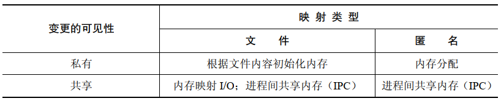

# 概述

`mmap()` 系统调用在调用进程的虚拟地址空间中创建一个新的内存映射，映射分为两种：

- 文件映射：将一个文件的一部分直接映射到调用进程的虚拟内存中，一旦一个文件被映射之后，就可以通过在相应的内存区域中操作字节来访问文件内容，映射的分页会在需要的时候从文件中自动加载，这种映射也称为基于文件的映射或内存映射文件
- 匿名映射：没有对应的文件，相反，这种映射的分页会被初始化为 0

一个进程的映射中的内存可以与其他进程中的映射共享(即各个子进程的页表条目指向 RAM 中相同的分页)。这种情况会存在2种情况发生：

- 当两个进程映射了一个文件的同一个区域时，它们会共享物理内存的相同分页
- 通过 `fork()` 创建的子进程会继承父进程的映射的副本，并且这些映射所引用的物理内存分页与父进程中相应映射所引用的分页相同

当两个或者多个进程共享相同分页时，每个进程都有可能看到其他进程对分页内容作出的改变，这当然要取决于映射是私有的还是共享的：

- 私有映射(`MAP_PRIVATE`) ：在映射内容上发生的变更对其他进程是不可见的，对于文件映射来说，变更将不会在底层文件上进行。尽管一个私有映射的分页在上面介绍的情况中，  初始时是共享的，但对映射内容作出的变更对各个进程来讲是私有的。内核使用了写时复制技术完成了这个任务。这意味着，当一个进程试图修改一个分页  的内容时，内核首先会为该进程创建一个新分页，并将需要修改的分页中的内容复制到新分页中(以及调整进程的页表)。正因为这个原因，`MAP_PRIVATE`   映射会被称为私有，写时复制映射
- 共享映射(`MAP_SHARED`)：在映射内容上发生的变更对所有共享同一个映射的其他进程都是可见的，对于文件映射来说，变更将会发生在底层文件上

各种映射的用途：



- 私有文件映射：映射的内容被初始化为一个而文件区域的内容。多个映射同一个文件的进程初始时会共享同样的内存物理分页，但系统使用写时复制技术使得一个进程对映射所做的变更对其他进程不可见。这种映射的主要用途是使用一个文件的内容来来初始化一块内存区域。一些常见的例子包括根据二进制可执行文件或共享文件的相应部分来初始化一个进程的文件和数据段
- 私有匿名映射：每次调用 `mmap()` 创建一个私有映射时都会产生一个新映射，该映射与同一进程创建的其他匿名映射是不同的(即不会共享物理分页)。尽管子进程会继承父进程的映射，但写时复制语义确保了 `fork()` 之后父进程和子进程不会看到其他进程对映射所做的变更。匿名映射的主要用途是为一个进程分配新(用0填充)的内存(如在分配大块内存时用 `malloc()`  会为此使用 `mmap()`)
- 共享文件映射：所有映射一个文件同一区域的进程会共享同样的内存物理分页，这些分页的内容将被初始化为该文件区域。对映射内容的修改将直接在文件中进行。这种映射主要用于2个用途：
  -  允许内存映射 IO, 这表示一个文件会被加载到进程的虚拟内存中的一个区域中并且对该区域的变更会自动被写入到这个文件中。因此，内存映射 IO 为使用 `read()`，`write()` 来执行文件 IO  这种做法提供了一种替代方案。
  - 允许无关进程共享一块内容以便以一种类似于 System V 共享内存段的方式来执行(快速) IPC
- 共享匿名映射：与私有匿名映射一样，每次调用 `mmap()` 创建一个共享匿名映射时都会产生一个新的，与任何其他映射不共享分页的截然不同的映射。这里的区别是映射的分页不会被写时复制。这意味着， 当一个子进程在 `fork()` 之后继承映射，父进程和子进程共享同一的 RAM 分页，并且一个进程对映射内容所作出的变更会对其他进程可见。共享匿名映射允许以一种类似于 System V 共享内存段的方式来进行 IPC，但只有相关进程可以这么做

 一个进程在执行 `exec()` 后映射会丢失，但通过 `fork()` 创建的子进程会继承映射，映射类型(`MAP_PRIVATE` 和 `MAP_SHARED`) 也会被继承。

通过 Linux 下特有的 `/proc/PID/maps` 文件能够查看与一个进程的映射有关的所有信息。

# 创建一个映射

```
#include <sys/mman.h>

void *mmap(void *addr, size_t length, int prot, int flags,int fd, off_t offset);
```

- `addr` 建立映射区的首地址，由 Linux 内核指定。用户程序调用时直接传递 `NULL`，那么内核会为映射选择一个合适地址，如果不是 `NULL`，内核会再选择将映射放置在何处时将这个参数值作为一个提示信息来处理
- 成功时返回创建的映射区首地址，失败时返回 `MAP_FAILED`
- `length` 指定了映射的字节数，尽管 `length` 无需是一个系统分页大小的倍数，但是内核会以分页大小为单位来创建映射，因此，实际上 `lenght` 会被向上提升为分页大小的下一个倍数
- `prot` 映射区的权限：


- `flags` 标志位参数，常用于设定更新物理区域、设置共享、创建匿名映射区：
  - `MAP_SHARED`：创建一个共享映射，映射区所做的修改会反映到物理设备（磁盘）上
  - `MAP_PRIVATE`：创建一个私有映射，映射区所做的修改不会反映到物理设备上
- `fd` 是用来建立映射区的文件描述符。
- `offset` 映射文件的偏移量，它必须是系统分页大小的整数倍，可以映射整个文件，也可以只映射一部分内容

## 有关内存保护的更多细节

如果一个进程在访问一个内存区域时违反了该区域上的保护位，那么内核会向该进程发送一个 `SIG_SEGV` 信号。

标记为 `PROT_NONE` 的分页内存的一个用途是作为一个进程分配的内存区域的起始位置或结束位置的守护分页，如果进程意外地访问了标记为 `PROT_NONE` 的分页，那么内核会通过一个 `SIGSEGV` 信号来通知该进程。

内存保护信息驻留在进程的私有虚拟内存表中，因此不同的进程可能会使用不同的保护位来映射同一个内存区域。

## 标准中规定的对 `offset` 和 `addr` 的对齐约束

SUSv3 规定 `mmap()` 的 `offset` 参数必须要与分页对齐，而 `addr` 参数在指定了 `MAP_FIXED`  的情况下也必须要与分页对齐。

SUSV4 放宽了这些要求：

- 一个实现可能会要求 `offset` 为系统分页大小的倍数
- 如果指定了 `MAP_FIXED`，那么一个实现可能会要求 `addr` 是分页对齐的
- 如果指定了 `MAP_FIXED`，并且 `addr` 为非零值，那么 `addr` 和 `offset` 除以系统分页大小所得的余数应该相等

# 解除映射区域

```
#include <sys/mman.h>

int munmap(void *addr, size_t length);
```

- `munmap()` 与 `mmap()` 操作相反，即从调用进程的虚拟地址空间中删除一个映射
- `addr` 参数是待解除映射的地址范围的起始地址，它必须与一个分页边界对齐
- `length` 参数是一个非负整数，它指定了待解除映射区域的大小，范围为系统分页大小的下一个倍数的地址空间将会解除映射
- 通常会解除整个映射，因此将 `addr` 指定为上一个 `mmap()` 调用返回的地址，并且 `length` 的值与 `mmap()` 调用中使用的 `length` 的值一样。也可以解除一个映射中的部分映射，这样原来的映射要么会收缩，要么会被分为两个，这取决于在何处开始解除映射。还可以指定一个跨越多个映射的地址范围，这样的话所有范围内的映射都会被解除
- 如果在 `addr` 和 `length` 指定的地址范围中不存在映射，那么 `munmap()` 将不起任何作用并返回 0
- 在解除映射期间，内核会删除进程持有的在指定地址范围内的所有内存锁
- 当一个进程终止或执行了一个 `exec()` 之后进程中所有的映射会自动解除
- 为确保一个共享文件映射的内容会被写入到底层文件中，在使用 `munmap()` 解除一个映射之前需要调用 `msync()`

# 文件映射

创建一个文件映射的步骤：

- 获取一个文件的描述符，通常通过调用 `open()` 来获取
- 将文件描述符作为 `fd` 参数，传入 `mmap()` 调用中

执行上面操作之后，`mmap()` 会将打开的文件的内容映射到调用进程的地址空间。一旦 `mmap()` 被调用之后就能够关闭文件描述符了，而不会对映射产生任何影响。

除了普通的磁盘文件，使用 `mmap()` 还能够映射各种真实和虚拟设备的内容，如硬盘，光盘以及 `/dev/mem` 。

在打开描述符 `fd` 引用的文件时必须要具备与 `port` 和 `flags` 参数值匹配的权限。

`offset` 参数指定了从文件区域中的哪个字节开始映射，它必须是系统分页大小的倍数，将 `offset` 指定为 0 会导致从文件的起始位置开始映射，`length` 参数指定了映射的字节数。


## 私有文件映射

私有文件映射用途：

- 允许多个执行同一程序或者使用同一个共享库的进程共享同样(只读的)文本段，它是从底层可执行文件或库文件的相应部分映射而来的
- 映射一个可执行文件或共享库的初始化数据段。这种映射会被处理成私有，使得对映射数据段内容的变更不会发生在底层文件上

`mmap()` 的这两种用法通常对程序是不可见的，因为这些映射是由程序加载器和动态链接器创建的，可以在 `/proc/PID/maps` 中发现这两种映射。

## 共享文件映射

当多个进程创建了同一个文件区域的共享映射时，它们会共享同样的内存物理分页。此外，对映射内容的变更将会反应到文件上。


共享文件映射有两个用途：内存映射 IO 和 IPC。

### 内存映射 IO 

由于共享文件映射中的内容是从文件初始化而来，并且对映射内容所做的变更都会自动反应到文件上，因此可以简单的通过访问内存中的字节来执行文件 IO，而
依靠内核来确保对内存的变更会被传递到映射文件上。(一般来说，一个程序会定义一个结构化数据类型来与磁盘文件中的内容对应起来，然后使用该数据类型来转换映射的内容)这项技术被称为内存映射 IO，它是使用 `read()` 和 `write()` 来访问文件内容这种方法的替代方案。

内存映射 IO 具备两个潜在的优势：

- 使用内存访问来代替 `read()` 和 `write()` 系统调用能够简化一些应用程序的逻辑
- 在一些情况下，它能够比使用传统的 IO 系统调用执行文件 IO 这种做法提供更好的性能

内存映射 IO 之所以能够带来性能的优势的原因如下：

- 正常的 `read()` 或者 `write()` 需要两次传输，一次是在文件和内核高速缓冲区之间，另一次是在高速缓冲区和用户空间缓冲区之间，使用 `mmap()` 就无需第二次传输：
  - 对于输入：一旦内核将相应的文件块映射进内存之后用户进程就能够使用这些数据
  - 对于输出：用户进程仅仅需要修改内存中的内容，然后可以依靠内核内存管理器来自动更新底层的文件
- `mmap()` 还能够通过减少所需使用的内存来提升性能，当使用 `read()` 或 `write()` 时，数据将被保存在两个缓冲区中：一个位于用户空间，另一个位于内核空间，当使用 `mmap()` 时，内核空间和用户空间会共享同一个缓冲区，此外，如果多个进程正在在同一个文件上执行 IO，那么它们通过使用 `mmap()`  就能够共享同一个内核缓冲区，从而又能够节省内存的消耗

 内存映射 IO 所带来的性能优势在大型文件执行重复随机访问时最有可能提现出来。对于小数据量  IO 来讲，内存映射 IO 的开销实际上要比简单的 `read()` 或  `write()` 大。

### 使用共享文件映射的  IPC

由于所有使用同样文件区域的共享映射的进程共享同样的内存物理分页，因此共享文件映射的第二个用途就是作为一种 IPC 方法。这种共享内存区域与 System V 共享内存对象之间的区别在于，区域上的内容的更变会反应到底层的映射文件上。这种特性对于那些需要共享内容在应用程序或系统重启时能够持久化的应用程序来说是非常有用的。

## 边界情况

在很多情况下，一个映射的大小是系统分页大小的整数倍，并且映射会完全落入映射文件的范围之内，但这个要求不是必须的。

映射完全落入映射文件的范围之内但区域大小并不是系统分页大小的一个整数倍的情况，假设分页大小为 4096 字节：


由于映射大小不是系统分页大小的整数倍，因此它会被向上舍入到系统分页大小的下一个整数倍。

当映射扩充过了底层文件的结尾处时，情况更加复杂：


虽然向上舍入的字节是可以访问的，但它们不会被映射到底层文件上，这部分会被初始化为0。

通过扩展文件的大小(如使用 `ftruncate()` 或 `write()`) 可以使得这种映射中之前不可访问的部分变得可用。

## 内存保护和文件访问模式交互

一般从原则来讲：

- `PROT_READ` 和  `PROT_EXEC` 保护要求被映射的文件使用 `O_RDONLY` 或 `O_RDWR` 打开
- `PROT_WRITE` 保护要求被映射的文件使用 `O_WRONLY` 或 `O_RDWR` 打开

但是，由于一些硬件架构提供的内存保护粒度有限，因此情况会变得复杂：

- 所有内存保护组合与使用 `O_RDWR` 标记打开文件是兼容的
- 没有内存保护组合
- 使用 `O_RDONLY` 标记打开一个文件的结果依赖于在调用 `mmap()` 时是否指定了可以指定任意的内存保护组合，因为对于一个 `MAP_PRIVATE` 分页内容做出的变更不会被写入到文件中

# 同步映射区域

内核会自动将发生在 `MAP_SHARED` 映射内容上的变更写入到底层文件中的，但默认情况下，内核不保证这种同步操作会在何时发生。

```
#include <sys/mman.h>

int msync(void *addr, size_t length, int flags);
```

- `msync()` 系统调用让应用程序能够显式地控制何时完成共享映射与映射文件之间的同步
- `addr` 和 `length` 指定了需同步的内存区域的起始地址和大小
- `flags` 参数的可取值：
  - `MS_SYNC` ：执行一个同步的文件写入。这个调用会阻塞直到内存区域中所有被修改过的分页被写入底层磁盘为止
  - `MS_ASYNC` ：执行一个异步写入。内存区域中被修改的分页会在后面某个时刻被写入磁盘并立即在相应文件区域中执行 `read()` 的其他进程可见

另外一种区分这两个值的方式可以表述为，在 `MS_SYNC` 操作之后，内存区域会与磁盘同步，而在 `MS_ASYNC` 之后，内存区域仅仅是与内核高速缓冲区同步。

`flags` 参数还可以加上下面这个值：

- `MS_INVALIDATE`：使映射数据的缓存副本失效，当内存区域中所有被修改过的分页被同步到文件中之后，内存区域中所有与底层文件不一致的分页会被标记为无效，当下次引用这些分页时会从文件的相应位置处复制相应的分页内容，其结果是其他进程对文件做出的所有更新将会在内存区域中可见

# 其他 `mmap()` 标记

`mmap()` 的 `flags` 参数的位掩码值：


- `MAP_ANONYMOUS` ：创建一个匿名映射，即没有底层文件对应的映射
- `MAP_HUGETLB` ：与 `SHM_HUGETLB` 标记在 System V 共享内存段中所起的作用一样
- `MAP_LOCKED` ：按照 `mlock()` 的方式预加载映射分页并将映射分页锁进内存
- `MAP_NORESERVE` ：这个标记用来控制是否提前为映射的交换空间执行预留操作
- `MAP_POPULATE` ：填充一个映射的分页，对于文件映射来将，这将会在文件上执行一个超前读取
- `MAP_UNINITIALIZED` ：指定一个标记会防止一个匿名映射被清零，它能够带来性能上的提升，但同时也带来了安全风险，因为已分配的分页中可能会包含上一个进程留下来的敏感信息

# 匿名映射

匿名映射是没有对应文件的一种映射。

## `MAP_ANONYMOUS`  和 `/dev/zero`

在Linux 中，使用 `mmap()` 创建匿名映射存在2种不同但等级的方法：

- 在 `flags` 中指定 `MS_ANONYMOUS` 并将 `fd` 指定为 -1
- 打开 `/dev/zero` 设备文件，并将得到的文件描述符传递给 `mmap()`

不管使用哪种方法，得到映射中的字节会被初始化为 0。`offset` 参数都将会被忽略，因为没有底层文件，所以也无法指定偏移量。

## `MAP_PRIVATE` 匿名映射

`MAP_PRIVATE` 匿名映射用来分配进程私有的内存块并将其中的内容初始化为 0。

下面的代码使用 `/dev/zero` 技术创建一个 `MAP_PRIVATE` 匿名映射：

```
fd = open("/dev/zero",O_RDWR);
if(fd == -1)
	errExit("open");
addr = mmap(NULL,length,PROT_READ | PROT_WRITE,MAP_PRIVATE,fd,0);
if(addr == MAP_FAILED)
	errExit("mmap");
```

##  `MAP_SHARED` 匿名映射

`MAP_SHARED` 匿名映射允许相关进程共享一块内存区域而无需一个对应的映射文件。

使用 `MAP_ANONYMOUS` 技术创建一个 `MAP_SHARED` 匿名映射：

```
addr = mmap(NULL,length,PROT_READ | PROT_WRITE,MAP_SHARED,-1,0);
if(addr == MAP_FAILED)
	errExit("mmap");
```

 # 重新映射一个映射区域

UNIX 实现上一旦映射被创建，其位置和大小就无法改变了。Linux 提供 `mremap()` 系统调用可以执行此类变更。

```
#define _GNU_SOURCE 
#include <sys/mman.h>

void *mremap(void *old_address, size_t old_size,size_t new_size, int flags, ... /* void *new_address */);
```

- `old_address` 和 `old_size` 指定了需要扩展或收缩的既有映射的位置和大小
- 在执行重映射的过程中内核可能会为映射进程的虚拟地址空间中重新指定一个位置，是否允许这种行为由  `flag` 参数来控制：
  - `MREMAP_MAYMOVE`：内核可能会为映射在进程的虚拟地址空间中重新指定一个位置，如果没有指定这个标记，并且在当前位置处没有足够的空间来扩展这个映射，那么就返回 `ENOMEM` 错误
  - `MREMAP_FIXED`：只能和 `MREMAP_MAYMOVE` 一起使用，如果指定了这个标记，那么 `mremap()` 会接收一个额外的参数 `void *new_address`，该参数指定了一个分页对齐的地址，并且映射将会被迁移至该地址处
- `mremap()` 成功时返回映射的起始地址

# `MAP_NORESERVE` 和过度利用交换空间

一些应用程序会创建大的映射，但之用映射区域中的一小部分。如果内核总是为此类映射分配(或者预留)足够的交换空间，那么很多交换空间可能会被浪费。相反，内核可以只在需要的时候用到映射分页的时候(即当应用程序访问分页时)为它们预留交换空间，这种方法称为懒交换预留。它的一个优点是，应用程序总共使用的虚拟内存量能够超过 RAM 加上交换空间的总量。

懒交换预留允许交换空间被过度利用，这种方式能够很好地工作，只要所有进程都不试图访问整个映射，但如果所有应用程序都试图访问整个映射，那么 RAM 和交换空间就会被耗尽。在这种情况下，内核会通过杀死系统中的一个或多个进程来降低内存压力。

内核如何处理交换空间的预留是由调用 `mmap()` 时是否使用了 `MAP_NORESERVE` 标记以及影响系统层面的交换空间过度利用操作的 `/proc` 接口来控制的：


Linux 特有的 `/proc/sys/vm/overcommit_memory` 文件包含了一个整数值，它控制着内核对交换空间过度利用的处理。

过度利用监控只适用于下面的这些映射：

- 私有可写映射，这种映射的交换开销等于所有使用该映射的进程为该映射所分配的空间总和
- 共享匿名映射，这种映射的交换开销等于映射的大小

为只读私有映射预留交换空间是没有必要的，因为映射中的内容是不可变更的，从而无需使用交换空间，共享文件映射也不需要使用交换空间，因为映射文件本身担当了映射的交换空间。

当一个子进程在  `fork()` 调用中继承了一个映射时，它将会继承该映射的 `MAP_NORESERVER`  设置。

## OOM 杀手

内核中用来在内存被耗尽时选择杀死哪个进程的代码通常被称为 `out-of-memory`(OOM) 杀手，OOM 杀手会尝试选择杀死能够缓解内存消耗情况的最佳进程，这里的 “最佳” 是由一组因素决定的。如一个进程消耗的内存越多，它越可能成为 OOM 杀手选择的目标。内核一般不会杀死下列进程：

- 特权进程，因为它们可能正在执行重要的任务
- 正在访问裸设备的进程，因为杀死它们可能会导致设备处理一个不可用的状态
- 已经运行了很长时间或已经消耗了大量 CPU 的进程，因为杀死它们可能会导致丢失很多 "工作"

为杀死一个被选中的进程，OOM 杀手会向其发送一个 `SIGKILL` 信号。

Linux 特有的 `/proc/PID/oom_score` 文件给出了在需要调用 OOM 杀手时内核赋予给每个进程的权重。在这个文件中，进程的权重越大，那么在必要的时候被 OOM 杀手选中的可能性就越大。

Linux 特有的 `/proc/PID/oom_adj` 文件能够用来影响一个进程的 `oom_score` 值，这个文件可以被设置成 `[-16,15]` 之间的任意一个值，其中负数会减小 `oom_score` 的值，而整数则会增大 `oom_score`  的值，`-17` 会完全将进程从 OOM 杀手的候选目标中删除。

 


 


2.文件映射
	创建一个文件映射的步骤：
	1.获取一个文件的描述符，通常通过调用 open() 来获取
	2.将文件描述符作为 fd 参数，传入 mmap() 中