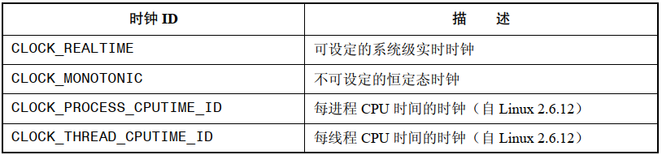
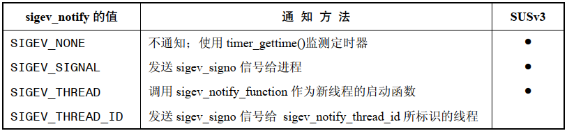

# 间隔定时器

```
#include <sys/time.h>

int setitimer(int which,const struct itimerval* new_value,struct itimerval* old_value);
```

- `setitimer()` 创建一个间隔式定时器，这种定时器会在未来某个时间点到期，并于此后(可选择地)每间隔一段时间到期一次
- `which` 可以指定以下值：
  - `ITIMER_REAL` ：创建以真实时间倒计时的定时器，到期会产生 `SIGALARM`  信号并发送给进程
  - `ITIMER_VIRTUAL`：创建以进程虚拟时间(用户模式下的 CPU 时间) 倒计时的定时器，到期时会产生信号 `SIGVTALRM`
  - `ITIMER_PROF`：创建一个 `profiling` 定时器，以进程时间(用户态与内核态 CPU 时间的总和)倒计时，到期时，则会产生 `SIGPROF` 信号

针对所有这些信号的默认处置均会终止进程，除非真地期望如此，否则就需要针对这些定时器信号创建处理器函数。

```
struct itimerval{
	struct timeval it_interval;	/* Interval for periodic timer */
	struct timeval it_value;	/* Current value(time until next expiration) */
};

struct timeval{
	time_t tv_sec;		/* Seconds */
	suseconds_t tv_usec;	/* Microseconds */
};
```

- `new_value` 下属的 `it_value` 指定了距离定时器到期的延迟时间，`it_interval` 则说明该定时器是否是周期性定时器，如果 `it_interval` 的两个字段都是 0，那么该定时器属于 `it_value` 所指定的时间间隔后到期的一次性定时器，只要 `it_interval` 中的任一字段非0，那么在每次定时器到期之后，都会将定时器重置为在指定间隔后再次到期
- 进程只能拥有上述3种定时器的一种，当第二次调用 `settimer()`  时，修改已有定时器的属性要符合参数 `which` 中的类型，如果调用 `setitimer()` 时将 `new_value.it_value` 的两个字段均设置为 0，那么会屏蔽任何已有的定时器
- 若 `old_value` 不为 `NULL`，则以其所指向的 `itimerval` 结构来返回定时器的前一设置：
  - 如果 `old_value.it_value` 的两个字段值均为 0，那么该定时器之前被设置处于屏蔽状态
  - 如果 `old_value.it_interval` 的两个字段值均为 0，那么该定时器之前被设置为历经 `old_value.it_value` 指定时间到期的一次性定时器
  - 对需要在新定时器到期后将其还原的情况而言，获取定时器的前一设置就很重要，如果不关心定时器的前一设置，可以将 `old_value` 设置为 `NULL`
- 定时器会从初始值 `it_value` 倒计时一直到 0 为止，递减为 0 时，会将相应信号发送给进程，随后，如果时间间隔值 `it_interval` 非0，那么会再次将 `it_value` 加载到定时器，重新开始向 0 倒计时

可以在任何时刻调用 `getitimer()`，以了解定时器的当前状态，距离下次到期的剩余时间：

```
#include <sys/time.h>

int getitimer(int which,struct itimerval* curr_value);
```

- `getitimer()` 返回由  `which` 指定定时器的当前状态，并置于 `curr_value` 指向的缓冲区中

使用 `setitimer()` 和 `alarm()` 创建的定时器可以跨越 `exec()` 调用而得以保存，但由  `fork()` 创建的子进程并不继承该定时器。

## 更为简单的定时器接口：`alarm()`

```
#include <unistd.h>

unsigned int alarm(unsigned int seconds);
```

- `seconds` 表示定时器到期的秒数，到期时向调用进程发送 `SIGALRM`  信号
- 调用 `alarm()` 会覆盖对定时器的前一个设置，调用 `alarm(0)` 可以屏蔽现有定时器
- 返回值是定时器前一设置距离到期的剩余描述，如果之前并无设置，则返回 0

## `setitimer()` 和 `alarm()` 之间的交互

Linux 中 `alarm()` 和 `setitimer()`  针对同一进程共享一个实时定时器，无论调用两者之中的哪个完成了对定时器的前一设置，同样可以调用二者中的任一函数来改变这一设置。

程序设置实时定时器时，最好选用二者之一。

# 定时器的调度和精度

内核配置项 `CONFIG_HIGH_RES_TIMERS` 可以支持高分辨率定时器，使得定时器的精度不受软件时钟周期的影响，可以达到底层硬件所支持的精度，在现代硬件平台上，精度达到微秒级别是司空见惯的。

# 为阻塞操作设置超时

实时定时器的用途之一就是为某个阻塞系统调用设置其处于阻塞状态的时间上限。

例如，处理 `read()` 操作：

- 调用 `sigaction()` 创建  `SIGALRM` 信号的处置函数，排除 `SA_RESTART` 标志以确保系统调用不会重新启动
- 调用 `alarm()` 或者 `setitimer()` 创建定时器，设置超时时间
- 执行阻塞的系统调用
- 系统调用返回，再次调用 `alarm()` 或 `setitimer()` 屏蔽定时器
- 检查系统调用失败是否设置 `errno` 为 `EINTR` ，即系统调用遭到中断

# 暂停运行一段固定时间

## 低分辨率休眠：`sleep()`

```
#include <unistd.h>

unsigned int sleep(unsigned int seconds);
```

- `sleep()` 可以暂停调用进程执行  `seconds` 秒，或者在捕获信号后恢复进程的执行
- 如果休眠正常结束，返回0，如果因信号中断休眠，返回剩余的秒数
- 考虑到一致性，应该避免 `sleep()` 和 `alarm()` 以及 `setitimer()` 之间的混用，Linux 将 `sleep()` 实现为对 `nanosleep()` 的调用，而有些老系统使用 `alarm()` 和  `SIGALRM` 信号处理函数实现 `sleep()`

## 高分辨率休眠 `nanosleep()`

```
#include <time.h>

int nanosleep(const struct timespec *req, struct timespec *rem);
```

- `nanosleep()` 与 `sleep()` 相似，但是分辨率更高
-  `struct timespec`：

```
struct timespec {
        time_t tv_sec;        /* seconds */
        long   tv_nsec;       /* nanoseconds */
};
```

- 规范规定不得使用信号实现该函数，这意味着 `nanosleep()` 与 `alarm()` 和  `setitimer()` 混用，也不会危及程序的可移植性
- 尽管 `nanosleep()` 没有使用信号，但还是可以通过信号处理器函数将其中断，此时将返回 -1，并设置错误 `EINTR`，如果 `remain` 不为 `NULL`，则该指针所指向的缓冲区将返回剩余的休眠时间，可以利用这个返回值重启该系统调用以完成休眠，但是由于返回的 `remain` 时间未必是软件时钟间隔的整数倍，故而每次重启都会遭受取整，其结果是，每次重启后的休眠时间都要长于前一调用返回的 `remain` 值，在信号接收频率很高的情况下，进程的休眠可能永远也结束不了，使用 `TIMER_SBSTIME` 选项的 `clock_nanosleep()` 可以避免这个问题

# POSIX 时钟

Linux 中需要使用 realtime，实时函数库，需要链接 `librt` 即需要加入 `-lrt` 选项。

## 获取时钟的值

```
#include <time.h>

int clock_getres(clockid_t clk_id, struct timespec *res);
int clock_gettime(clockid_t clk_id, struct timespec *tp);
```

- `clock_gettime()` 针对参数 `clk_id` 所指定的时钟返回时间，返回的时间，置于 `tp` 指向的结构中
- `clockid_t` 是 SUSv3 规范定义的数据类型，用于表示时钟标识符：



- `CLOCK_REALTIME` 时钟是一种系统级时钟，用于度量真实时间，它的设置是可以变更的
- `CLOCK_MONOTONIC` 时钟对时间的度量始于"未予规范的过去某一时间点"，系统启动后就不会改变它，Linux 上，这种时钟对时间的测量始于系统启动
- `CLOCK_PROCESS_CPUTIME_ID` 时钟测量调用进程所消耗的用户和系统 CPU 时间
- `CLOCK_THREAD_CPUTIME_ID` 时钟测量调用线程所消耗的用户和系统 CPU 时间

 ## 设置时钟的值

```
#define _POSIX_C_SOURCE 199309L
#include <time.h>

int clock_settime(clockid_t clk_id, const struct timespec *tp);
```

- `clock_settime()` 利用 `tp` 指向缓冲区中的时间来设置由  `clockid` 指定的时钟
- 如果 `tp` 指向的时间并非 `clock_getres()` 所返回的时钟分辨率的整数倍，时间会向下取整
- 特权级进程可以设置 `CLOCK_REALTIME` 时钟，该时钟的初始值通常自  Epoch 以来的时间，其他时钟类型不可更改

## 获取特定进程或线程的时钟 ID

要测量特定进程或线程消耗的 CPU 时间，首先要获取其时钟 ID：

```
#define _XOPEN_SOURCE 600
#include <time.h>

int clock_getcpuclockid(pid_t pid, clockid_t *clock_id);
```

- `clock_getcpuclockid`  将隶属于 `pid` 进程的 CPU 时间时钟的标识符置于 `clock_id` 指针指向的缓冲区中

```
#define _XOPEN_SOURCE 600
#include <pthread.h>
#include <time.h>

int pthread_getcpuclockid(pthread_t thread, clockid_t *clock_id);
```

- `pthread_getcpuclockid()` 是  `clock_getcpuclockid()` 的 POSIX 线程版，返回的标识符所标识的时钟用于度量调用进程中指定线程消耗的 CPU 时间

## 高分辨率休眠的改进版

```
#define _XOPEN_SOURCE 600
#include <time.h>

int clock_nanosleep(clockid_t clock_id, int flags,const struct timespec *request,struct timespec *remain);
```

- 默认情况下，`flags` 是0，`request` 指定的休眠间隔时间是相对时间，如果 `flags` 设置为 `TIMER_ABSTIME` ，`request` 则表示 `clock_id` 所测量的绝对时间，这个特性对于需要精确休眠一段指定时间的应用程序至关重要，以相对时间进行休眠，进程可能执行到一半就被占先了，结果休眠的时间要比预期的久

对于那些被信号处理器中断并使用循环重启休眠的进程来说，"嗜睡" 问题尤其明显，如果以高频接收信号，那么按相对时间休眠的进程在休眠时间上会有较大误差，可以通过如下方式避免嗜睡：

- 先调用 `clock_gettime()` 获取时间，再加上期望休眠的时间量
- 再以 `TIMER_ABSTIME` 标志调用 `clock_nanosleep()` 函数，指定了 `TIME_ABSTIME` 时，不需要使用参数 `remain`
- 信号处理器程序中断了 `clock_nanosleep()` 调用，再次调用该函数来重启休眠时，`request` 参数不变

```
struct timespec request;

if(clock_gettime(CLOCK_REALTIME,&request) == -1)
	errExit("clock_gettime");

request.tv_sec += 20;  /* sleep for 20 seconds from now*/

s = clock_nanosleep(CLOCK_REALTIME,TIMER_ABSTIME,&request,NULL);
if(s != 0)
{
	if(s == EINTR)
		printf("Interrupted by signal handler\n");
	else 
		errExit("clock_nanosleep");
}
```

# POSIX 间隔式定时器

使用 `settimer()` 来设置经典 UNIX 间隔式定时器，会收到如下制约：

- 针对 `ITIMER_REAL`，`ITIMER_VIRTUAL` 和 `ITIMER_PROF` 这 3 类定时器，每种智能设置一个
- 只能通过发送信号的方式通知定时器到期，另外也不能改变到期时产生的信号
- 如果一个间隔式定时器到期多次，且相应信号遭到阻塞时，那么会只调用一次信号处理器函数，换言之，无从知晓是否出现定时器溢出的情况
- 定时器的分辨率只能达到微秒级

POSIX.1b 定义了一套 API 来突破这些限制，主要包含如下几个阶段：

- `timer_create()` 创建一个新的定时器，并定义其到期时对进程的通知方法
- `timer_settime()` 启动或者停止一个定时器
- `timer_delete()` 删除不再需要使用的定时器

`fork()`  创建的子进程不会继承 POSIX 定时器，调用 `exec()` 期间亦或是进程终止时将停止并删除定时器。

使用 POSIX 定时器的 API 程序编译时需要使用 `-lrt`  选项。

## 创建定时器

```
#define _POSIX_C_SOURCE 199309L
#include <signal.h>
#include <time.h>

int timer_create(clockid_t clockid, struct sigevent *sevp,timer_t *timerid);
```

- `timer_create()` 创建一个新的定时器，并以 `clockid` 指定的时钟进行时间度量
- `clockid` 可以是  SUSv3 规范定义的类型，也可以采用 `clock_getcpuclockid()`  或 `pthread_getcpuclockid()` 返回的 `clockid` 值
- 函数返回时，`timerid` 指向的缓冲区放置定时器句柄，供后续调用中指代该定时器之用
- `sevp` 可决定定时器到期时，对应应用程序的通知方式，指向 `struct sigevent`：

```
union sigval {          /* Data passed with notification */
    int     sival_int;         /* Integer value */
    void   *sival_ptr;         /* Pointer value */
};

struct sigevent {
    int          sigev_notify; /* Notification method */
    int          sigev_signo;  /* Notification signal */
    union sigval sigev_value;  /* Data passed with notification */
    void       (*sigev_notify_function) (union sigval);  /* Function used for thread notification (SIGEV_THREAD) */
    void        *sigev_notify_attributes; 	/* Attributes for notification thread (SIGEV_THREAD) */
    pid_t        sigev_notify_thread_id; 	/* ID of thread to signal (SIGEV_THREAD_ID) */
};
```

- `sigev_notify` 字段的值：



- `SIGEV_NONE`：不提供定时器的到期通知，进程可以使用 `timer_gettime()` 来监控定时器的运转情况
- `SIGEV_SIGNAL`：定时器到期时，为进程生成指定于 `sigev_signo` 中的信号，如果 `sigev_signal` 为实时信号，那么 `sigev_value` 字段则指定了信号的伴随数据，通过 `siginfo_t` 结构的 `si_value` 可获取这一数据
- `SIGEV_THREAD`：定时器到期时，会调用由 `sigev_notify_function` 字段指定的函数，调用该函数类似于调用新线程的启动函数
- `SIGEV_THREAD_ID`：与 `SIGEV_THREAD` 相类似，只是发送信号的目标线程 ID 要与 `sigev_notify_thread_id` 相匹配

## 配备和解除定时器

```
#define _POSIX_C_SOURCE 199309L
#include <time.h>

int timer_settime(timer_t timerid, int flags,const struct itimerspec *new_value,struct itimerspec *old_value);
```

- `timer_settime()` 的参数 `timerid` 是一个定时器句柄，由之前对 `timer_create()` 的调用返回
- `new_value` 包含定时器的新设置，`old_value` 返回定时器的前一设置，如果对前一个设置不感兴趣，可以设置为 `NULLL`

```
struct timespec {
    time_t tv_sec;                /* Seconds */
    long   tv_nsec;               /* Nanoseconds */
};

struct itimerspec {
    struct timespec it_interval;  /* Timer interval */
    struct timespec it_value;     /* Initial expiration */
};
```

- `it_value` 指定了定时器首次到期的时间，`it_interval` 任意一个字段非0，那么就是一个周期性定时器，如果都是0，那么这个定时器将只到期一次
- `flags` 如果是0，会将 `value.it_value` 视为始于 `timer_settime()` 调用时间点的相对值，如果 `flags` 设为 `TIMER_ABSTIME`，那么 `value.it_value` 则是一个绝对时间
- 为了启动定时器，需要调用函数 `timer_settime()`，并将 `value.it_value` 的一个或者全部字段设置为非0，如果之前曾经配备过定时器，则 `timer_settime()` 会将之前的设置值替换掉
- 如果定时器的值和间隔时间并非对应时钟分辨率的整数倍，那么会对这些值向上取整
- 要解除定时器，需要调用 `timer_settime()`，并将 `value.it_value`  的所有字段设置为 0

## 获取定时器的当前值

```
#define _POSIX_C_SOURCE 199309L
#include <time.h>

int timer_gettime(timer_t timerid, struct itimerspec *curr_value);
```

- `timer_gettime()` 返回由 `timerid` 指定的 POSIX 定时器的间隔以及剩余时间
- 如果返回结构 `curr_value.it_value` 的两个字段都是0，表示定时器处于停止状态，如果 `curr_value.it_interval` 的两个字段都是0，那么该定时器仅在 `curr_value.it_value` 给定的时间到期过一次

## 删除定时器

每个 POSIX 定时器都会消耗少量的系统资源，一旦使用完毕，应当及时释放这些资源：

```
#define _POSIX_C_SOURCE 199309L
#include <time.h>

int timer_delete(timer_t timerid);
```

- 对于已启动的定时器，会在移除之前自动将其停止
- 进程终止时，会自动删除所有定时器


## 通过信号发出通知

如果选择通过信号来接收定时器通知，那么处理这些信号时既可以采用信号处理器函数，也可以调用 `sigwaitinfo()` 或是 `sigtimerdwait()`。接收进程借助于这两种方法可以获取一个 `siginfo_t` 结构：

- `si_signo`：包含由定时器产生的信号
- `si_code`：置为 `SI_TIMER`，表示这是因为 POSIX 定时器到期而产生的信号
- `si_value`：设置为以 `timer_create()`创建定时器在 `evp.sigev_value` 中提供的值

为  `evp.sigev_value` 指定不同的值，可以将到期时发送同类信号的不同定时器区分开。

Linux 还为 `siginfo_t` 结构提供了如下非标准字段：

- `si_overrun`： 包含了定时器溢出个数

## 定时器溢出

假设已经选择通过信号传递的方式来接收定时器到期的通知。在捕获或接收相关信号之前定时器到期多次，或者不论直接调用 `sigprocmask()` 还是在信号处理器函数中暗中处理，也都有可能堵塞相关信号的发送，那如何知道这些定时器溢出？

接收到定时器信号之后，有两种方法可以获取定时器的溢出值：

- 调用 `timer_getoverrun()`
- 使用随信号一同返回的结构  `siginfo_t` 中的  `si_overrun` 字段值，这种方法可以避免 `timer_getoverrun()` 调用开销，但是这种方法是 Linux 扩展方法，无法移植

```
#define _POSIX_C_SOURCE 199309L
#include <time.h>

int timer_getoverrun(timer_t timerid);
```

- 每次收到定时器信号后，都会重置定时器溢出计数，若自处理或接收定时器信号之后，定时器仅到期一次，则溢出计数为 0
- 返回由参数 `timerid` 指定的定时器的溢出值
- `timer_getoverrun()` 是异步信号安全的函数，故而在信号处理器函数内部调用也是安全的

## 通过线程来通知

`SIGEV_THREAD` 标志允许程序从一个独立的线程中调用函数来获取定时器到期通知。

# 利用文件描述符进行通知的定时器

Linux 内核特有的创建定时器的 timerfd API，可从文件描述符中读取其所创建定时器的到期通知。

```
#include <sys/timerfd.h>

int timerfd_create(int clockid, int flags);
```

- `timerfd_create()` 创建一个新的定时器对象，并返回一个指代该对象的文件描述符
- `clockid` 的值，可以是：`CLOCK_REALTIME` 或者 `CLOCK_MONOTONIC`
- `flags` 最初必须设置为0现在支持：
  - 

```
#include <sys/timerfd.h>

int timerfd_settime(int fd, int flags,const struct itimerspec *new_value,struct itimerspec *old_value);
```


```
#include <sys/timerfd.h>

int timerfd_gettime(int fd, struct itimerspec *curr_value);
```


 


 


