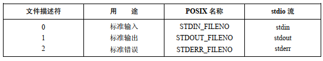

# 概述

文件描述符：非负整数，指代打开的文件。

标准文件描述符：



# 通用 IO

所有类型的文件和设备驱动都实现相同的 IO 接口，这保证了 IO 操作的通用性。

# 打开文件

## open

```
#include <sys/types.h>
#include <sys/stat.h>
#include <fcntl.h>

int open(const char *pathname, int flags);
int open(const char *pathname, int flags, mode_t mode);
```

- `pathname` 如果是符号链接，会对其解引用
- 调用成功，返回进程未使用文件描述符中数值最小的值，失败返回 -1，并且设置 `errno`

### flags 参数

- `O_RDONLY`，`O_WRONLY`，`O_RDWR` 
  - 只读，只写，可读写
  - 三者不能同时使用，只能使用其中一种
- `O_APPEND`
  - 文件尾部追加数据
- `O_ASYNC`
  - 对 `open()` 返回的文件描述符施加 IO 操作时，系统会产生一个信号通知进程，称为信号驱动 IO
  - 仅针对特定的文件类型有效，例如：终端，FIFOS，SOCKET
- `O_CLOEXEC`
  - 为新的文件描述符启用 close-on-flag 标志。
- `O_CREAT`
  - 如果文件不存在，新创建一个文件
  - 即使文件是只读方式打开，此标志仍然有效
  - 使用此标志时，一般还需要指定权限，否则会将新文件的权限设置为栈中的某个临时值
- `O_DIRECT`
  - 无系统缓冲的文件 IO 操作
- `O_DIRECTORY`
  - 如果 `pathname` 不是目录，将返回错误 `ENOTDIR`
- `O_DSYNC`
  - 根据同步 IO 数据完整性要求来执行文件写操作
- `O_EXCL`
  - 此标志与 `O_CREAT` 结合使用，如果文件已经存在，则不会打开文件，并且 `open` 返回错误 `EEXIST`
  - 此标志确保了 `open` 就是用于创建文件
  - 文件是否存在的检查和创建文件是原子操作
- `O_LARGEFILE`
  - 支持以大文件方式打开文件，在 32 位操作系统中使用此标志，以支持大文件操作
- `ONOATIME`
  - 读文件时，不更新文件的最近访问时间
  - 要使用该标志，要么调用进程的有效用户ID必须与文件的拥有者相匹配，要么进程需要拥有特权
  - 该标志的使用可以显著减少磁盘活动量，省却了更新文件 i-node 结构中最近访问时间的步骤
- `O_NOCTTY`
  - 如果正在打开的文件属于终端设备，`O_NOCTTY` 标志防止其称为控制终端
  - 如果打开的文件不是终端设备，此标志无效
- `O_NOFOLLOW`
  - `pathname` 如果是符合链接，不去解引用，`open()` 直接返回错误 `ELOOP`
- `O_NONBLOCK`
  - 以非阻塞方式打开文件
- `O_SYNC`
  - 以同步 IO 方式打开文件
- `O_TRUNC`
  - 如果文件已经存在并且是普通文件，那么将文件清空，长度设置为0
  - 无论以读、写方式打开文件，都可以清空文件的内容

### 错误

`errno` 除了上面提及的情况，还可能是：

- `EACCESS` ： 文件权限不允许调用进程以 flags 参数指定的方式打开文件
- `EISDIR` ： 所指定的文件属于目录，而调用者试图打开文件并写入
- `EMFILE` ： 进程已打开的文件描述符数量达到了进程资源所设定的上限
- `ENFILE` ： 文件打开数量已经达到了系统允许的上限
- `ENOENT` ： 要么文件不存在并且未指定 `O_CREAT`，要么指定了 `O_CREAT` 但 `pathname` 参数所指定的路径的目录之一不存在，或者 `pathname` 参数是符合链接，而符号链接指向的文件不存在
- `EROFS` ：所指定的文件隶属于只读文件系统，而调用者试图以写方式打开
- `ETXTBSY` ：所指定的文件为可执行文件，并且正在运行，系统不允许修改正在运行的程序

## creat

```
#include <sys/types.h>
#include <sys/stat.h>
#include <fcntl.h>

int creat(const char *pathname, mode_t mode);
```

- 根据 `pathname` 创建并打开一个文件，如果文件存在则打开文件，并清空其内容，将其长度设置为 0
- 等价于 ：`open(WRONLY | O_CREAT | O_TRUNC)`

# 读取文件内容

```
#include <unistd.h>

ssize_t read(int fd, void *buf, size_t count);
```

- `count` 指定最多读取的字节数
- `buf` 指定的缓冲区，应该至少具有 `count` 个字节
- 调用成功返回实际读取的字节数，该值可能小于期望值，如果遇到文件结束 `EOF` 则返回 0，如果出错，返回 -1，并且设置 `errno`

# 数据写入文件

```
#include <unistd.h>

ssize_t write(int fd, const void *buf, size_t count);
```

- 调用成功返回实际写入的字节数，该值可能小于 count，如果出错，返回 -1，并且设置 `errno`

# 关闭文件

```
#include <unistd.h>

int close(int fd);
```

- 关闭打开的文件描述符，并将其释放回调用进程
- 进程关闭时，将自动关闭其已打开的所有文件描述符

应该对 close 调用进行错误检查：

```
if(close(fd) == -1)
	//@ do sth
```

可能出错的原因，比如：

- 企图关闭一个未打开的文件描述符
- 两次关闭同一描述符

# 改变文件偏移量

文件偏移量：

- 每个打开的文件，内核都会记录其文件偏移量，文件偏移量是执行下一次 `read()` 或 `write()` 操作的文件起始位置
- 文件打开时，会将文件偏移量设置为指向文件开始，以后每次 `read()` 和 `write()` 调用都将自动调整偏移量，以指向已读或者已写数据的下一个字节

```
#include <sys/types.h>
#include <unistd.h>

off_t lseek(int fd, off_t offset, int whence);
```

- `whence` 可以是：
  - `SEEK_SET` ： 从文件头部开始，`offset` 必须是非负数
  - `SEEK_CUR` ： 从文件当前位置开始，`offset` 可正可负
  - `SEEK_END` ： 从文件尾部开始，`offset` 可正可负
- 调用成功返回新的文件偏移量，失败返回 -1，并且设置 `errno`
- 并非适用于所有类型的文件，应用于管道，FIFO，SOCKET 或者终端将调用失败，设置错误 `ESPIPE`

## 文件空洞

文件结尾后到新写入数据间的这段空间称为文件空洞。

- 读取空洞文件将会返回以 `0` 字节填充的缓冲区
- 文件空洞不占用任何磁盘空间，直到后续在空洞文件中写入数据，文件系统才会为之分配磁盘块

# ioctl

```
#include <sys/ioctl.h>

int ioctl(int fd, unsigned long request, ...);
```

- `ioctl()`  系统调用为执行文件和设备操作提供了一种多用途机制
- `ioctl()` 根据命令字类型决定参数类型