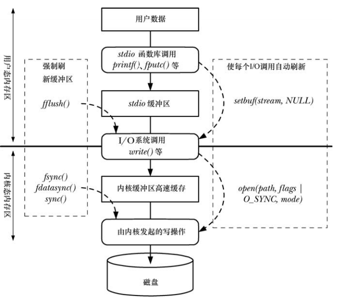

# 文件 IO 的内核缓冲：缓冲区高速缓存

系统操作与磁盘操作并不同步：`read()` 和 `write()` 系统调用在操作磁盘文件时不会直接发起磁盘访问，而是在用户空间缓冲区与内核缓冲区高速缓存之间复制数据。

- 对于输出，`write` 将数据送入内核空间的高速缓存区就立即返回，后续的某个时刻，内核将其缓冲区中的数据写入磁盘，在此期间如果另一个进程想要读取该文件几个字节，那么内核将自动从缓冲区高速缓存中提供这些数据。
- 对于输入，内核从磁盘中读取数据并存储到内核缓冲区中，`read()` 调用将从该缓冲区中读取数据，直到将缓冲区中的数据读完，内核将文件的下一段内容读到缓冲区高速缓存。

linux 内核对于缓冲区高速缓存的大小没有固定上限，内核会尽可能多的分配缓冲区高速缓存页，但受限于两个因素：

- 可用的物理内存总量
- 其他目的对物理内存的需求(例如：正在运行进程的文本段和数据段占据的物理内存)

内存不足时，内核会将缓冲区高速缓存的内容刷新到磁盘，并释放其供系统重用。

从内核 2.4 开始，不再单独维护一个缓冲区高速缓存，而是将文件 IO 缓冲区置于页面高速缓存中，其中还有诸如内存映射文件的页面。

## 缓冲区大小对 IO 系统调用性能的影响

采用大块空间缓冲数据，以执行更少的系统调用，可以极大地提高 IO 性能。

# stdio 库的缓冲

## 设置 stdio 流的缓冲模式

```
#include <stdio.h>

int setvbuf(FILE* stream,char* buf,int mode,size_t size);
```

- 打开流之后，必须在调用任何其他 stdio 函数之前调用 `setvbuf`，并且调用之后将影响后续在指定流上进行的所有 stdio 操作
- `buf`  和 `size` 针对参数 `stream` 要使用的缓冲区，有两种方式可以指定：
  - `buf`  不为 NULL，指向 `size` 大小的内存块用来作为 `stream`  缓冲区，这块缓冲区要在堆上或者静态区，不能在栈上
  - `buf`  为 `NULL`，stdio 库自动分配缓冲区(除非选择非缓冲 IO)，但不强制要求库使用 `size` 指定缓冲区大小
- `mode` 指定缓冲类型：
  - `_IONBF` ： 不对 IO 进行缓冲，忽略 `buf` 和 `size` 参数，`stderr` 默认属于这种类型
  - `_IOLBF` ：行缓冲 IO，对于输出流：在输出一个换行符之前缓冲数据(除非缓冲区已经填满)，对于输入流：每次读取一行，终端设备默认属于这种类型
  - `_IOFBF` ： 全缓冲 IO，单次读、写数据的大小与缓冲区相同，指代磁盘的流默认采用这种模式

- `setvbuf` 出错时，返回非 0 值，而不一定是 -1

```
#include <stdio.h>

void setbuf(FILE *stream, char *buf);
```

- `setbuf` 构建于 `setvbuf` 之上，要么将参数 `buf` 指定为 `NULL` 表示无缓冲，要么指向调用者分配的  `BUFSIZ` (定义在 `<stdio.h>`) 个字节的缓冲区

```
#include <stdio.h>

void setbuffer(FILE *stream, char *buf, size_t size);
```

- `setbuffer` 类似于 `setbuf` ，但是可以指定缓冲区大小

## 刷新 stdio 缓冲区

```
#include <stdio.h>

int fflush(FILE *stream);
```

- 无论采用何种缓冲模式，都可以使用 `fflush()` 强制将 stdio 输出流中的数据刷新到内核缓冲区
- `stream`  如果是 `NULL`  则将刷新所有的 stdio 缓冲区
- 也可以应用于输入流，将丢弃业已缓冲的输入数据，当程序下一次尝试从流中读取数据时将重新装填缓冲区
- 关闭相应流时，将自动刷新其 stdio 缓冲区

# 控制文件 IO 的内核缓冲

## 同步 IO 数据完整性和同步 IO 文件完整性

文件元数据：文件属主，属组，文件权限，文件大小，文件链接数量，文件最近访问，修改以及元数据发生变化的时间戳，指向文件数据块的指针。

synchronized IO data  integrity completion ：确保针对文件的一次更新传递了足够多的信息到磁盘上，以便于之后对数据获取。

synchronized IO file integrity completion ：是 synchronized IO data  integrity completion 的一个超集，对文件的一次更新过程中，要将所有发生更新的文件元数据都传递到磁盘，即使有些在后续对文件数据的读操作并不重要。

## 用于控制文件 IO 内核缓冲的系统调用

```
#include <unistd.h>

int fsync(int fd);
int fdatasync(int fd);
```

- 使缓冲数据和与打开文件描述符 `fd`  相关的所有元数据都刷新到磁盘上
- 仅在对磁盘设备的传递完成之后，`fsync()`  调用才会返回
-  `fsync()`  强制文件处于 synchronized IO file integrity completion

```
#include <unistd.h>

int fdatasync(int fd);
```

-  `fdatasync()` 运作与 `fsync()` 类似，只是强制文件处于 synchronized IO data  integrity completion 状态
- `fdatasync()` 可能会减少对磁盘操作的次数，由 `fsync()` 调用请求的两次变为一次，例如：文件内容变化，文件大小不变，调用 `fdatasync()` 只强制进行了数据更新，某些情况喜爱能够带来一定的性能提升

```
#include <unistd.h>

void sync(void);
```

- `sync()` 使得所有内核缓冲区都刷新到磁盘上
- 仅在所有数据已传递到磁盘上时返回

## 使所有写入同步 ： O_SYNC

调用 `open()` 时，如果指定了 `O_SYNC` 标志，将会使所有后续输出同步：

- 每个 `write()` 调用都会自动将文件数据和元数据刷新到磁盘上，遵照 synchronized IO file integrity completion 要求
- 采用 `O_SYNC` 标志或者频繁调用 `fsync()`，`fdatasync()` 或 `sync()`  对性能的影响是极大的，一般不建议使用此标志

## O_DSYNC 和 O_RSYNC 标志

`O_DSYNC` ：要求写操作按照 synchronized IO data integrity completion 来执行。

`O_RSYNC ` ：可与 `O_DSYNC ` 或者 `O_SYNC ` 配合使用，将这些对写操作的作用结合到读操作中：

- 如果打开文件指定 `O_RSYNC ` 和 `O_DSYNC `  那么后续的所有操作都会按照 synchronized IO data integrity completion。
- 如果打开文件指定 `O_RSYNC ` 和 `O_SYNC `  那么后续的所有操作都会按照 synchronized IO file integrity completion。

# IO 缓冲小结



- stdio 库将用户数据传递到 stdio 缓冲区，该缓冲区是位于用户态的缓冲区
- 缓冲区填满后，stdio 库将会调用 `write()`  将数据传递到内核高速缓冲区中，该缓冲区是位于内核的缓冲区
- 内核发起操作，将数据传递给磁盘

# 就 IO 模式向内核提出建议

```
#define _XOPEN_SOURCE 600
#include <fcntl.h>

int posix_fadvise(int fd, off_t offset, off_t len, int advice);
```

- `posix_fadvise` 就进程自身访问文件数据时可能采取的模式通知内核，内核可以(但非必要)根据提供的信息来优化对高速缓冲区的使用，进而可以提高整个系统性能
- `posix_fadvise` 调用对程序语义并无影响
- `offset` 和 `len` 确定了建议所使用的文件区域：
  - `offset` ： 指定区域起始的偏移量
  - `len` ：指定区域的大小，为 0 表示从 `offset` 开始，直到文件结尾
- `advise` 表示进程期望对文件采取的访问模式：
  - `POSIX_FADV_NORMAL`  ：进程对访问模式无特别建议，采用默认行为，linux 系统中，该操作将文件预读窗口大小设置为默认值 128 k
  - `POSIX_FADV_SEQUENTAL` ： 进程预计会从低偏移量到高偏移量顺序读取数据，linux 系统中，该操作将文件预读窗口大小设置为默认值的两倍
  - `POSIX_FADV_RANDOM` ： 进程预计以随机顺序访问数据，linux 系统中，该选项会禁用文件预读
  - `POSIX_FADV_WILLNEED` ：进程预计会在不久的将来访问指定的文件区域，内核将由 `offset` 和 `len` 指定区域的文件数据预先填充到缓冲区高速缓存中，但是对于保留多长时间，内核并无保证
  - `POSIX_FADV_DONTNEED` ：进程预计会在不久的将来不会访问指定的文件区域，这一操作给内核的建议是释放相关的高速缓存页面(如果存在的话)
  - `POSIX_FADV_NOREUSE` ：进程预计一次性地访问指定文件区域、不再重复，提示内核对指定区域访问一次之后就可以释放页面，在 linux 中，目前不起作用

# 绕过缓冲区高速缓存

应用程序在执行磁盘 IO 时，绕过缓冲区高速缓存，从用户空间直接将数据传递到文件或者磁盘设备，有时称为直接 IO 或者裸 IO。

对于多数应用，直接 IO 可能会大大降低性能，只针对特定的应用有效，例如数据库系统，其高速缓存和 IO 优化机制均自成一体，无需内核消耗 CPU 时间和内存区完成相同的任务。

为了直接 IO，需要在调用  `open()` 时需要指定 `O_DIRECT` 标志，但是这一标志并不是所有的 linux 文件系统和内核版本都支持。

若一个进程以 `O_DIRECT` 标志打开某文件，而另一进程以普通方式打开同一文件，则由直接 IO 说读写的数据与缓冲区高速缓存中内容直接不存在一致性，应尽量避免这一场景。

## 直接 IO 的对齐限制

执行直接 IO 时，必须遵循一些限制：

- 用于传递数据的缓冲区，其内存边界必须对齐为块大小的整数倍
- 数据传输的开始点，亦即文件和设备的偏移量，必须是块大小的整数倍
- 待传递数据的长度必须是块大小的整数倍

块大小是指设备的物理块大小，通常为 512 字节，不遵守上述任一限制将导致  `EINVAL`  错误。


 


