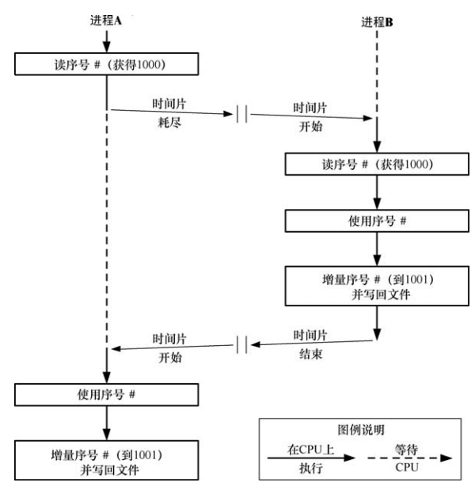

# 概述

应用程序的一个常见需求是从一个文件中读取一些数据，修改这些数据，然后将这些数据写回文件。但是当多个进程同时更新一个文件时问题就出现了。

例如，执行下面的序列：

- 从文件中读取序号
- 使用这个序号完成应用程序定义的任务
- 递增这个序号并将其写回文件



在多个进程同时操作同一份文件的过程中，很容易导致文件中的数据混乱，需要锁操作来保证数据的完整性。

尽管可以使用（比如说）信号量来完成所需的同步，但通常文件锁更好一些，因为内核能够自动将锁与文件关联起来。

# 使用 `flock()` 给文件加锁

尽管 `fcntl()` 提供的功能涵盖了 `flock()` 的功能，但这里仍需要对其进行介绍，因为在一些应用程序中仍然使用 `flock()` 并且其在继承和锁释放方面的一些语义与 `fcntl` 不同。

```
#include <sys/file.h>

int flock(int fd, int operation);
```

- `flock()` 系统调用在整个文件上放置一个锁。待加锁的文件是通过传入 `fd` 的一个打开的文件描述符指定的。`flock()` 中 `operation` 参数的可取值如下：


- 默认情况下，如果另一个进程已经持有了文件上的一个不兼容的锁，那么 `flock()` 会阻塞。如果需要防止出现这种情况，那么可以在 `operation` 参数中对这些值取 `OR(|)`。在这种情况下，如果另一个进程已经持有了文件上的一个不兼容的锁，那么 `flock()` 就不会阻塞，相反它会返回 −1 并将 `errno` 设置成 `EWOULDBLOCK`
- 任意数量的进程可以同时持有一个文件上的共享锁，但是在同一个时刻只有一个进程能够持有一个文件上的互斥锁(即互斥锁会拒绝其他进程的互斥和共享锁请求)。下表对 `flock()` 锁的兼容规则进行了总结。这里假设进程 A 首先放置了锁，表中给出了进程 B 是否能够放置一把锁：


- 不管一个进程在文件上的访问模式是什么（读、写、或读写），它都可以在文件上放置一把共享锁或者互斥锁
- 通过再次调用 `flock()` 并在 `operation` 参数中指定恰当的值可以将既有共享锁转换成一个互斥锁锁（反之亦然）。将一个共享锁转换成一个互斥锁，在另一个进程持有了文件上的共享锁时会阻塞，除非同时指定了 `LOCL_NB` 标记
- 锁转换的过程不一定是原子的。在转换过程中首先会删除既有锁，然后创建一个新锁。在这两步之间另一个进程对一个不兼容锁的未决请求可能会满足。如果发生了这种情况，那么转换过程会被阻塞，或者在指定了 `LOCK_NB` 的情况下转换过程会失败并且进程丢失其原先持有的锁

## 锁继承与释放的语义

通过 `flock()` 调用并将 `operation` 参数指定为 `LOCK_UN` 可以释放一个文件锁。另外，锁会在相应的文件描述符被关闭之后自动被释放。但问题其实更加复杂，通过 `flock()` 获取的文件锁是与打开的文件描述而不是文件描述符会在文件本身相关联的，这意味着当一个文件描述符被复制是（通过 dup()、dup2()或一个 fcntl() F_DUPFD 操作），新文件描述符会引用同一个文件锁。比如，如果获取了fd所引用的文件上的一个锁，那么下面的代码就会释放这个锁

```
flock(fd, LOCK_EX);
newfd = dup(fd);
flock(fd, LOCK_UN);
```

如果已经通过一个特定的文件描述符获取了一个锁并创建了该文件描述符的一个或者多个副本，那么如果不显示的执行一个解锁操作，那么只有当所有描述符副本都被关闭之后所才会被释放。

如果使用 `open()` 获取第二个引用同一个文件的文件描述符，那么flock()就会将第二个文件描述符当成是一个不同的描述符。比如下面代码会在第二个 `flock()` 调用上阻塞：

```
fd1 = open("a.txt", O_RDWR);
fd2 = open("a.txt", O_RDWR);
flock(fd1, LOCK_EX);
flock(fd2, LOCK_EX); // 阻塞，因为fd1已经获取到了锁
```

当使用 `fork()` 创建一个子进程时，这些子进程会复制其父进程的文件描述符，并且与使用 `dup()` 调用之类的函数复制的描述符一样，这些描述符会引用同一个打开的文件描述，进而会引用同一个锁。比如，下面代码会导致子进程删除父进程的锁：

```
flock(fd, LOCK_EX);  // 父进程获取锁
if(fock() == 0){
	flock(fd, LOCK_UN); // release lock shared with parent
}
```

有时候可以利用这些语义来将一个文件锁从父进程（原子地）传输到子进程：在 `fork()` 之后，父进程关闭其文件描述符，然后锁就只在子进程的控制之下了。

通过 `flock()` 创建的锁在 `exec()` 中会得到保留（除非在文件描述符上设置了 `close-on-exec` 标记并且该文件描述符是最后一个引用底层的打开的文件描述的描述符）。

## `flock()` 的限制

- 只能对整个文件加锁。这种粗粒度的加锁会限制协作进程之间的并发性。例如，假设存在多个进程，其中各个进程都想要同时访问同一个文件的不同部分，那么通过 `flock()` 加锁会不必要地阻止这些进程并发完成这些操作
- 通过 `flock()` 只能放置劝告式锁
- 很多 NFS 实现不识别 `flock()` 放置的锁

# 使用 `fcntl()` 给记录加锁

使用 `fcntl()` 能够在一个文件的任意部分上放置一把锁，这个文件部分既可以是一个字节，也可以是整个文件。这种形式的文件锁被称为记录加锁，但这种称谓是不恰当的，因为 UNIX 上的文件是一个字节序列，并不存在记录边界的概念，文件记录的概念只存在应用程序中。


用来创建或删除一个文件锁的 `fcntl()` 调用的常规形式：

```
struct flock flockstr;

/* Set fields of 'flockstr' to describe lock to be placed or removed */

fcntl(fd,cmd,&flockstr);  //@ fd 参数是一个打开着的文件描述符，它引用了待加锁的文件
```

**`flock` 结构**

`flock` 结构定义了待获取或者删除的锁： 

```
struct flock {
    ...
    short l_type;    /* Type of lock: F_RDLCK, F_WRLCK, F_UNLCK */
    short l_whence;  /* How to interpret l_start: SEEK_SET, SEEK_CUR, SEEK_END */
    off_t l_start;   /* Starting offset for lock */
    off_t l_len;     /* Number of bytes to lock */
    pid_t l_pid;     /* PID of process blocking our lock
};
```

- `l_type` 字段表示需放置的锁的类型，其取值为：


- 从语义上来讲，读（`F_RDLCK`）和写（`F_WRLCK`）锁对应于 `flock()` 施加的共享锁和互斥锁，并且它们遵循着同样的兼容性规则：任何数量的进程能够持有一块文件区域上的读锁，但只有一个进程能够持有一把写锁，并且这把锁会将其他进程的读锁和写锁排除在外

- 为了在一个文件上放置一把读锁就必须要打开文件以允许读取。类似地，要放置一把写锁就必须要打开文件以允许写入。要放置两种锁就必须要打开文件以允许读写（`O_RDWR`）。试图在文件上放置一把与文件访问模式不兼容的锁将会导致一个 `EBADF` 错误

- `l_whence`、`l_start` 以及 `l_len` 字段一起指定了待加锁的字节范围：
  - `l_whence` 指定相对起点，`l_start` 字段指定了文件中的一个偏移量：
    - `SEEK_SET`: `l_start` 相对于文件的开头解释
    - `SEEK_CUR`: `l_start` 相对于文件的当前字节读写指针位置解释；`l_start` 可以是一个负数，只要最终得到的文件位置不会小于文件的起始位置（字节 0）即可。
    - `SEEK_END`：`l_start` 相对于文件的开头末尾；`l_start` 可以是一个负数，只要最终得到的文件位置不会小于文件的起始位置（字节 0）即可
  - `l_len` 指定从该偏移开始的连续字节数(指定待加锁的字节数)，其起始位置由 `l_whence` 和 `l_start ` 定义
    - 长度为0表示从字节偏移开始到文件偏移的最大可能值
    - 对文件结尾之后并不存在的字节进行加锁是可以的，但无法对在文件起始位置之前的字节进行加锁
  - 锁住整个文件的两种方式：
    - 指定`l_whence`=`SEEK_SET`，`l_start=0, l_len=0`（常用）
    - 使用 `lseek` 将读写指针定位到文件头，然后指定`l_whence`=`SEEK_CUR`，`l_start=0, l_len=0`

一般来讲，应用程序应该支只对所需的最小字节范围加锁，这样其他进程就能够同时对同一个文件的不同区域进行加锁，进而取得更到的并发性。

**cmd 参数**

cmd 参数用于记录上锁的命令，一共有三个值：

- `F_SETLK` ：获取（`l_type`成员为`F_RDLCK/F_WRLCK`）或者释放（`l_type`成员为`F_UNLCK`）由 `flockstr` 指定的字节上的锁。如果另一个进程持有了一把待加锁的区域中任意部分上的不兼容的锁时，`fcntl()` 就会失败并返回 `EAGAIN` 错误。在一些 UNIX 实现上 `fcntl()` 在碰到这种情况时会失败并返回 `EACCES` 错误。SUSv3 允许实现采用其中任意一种处理方式，因此可移植的应用程序应该对这两个值都进行测试
- `F_SETLKW` ：与`F_SETLK`类似，唯一不同的是如果无法获取该锁授予调用进程，该调用进程将阻塞直到能够获取：内核会将调用进程拖入睡眠，直到该锁可用，然后唤醒它。如果正在处理一个信号并且没有指定 `SA_RESTART`，那么 `F_SETLKW` 操作就可能会被中断（即失败并返回 `EINTR` 错误）。开发人员可以利用这种行为来使用 `alarm()` 或 `setitimer()` 为一个加锁请求设置一个超时时间
- `F_GETLK`：检测是否可以在一个给定的区域上放置一把锁，但实际不获取这把锁。`l_type` 字段的值必须为 `F_RDLCK` 或 `F_WRLCK`，在返回时它包含了有关释放能够放置指定的锁的信息。如果允许加锁（即在指定的文件区域上不存在不兼容的锁），那么在 `l_type` 字段中会返回 `F_UNLCK`，并且剩余的字段会保持不变。如果在区域上存在一个或多个不兼容的锁，那么 `flockstr` 会返回与那些锁中其中一把锁（无法确定是哪把锁）相关的信息，包括其类型（`l_type`）、字节范围（`l_start` 和 `l_len`；`l_whence` 总是返回为 `SEEK_SET`）以及持有这把锁的进程的进程 ID（`l_pid`）

注意，在使用 `F_GETLK` 之后接着使用 `F_SETLK` 或 `F_SETLKW` 的话就可能会出现竞争条件，因为在执行后面一个操作时，`F_GETLK` 返回的信息可能已经过时了，因此 `F_GETLK` 的实际作用比其一开始看起来的作用要小很多。即使 `F_GETLK` 表示可以放置一把锁，仍然需要为 `F_SETLK` 返回一个错误或 `F_SETLKW` 阻塞做好准备。

**锁获取和释放的细节**

有关获取和释放由 `fcntl()` 创建的锁方面需要注意以下几点：

- 解锁一块文件区域总是会立即成功。即使当前并不持有一块区域上的锁，对这块区域解锁也不是一个错误
- 在任意时刻，一个进程只能持有一个文件的某个特定区域上的一种锁。在之前已经锁住的区域上放置一把新锁会不发生任何事情（新锁的类型与既有锁的类型是一样的）或原子地将既有锁转换成新模式。在后一种情况中，当一个读锁转换成写锁时需要为调用返回一个错误（`F_SETLK`）或阻塞（`F_SETLKW`）做好准备
- 一个进程永远无法将自己锁在一个文件区域之外，即使通过多个引用同一文件的文件描述符放置锁也是如此
- 在已经持有的锁中间放置一把模式不同的锁会产生三把锁：在新锁的两端会创建两个模式为之前模式更小一点的锁，如下图所示：


## 死锁

在使用 `F_SETLKW` 时要避免小心死锁。如果内核不对这种情况进行抑制，那么会导致两个进程永远阻塞。为避免这种情况，内核会对 `F_SETLKW` 发起的每个新锁请求进行检测以判断是否会导致死锁。如果会，那么内核就会选中其中一个被阻塞的进程使其 `fcntl()` 调用接触阻塞并返回 `EDEADLK`：


## 锁的限制和性能

SUSv3 允许一个实现为所能获取的记录锁的数量设置一个固定的，系统级别的上限。当到达这个限制时，`fcntl()` 就会失败，并返回 `ENOLCK` 错误，Linux 并没有为所能获取的记录锁的数量设置一个上限，置于具体数量则受限于内存数量。

每个打开着的文件都有一个关联链表，链表中保存着该文件上的锁，列表中的锁会先按照进程 ID 再按照起始偏移量来排序：


每次需要在这个数据结构中添加一把新锁时，内核必须要检查是否与文件上的既有锁冲突，这个过程是从列表头开始顺序展开的。

假设有大量的锁随机地分布在很多进程中，那么就可以说，添加或者删除一个锁所需的时间与文件上已有锁的数量之间大概是线性关系。

## 锁继承和释放的语义

`fcntl()` 记录锁继承和释放的语义与使用 `flock()` 创建的锁的继承和释放的语义是不同的，以下几点需要注意：

- 锁不能通过 `fork()` 子进程继承。因为锁和进程ID紧密关联，而父子进程有不同的进程ID。这与 `flock()` 不同，`flock()` 时，子进程会继承一个引用同一把锁的引用并且能够释放这把锁，从而导致父进程也会失去这把锁
- 记录锁在 `exec()` 中会得到保留
- 一个进程中的所有线程会共享同一组记录锁。
- 记录锁同时与一个进程和一个 `i-node` 关联。从这种关联关系可以得出结果是当一个进程终止之后，其所有记录锁会被释放。另一个推论是当一个进程关闭了一个描述符之后，进程持有的对应文件上的锁会被释放，不管这些锁是通过哪个文件描述符获得的。比如下面代码中，`colse(fd2)` 调用会释放调用进程持有的 `testfile` 文件上的锁，尽管这把锁是通过文件描述符 `fd1` 获得的：

```
struct flock f1;

f1.l_type = F_WRLCK;
fl.l_whence = SEEK_SET;
fl.l_start = 0;
fl.l_len = 0;
fd1 = open("testfile", O_RDWD);
fd2 = open("testfile", O_RDWD);

if(fcntl(fd1, cmd, &f1) == -1){
	perror("testfile");
	exit(EXIT_FAILURE);
}

close(fd2);
```

`dup()`、`dup2()` 以及 `fcntl()` 都可以用来获取一个打开着的文件描述符的副本。除了执行一个显式的 `close()` 之外，一个描述符在设置了 `close-on-exec` 标记时会被一个 `exec()` 调用关闭，或者也可以通过一个 `dup2()` 调用来关闭其第二个文件描述符参数，当然前提是该描述符已经被打开了。

## 锁定饿死和排队加锁请求的优先级

Linux上的规则如下：

- 排队的锁请求被准予的顺序是不确定的。如果多个进程正在等待加锁，那么它们被满足的顺序取决于进程的调度
- 写者并不比读者拥有更高的优先权，反之亦然

在其他系统上这些论断可能就是不正确的了。在一些 UNIX 实现上，锁请求的服务是按照 FIFO 的顺序来完成的，并且读者比写者拥有更高的优先权。

# 强制加锁

以上介绍的锁都是劝告式加锁，这意味着一个进程可以自由地忽略 `fcntl()` 或 `flock()` 的使用或简单地在文件上执行  IO。内核不会阻止进程的这种行为。

使用劝告式锁，需要注意：

- 为文件设置合适的所有权或组所有权以及权限以防止非协作进程执行文件 IO
- 通过在执行 IO 之前获取恰当的锁来确保构成应用程序的进程相互协作

Linux 也允许 `fcntl()` 记录锁是强制式的，这表示需对每个文件 IO 操作进行检查以判断其他进程在执行 IO 所在的文件区域上是否持有任何不兼容的锁。

通过在挂载文件系统时使用 `-o mand` 选项能够在该文件系统上启用强制式加锁：

```
mount -o mand /dev/sda10 /testfs
```

通过下面的命令可以看出一个挂载文件系统是否启用了强制式加锁：

```
mount | grep sda10
```

在 shell 中可以按照下面的方法在一个文件上启用强制式加锁：

```
chmod g+s,g-x 	/testfs/file
```

在一个程序中可以通过使用 `chmod()` 或者 `fchmod()` 恰当地设置文件上的权限来启用该文件上的强制式加锁。

## 强制式加锁对文件 IO 操作的影响

如果在一个文件上启用了强制式加锁，那么执行数据传输(`read()` 或者 `write()`)调用在碰到冲突时：

- 如果以阻塞模式打开了文件，那么系统调用就会阻塞
- 如果在打开文件时使用了 `O_NONBLOCK` 标记，那么系统调用就会立即失败并返回 `EAGAIN` 错误

使用 `O_TRUNC` 标记 `open()` 一个文件在存在其他进程持有该文件任意部分上的一个读锁或者写锁时会立即失败，返回 `EAGAIN` 错误。

如果存在进程持有了一个文件任意部分上的强制式读锁或写锁，那么就无法在该文件上创建一个共享内存映射。同样，如果一个文件参与了一个共享内存映射，那么就无法在该文件的任意部分上放置一把强制式锁。在这两种情况下，相关的系统调用立即失败，并返回 `EAGAIN` 错误。

## 强制式加锁警告

强制式加锁存在一些缺陷和问题：

- 在一个文件上持有一把强制式锁并不能阻止其他进程删除这个文件，因为只要在父目录上拥有合适的权限就能够与一个文件断开链接
- 在一个可公开访问的文件上启用强制式加锁之前需三思，因为即使是特权进程也无法覆盖一个强制锁
- 使用强制式加锁存在性能开销，在启用了强制式加锁的文件上执行的每个 IO 系统调用中，内核都必须要检查在文件上是否存在冲突的锁，如果文件上存在大量的锁，那么这种检查工作会极大降低 IO 系统调用效率
- 强制式加锁还会在应用程序设计阶段造成额外开销，因为需要处理每个 IO 系统调用返回的 `EAGAIN` (非阻塞 IO) 或 `EDEADLK` (阻塞 IO) 错误的情况
- 因为在当前的 Linux 实现上存在一些内核竞争条件，因此在有些情况下执行 IO 操作的系统调用在文件上存在本应该拒绝这些操作的强制式锁时也能成功

总的来说，应该尽可能避免使用强制式锁。

# `/proc/locks` 文件

通过检查 Linux 特有的 `/proc/locks` 文件中的内容能够查看系统中当前存在的锁。

`/proc/locks` 文件显示了使用 `flock()` 和 `fcntl()` 创建的锁的相关信息，每个锁包含 8 个字段：

- 锁在该文件上所有锁中的序号
- 锁的类型。其中 `FLOCK` 表示 `flock()` 创建的锁，`POSIX` 表示 `fcntl()` 创建的锁
- 锁的模式，其值是 `ADVISORY` 或 `MANDATORY`
- 锁的类型，其值是 `READ` 或 `WRITE`（对应于 `fcntl()` 的共享锁和互斥锁）
- 持有锁的进程的进程 ID
- 三个用冒号分隔的数字，它们标识出了锁所属的文件。这些数字是文件所处的文件系统的主要和次要设备号，后面跟着文件的 `i-node` 号
- 锁的起始字节。对于 `flock()` 锁来讲，其值永远是 0
- 锁的结尾字节。其中 `EOF` 表示锁延伸到文件的结尾（即对于 `fcntl()` 创建的锁来讲是将 `l_len` 指定为 0）。对于 `flock()` 锁来讲，这一列的值永远是 `EOF`

# 仅运行一个程序的单个实例

一些程序，特别是很多 daemon，需要确保同一时刻只有一个程序实例在系统中运行。完成这项任务的一个常见方法是让 daemon 在一个标准目录中创建一个文件并在该文件上放置一把写锁。daemon 在其执行期间一直持有这个文件上并在即将终止之前删除这个文件。如果启用了 daemon 的另一个实例，那么它在获取该文件上的写锁时就会失败，其结果是它会意识到 daemon 的另一个实例肯定正在运行，然后终止。

很多网络服务器采用了另一种常规做法，即当服务器绑定的众所周知的 socket 端口号已经被使用时就认为该服务器实例已经处于运行状态了。

`/var/run` 目录通常是存放此类锁文件的位置。或者也可以在 daemon 的配置文件中加一行来指定文件的位置。

通常，daemon 会将其进程ID写入锁文件，因此这个文件在命名时通常将 `.pid` 作为扩展名（如 `syslogd` 会创建文件 `/var/run/syslogd.pid`）。

# 老式加锁技术

## `open(file,O_CREAT | O_EXCL,...)` 加上 `unlink(file)`

SUSv3 要求使用 `O_CREAT` 和 `O_EXCL` 标记的 `open()` 调用有原子地执行检查文件的存在性以及创建文件两个步骤。这意味着如果两个进程尝试在创建一个文件时指定这些标记，那么保证只有一个进程能够成功调用。

获取锁可通过成功地使用 `O_CREAT` 和 `O_EXCL`  标记打开文件文件后，立即跟着一个 `close()` 来完成。

释放锁可以通过使用 `unlink()` 来完成。

局限：

- 如果 `open()` 失败，表示其他进程拥有了锁，那么就必须要在某种循环中重试  `open()` 操作
- 使用 `open()` 和 `unlink()` 获取和释放锁涉及到文件系统操作，这比记录锁慢的多
- 如果一个进程意外终止并且没有删除锁文件，那么锁就不会被释放
- 如果使用多个锁文件，那么就无法检测出死锁，一旦死锁，将导致造成死锁的进程永久阻塞

## `link(file,lockfile)` 加上 `unlink(lockfile)`

`link()` 系统调用在新链接已经存在时会失败的事实可用作一种加锁机制，而解锁还是借助于 `unlink()` 完成。

如果 `link()` 调用成功，表示获取了锁，如果失败(`EEXIST`)，那么就表示另一个进程持有了锁，因此必须在稍后某个时刻重试获取锁。


