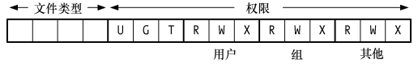
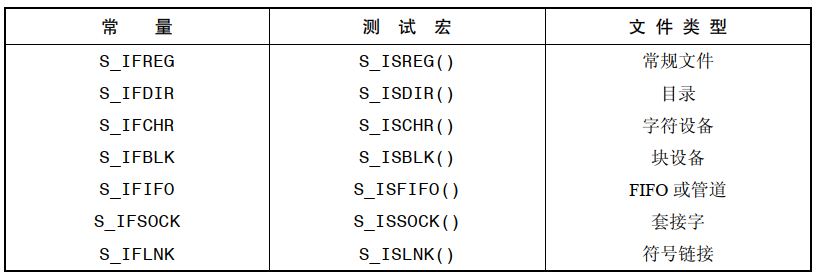
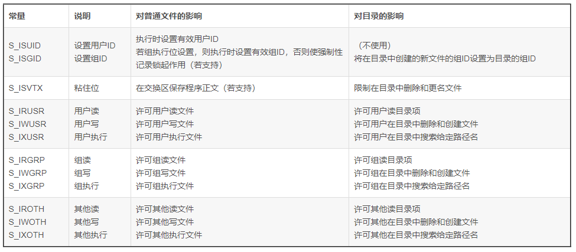
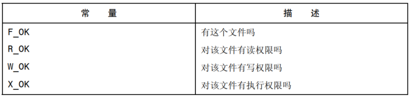
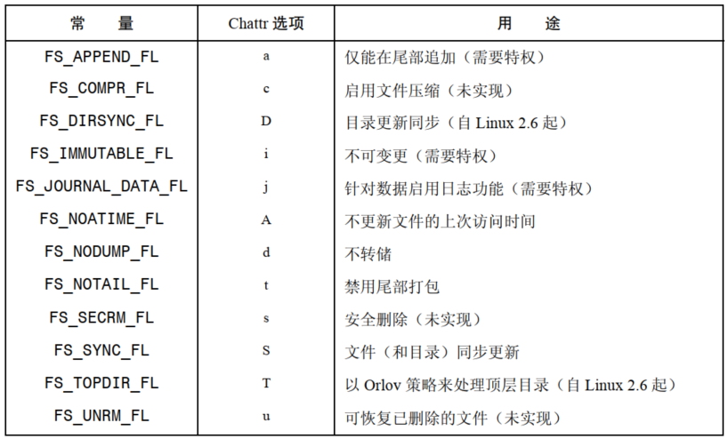

# 获取文件信息

```
#include <sys/types.h>
#include <sys/stat.h>
#include <unistd.h>

int stat(const char *pathname, struct stat *buf);
int fstat(int fd, struct stat *buf);
int lstat(const char *pathname, struct stat *buf);
```

- `stat()` 返回所命名文件的相关信息
- `lstat()` 与 `stat()` 类似，区别在于如果文件属于符号链接，那么所返回的信息针对的是符合链接自身，而非符号链接所指向的文件
- `fstat()` 返回由某个打开文件描述符所指代的文件的相关信息
- `stat()` 和 `lstat()` 无需对其所操作的文件本身拥有任何权限，但针对指定的 `pathname` 的父目录要有执行权限，而 `fstat()` 只要文件描述符有效，总是成功
- `struct stat`：

```
struct stat {
    dev_t     st_dev;         /* ID of device containing file */
    ino_t     st_ino;         /* inode number */
    mode_t    st_mode;        /* protection */
    nlink_t   st_nlink;       /* number of hard links */
    uid_t     st_uid;         /* user ID of owner */
    gid_t     st_gid;         /* group ID of owner */
    dev_t     st_rdev;        /* device ID (if special file) */
    off_t     st_size;        /* total size, in bytes */
    blksize_t st_blksize;     /* blocksize for filesystem I/O */
    blkcnt_t  st_blocks;      /* number of 512B blocks allocated */

    /* Since Linux 2.6, the kernel supports nanosecond
    precision for the following timestamp fields.
    For the details before Linux 2.6, see NOTES. */

    struct timespec st_atim;  /* time of last access */
    struct timespec st_mtim;  /* time of last modification */
    struct timespec st_ctim;  /* time of last status change */

    #define st_atime st_atim.tv_sec      /* Backward compatibility */
    #define st_mtime st_mtim.tv_sec
    #define st_ctime st_ctim.tv_sec
};
```

## 设备 ID 和 i 节点号

`st_dev` 标识文件所驻留的设备。`st_ino` 包含了文件的 `i` 节点号。利用这两者可在所有文件系统中唯一标识某个文件。

`dev_t` 类型记录了设备的主、辅 ID，使用 `major()` 和 `minor()` 可分别提取。

针对设备的 `i` 节点，`st_rdev` 字段则包含了设备的主、辅 ID。

## 文件所有权

`st_uid` 和 `st_gid` 分别标识文件的属主(用户 ID)和属组(组 ID)。

## 链接数

`st_nlink` 包含了指向文件的硬链接数。

## 文件类型和权限

`st_mode` 包含位掩码，具有标识文件类型和文件权限的双重作用：



与 `S_IFMT`  相与 `&` 可从该字段中析取文件类型。

```
if((statbuf.st_mode & S_IFMT) == S_IFREG)
	printf("regular file\n");

//@ 可以简写为
if(S_ISREG(statbuf.st_mode))
	printf("regular file\n");
```



- 想要从 `<sys/stat.h>` 中获得 `S_IFSOCK` 和  `S_ISSOCK` 的定义，必须定义 `_BSD_SOURCE`，或是将 `_XOPEN_SOURCE` 定义不小于 500 的值

## 文件大小、已分配块以及最优 IO 块大小

`st_size` ：

- 对于常规文件， 表示文件的字节数
- 对于符合链接，则表示链接所指路径名的长度，以字节位单位
- 对于共享内存对象，该字段则表示对象的大小

`st_blocks` ：

- 表示分配给文件的磁盘块的总块数，块大小为 512 字节，其中包括了为指针所分配的空间。现代的 UNIX 文件系统则使用更大尺寸的逻辑块，例如：1024,2048,4096 字节，其取值总是 2,4,8 的倍数
- 如果文件中内含空洞，该值将小于从相应文件字节数字段 `st_size` 的值
- `du -k file` 可以获取这个值，单位是 KB

`st_blksize`：

- 文件进行 IO 操作时的最优块大小，单位是字节，如果所采用的块大小小于这个值，则视为低效
- 一般 `st_blksize` 是 4096

## 文件时间戳

`st_atime` ： 文件上次访问时间

`st_mtime` ： 文件上次修改时间

`st_ctime` ： 文件状态发生改变的上次时间

# 文件时间戳

glibc API 自版本2.3以后将`st_atime`，`st_mtime`，`st_ctime`每个时间字段都定义为 `timespec` 结构，精度为纳秒。

## 使用 `utime()` 和 `utimes()` 改变文件时间戳

```
#include <sys/types.h>
#include <utime.h>

int utime(const char *filename, const struct utimbuf *times);
```

- `utime()` 可显式修改存储于文件 `i` 节点中的文件上次访问时间戳和上次修改时间戳
- `filename` 标识欲修改时间的文件，若该参数是符号链接，则会进一步解引用
- `buf` 可以是  `NULL`，也可以是指向 `utimbuf` 结构的指针：

```
 struct utimbuf {
               time_t actime;       /* access time */
               time_t modtime;      /* modification time */
           };
```

- 如果 `buf` 为  `NULL`，会将文件的上次访问和修改时间同时置为当前时间，
- 如果 `buf` 为指向 `utimbuf` 结构指针，则会使用该结构的相应字段区更新文件上次访问和修改时间

```
#include <sys/time.h>

int utimes(const char *filename, const struct timeval times[2]);
```

- 与 `utimbuf()` 的差别是 `utimes` 指定的时间戳精度是微妙级

```
#include <sys/time.h>

int futimes(int fd, const struct timeval tv[2]);

int lutimes(const char *filename, const struct timeval tv[2]);
```

- `futimes()` 使用打开文件描述符 `fd` 来指定文件
-  `lutimes()` 使用路径名来指定文件，如果路径名是一个符号链接，则调用不会对该链接解应用，而是更改链接自身的时间戳

## 使用 `utimensat()` 和 `futimens()` 改变文件时间戳

`utimensat()` 和 `futimens()` 优势：

- 可按纳秒精度设置时间戳
- 可独立设置某一个时间戳
- 可独立将任一时间戳设置为当前时间

```
#include <fcntl.h> /* Definition of AT_* constants */
#include <sys/stat.h>

int utimensat(int dirfd, const char *pathname,const struct timespec times[2], int flags);
```

- 如果将 `times` 指定为 `NULL`，则会将以上两个文件时间戳都更新为当前时间
- 如果 `times` 不是 `NULL`，则 `times[0]` 放置新的上次访问时间，在 `times[1]` 放置新的上次修改时间
- `struct timespec`：

```
 struct timespec {
               time_t tv_sec;        /* seconds */
               long   tv_nsec;       /* nanoseconds */
           };
```

- 如果想将时间戳之一设置为当前时间，则可将相应的 `tv_nsec` 字段指定为 `UTIME_NOW`，若希望某一时间戳保持不变，则可将相应的 `tv_nsec` 字段指定为 `UTIME_OMIT`，一旦指定，都将忽略 `tv_sec` 字段
- `dirfd` 指定为 `AT_FDCWD`，此时对 `pathname` 参数的解读与 `utimes()` 相类似，或者也可以将其指定为目录的文件描述符
-  `flags` 参数可以是0，或者 `AT_SYMLINK_NOFOLLOW`，意即当 `pathname` 为符号链接时不会对其解引用

```
#include <fcntl.h> /* Definition of AT_* constants */
#include <sys/stat.h>

int futimens(int fd, const struct timespec times[2]);
```

- `futimens()` 可以更新打开文件描述符 `fd` 所指代文件的各个时间戳

# 文件属主

## 新建文件的属主

文件创建时，其用户 ID 取自进程的有效用户 ID，新建文件的组 ID 取自进程的有效组 ID。

装配 `ext2` 文件系统时，`mount` 命令的参数：

- `-o grpid` 或者 `-o bsdgroups` ： 新建文件的组 ID 取自父目录
- `-o nogrpid` 或者 `-o sysvgroups` ：
  - 设置了父目录的  `set-group-ID` 新建文件的组 ID 取自父目录
  - 没有设置父目录的  `set-group-ID` 新建文件的组 ID 取自进程的有效组 ID，这也是默认行为

## 改变文件属主

```
#include <unistd.h>

int chown(const char *pathname, uid_t owner, gid_t group);
int fchown(int fd, uid_t owner, gid_t group);
int lchown(const char *pathname, uid_t owner, gid_t group);
```

- `chown()` 改变 `pathname` 参数命名文件的所有权
- `fchown()` 作用与 `chown()` 相同，不同之处在于若参数 `pathname` 为符号链接，则将会改变链接文件本身的所有权，而与该链接所指代的文件无关
- `chown()` 改变 `fd` 参数指定的打开文件的所有权
- `owner` 和 `group` 分别指代用户 ID 和 组 ID，若只想改变其中一个，只需将另一个参数设置为 `-1`
- 只有特权级进程才能使用 `chown()`，非特权级进程可使用  `chown()` 将自己拥有文件的组 ID改为其所从属任一属组的 ID，前提是进程的有效用户 ID 与 文件的用户 ID 相匹配

# 文件权限

## 普通文件的权限

文件权限掩码：

- `Owner` ：授予文件属主的权限
- `Group` ：授予文件属组成员用户的权限
- `Other` ：授予其他用户的权限

每一类用户授予权限：

- `Read` ： 可阅读文件的内容
- `Write` ： 可更改文件的内容
- `Execute` ： 可执行文件的内容



## 目录权限

目录和文件拥有相同的权限方案，只是对3种权限的含义另有所指：

- 读权限：可列出目录下的内容
- 写权限：可在目录内创建、删除文件
- 可执行权限：可访问目录中的文件

## 权限检查算法

检查好文件权限时，内核遵循的规则：

- 特权进程，授予其所有访问权限
- 若进程的有效用户 ID 与文件的用户 ID 相同，内核会根据文件的属主权限，授予进程相应的访问权限
- 若进程的有效组 ID 或任一附属组 ID 与文件的组 ID 相匹配，内核会根据文件的属组权限，授予进程对文件的相应访问权限
- 以上皆不满足时，内核会根据文件的其他权限，授予进程相应权限

内核会依次执行属主、属组以及其他用户的权限检查，只要匹配上述规则之一，就会停止检查。

## 检查对文件的访问权限

```
#include <unistd.h>

int access(const char *pathname, int mode);
```

- `pathname` 如果是符号链接，将对其解引用



## Sticky 位

旧的 UNIX 实现中，提供 `Sticky` 位让常用程序的运行速度更快，如果设置了该位，在首次执行程序时，系统会将其文本拷贝保存到交换区中，即 "粘"  在交换区，故而能够提高后续执行的加载速度。

现状 UNIX 的实现，`Sticky` 位作用于目录，起到=限制删除位的作用，位目录设置这个位，则表明只有当非特权进程具有对目录的写权限，并且为文件或目录的属组时，才能对目录下的文件进行删除和重命名。

`chmod + t file`  可以设置文件的 `Sticky` 位，`ls -l` 将会看到 `T`。

## 进程的文件模式创建掩码

进程的 `umask` 通常继承自父 shell，可以使用 `umask` 命令进行修改，大多数 shell  将其默认值设置为 `022`，表示对于同组或其他用户，总是屏蔽写权限，如果 `open()` 指定 `mode` 参数为 `0666`，那么对于新建文件来说，其属主拥有读、写权限，所有其他用户只有读权限。

```
#include <sys/types.h>
#include <sys/stat.h>

mode_t umask(mode_t mask);
```

- `umask()` 调用总是成功的，并且返回当前进程的前一 `umask`

## 更改文件权限

 ```
 #include <sys/stat.h>
 
 int chmod(const char *pathname, mode_t mode);
 int fchmod(int fd, mode_t mode);
 ```

- `chmod()` 更改由 `pathname` 指定的文件权限，如果是符号链接，则会改变符号链接所指代文件的访问权限，而非对符号链接自身的访问权限
-  `chmod()` 更改由 `fd` 指定的打开文件权限

# i 节点标志(ext2 扩展文件属性)

某些 Linux 文件系统允许为文件和目录设置各种各样的 inode flags，该特性是一种非标准的 Linux 扩展功能。

`chattr` 和 `lsattr` 命令可以设置和查看 `i`  节点标志。

程序中可以使用 `ioctl()` 系统调用来获取并修改 `i`  节点标识。

对普通文件或目录均可设置 `i` 节点标识，大多数 `i` 节点标识是供普通文件使用的，也有少部分供目录使用。



- `FS_APPEND_FL` ：仅当指定 `O_APPEND` 标志时，方能打开文件并写入(因而迫使所有对文件的更新都追加到文件尾部)
- `FS_COMPR_FL` ： 文件内容经过压缩后存储与磁盘之上
- `FS_DIRSYNC_FL`  ：使得对目录的更新同步发生
- `FS_IMMUTABLE_FL` ：将文件设置为不可更改，既不能更新文件数据也不能改变文件的元数据，只有特权级进程可为文件设置这一标志，但该标志一旦设定，即便是特权级进程也无法改变文件的内容或元数据
- `FS_JOURNAL_DATA_FL` ：对数据启用日志功能，只有 `ext3` 和 `ext4` 文件系统才支持这个标志，提供 3 种层次的日志记录：
  - `journal` 日志
  - `ordered` 排序
  - `writeback` 回写
- `FS_NOATIME_FL` ：访问文件时不更新文件的上次访问时间
- `FS_NODUMP_FL` ：在使用 `dump` 备份系统时跳过具有此标志的文件
- `FS_NOTAIL_FL` ：禁用尾部打包
- `FS_SECRM_FL` ：安全删除文件
- `FS_SYNC_FL` ：令对文件的更新保持同步
- `FS_TOPDIR_FL` ：这标志着将在 Orlov 块分配策略的指导下对某一目录进行特殊处理
- `FS_UNRM_FL` ：允许该文件在遭删除后得以恢复


