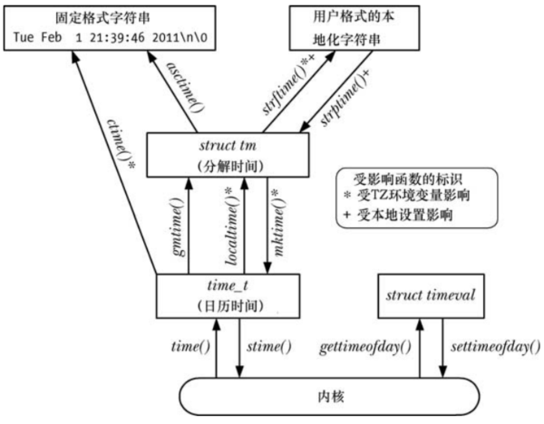
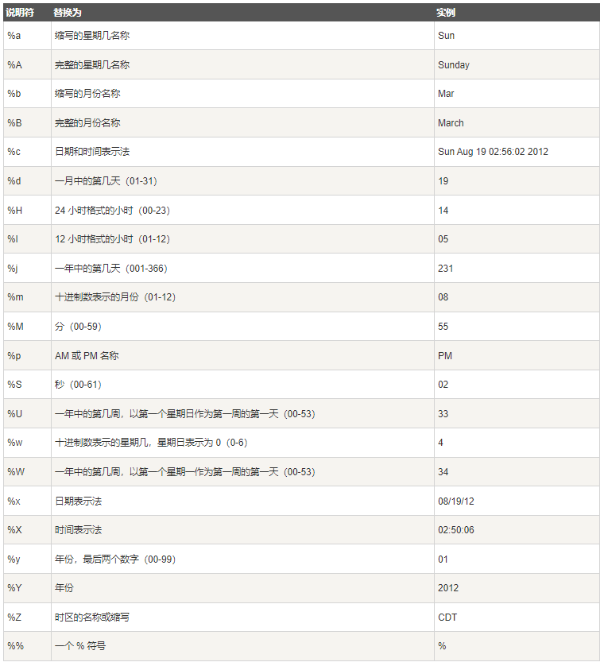

程序可能会关注两种时间类型：

- 真实时间，度量这一时间的起点：
  - 某个标准点，称为日历时间
  - 进程生命周期内的某个固定时间点，通常为程序启动时，称为流逝时间或挂钟时间
- 进程时间，一个进程所使用的 CPU 时间总量，适用于对程序，算法性能的检查和优化

大多数计算机体系结构都内置硬件时钟，使内核得以计算真实时间和进程时间。

# 日历时间

无论地理位置如何，UNIX 系统内部对时间的表示方式均是以自 Epoch 以来的秒数来度量，Epoch 亦即通用协调时间(UTC，格林威治标准时间，或 GMT)的 1970年1月1日早晨零点。

日历时间存储的类型是  `time_t` ，在 32 位的 Linux 系统，`time_t` 是一个有符号整数，可以表示的日期范围是：1901-12-13 20:45:53 ~ 2038-01-19 03:14:07。

```
#include <sys/time.h>

int gettimeofday(struct timeval *tv, struct timezone *tz);
```

- `tv` 指向的缓冲区返回日历时间：
```
 struct timeval {
               time_t      tv_sec;     /* seconds */
               suseconds_t tv_usec;    /* microseconds */
           };
```

- 虽然 `tv_usec` 提供微妙精度，但其返回值的准确性则依赖于架构的具体实现来决定
- `tz` 用来获取系统的时区信息，目前已被废弃，应将其设置为 `NULL`，如果提供了 `tz` 参数，那么将返回一个 `timezone` 结构体，其内容是上次调用 `settimeofday()` 时传入的 `tz` 参数：
```
struct timezone {
               int tz_minuteswest;     /* minutes west of Greenwich */
               int tz_dsttime;         /* type of DST correction */
           };
```

- `tz_minuteswest` 将本时区转换为 UTC 时间所增加的分钟数，`tz_dsttime` 表示这个时区是否强制施行夏令时制，因为夏令时制度无法用一个简单加法加以表达，故而 `tz` 已遭废弃

```
#include <time.h>

time_t time(time_t *timep);
```

- `timep` 不为 NULL，会将自 Epoch 以来的秒数置于 `timep` 所指的位置
- 常使用的方式 `t = time(NULL);`

# 时间转换函数



##  将 time_t 转换为可打印格式

```
 #include <time.h>

char *ctime(const time_t *timep);
char *ctime_r(const time_t *timep, char *buf);
```

- `ctime()` 返回一个长达 26 个字节的字符串：`Sun Jun 27 11:08:37 2021`，包含换行符和终止空字节
- `ctime()` 会自动对本地时区和 DST 设置加以考虑
- `ctime()` 返回的字符串由静态分配的，是不可重入的，可重入版本为 `ctime_r()`

## time_t 和分解时间之间的转换

```
#include <time.h>

struct tm *gmtime(const time_t *timep);
struct tm *gmtime_r(const time_t *timep, struct tm *result);

struct tm *localtime(const time_t *timep);
struct tm *localtime_r(const time_t *timep, struct tm *result);
```

- `gmtime()` 能够把日历时间转换为一个对应于 UTC 的分解时间
- `localtime()` 需要考虑时区和夏令时设置，返回对应于系统本地时间的一个分解时间
- `tm` 结构：

```
  struct tm {
               int tm_sec;    /* Seconds (0-60) */
               int tm_min;    /* Minutes (0-59) */
               int tm_hour;   /* Hours (0-23) */
               int tm_mday;   /* Day of the month (1-31) */
               int tm_mon;    /* Month (0-11) */
               int tm_year;   /* Year - 1900 */
               int tm_wday;   /* Day of the week (0-6, Sunday = 0) */
               int tm_yday;   /* Day in the year (0-365, 1 Jan = 0) */
               int tm_isdst;  /* Daylight saving time */
           };
```

```
#include <time.h>

time_t mktime(struct tm *tm);
```

- `mktime()`  可能会修改 `tm` 指向的结构体，`mktime()` 不要求 `tm` 结构体的其他字段收到前述范围的限制，任何一个字段超出范围，`mktime()` 会将其调整回有效范围，并适当调整其他字段，例如 `tm_sec` 字段的值为 123，则返回时此字段的值为 3，调整 `tm_min`  字段增加 2
- `mktime()` 在进行转换时会对时区进行设置，DST 设置的使用与否取决于输入字段 `tm_isdst` 的值：
  - `tm_isdst` 为 0，则将这一时间视为标准时间
  - `tm_isdst` 大于 0，则将这时间视为夏令时
  - `tm_isdst` 小于 0，试图判定 DTS 在每年的这一时间是否生效

### 分解时间和打印格式之间的转换

### 从分解时间转换为打印格式

```
#include <time.h>

char *asctime(const struct tm *tm);
char *asctime_r(const struct tm *tm, char *buf);
```

- `asctime()` 返回一个指针，指向经由静态分配的字符串，内含时间，格式则与 `ctime()` 相同
- 相形于 `ctime()`，本地时区设置对 `asctime()` 没有影响，因为其所转换的是一个分解时间，该时间通常要么已然通过 `localtime()` 作了本地化处理，要么早已经由 `gmtime()` 转换为 UTC
- `asctime()`  无法控制其所生成字符串的格式

```
#include <time.h>

size_t strftime(char *outstr, size_t maxsize, const char *format, const struct tm *timeptr);
```

- `strftime()` 可以提供更为精确的控制，`timeptr` 指向分解时间，`strftime()` 会将以 `null` 结尾、由日期和时间组成的相应字符串置于 `outstr`  所指向的缓冲区，`format` 指定了格式化的格式化格式，`maxsize` 指定了  `outstr` 的最大长度
-  `strftime()` 不会在字符串的结尾包含终止空字节和换行符，如果结果字符串的总长度含终止空字节，超过了 `maxsize` 参数，那么 `strftime()` 会返回 0，以示错误，且此时无法确定 `outstr` 的长度




