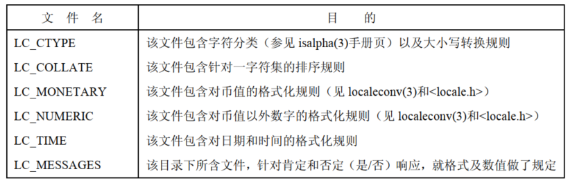

程序可能会关注两种时间类型：

- 真实时间，度量这一时间的起点：
  - 某个标准点，称为日历时间
  - 进程生命周期内的某个固定时间点，通常为程序启动时，称为流逝时间或挂钟时间
- 进程时间，一个进程所使用的 CPU 时间总量，适用于对程序，算法性能的检查和优化

大多数计算机体系结构都内置硬件时钟，使内核得以计算真实时间和进程时间。

# 日历时间

无论地理位置如何，UNIX 系统内部对时间的表示方式均是以自 Epoch 以来的秒数来度量，Epoch 亦即通用协调时间(UTC，格林威治标准时间，或 GMT)的 1970年1月1日早晨零点。

日历时间存储的类型是  `time_t` ，在 32 位的 Linux 系统，`time_t` 是一个有符号整数，可以表示的日期范围是：1901-12-13 20:45:53 ~ 2038-01-19 03:14:07。

```
#include <sys/time.h>

int gettimeofday(struct timeval *tv, struct timezone *tz);
```

- `tv` 指向的缓冲区返回日历时间：
```
 struct timeval {
               time_t      tv_sec;     /* seconds */
               suseconds_t tv_usec;    /* microseconds */
           };
```

- 虽然 `tv_usec` 提供微妙精度，但其返回值的准确性则依赖于架构的具体实现来决定
- `tz` 用来获取系统的时区信息，目前已被废弃，应将其设置为 `NULL`，如果提供了 `tz` 参数，那么将返回一个 `timezone` 结构体，其内容是上次调用 `settimeofday()` 时传入的 `tz` 参数：
```
struct timezone {
               int tz_minuteswest;     /* minutes west of Greenwich */
               int tz_dsttime;         /* type of DST correction */
           };
```

- `tz_minuteswest` 将本时区转换为 UTC 时间所增加的分钟数，`tz_dsttime` 表示这个时区是否强制施行夏令时制，因为夏令时制度无法用一个简单加法加以表达，故而 `tz` 已遭废弃

```
#include <time.h>

time_t time(time_t *timep);
```

- `timep` 不为 NULL，会将自 Epoch 以来的秒数置于 `timep` 所指的位置
- 常使用的方式 `t = time(NULL);`

# 时间转换函数


##  将 time_t 转换为可打印格式

```
 #include <time.h>

char *ctime(const time_t *timep);
char *ctime_r(const time_t *timep, char *buf);
```

- `ctime()` 返回一个长达 26 个字节的字符串：`Sun Jun 27 11:08:37 2021`，包含换行符和终止空字节
- `ctime()` 会自动对本地时区和 DST 设置加以考虑
- `ctime()` 返回的字符串由静态分配的，是不可重入的，可重入版本为 `ctime_r()`

## time_t 和分解时间之间的转换

```
#include <time.h>

struct tm *gmtime(const time_t *timep);
struct tm *gmtime_r(const time_t *timep, struct tm *result);

struct tm *localtime(const time_t *timep);
struct tm *localtime_r(const time_t *timep, struct tm *result);
```

- `gmtime()` 能够把日历时间转换为一个对应于 UTC 的分解时间
- `localtime()` 需要考虑时区和夏令时设置，返回对应于系统本地时间的一个分解时间
- `tm` 结构：

```
  struct tm {
               int tm_sec;    /* Seconds (0-60) */
               int tm_min;    /* Minutes (0-59) */
               int tm_hour;   /* Hours (0-23) */
               int tm_mday;   /* Day of the month (1-31) */
               int tm_mon;    /* Month (0-11) */
               int tm_year;   /* Year - 1900 */
               int tm_wday;   /* Day of the week (0-6, Sunday = 0) */
               int tm_yday;   /* Day in the year (0-365, 1 Jan = 0) */
               int tm_isdst;  /* Daylight saving time */
           };
```

```
#include <time.h>

time_t mktime(struct tm *tm);
```

- `mktime()`  可能会修改 `tm` 指向的结构体，`mktime()` 不要求 `tm` 结构体的其他字段收到前述范围的限制，任何一个字段超出范围，`mktime()` 会将其调整回有效范围，并适当调整其他字段，例如 `tm_sec` 字段的值为 123，则返回时此字段的值为 3，调整 `tm_min`  字段增加 2
- `mktime()` 在进行转换时会对时区进行设置，DST 设置的使用与否取决于输入字段 `tm_isdst` 的值：
  - `tm_isdst` 为 0，则将这一时间视为标准时间
  - `tm_isdst` 大于 0，则将这时间视为夏令时
  - `tm_isdst` 小于 0，试图判定 DTS 在每年的这一时间是否生效

### 分解时间和打印格式之间的转换

### 从分解时间转换为打印格式

```
#include <time.h>

char *asctime(const struct tm *tm);
char *asctime_r(const struct tm *tm, char *buf);
```

- `asctime()` 返回一个指针，指向经由静态分配的字符串，内含时间，格式则与 `ctime()` 相同
- 相形于 `ctime()`，本地时区设置对 `asctime()` 没有影响，因为其所转换的是一个分解时间，该时间通常要么已然通过 `localtime()` 作了本地化处理，要么早已经由 `gmtime()` 转换为 UTC
- `asctime()`  无法控制其所生成字符串的格式

```
#include <time.h>

size_t strftime(char *outstr, size_t maxsize, const char *format, const struct tm *timeptr);
```

- `strftime()` 可以提供更为精确的控制，`timeptr` 指向分解时间，`strftime()` 会将以 `null` 结尾、由日期和时间组成的相应字符串置于 `outstr`  所指向的缓冲区，`format` 指定了格式化的格式化格式，`maxsize` 指定了  `outstr` 的最大长度
-  `strftime()` 不会在字符串的结尾包含终止空字节和换行符，如果结果字符串的总长度含终止空字节，超过了 `maxsize` 参数，那么 `strftime()` 会返回 0，以示错误，且此时无法确定 `outstr` 的长度


### 将打印格式时间转换为分解时间

```
#define _XOPEN_SOURCE       /* See feature_test_macros(7) */
#include <time.h>

char *strptime(const char *str, const char *format, struct tm *timeptr);
```

- `strptime()` 是  `strftime()` 的逆向函数，将包含日期和时间的字符串转换成分解时间
-  `strptime()` 按照参数 `format` 内的格式要求，对由日期和时间组成的字符串 `str` 加以解析，并将转换后的分解时间置于指针 `timeptr` 所指向的结构体
- 如果成功，`strptime()` 返回一个指针，指向 `str` 中下一个未经处理的字符，如果无法匹配整个格式字符串，`strptime()` 返回 `NULL`
- `strptime()` 的格式规范类似于 `scanf`：
  - 转换字符串冠以一个 `%` 字符
  - 如包含空格字符，则意味着其可匹配零个或多个空格
  - `%` 之外的非空格字符必须和输入字符串中的相同字符严格匹配

# 时区

不同的国家和地区使用不同的时区和夏时制。

## 时区定义

时区信息存储于目录 `/usr/share/zoneinfo`，该目录下的每个文件都包含了一个特定国家或地区的时区制度的相关信息，且往往根据其所描述的时区加以命名。

系统的本地时间由时区文件 `/etc/localtime` 定义，通常链接到 `/usr/share/zoneinfo` 下的一个文件。

## 为程序指定时区

为运行中的程序指定一个时区，需要将 TZ 环境变量设置为由一个 `:` 和时区名称组成的字符串，其中时区名称定义于  `/usr/share/zoneinfo` 中。

设置时区会自动影响到函数 `ctime()`，`localtime()`，`strftime()`。

为了获取当前的时区设置，上述函数都会调用 `tzset()`，对如下三个全局变量进行了初始化：

```
extern char *tzname[2];
extern long timezone;
extern int daylight;
```

`tzset()` 首先会检查环境变量 TZ，如果三位设置该变量，那么就采用 `/etc/localtime`  中定义的默认时区来初始化时区。

如果 TZ 变量的值为空，或无法与时区文件名相匹配，那么就使用 UTC。

可将 TZDIR 环境变量设置为搜寻时区信息的目录名称，以替代默认的  `/usr/share/zoneinfo` 目录。

设置  TZ 的另一种方法：

```
std offset [ dst [offset] [, start-date [/time],end-date [/time]]]
```

- `std` 和 `dst`  部分用以标识标准和 DST  时区名称的字符串
- `offset`  表示欲转换为 UTC，需要叠加在本地时间上的正、负调整值
- 最后四个部分提供了一个规则，描述何时从标准时间变更为夏令时

```
TZ="CET-1:00:00CEST-2:00:00,M3.5.0,M10.5.0"
```

上面的形式相比于 Linux 下的专有格式则显得复杂：

```
TZ=":Europe/Berlin"
```

# 地区

对于语言、数字、货币金额、日期和时间之类的信息，不同的国家的习俗不同。locale 的定义为：用户 环境中依赖于语言和文化习俗的一个子集。

意欲在多个地理区位运行的任何程序都应处理地区概念，即国际化 internationlization，也写为 I18N。

## 地区定义

地区信息维护于 `/usr/share/local` 之下的目录层次结构，改目录下的每个子目录都包含一个特定的信息，这些目录的命名约定为：

```
language[_territory[.codeset]][@modifier]
```

- `language` 是双字母的 ISO 语言代码
- `territory` 是双字母的 ISO 国家代码
- `codeset` 表示字符编码集
- `modifier` 用以区分多个地区目录下 `labguage`、`terrtory`、`codeset` 均相同的状况

```
de_DE.utf-8@euro //@ 德语_德国。UTF-8字符编码@使用欧元作为货币单位
```

可以将地区目录名称中的相应部分省略，通常情况下，命名只包含语言和国家，例如 `en_US`。

在程序中指定要使用的地区时，实际上是指定了 `/usr/share/locale` 下某个子目录的名称，如果程序指定地区不与任何子目录名称相匹配，那么 C 语言函数库将从指定地区中剥离，以寻求匹配：

- codeset
- normalized codeset
- territory
- modifier

例如 `fr_CH.utf-8`，如果不存在以该名称命名的地区目录，那么如果 `fr_CH` 目录存在，则与之匹配，如果 `fr_CH`  不存在，那么将采用 `fr` 地区目录，如果 `fr` 目录不存在， `setlocale()`  将会报错。

每个地区子目录中包含有标准的一套文件，指定了地区的约定设置，还要注意：

- 文件 LC_COLLATE 定义了一套规则，描述了如何在一字符集内对字符排序，这些规则决定了函数 `strcoll()` 和 `strxfrm()` 
- 目录 LC_MESSAGES 是程序显示信息迈向国际化的步骤之一 



## 为程序设置地区

```
#include <locale.h>

char *setlocale(int category, const char *locale);
```

- `setlocale()` 即可以设置也可以查询程序的当前地区
- `category`  参数选择设置或查询地区的那一部分，仅能使用上面的表列出的地区类别常量名称，也可以使用 `LC_ALL` 来指定要设置的地区的所有部分的值
- `locale` 参数可能是一个字符串，指定系统上已经定义的一个地区，如 `de_DE` 或者  `en_US`，如果是空字符串，意味着将从环境变量中取得地区的设置
- `setlocale()` 返回一个指针指向标识这一类地区设置的字符串，如果需要查看地区的设置而不需要改变它，就可以指定 `locale`  为 `NULL`

# 更新系统时钟

```
#include <sys/time.h>

int settimeofday(const struct timeval *tv, const struct timezone *tz);
```

-  `settimeofday()` 和  `gettimeofday()` 是逆向操作，将 `tv` 指向的 `timeval` 结构里的秒数和微妙数，设置到系统的日历时间
- `tz` 参数已被废弃，这个参数应该始终为 `NULL`

```
#include <time.h>

int stime(const time_t *t);
```

- `stime()` 系统调用用来设置系统时钟，允许使用秒的精度来更新新的日历时间

`settimeofday()` 造成的系统时间突然变化，可能会对于依赖于系统时钟单调递增的应用造成有害的影响，出于这个原因，当对时间做微小调整时，推荐使用 `adjtime()`：

```
#include <sys/time.h>

int adjtime(const struct timeval *delta, struct timeval *olddelta);
```

- `delta` 指向一个 `timeval`  结构体，指定需要改变时间的秒和微妙数，如果是正数，那么每秒系统时间都会额外拨快一点点，直到增加完所需的时间，如果是负值，时钟以类似的方式减慢
- 在 `adjtime()` 执行的时间里，可能无法完成时钟调整，剩余未经调整的时间存放在 `olddelta` 指向的 `timeval`  结构体内，如果不关心这个值，可以指定其为  `NULL`，如果只关心当前未完成时间的校正信息，而不想改变它，可以指定 `delta` 为  `NULL`

# 软件时钟

时间相关的系统调用的精度受限于系统软件时钟的分辨率，它的度量单位是 `jiffies`，其大小是定义在内核源码的常量 HZ，这是内核按照 `round-robin` 分时调度算法分配 CPU 进程的单位。例如软件时钟速度是 100 HZ，也就是一个 jiffy  是 10 毫秒。

软件时钟频率是一个可配置的内核的选项，包括处理器类型和特性，定时器的频率

# 进程时间

进程时间是进程创建后使用的 CPU 时间数量。内核把 CPU 时间分为：

- 用户 CPU 时间是用户模式下执行所花费的时间数量，有时也称为虚拟时间，这对于程序来说，是它已经得到的 CPU 时间
- 系统 CPU 时间是内核模式中执行所花费的时间数量，这是内核用于执行系统调用或代表程序执行的其它任务的时间

使用 `time` 命令可以同时获得两个部分的时间值以及运行程序所需的实际时间。

```
#include <sys/times.h>

clock_t times(struct tms *buf);
```

- `times()`  检索进程时间信息，并把结果通过 `buf` 指向的结构体返回

```
  struct tms {
               clock_t tms_utime;  /* user time */
               clock_t tms_stime;  /* system time */
               clock_t tms_cutime; /* user time of children */
               clock_t tms_cstime; /* system time of children */
           };
```

- `tms` 结构体的前两个字段返回调用进程到目前为止使用的用户和系统组件的 CPU 时间，最后两个字段返回的信息是父进程执行了系统调用 `wait()` 的所有已经终止的子进程使用的  CPU 时间
- `clock_t` 是用时钟计时单元为单位度量时间的整型值，可以使用 `sysconf(_SC_CLK_TCK)` 来获得每秒包含的时钟计时单元，然后用这个数字除以 `clock_t` 转换为秒
- 成功时，返回自过去的任意点流逝的以时钟计时单元为单位的时间，这个返回值唯一的用法是通过计算一对 `times()` 调用返回的值得差，来计算进程执行消耗的时间，但是  `times()` 的返回值有可能溢出  `clock_t` 的有效范围，此时 `times()` 的返回值将再次从 0 开始计算，也就是稍后一个 `times()` 调用返回的值可能低于一个更早的  `times()` 调用，可靠的测量经过时间的方法是使用函数 `gettimeofday()`
- 指定 `buf` 为 `NULL`，`times()`  将返回一个函数结果，这是没有意义的

```
#include <time.h>

clock_t clock(void);
```

- `clock()` 提供了一个简单的接口用于获取进程时间，返回一个值描述了调用进程使用的总得的 CPU 时间(包括用户和系统时间)
- `clock()` 返回值得计量单位是 `CLOCK_PER_SEC` ，所以必须除以这个值来获得进程使用的 CPU 时间秒数，`CLOCK_PER_SEC` 通常是 1000
- 

 


 


