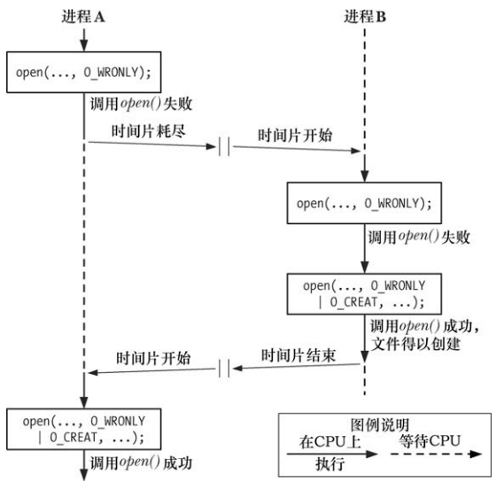
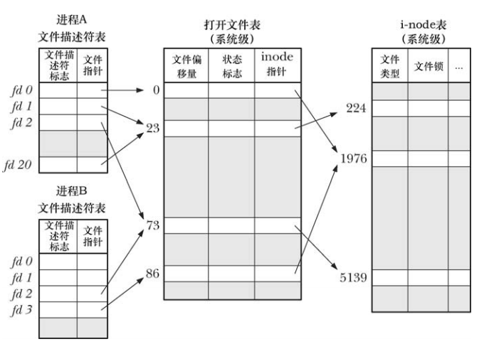
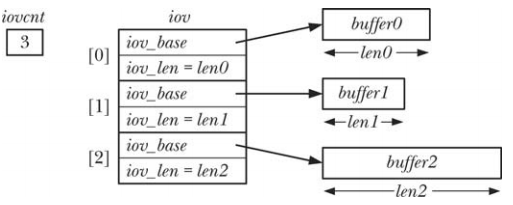

# 原子操作和竞争条件

所有的系统调用都是以原子操作方式执行的，内核保证了系统调用期间不会被其他进程或线程中断。

## 以独占方式创建一个文件

`O_EXCL` 和 `O_CREAT` 一起使用能够确保文件是进程独创的，并且是原子操作。

错误的示例：

```
fd = oepn(pathname,O_WRONLY);
if(fd != -1) //@ file exists,open succeed 
{
	close(fd);
}
else
{
	if(errno != ENOENT) //@ failed for unexpected reason
		errExit("open");
	
	fd = open(pathname,O_WRONLY | O_CREAT,0644);
	if(fd == -1)
		errExit("open");
}
```

上面的代码并非原子操作，无法保证检查文件和创建文件是原子操作，考虑下面的执行顺序：



## 向文件尾部追加数据

多个进程同时向同一个文件尾部添加数据，为了达到这一目的，考虑下面的代码：

```
if(lseek(fd,0,SEEK_END) == -1)
	errExit("lseek");
if(write(fd,buf,len) != len)
	errExit("write");
```

上面的代码移动到文件尾部和执行写入并非原子操作，执行期间可被打断，解决问题的方法就是在打开文件时指定 `O_APPEND`  标志。

# 文件控制操作

```
#include <unistd.h>
#include <fcntl.h>

int fcntl(int fd, int cmd, ... /* arg */ );
```

- `fcntl` 对一个打开的文件描述符执行一系列的控制操作
- 内核会依据 `cmd` 的类型来确定 `arg` 的类型

# 打开文件的状态标志

`fcntl()` 可以针对一个打开的文件获取或修改其访问模式和状态标志，这些值都是调用 `open()` 函数时通过 `flag` 指定的。

## 获取打开文件的状态标志

要获取这些值应该将 `cmd` 设置为  `F_GETFL`。

```
int flags,access_mode;
flags = fcntl(fd,F_GETFL);
if(flags == -1)
	errExit("fcntl");
if(flags & O_SYNC)  //@ 判断是否是同步写方式打开文件
	printf("writes are synchronized\n");
```

`O_RDONLY`，`O_WRONLY`，`O_RDWR` 不与文件状态的单个比特位对应，判定访问方式时需要使用 `O_ACCMODE` 与 `flag` 相与，其结果与三个常量进行比对：

```
access_mode =  flags & O_ACCMODE;
if(access_mode == O_WRONLY || access_mode == O_RDWR)
	printf("file is writable\n");
```

## 修改打开文件的状态标志

可以使用 `F_SETFL` 命令修改打开文件的状态标志，可以修改的标志有：

- `O_APPEND`
- `O_NONBLOCK`
- `O_NOATIME`
- `O_ASYNC`
- `O_DIRECT`
- `O_SYNC` ： 部分 UNIX 支持

系统将会忽略对其他状态标志的操作。

修改文件状态标志的适用场景：

- 文件不是由调用程序打开的，所以程序也无法通过  `open()` 来指定状态标志，比如 3 个标准输入输出中的一员
- 文件描述符是通过 `open()` 以外的系统调用得到的，比如 `pipe()` 和  `socket()`

```
int flags;
flags = fcntl(fd,F_GETFL);
if(flags == -1)
	errExit("fcntl");
flags |= O_APPEND; //@ 添加 O_APPEND 标志
if(fcntl(fd,F_SETFL,flags) == -1)
	errExit("fcntl");
```

# 文件描述符和打开文件之间的关系

文件描述符和打开的文件之间并非一对一的关系，多个文件描述符可以指向同一个文件，这些文件描述符可以在相同的或者不同的进程中打开。

内核中文件相关的三个重要数据结构：

- 进程级的文件描述符表
- 系统级的打开文件表
- 文件系统的 i-node 表

针对每个进程，内核为其维护打开文件的描述表，该表的每个条目都记录了单个文件描述符的相关信息：

- 控制文件描述符操作的一组标志，目前只支持 close-on-exec
- 对打开文件句柄的引用

内核对所有打开的文件维护一个系统级的描述表，也称为打开文件表，并将表中的各条目称为打开文件句柄，一个打开文件句柄中包含的信息：

- 当前文件的偏移量(调用 `write()` 和 `read()` 时更新，调用 `lseek()` 时直接修改)
- 打开文件时所使用的状态标志，即 `open()` 指定的 `flags` 参数
- 文件访问模式，即 `open()`  指定的只读，只写，读写模式
- 与信号驱动 IO 相关的设置
- 对该文件的 i-node  对象的引用

每个文件系统都会为驻留在其上的所有文件建立一个 i-node 表，包含的信息：

- 文件类型和访问权限
- 一个指针，指向该文件所持有的锁的列表
- 文件的各种属性，包括文件大小与不同类型操作相关的时间戳

访问一个文件时会在内存中创建 i-node 的副本，并会记录引用该 i-node 的打开文件局部数量以及该 i-node 所在的设备的主、从设备号，还包括打开文件时与文件相关的临时属性，例如文件锁。



- 进程 A `fd0`  和 `fd20` 指向同一个打开文件句柄，可能是因为调用 `dup()`，`dup2()` `fcntl()` 导致的
- 进程 A `fd2` 和进程 B `fd2` 指向同一个打开文件句柄，可能是因为调用 `fork()` 或者进程通过 UNIX 域套接字将一个打开的文件描述符传递给另一个进程
- 进程 A `fd2` 和进程 B `fd0` 指向同一个 i-node(文件)，可能是因为两个进程对同一个文件发起 `open()` 调用，同一进程两次打开同一文件也是如此

另外需要注意的是：

- 两个不同的文件描述符指向同一个打开文件句柄，将同享同一文件偏移量。无论这两个文件描述符分属于同一进程还是不同进程，情况都是如此
- 要获取和修改打开的文件标志，其作用域约束与上一条类似
- 文件描述符标志，即 close-on-exec 为进程和文件描述符私有，对这一个标志的修改不会影响同一进程或不同进程中的其他文件描述符

# 复制文件描述符

```
#include <unistd.h>

int dup(int oldfd);
```

- `dup()` 复制一个打开的文件描述符 oldfd，并返回一个新描述符，两者都指向同一打开文件句柄，系统会保证新描述符一点是编号值最低的未用文件描述符

```
#include <unistd.h>

int dup2(int oldfd, int newfd);
```

- `dup2()` 为 `oldfd` 创建副本，编号为 `newfd`。如果 `newfd`  已经被打开，`dup2()`  会首先将其关闭，并且忽略关闭期间的任何错误，更好的做法是先显式调用 `close()` 将其关闭
- 调用成功，返回 `newfd` 指定的文件描述符编号
- 如果 `oldfd` 是无效的文件描述符，调用失败将设置 `errno` 为 `EBADF` 不会关闭 `newfd`，如果 `oldfd` 有效，并且 `oldfd==newfd` 则  `dup2()`  什么也不做，返回 `newfd`

`fcntl()` 的 `F_DUPFD` 操作也可以复制文件描述符，并且更具灵活性：

```
newfd = fcntl(oldfd,F_DUPFD,startfd);
```

- 为 `oldfd` 创建副本，使用大于等于 `startfd` 的最小未使用值作为描述符编号

上述三种复制文件描述符的方法，正、副本之间共享同一个打开文件句柄所含的文件偏移量和状态标志，但是新文件描述符有自己一套文件描述符标志，且其 `close-on-exec` 标志总是处于关闭。

```
#define _GNU_SOURCE             /* See feature_test_macros(7) */
#include <fcntl.h>              /* Obtain O_* constant definitions */
#include <unistd.h>

int dup3(int oldfd, int newfd, int flags);
```

- `dup3()`  能够完成 `dup2()`  相同的工作，新增一个  `flag` ，可以修改系统调用行为的位掩码
- `dup3()` 只支持  `O_CLOEXEC`

 # 在文件特定偏移量处的 IO

```
#include <unistd.h>

ssize_t pread(int fd, void *buf, size_t count, off_t offset);
ssize_t pwrite(int fd, const void *buf, size_t count, off_t offset);
```

- `pread()` 和 `pwrite()` 完成与 `read()`  和  `write()`  类似的工作，但是两者会在 `offset` 指定的位置进行文件 IO，而非在文件的当前偏移处，并且也不会改变文件当前的偏移量
- `fd`所指代的文件必须是可定位的，即允许对文件描述符执行 `lseek()` 调用
- 使用 `pread()` 和  `pwrite()` 在多线程中可同时对同一文件描述符执行 IO 操作，且不会因其他线程修改文件偏移量而受影响

# 分散输入和集中输出

```
#include <sys/uio.h>

ssize_t readv(int fd, const struct iovec *iov, int iovcnt);
ssize_t writev(int fd, const struct iovec *iov, int iovcnt);
```

- 这些系统调用并非只对单个缓冲区进行读写，而是一次可以传输多个缓冲区的数据

- 数组 `iov` 定义了一组用来传输数据的缓冲区，`iovcnt` 指定了  `iov` 的成员个数，`struct iovec` ：

  ```
   struct iovec {
                 void  *iov_base;    /* Starting address */
                 size_t iov_len;     /* Number of bytes to transfer */
        };
  ```

- `iov` 成员个数可以通过 `sysconf(_SC_IOV_MAX)` 获取，可以通过定义 `<limits.h>` 中的 `IOV_MAX` 来通告这一限额



## 分散输入

`readv()` 从文件描述符 `fd` 中读取一片连续的字节，将其分散放置到 `iov` 指定的缓冲区，从 `iov[0]` 开始，依次填满每个缓冲区：

	- `readv()`  是原子操作，调用 `readv()`  时，内核在 `fd` 指代的文件和用户内存之间一次性完成了数据转移
	- `readv()` 成功将返回读取的字节数，到达文件末尾返回0，必须对返回值进行检查，以验证是否读取了指定的字节数

## 集中输出

`writev()`  将 `iov`  指定的缓冲区中的数据拼接起来，然后以连续的字节序列写入到文件描述符 `fd` 指代额度文件中，对缓冲区中的数据 “集中”  始于 `iov[0]` 所指定的缓冲区，并按照数组顺序展开：

- `writev()`   是原子操作，所有数据将一次性从用户内存传输到 `fd` 指代的文件中
- `writev()`  也可能存在部分写的问题，所以必须检查返回值，以确定写入的字节数

## 在指定的文件偏移处执行分散输入和集中输出

```
#include <sys/uio.h>

ssize_t preadv(int fd, const struct iovec *iov, int iovcnt,off_t offset);
ssize_t pwritev(int fd, const struct iovec *iov, int iovcnt,off_t offset);
```

适用于既想分散-集中 IO，又不愿意受制于当前文件偏移量的应用程序。

# 非阻塞 IO

打开文件时指定 `O_NONBLOCK` 标志，目的有二：

- 若 `open()` 调用未能立即打开文件，则返回错误，而非陷入阻塞，一种情况例外： `open()` 操作 `FIFO` 可能会陷入阻塞
- 调用 `open()` 成功后，后续的 IO 操作都是非阻塞的，如果 IO 系统调用未能立即返回，则可能会只传输部分数据，或者系统调用失败，设置 `errno` 为 `EAGAIN` 或者 `EWOULDBLOCK`，LINUX 将两个错误量视为同义

管道，FIFO，套接字，设备(比如终端，伪终端) 都支持非阻塞，但是不能通过 `open()` 打开，因而设置非阻塞时需要使用 `fcntl()`。

打开普通文件时一般会忽略 `O_NONBLOCK` 标志，然而使用强制文件锁时，`O_NONBLOCK` 标志对普通文件也起作用。

# 大文件 IO

文件偏移量 `off_t`  类型是一个有符号长整型：

- 有符号，可以使用 `-1` 表示错误
- 在 32 位架构下，会将文件大小限制在 2G

应用程序获得 LFS(Large File Summit) 功能：

- 使用支持大文件操作的备选 API，目前这一实现已经过时
- 编译程序时将 `_FILE_OFFSET_BITS`  的值定义为 64，推荐使用此方法

## 过渡型  LFS API

要使用过渡型  LFS API 必须在程序编译时定义 `_LARGEFILE64_SOURCE` 功能测试宏，或者在源文件中包含所有头文件之前定义。

这些 API 具有 64 位文件大小和文件偏移量的，以后缀 `64` 加以区别：`fopen64()`,`open64()`,`lseek()`,`truncate64()`,`stat64()`,`mmap64()`,`setrlimit64()`等。

过渡型  LFS API  增加的数据类型：

- `struct stat64` ： 与 `struct stat`  类似，支持大文件尺寸
- `off64_t` ： 64 位类型，用于表示文件偏移量

## _FILE_OFFSET_BITS 宏

使用方法：

- 在编译命令中加入：`-D_FILE_OFFSET_BITS=64`
- 在源码所有头文件之前加入 `#define _FILE_OFFSET_BITS 64`

定义 `FILE_OFFSET_BITS` 之后，所有的 32 位函数和数据类型都转为 64 位版本，无序修改源代码。

## 向 printf 中传递 off_t 的值

```
printf("offset = %lld\n",(long long)offset);
```

# /dev/fd 目录


 


