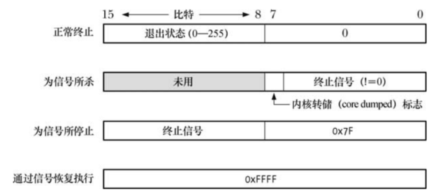

# 等待子进程

## 系统调用 `wait()`

```
#include <sys/types.h>
#include <sys/wait.h>

pid_t wait(int *wstatus);
```

- 如果调用 `wait()`  时已经有子进程终止，`wait()` 将立即返回，否则，子进程将一直阻塞，直至某个进程终止
- 如果 `wstatus` 非空，那么关于子进程如何终止的信息则会通过 `wstatus` 指向的整型变量返回
- 内核将会为父进程下所有子进程的运行总量追加 CPU 时间以及资源使用数据
- 将终止子进程的  ID 作为 `wait()` 的结果返回
- 出错时，返回 -1，可能的原因之一是调用进程没有被等待的子进程，此时将设置错误 `ECHILD`，所以可以使用循环来等待调用进程的所有子进程退出：

````
while((childPid == wait(NULL)) == -1)
	continue;
if(errno != ECHILD)
	errExit("wait");
````

## 系统调用 `waitpid()`

`wait()` 的限制：

- 如果父进程创建了多个子进程，`wait()` 无法等待特定的进程的完成，只能按顺序等待下一个子进程的终止
- 如果没有子进程退出，`wait()` 总是保持阻塞
- 使用 `wait()` 只能发现那些已经终止的子进程，对于子进程因为某个信号(`SIGSTOP` 或者 `SIDTTIN`)而停止，或者是已经停止子进程收到 `SICONT` 信号后恢复执行的情况则无能为力

```
#include <sys/types.h>
#include <sys/wait.h>

pid_t waitpid(pid_t pid, int *wstatus, int options);
```

- `pid` 指示具体要等待的子进程：

  - `pdi > 0`：表示等待进程为 `pid` 的子进程
  - `pid == 0`：表示等待与调用进程同一个进程组的所有子进程
  - `pid < -1`：表示等待进程组标识符与 `pid` 绝对值相等的所有子进程
  - `pid == -1`：表示等待任意子进程，相当于调用 `wait()`

- `options` 是位掩码：

  - `WUNTRACED`：除了返回终止子进程的信息外，还返回因信号而停止的子进程信息
  - `WCONTINUED`：返回那些因收到 `SIGCONT` 信号而恢复执行的已停止子进程的状态信息
  - `WNOHANG`：如果 `pid` 所指定的子进程并未发生状态改变，则立即返回，而不会阻塞，这种情况下，`waitpid()`  返回0，如果不存在与 `pid`  匹配的子进程，则报错，设置错误为 `ECHILD`

  ## 等待状态值

  `wait()` 和 `waitpid()` 返回的  `status`  值，可以用来区分一下子进程事件：

  - 子进程调用 `_exit()`  或者 `exit() `而终止，并指定一个整型值作为退出状态
  - 子进程收到未处理信号而终止
  - 子进程因为收到信号而终止，并以 `WUNTRACED` 标志调用 `waitpid()`
  - 子进程因收到信号 `SIGCONT` 而恢复，并以  `WCONTINUED` 标志调用 `waitpid()`

  `status` 虽然是 `int` 类型，但是只有其最低 2 个字节可以使用，对这两个字节的填充方式取决于子进程具体发生的事件：



可以如下的宏对 `status`  进行进一步分析：

- `WIFEXITED(status)`：子进程正常结束时返回 `true`，可以使用 `WEXITSTATUS(status)` 返回子进程的退出状态
- `WIFSIGNALED(status)`：子进程因为信号杀死返回 `true`，可以使用 `WTERMSIG(status)` 返回导致子进程终止的信号编号，若子进程产生内核转储文件，则宏 `WCOREDUMP(status)` 返回 `true`
- `WIFSTOPPED(status)`：子进程因为信号而停止返回 `true`,可以使用 `WSTOPSIG(status)` 返回导致子进程停止的信号编号
- `WIFCONTINUED(status)`：子进程因为收到 `SIGCONT`信号恢复执行方法 `true`

## 从信号处理程序中终止进程

如果需要通知父进程自己因某个信号而终止，那么子进程的信号处理程序应该首先将自己废除，然后再次发出相同信号，该信号将终止这一进程：

```
void handler(int sig)
{
	signal(sig,SIG_DFL);
	raise(sig);
}
```

## 系统调用 `waitid()`

```
#include <sys/types.h>
#include <sys/wait.h>

int waitid(idtype_t idtype, id_t id, siginfo_t *infop, int options);
```

- `idtype` 和 `id` 指定需要等待哪些子进程：

  - `idtype == P_ALL`，等待任何子进程，同时忽略 `id` 值
  - `idtype == P_PID`，等待进程 ID 为 `id` 进程的子进程
  - `idtype == P_PGID`，等待进程组 ID 为 `id` 各进程的所有子进程

- `waitpid()` 和 `waitid()` 最显著的区别在于，对于应该等待的子进程事件，`waitid()` 可以提供更精确的控制，可以通过指定一个或多个 `options` 来实现控制：

  - `WEXITED`：等待已终止的子进程，而无论其是否正常返回

  - `WSTOPPED`：等待已通过信号而停止的子进程

  - `WCONTINUTED`：等待经由信号 `SIGCONT` 而恢复的子进程

  - `WNOHANG`：如果匹配的 `id` 值的子进程中并无状态信息需要返回，则立即返回 0，如果不存在匹配的子进程，调用失败，设置错误 `ECHILD`

  - `WNOWAIT`：如果被指定，则返回子进程的状态，调用成功 `waitid()` 返回0，且会更新  `infop` 指向的结构，以包含子进程的相关信息

  - `siginfo_t` 结构：

    - `si_code`：包含以下值：
      - `CLD_EXITED`：表示子进程已经通过调用 `_exit()` 而终止
      - `CLD_KILLED`：表示子进程被某个信号所杀
      - `CLD_STOPPED`：表示子进程因为某个信号而停止
      - `CLD_CONTINUTED`：表示子进程(之前停止的)因为收到 `SIGCONT` 而恢复执行
    - `si_pid`：包含状态发生变化子进程的进程 ID
    - `si_signo`：总是将该字段设置为 `SIGCHILD`
    - `si_status`：该字段要么包含传递给 `_exit()` 的子进程退出状态，要么包含导致子进程停止、继续或终止的信号值，可以通过读取 `si_code`  值来判定具体包含的哪一种类型的信息
    - `si_uid`：该字段包含子进程的真正用户 ID

    

如果设置了 `WNOHANG`，则 `waitpid()` 返回 0：

- 在调用子进程的状态已经改变，子进程的相关信息保存在 `infop` 指向的结构体中
- 没有任何子进程的状态有所改变

可移植的写法：

```
siginfo_t info;

memset(&info,0,sizeof(siginfo_t));

if(waitid(idtype,id,&info,opetions | WNOHANG) == -1)
	errExit("waitid");
if(info.si_pid == 0)
{
	//@ no child state changed
}
else
{
	//@ a child changed state,details are provided in infop
}
```

## 系统调用 `wait3()` 和 `wait4()`

```
#define _BSD_SOURCE

#include <sys/types.h>
#include <sys/time.h>
#include <sys/resource.h>
#include <sys/wait.h>

pid_t wait3(int *wstatus, int options,struct rusage *rusage);
pid_t wait4(pid_t pid, int *wstatus, int options,struct rusage *rusage);
```

- 这两个系统调用的名称源于参数的个数
- `wait3()` 和 `wait4()` 在参数 `rusage` 所指向的结构中返回终止子进程的资源使用情况，其中包括进程使用的 CPU 时间总量以及内存管理的统计数据
- 调用  `wait3()` 等同于调用 `waitpid(-1,&status,options)`，即 `wait3()` 等待的是任意子进程
- 调用 `wait4()` 等同于调用 `wait(pid,&status,options)`，即 `wait4()` 等待选定的一个或多个子进程

# 孤儿进程与僵尸进程

对于孤儿进程，即父进程已经终止的进程，init 进程将成为其父进程，某一进程的父进程终止后，对 `getppid()`  调用将返回 1。

子进程终止，在父进程调用 `wait()` 之前，内核将子进程转为僵尸进程，此时将子进程的大部分资源释放以供其他进程使用，只保留内核进程表中的一条记录，其中包含了子进程 ID、终止状态、资源使用数据信息。僵尸进程无法通过信号杀死，即便是 `SIGKILL` 也不可以，从而确保了父进程总是可以执行 `wait()`方法，从而从系统中删除僵尸进程。

# SIGCHLD 信号

子进程的终止属于异步时间，父进程无法预先得知，即使父进程向子进程发送 `SIGKILL` 信号，子进程终止的确切时间依赖于系统调度。

两种策略：

- 父进程调用不带 `WNOHANG` 标志的 `wait()`，或者 `waitpid()` 方法，此时如果尚无已经终止的子进程，那么调用将会阻塞
- 父进程周期性地调用带有 `WNOHANG` 标志的 `waitpid()`，执行针对已经终止子进程的非阻塞检查

这两种方法都有弊端：

- 不希望父进程阻塞
- 不希望反复调用非阻塞的 `waitpid()`  浪费  CPU 资源

为了规避上述问题，可以采用针对 `SIGCHLD` 信号的处理程序。

## 为 SIGCHLD 建立信号处理程序


