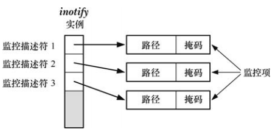
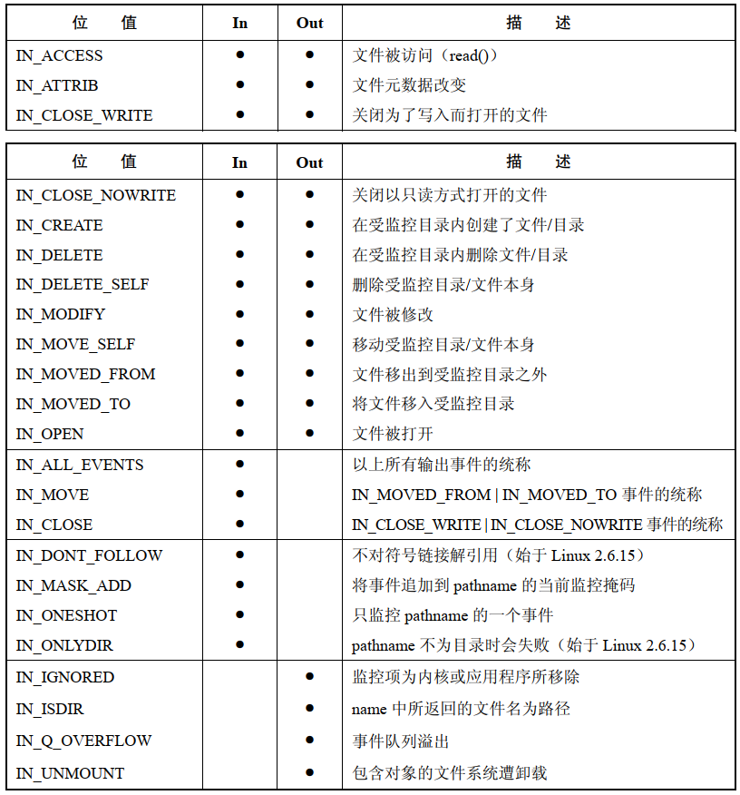
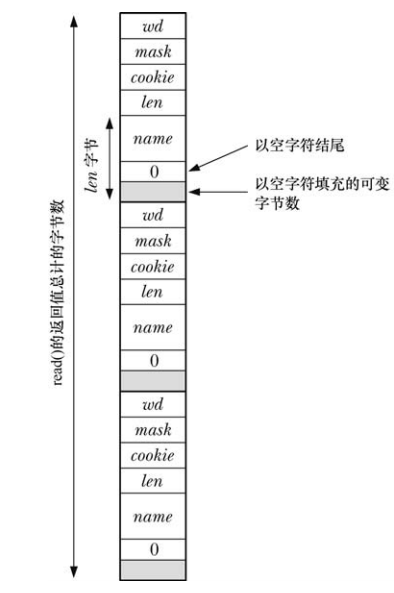

# 概述

- 使用 `inotify_init()` 创建 `inotify` 实例，该调用返回的文件描述符用于在后续操作中指代该实例
- 使用  `inotify_add_watch()` 向 `inotify` 实例的监控列表添加条目
- 针对 `inotify` 文件描述符执行 `read()` 操作来获取事件
- 程序再结束监控时会关闭 `inotify` 文件描述符，这将自动清除与 `inotify` 实例相关的所有监控项

# inotify_init API

```
#include <sys/inotify.h>

int inotify_init(void);
int inotify_init1(int flags);
```

- 返回一个文件描述符，用来指代 `inotify` 实例
- `inotify_init1`  增加了 `flags` 参数，可以取值：
  - `IN_CLOEXEC` ：使内核针对新文件描述符激活  `close-on-exec`
  - `IN_NONBLOCK` ：使内核激活底层打开文件描述符的 `O_NONBLOCK` 标志

```
#include <sys/inotify.h>

int inotify_add_watch(int fd, const char *pathname, uint32_t mask);
```

- `inotify_add_watch()` 既可以新加监控项，也可以修改现有监控项
- `pathname` 标识欲创建或修改的监控项所对应的文件



- `mask` 是一位掩码，针对 `pathname` 定义了欲监控的事件
- 如果先前未将 `pathname` 加入到 fd 的监控列表，那么 `inoify_add_watch()` 会再列表中创建一个新的监控项，并返回一新的、非负监控描述符，用来在后续操作中指代此监控项
- 如果先前已将 `pathname` 加入到 fd 的监控列表，，那么 `inoify_add_watch()` 修改现有 `pathname` 监控项的掩码，并返回其监控描述符

```
#include <sys/inotify.h>

int inotify_rm_watch(int fd, int wd);
```

- `inotify_rm_watch()` 会从文件描述符 `fd` 所指代的 `inotify` 实例中删除 `wd` 定义的监控项
- 删除监控项会为该监控描述符生成 `IN_IGNORED` 事件

# inotify 事件

`mask` 事件位：




# 读取 inotify 事件

`read()`  可从  `inotify` 文件描述符中读取事件，以判定发生了哪些事件：

- 时至读取时尚未发生任何事件，`read()`  将会阻塞下去，直到有事件发生
- `O_NONBLOCK` 被设置，若无任何事件可读，`read()` 将立即返回，并报错 `EAGAIN`

事件发生后，`read()`  返回：

```
truct inotify_event {
             int      wd;       /* Watch descriptor */
             uint32_t mask;     /* Mask of events */
             uint32_t cookie;   /* Unique cookie associating related events (for rename(2)) */
             uint32_t len;      /* Size of ’name’ field */
             char     name[];   /* Optional null-terminated name */
         };
```



- `wd` 指明发生事件的是哪个监控描述符，该值由之前对 `inotify_add_watch()` 的调用返回
-  `mask` 描述该事件的位掩码，上表 `Out` 展示了可出现于 `mask` 中的位范围，还需要注意：
  - 移除监控项时，会发生 `IN_IGNORED` 事件
  - 如果事件的主体是路径，那么除去其他位之外，在 `mask` 中还会设置  `IN_ISDIR`
  - `IN_UNMOUNT` 事件会通知应用程序包含受监控对象的文件系统已遭卸载，该事件发生后，还会产生保护 `IN_IGNORED` 置位的附加事件

- `cookie` 字段可将相关事件联系起来，目前只有对文件重命名时才会使用该字段
- 当受监控目录中有文件发生事件时，`name` 字段返回一个以空字符结尾的字符串，以标识该文件，受监控对象自身事件发生，则不使用 `name` 字段，将 `len` 设置为 0
- `len`  表示实际分配给 `name`  的字节数，单个 `inotify` 事件的长度为 `sizeof(struct inotify_event) + len`
- 如果传递给 `read()` 的缓冲区过小，无法容纳下一个 `notify_event` 结构，`read()` 调用将失败，并设置错误 `EINVAL`，所以传给 `read()` 缓冲区应至少为 `sizeof(struct inotify_event) + NAME_MAX + 1` 字节，`NAME_MAX`  是文件名的最大长度

# 队列限制和 `/proc` 文件

对 `inotify` 事件做排队处理，需要消耗内核内存，因此内核会对 `inotify`  机制施加限制，超级用户可配置 `/proc/sys/fs/inotify`  路径中的 3 个文件来调整这些限制：

- `max_queued_events` ：调用  `inotify_init()` 时，使用该值来为新 `inotify` 实例队列中的事件数量设置上限，一旦超过这个上限，系统将生成 `IN_Q_OVERFLOW` 事件，并丢弃多余的事件，溢出事件的 `wd`  为 -1
- `max_user_instances` ：对由每个真实用户 ID 创建的 `inotify` 实例数的限制值
- `max_user_watches` ：对由每个真实用户 ID 创建的监控项数量的限制值

这三个文件的典型默认值是 16384,128,8192。

# 监控文件的旧有系统：dnotify

`dnotify` 相对于 `inotify` 已经落伍，其限制有：

- `dnotify` 通过向应用程序发送信号来告知事件，使应用程序设计十分复杂
- `dnotify` 监控单元是目录，`inotify` 监控对象既可以是单个文件，也可能是目录
- 为监控目录，`dnotify` 需要应用程序为该目录打开文件描述符：
  - 由于程序处于运行中，将无法下载包含此目录的文件系统
  - 每个目录都需要一个文件描述符，应用程序最终可能会销毁大量文件描述符
- `dnotify`  与文件相关的信息相比于 `inotify`  不够准确
- 一些情况下，`dnotify` 不支持可靠的文件事件通告机制


