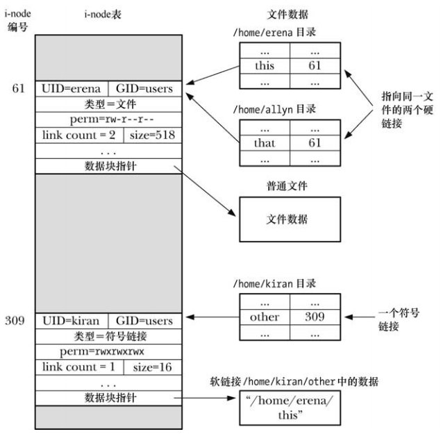

# 目录和 (硬)链接

目录与普通文件的区别：

- 在其 `i-node` 条目中，会将目录笔记为一种不同的文件类型
- 目录是经特殊组织而成的文件，本质上就是一个表格，包含文件名和 `i-node` 编号

在大多数 Linux 系统上，文件的长度可达 255 个字符。

`i-node` 中存储的信息列表中并未包含文件名，而是通过列表内的一个映射来定义文件名称，其妙用在于可以创建多个名称都指向相同的 `i-node` 节点，也将这些名称称为链接，有时也称为硬链接。

当存在多个硬链接时，每删除一个硬链接文件，链接计数就会减1，只有当 `i-node` 的链接计数降为0，才会删除文件 `i-node` 记录和数据块。

硬链接的限制有二，均可用符号链接来加以规避：

- 因为目录条目(硬链接)对文件的指代采用了 `i-node` 编号，而 `i-node` 编号的唯一仅在一个文件系统之内才得到保证，所以硬链接必须与其指代的文件驻留在同一文件系统中
- 不能为目录创建硬链接，从而避免出现令诸多系统程序限于混乱的链接环路

# 符号(软)链接

符号链接，也称为软链接，是一种特殊的文件类型，其数据是另一文件的名称。

符号链接的内容既可以是绝对路径，也可以是想对路径，解释相对符号链接时以链接本身的位置作为参照点。

符号的链接的地位不如硬链接，尤其是，文件的链接计数中并未将符号链接计算在内，因此，如果移除了符号链接所指向的文件名，符号链接本身还将继续存在，尽管无法再对其进行解引用操作，也将此链接称之为悬空链接，甚至，可以为并不存在的文件名创建一个符号链接。

因为符号链接指代一个文件名，而非 `i-node`  编号，所以可以用来链接不同文件系统中的一个文件。

符号链接之间可能会形成链路(a 是指向 b 的符号链接，b 是指向 c 的符号链接)，当在各个文件相关的系统调用中指定了符号链接时，内核会对一系列链接层层解去引用，直抵最终文件。系统实现应允许对其实施至少 `_POSIX_SYMLOOP_MAX` 次解除引用操作，Linux 还将对一个完整路径名的解引用总数限制为 40 次，施加这些限制，意在应对超长符号链接链路以及符号链接环路，从而避免在解析符号链接时免于引发堆栈溢出。

## 系统调用对符号链接的解释

许多系统调用都会对符号链接进行解引用处理，从而对连接所指向的文件展开操作。

还有一些系统调用对符号链接则不作处理，直接操作于链接文件本身。

系统有时会提供两套系统调用：一套会针对链接解除引用，另一套则反之，后者在冠名时会冠以字母 `l`，例如 `stat()` 和 `lstat()`。

有一点是约定俗成的：总是会对路径名中目录部分的符号链接进行解除引用操作，因此 `/somedir/somesubdir/file`  中，若 `somedir` 和 `somesubdir` 属于符号链接，则一定会解除对这两个目录的引用，而针对 `file` 是否进行解引用与否，则取决于路径名所传入的系统调用。

