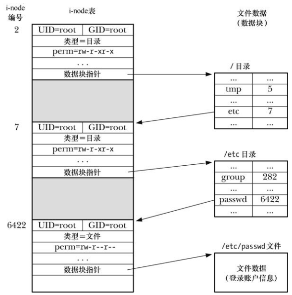

# 目录和 (硬)链接

目录与普通文件的区别：

- 在其 `i-node` 条目中，会将目录笔记为一种不同的文件类型
- 目录是经特殊组织而成的文件，本质上就是一个表格，包含文件名和 `i-node` 编号

在大多数 Linux 系统上，文件的长度可达 255 个字符。



`i-node` 中存储的信息列表中并未包含文件名，而是通过列表内的一个映射来定义文件名称，其妙用在于可以创建多个名称都指向相同的 `i-node` 节点，也将这些名称称为链接，有时也称为硬链接。

当存在多个硬链接时，每删除一个硬链接文件，链接计数就会减1，只有当 `i-node` 的链接计数降为0，才会删除文件 `i-node` 记录和数据块。

硬链接的限制有二，均可用符号链接来加以规避：

- 因为目录条目(硬链接)对文件的指代采用了 `i-node` 编号，而 `i-node` 编号的唯一仅在一个文件系统之内才得到保证，所以硬链接必须与其指代的文件驻留在同一文件系统中
- 不能为目录创建硬链接，从而避免出现令诸多系统程序限于混乱的链接环路

# 符号(软)链接

符号链接，也称为软链接，是一种特殊的文件类型，其数据是另一文件的名称。

符号链接的内容既可以是绝对路径，也可以是想对路径，解释相对符号链接时以链接本身的位置作为参照点。

符号的链接的地位不如硬链接，尤其是，文件的链接计数中并未将符号链接计算在内，因此，如果移除了符号链接所指向的文件名，符号链接本身还将继续存在，尽管无法再对其进行解引用操作，也将此链接称之为悬空链接，甚至，可以为并不存在的文件名创建一个符号链接。


因为符号链接指代一个文件名，而非 `i-node`  编号，所以可以用来链接不同文件系统中的一个文件。

符号链接之间可能会形成链路(a 是指向 b 的符号链接，b 是指向 c 的符号链接)，当在各个文件相关的系统调用中指定了符号链接时，内核会对一系列链接层层解去引用，直抵最终文件。系统实现应允许对其实施至少 `_POSIX_SYMLOOP_MAX` 次解除引用操作，Linux 还将对一个完整路径名的解引用总数限制为 40 次，施加这些限制，意在应对超长符号链接链路以及符号链接环路，从而避免在解析符号链接时免于引发堆栈溢出。

## 系统调用对符号链接的解释

许多系统调用都会对符号链接进行解引用处理，从而对连接所指向的文件展开操作。

还有一些系统调用对符号链接则不作处理，直接操作于链接文件本身。

系统有时会提供两套系统调用：一套会针对链接解除引用，另一套则反之，后者在冠名时会冠以字母 `l`，例如 `stat()` 和 `lstat()`。

有一点是约定俗成的：总是会对路径名中目录部分的符号链接进行解除引用操作，因此 `/somedir/somesubdir/file`  中，若 `somedir` 和 `somesubdir` 属于符号链接，则一定会解除对这两个目录的引用，而针对 `file` 是否进行解引用与否，则取决于路径名所传入的系统调用。

## 符号链接的文件权限和所有权

大部分操作会无视符号链接的所有权和权限，是否允许操作反而是由符号链接所指代文件的所有权和权限决定。

仅当在带有粘性权限位的目录中对符号链接进行移除或改名操作时，才会考虑符号链接自身的所有权。

# 创建和移除(硬)链接

```
#include <unistd.h>

int link(const char *oldpath, const char *newpath);
```

- `oldpath` 提供的是一个已存在文件的路径名，创建 `newpath` 指定的新链接，若 `newpath` 指定的路径名已然存在，则不会将其覆盖，相反会产生一个错误 `EEXIST`
- `link()` 系统调用不会对符号链接进行解引用操作，若 `oldpath` 属于符号链接，则会将  `newpath` 创建为指向相同符号链接文件的全新硬链接

```
#include <unistd.h>

int unlink(const char *pathname);
```

- `unlink()` 移除一个链接(删除一个文件名)，且如果此链接是指向文件的最后一个链接，那么还将移除文件本身
- 如果 `pathname` 中指定的链接不存在，则 `unlink()` 调用会失败，并将 `errno` 设置为 `ENOENT`
-  `unlink()`  不能移除一个目录，完成这一任务需要使用 `rmdir()` 或者 `remove()`
- `unlink()` 不会对符号链接进行解引用操作，若 `pathname` 为符号链接，则移除链接本身，而不是链接指向的名称

## 仅当关闭所有文件描述符时，方可删除一个已打开的文件

内核除了为每个 `i-node` 维护链接计数之外，还对文件的打开文件描述符计数。当移除指向文件的最后一个链接时，如果仍有指代该文件的打开文件描述符，那么在关闭所有此类描述符之前，系统实际上将不会删除该文件：

- 允许取消对文件的链接，而无需担心是否有其他进程已将其打开
- 先创建并打开一个临时文件，随机取消对文件的 `link` ，然后在程序中继续使用该文件

# 更改文件名

```
#include <stdio.h>

int rename(const char* oldpath,const char* newpath);
```

- 调用会将现有的一个路径名 `oldpath` 重命名为 `newpath` 指定的路径名
- 调用仅操作目录条目，而不移动文件数据，改名既不影响指向该文件的其他硬链接，也不影响持有该文件打开描述符的任何进程，因为这些文件描述符指向的是打开文件与文件名无瓜葛

以下规则适用于对 `rename()` 的调用：

- 若  `newpath` 已经存在，则将其覆盖
- 若 `newpath` 与 `oldpath` 指向同一文件，则不发生变化且调用成功
-  `rename` 系统调用对其两个参数中的符号链接均不进行解引用，如果 `oldpath` 是一个符号链接，那么将重命名该符号链接，如果 `newpath` 是符号链接，那么会将其视为 `oldpath` 重命名而成的普通路径名，即移除已有的符号链接 `newpath`
- 如果 `oldpath` 指代文件，而非目录，那么就不能将 `newpath` 指定为一个目录的路径名，要想重命名一个文件到某一目录中，`newpath` 必须包含新的文件名，如下调用既将一个文件移动到另一目录中，同时将其改名：

```
rename("sub1/x","sub2/y");
```

- 若将 `oldpath` 指定为目录名，则意在重命名该目录。此时必须保证 `newpath` 要么不存在，要么将是一个空目录名称，否则调用出错为 `ENOTDIR` 和 `ENOTEMPTY`
- 若 `oldpath` 是一目录，则 `newpath` 不能包含 `oldpath` 作为其目录前缀，例如不能将 `/home/mtk` 重命名为 `/home/mtk/bin`，否则返回错误 `EINVAL`
- `oldpath` 和 `newpath` 所指代的文件必须位于同一文件系统，这是因为目录内容由硬链接列表组成，且硬链接所指向的 `i-node` 与目录位于同一文件系统，否则将返回错误 `EXDEV`

# 使用符号链接

 ```
 #include <unistd.h>
 
 int symlink(const char* filepath,const char* linkpath);
 ```

- 针对 `filepath` 创建 `linkpath` 符号链接，若想移除，需要使用 `unlink()`
- 若 `linkpath` 中给定的路径名已然存在， 则调用失败，设置错误 `EEXIST`，`filepath` 指定的路径名可以是绝对路径，也可以是相对路径
- 由 `filepath` 所命名的文件或目录在调用时无需存在，即便当时存在，也无法阻止后来将其删除，这时，`linkpath` 成为悬空链接，其他系统调用对其解引用都将出错 `ENOENT`

```
#include <unistd.h>

ssize_t readlink(const char* pathname,char* buffer,size_t bufsiz);
```

- `bufsiz` 告知 `readlink()` 调用 `buffer` 中的可用字节数
- 成功调用时， `readlink()` 返回实际放入 `buffer` 中的字节数，若链接长度超过 `bufsiz`，则置于 `buffer` 中的是经过截断处理的字符串
- 由于 `buffer` 尾部未放置空字符，故而无法分辨 `readlink()` 所返回的字符串是否被截断，还是恰巧将 `buffer` 填满，验证的返回是申请更大的 `buffer`，并再次调用 `readlink()`

# 创建和移除目录

```
#include <sys/stat.h>

int mkdir(const char* pathname,mode_t mode);
```

- `pathname` 创建新目录的路径名，该路径名可以是相对路径，也可以是绝对路径
- 如果该路径名的文件已经存在，将调用设置 `EEXIST`
- `mode`  参数指定了新目录的权限，如果在 `mode` 中设置了粘滞位  `S_ISVTX`，那么对新目录设置该权限
- 新建目录包含两个条目：`.` 和  `..`
- `mkdir()` 所创建的仅仅是路径名中的最后一部分，`mkdir("aaa/bbb/ccc",mode)` 仅当目录 `aaa` 和 `aaa/bbb` 都已经存在的情况下才会成功 

```
#include <unistd.h>

int rmdir(const char* pathname);
```

- `rmdir()` 只能删除空目录
- 如果 `pathname` 的最后一部分为符号链接，那么 `rmdir()` 将不对其解引用操作，并设置错误 `ENOTDIR`

# 移除一个文件或目录

```
#include <stdio.h>

int remove(const char* pathname);
```

- `pathname` 是一文件，那么 `remove()` 将调用 `unlink()`，如果  `pathname` 为一目录，那么 `remove()` 将调用 `rmdir()`
- `remove()` 不对符号链接进行解引用操作，若 `pathname` 是符号链接，则 `remove()` 会移除链接本身，而非链接所指向的文件

# 读目录

```
#include <dirent.h>

DIR *opendir(const char* dirpath);
```

- `DIR` 即所谓的目录流，一旦从 `opendir()` 返回，则将目录流指向目录列表的首条记录

```
#include <dirent.h>

DIR* fdopendir(int fd);
```

- `fdopendir()` 成功后，文件描述符将处于系统的控制之下，且除了本节的函数外，程序不应该采取任何其他方式对其访问

```
#include <dirent.h>

struct dirent* readdir(DIR* dirp);
```

- `readdir()` 每调用一次，就会从 `dirp` 所指代的目录流中读取下一目录条目，返回的指针指向静态分配而得到的 `dirent` 类型结构，每次调用 `readdir()` 都会覆盖该结构：

```
struct dirent{
	ino_t d_ino;	/*file i-node number*/
	char d_name[];  /*null-terminated name of file*/
};
```

- `readdir()` 返回时并未对文件名进行排序，而是按照文件在目录中出现的天然次序
- 一旦遇到文件末尾或是出错，`readdir()` 将返回 `NULL`：

```
errno = 0;
direntp = readdir(dirp);
if(direntp == NULL)
{
	if(erno != 0)
		//@ Handle error
	else
		//@ reached end-of-directory
}
```

- 如果目录内容恰逢应用调用  `readdir()` 扫描该目录时发生变化，那么应用程序可能无法观察到这些变化

```
#include <dirent.h>

void rewinddir(DIR* dirp);
```

- `rewinddir()` 将目录流回移到起点，以便对 `readdir()` 的下一次调用将从目录的第一个文件开始

```
#include <dirent.h>

void closedir(DIR* dirp);
```

- `closedir()` 函数将 `dirp` 指代、处于打开状态的目录流关闭，同时释放流所使用的资源

## 目录流与文件描述符

```
#include <dirent.h>

int dirfd(DIR* dirp);
```

- `dirfd()` 返回与 `dirp` 目录流相关联的文件描述符

## `readdir_r` 函数

```
#include <dirent.h>

int readdir_r(DIR* dirp,struct dirent* entry,struct dirent** result);
```

- `readdir_r()` 是 `readdir()` 的可重入版本
- 如果抵达目录流尾部，那么会在 `result` 中返回 `NULL`，当出现错误时，`readdir_r()` 不会返回 -1，而是返回一个对应于 `errno`  的正整数

# 文件树遍历

```
#define _XOPEN_SOURCE 500
#include <ftw.h>

int nftw(const char* dirpath,int(*func)(const char* pathname,const struct stat* statbuf,int typeflag,struct FTW* ftwbuf),
		int nopenfd,int flags);
```

- `nftw()` 遍历由 `dirpath`  指定的目录树，并为目录树中的每个文件调用一次指定的 `func` 函数

- 默认情况下，`nftw()` 会针对给定的树执行未排序的前序遍历，即对各目录的处理要先于各目录下的文件和子目录

- `nopenfd` 指定了 `nftw()` 使用文件描述符数量的最大值，如果目录树深度超过这一最大值，那么 `nftw()` 会在做好记录的前提新爱，关闭并重新打开描述符，从而避免同时持有的描述符数目突破上限 `nopenfd` 

- `flags`  参数由 0 个或多个常量组成：

  - `FTW_CHDIR` ： 在处理目录内容之前先调用 `chdir()` 进入每个目录，如果想让 `func` 在 `pathname` 参数指定文件的驻留目录下展开某些工作，那么就应当使用这一标志
  - `FTW_DEPTH` ：对目录树执行后序遍历，这意味着 `ntfw()` 会在对目录本身执行  `func` 之前先对目录中的所有文件及子目录执行 `func` 调用
  - `FTW_MOUNT` ： 不会越界进入另一文件系统，因此，如果树中某一子目录是挂载点，那么不会对其进行遍历
  - `FTW_PHYS` ：默认情况下，`nftw()`  对符号链接进行解引用操作，而使用该标志将告知 `nftw()` 函数禁止这样做，函数会将符号链接传递给 `func` 函数，并将 `typeflag` 值设置为 `FTW_SL`

- `func` 函数的参数：

  - `pathname` ： 文件的路径名，可以是绝对路径名，也可以是相对路径名
    - 如果指定 `dirpath` 时使用的是绝对路径，那么 `pathname` 就可能是绝对路径
    - 如果指定 `dirpath` 时使用的是相对路径，那么 `pathname` 就可能是相对于进程调用 `nftw()` 时的当前工作目录而言
  - `statbuf` ： 是一个指针，指向 `stat` 结构，内含该文件的相关信息
  - `typeflag` ：提供了有关该文件的深入信息，可以是如下特征值：
    - `FTW_D` ：这是一个目录
    - `FTW_DNR` ：这是一个不能读取的目录
    - `FTW_DP` ：正在对一个目录进行后序遍历，当前项是一个目录，其所包含的文件和子目录已经处理完毕
    - `FTW_F` ：该文件的类型是除目录和符号链接以外的任何类型
    - `FTW_NS` ：对该文件调用 `stat()` 失败，可能是因为权限限制
    - `FTW_SL`：这是一个符号链接，仅当使用 `FTW_PHYS` 标志调用 `nftw()` 函数才返回这个值
    - `FTW_SLN` ：这是一个悬空的符号链接，仅当未在 `flags` 参数中指定 `FTW_PHYS` 标识时才会出现该值
  - 每次调用 `func` 都必须返回一个整型值，由 `nftw()` 加以解释：
    - 如果返回0，`nftw()`  会继续对树进行遍历，如果所有对 `func`  的调用都返回0，那么 `nftw()`本身也将返回0给调用者
    - 如果返回非0值，则通知 `nftw()`立即停止对树的遍历，这时  `nftw()` 也会返回相同的非0值
  - 由于 `nftw()` 使用的数据结构是静态分配的，故而应用程序提前终止目录树遍历的唯一方法就是让 `func` 调用返回一个非0值

  glibc 允许在 `nftw()` 的 `flags`  中指定一个额外的非标准标志：`FTW_ACTIONRETVAL` ，当指定该标识时，`func`  返回下列值之一：

  - `FTW_CONTINUE` ：与传统 `func` 返回 0 时一样，继续处理目录树中的条目
  -  `FTW_SKIP_SIBLINGS` ：不再进一步处理当前目录中的条目，恢复对父目录的处理
  - `FTW_SKIP_SUBTREE` ：如果 `pathname` 是目录，那么就不对该目录下的条目调用 `func`，恢复进行对该目录的下一个同级目录的处理
  - `FTW_STOP` ：与传统 `func`  返回非 0 值时一样，不再进一步处理目录树下的任何条目

# 进程的当前工作目录

## 获取当前工作目录

```
#include <unistd.h>

char *getcwd(char *buf, size_t size);
```

- `getcwd()` 将当前工作目录的绝对路径的字符串置于 `buf` 指向的已分配缓冲区，必须为 `buf` 分配至少 `size` 个字节的空间
- 调用成功返回指向 `buf` 的指针，如果当前工作目录路径名称长度大于 `size`  个字节，则返回 `NULL`，设置错误 `ERANGE`

## 改变当前工作目录

```
#include <unistd.h>

int chdir(const char *path);
```

- 将调用进程的当前工作目录改为 `path` 指定的目录
- `path`  可以是绝对路径，也可以是相对路径，如果是符号链接，还会对其解引用

```
#define _XOPEN_SOURCE 500
#include <unistd.h>

int fchdir(int fd);
```

- 指定目录时使用打开文件描述符

# 针对目录文件描述符的相关操作

系统调用使用目录文件描述来解释相对路径：


# 改变进程的根目录

每个进程都有一个根目录，该目录是解释绝对路径时的起点，默认是文件系统的真实根目录。

```
#define _BSD_SOURCE
#include <unistd.h>

int chroot(const char *path);
```


