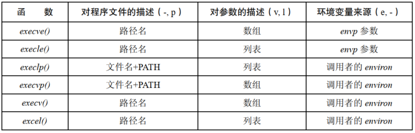

# 执行新程序：`execve()`

系统调用 `execve()` 将新程序加载到某一进程的内存空间，这一操作将丢弃旧有程序，而进程的栈、数据以及堆段会被新程序的相应部分替换。

```
#include <unistd.h>

int execve(const char *pathname, char *const argv[],char *const envp[]);
```

- `pathname` 包含准备载入当前进程空间的新程序的路径名，可以是绝对路径，也可以是相对路径
- `argv` 指定给新进程的命令行参数
- `envp` 指定新进程的环境列表

调用 `execve()` 之后，因为同一进程依然存在，所以进程 ID 保持不变，还有少量其他的进程属性也未发生变化。

如果对 `pathname` 所指定的程序文件设置了 `set-user-ID` (`set-group-ID`) 权限位，那么系统调用会在执行此文件时将进程的有效用户(组)设置为程序文件的属主(组) ID，利用这个机制，可以令用户在运行特定程序时临时获取特权。

无论是否改变了有效 ID，也不管这一变化是否生效，`execve()` 都会以进程的有效用户 ID 去覆盖已保存的 `set-user-ID`，以进程的有效组 ID 去覆盖已保存的 `set-group-ID`。

由于将调用程序取而代之，对 `execve()` 的成功调用将永不返回，而且无需检查 `execve()` 的返回值，因为该值总是  -1，实际上一旦函数返回，就表明发生了错误，`errno` 可能是：

- `EACCESS`：`pathname` 没有指向一个常规文件；未对文件赋予可执行权限；目录不可搜寻；以 `MS_NOEXEC`  标志来挂载文件所在的文件系统
- `ENOENT`：`pathname` 所指代的文件并不存在
- `ENOEXEC`：系统无法识别 `pathname` 指定文件的文件格式
- `ETXTBSY`：存在一个或多个进程以写入方式打开 `pathname` 所指代的文件
- `E2BIG`：参数列表和环境列表所需空间总和超出了允许的最大值

# `exec()` 库函数

库函数为了执行 `exec()` 提供了多种 API，这些函数都构建在系统调用 `execve()` 之上：

```
#include <unistd.h>

int execl(const char *pathname, const char *arg, .../* (char  *) NULL */);
int execlp(const char *file, const char *arg, .../* (char  *) NULL */);
int execle(const char *pathname, const char *arg, .../*, (char *) NULL, char *const envp[] */);
int execv(const char *pathname, char *const argv[]);
int execvp(const char *file, char *const argv[]);
int execvpe(const char *file, char *const argv[],char *const envp[]);
```

- `execlp()` 和 `execvp()` ：允许只提供程序名，系统会在由环境变量 `PATH` 所指定的目录列表中寻找相应的执行文件，如果文件名中包含 "/"，则将其视为相对路径或者绝对路径，不再使用 `PATH`
- `execle()`、`execlp()` 和 `execl()` ：`l` 表示 `list`，以示与含有 `v` 表示的 `vector`区别，要求调用时以字符串列表形式来指定参数，而不使用数组来描述 `argv` 列表
- `execve()` 和 `execle()`：允许通过 `envp` 为新程序显示指定环境变量，其中 `envp` 是一个以 `NULL` 结束的字符串指针数组，以 `e` 结尾以示区别 



## 环境变量 PATH

`execlp()` 和 `execvp()` 允许调用者只提供欲执行程序的文件名，二者都使用环境变量 `PATH` 来搜索文件。

`PATH` 的值是一个以冒号 `:` 分隔，由多个目录名，也称其为路径前缀组成的字符串组成：

```
echo $PATH
/usr/local/sbin:/usr/local/bin:/usr/sbin:/usr/bin:/sbin:/bin
```

对于一个登录 shell，其 `PATH` 值将由系统级和特定用户的 shell启动脚本来设置，子进程继承其父进程的环境变量，shell 执行每个命令时所创建的进程也就继承了 shell 的 PATH。

`PATH` 中指定的路径名即可以是绝对路径，也可以是相对路径名，相对路径名基于调用进程的当前工作目录。

如果没有定义变量 `PATH`，那么 `execvp()` 和 `execlp()` 会采用默认的路径列表：`./:usr/bin:/bin`。

出于安全考虑，通常会将当前工作目录排除在超级用户的 `PATH` 之外。

`execlp()` 和 `execvp()` 会在 `PATH` 包含的每个目录中搜索文件，以列表开头的目录开始，直到成功执行了既定文件。

应该避免在设置了 `set-user-ID` 或者 `set-group-ID` 的程序中调用 `execlp()` 和 `execvp()` 。

## 将程序参数指定为列表

如果已知  `exec()` 的参数个数，调用 `execle()`、`execlp()` 和 `execl()` 时就可以将参数作为列表传入，较之于将参数装配于一个 `argv` 向量中，便于使用。

## 将调用者的环境传递给新程序

函数 `execlp()`，`execvp()`，`execl()`,`execv()` 不允许开发者显式指定环境列表，新程序的环境继承自调用进程。

## 执行由文件描述符指代的程序: `fexecve()`

```
#define _GNU_SOURCE

#include <unistd.h>
int fexecve(int fd, char *const argv[], char *const envp[]);
```

- `fexecve()` 指定要执行程序是以打开文件描述符 `fd` 方式，而非通过路径名


