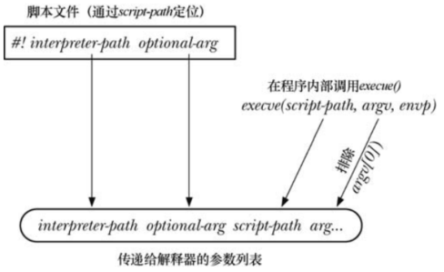
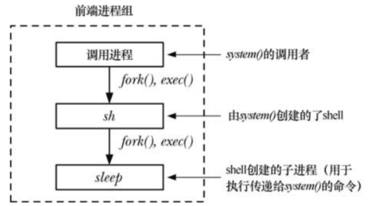

# 执行新程序：`execve()`

系统调用 `execve()` 将新程序加载到某一进程的内存空间，这一操作将丢弃旧有程序，而进程的栈、数据以及堆段会被新程序的相应部分替换。

```
#include <unistd.h>

int execve(const char *pathname, char *const argv[],char *const envp[]);
```

- `pathname` 包含准备载入当前进程空间的新程序的路径名，可以是绝对路径，也可以是相对路径
- `argv` 指定给新进程的命令行参数
- `envp` 指定新进程的环境列表

调用 `execve()` 之后，因为同一进程依然存在，所以进程 ID 保持不变，还有少量其他的进程属性也未发生变化。

如果对 `pathname` 所指定的程序文件设置了 `set-user-ID` (`set-group-ID`) 权限位，那么系统调用会在执行此文件时将进程的有效用户(组)设置为程序文件的属主(组) ID，利用这个机制，可以令用户在运行特定程序时临时获取特权。

无论是否改变了有效 ID，也不管这一变化是否生效，`execve()` 都会以进程的有效用户 ID 去覆盖已保存的 `set-user-ID`，以进程的有效组 ID 去覆盖已保存的 `set-group-ID`。

由于将调用程序取而代之，对 `execve()` 的成功调用将永不返回，而且无需检查 `execve()` 的返回值，因为该值总是  -1，实际上一旦函数返回，就表明发生了错误，`errno` 可能是：

- `EACCESS`：`pathname` 没有指向一个常规文件；未对文件赋予可执行权限；目录不可搜寻；以 `MS_NOEXEC`  标志来挂载文件所在的文件系统
- `ENOENT`：`pathname` 所指代的文件并不存在
- `ENOEXEC`：系统无法识别 `pathname` 指定文件的文件格式
- `ETXTBSY`：存在一个或多个进程以写入方式打开 `pathname` 所指代的文件
- `E2BIG`：参数列表和环境列表所需空间总和超出了允许的最大值

# `exec()` 库函数

库函数为了执行 `exec()` 提供了多种 API，这些函数都构建在系统调用 `execve()` 之上：

```
#include <unistd.h>

int execl(const char *pathname, const char *arg, .../* (char  *) NULL */);
int execlp(const char *file, const char *arg, .../* (char  *) NULL */);
int execle(const char *pathname, const char *arg, .../*, (char *) NULL, char *const envp[] */);
int execv(const char *pathname, char *const argv[]);
int execvp(const char *file, char *const argv[]);
int execvpe(const char *file, char *const argv[],char *const envp[]);
```

- `execlp()` 和 `execvp()` ：允许只提供程序名，系统会在由环境变量 `PATH` 所指定的目录列表中寻找相应的执行文件，如果文件名中包含 "/"，则将其视为相对路径或者绝对路径，不再使用 `PATH`
- `execle()`、`execlp()` 和 `execl()` ：`l` 表示 `list`，以示与含有 `v` 表示的 `vector`区别，要求调用时以字符串列表形式来指定参数，而不使用数组来描述 `argv` 列表
- `execve()` 和 `execle()`：允许通过 `envp` 为新程序显示指定环境变量，其中 `envp` 是一个以 `NULL` 结束的字符串指针数组，以 `e` 结尾以示区别 


## 环境变量 PATH

`execlp()` 和 `execvp()` 允许调用者只提供欲执行程序的文件名，二者都使用环境变量 `PATH` 来搜索文件。

`PATH` 的值是一个以冒号 `:` 分隔，由多个目录名，也称其为路径前缀组成的字符串组成：

```
echo $PATH
/usr/local/sbin:/usr/local/bin:/usr/sbin:/usr/bin:/sbin:/bin
```

对于一个登录 shell，其 `PATH` 值将由系统级和特定用户的 shell启动脚本来设置，子进程继承其父进程的环境变量，shell 执行每个命令时所创建的进程也就继承了 shell 的 PATH。

`PATH` 中指定的路径名即可以是绝对路径，也可以是相对路径名，相对路径名基于调用进程的当前工作目录。

如果没有定义变量 `PATH`，那么 `execvp()` 和 `execlp()` 会采用默认的路径列表：`./:usr/bin:/bin`。

出于安全考虑，通常会将当前工作目录排除在超级用户的 `PATH` 之外。

`execlp()` 和 `execvp()` 会在 `PATH` 包含的每个目录中搜索文件，以列表开头的目录开始，直到成功执行了既定文件。

应该避免在设置了 `set-user-ID` 或者 `set-group-ID` 的程序中调用 `execlp()` 和 `execvp()` 。

## 将程序参数指定为列表

如果已知  `exec()` 的参数个数，调用 `execle()`、`execlp()` 和 `execl()` 时就可以将参数作为列表传入，较之于将参数装配于一个 `argv` 向量中，便于使用。

## 将调用者的环境传递给新程序

函数 `execlp()`，`execvp()`，`execl()`,`execv()` 不允许开发者显式指定环境列表，新程序的环境继承自调用进程。

## 执行由文件描述符指代的程序: `fexecve()`

```
#define _GNU_SOURCE

#include <unistd.h>
int fexecve(int fd, char *const argv[], char *const envp[]);
```

- `fexecve()` 指定要执行程序是以打开文件描述符 `fd` 方式，而非通过路径名

# 解释器脚本

解释器是嫩个读取并执行文本格式命令的程序。各种 UNIX shell，以及 awk，sed，perl，python 和 ruby 等都属于解释器。

解释器能够交互式地读取和执行命令，也可以从脚本文件中读取和执行命令。

UNIX 内核运行解释器脚本需要满足两个条件：

- 必须赋予脚本文件可执行权限
- 文件的起始行必须指定脚本解释器的路径名，例如：

```
#! interpreter-path [optional-arg] 
```

- `#!` 必须置于该行的起始处，后面可以加空格
- 在解释该路径名时不会使用环境变量 `PATH`，因而一般采用绝对路径，使用相对路径比较少见，将对其解释基于当前的工作目录
- 解释器路径名后可以跟随可选参数，二者之间以空格分隔，可选参数不应该包含空格
- Linux 内核要求脚本 `#!` 起始行不得超过 127 字节，不包括结尾处的换行符，超出部分将会被略去

## 解释器脚本的执行

`execve()` 检测到传入文件以 `#!` 开始，就会分析取出该行剩余部分，然后按照如下参数列表来执行解释器程序：

```
interpreter-path [optional-arg] script-path arg...
```

其中，`interpreter-path`(解释器路径) 和 `optional-arg`(可选参数) 都取自 `#!`  所在行，`script-path`(脚本路径)是传递给 `execve()`  的路径名，`arg...` 通过变量 `argv`  传给 `execve()`，但是排除 `argv[0]`：



## 使用脚本的可选参数

可选参数的用途之一就是为解释器指定命令行参数。对于 `awk`  之类的解释器而言，这是非常实用的。

向 `awk` 提供脚本的两种方式：

```
awk 'script' input-file...
```

也可以将 `awk` 脚本保存于文件中：

```
cat longest_line.awk
#! /usr/bin/awk
longth > max {max = length;}
END          {print max;}
```

假设使用 C 代码来执行这一脚本：

```
execl("longest_line.awk","longest_line.awk","input.txt",(char*)NULL);
```

`execl()` 转而调用 `execve()` ：

```
/usr/bin/awk longest_line.awk input.txt
```

 由于 `awk` 会把字符串 `longest_line.awk` 解释为一个包含无效 `awk` 命令的脚本，因此将调用失败，解决办法是在 `#!` 加入 `-f` 参数：

```
#! /usr/bin/awk -f
longth > max {max = length;}
END          {print max;}
```

C 调用将转变为：

````
/usr/bin/awk longest_line.awk input.txt
````

## 使用 `execlp()` 和 `execvp()` 执行脚本

通常脚本缺少 `#!` 起始行，将导致 `exec()` 函数执行失败，但是 `execlp()` 和 `execvp()`  将会通过环境变量 `PATH` 来获取目录列表，并在其中搜寻要执行的文件，两个函数无论谁找到该文件，如果既具有可执行权限，也不是二进制文件，且不以 `#!` 开始，那么就会使用 `shell` 来解释这个文件。

# 文件描述符与 `exec()`

默认情况下，由 `exec()` 的调用程序所打开的所有文件描述符在 `exec()` 的执行过程中会保持打开状态，并且在新程序中依然有效。

shell 利用这一特性为其所执行的程序处理 IO 重定向：

```
ls /tmp > dir.txt
```

- 调用 `fork()` 创建子进程，子进程会运行 shell 的一份拷贝，因此命令行也有一份
- 子 shell 以描述符 1 (标准输出)打开文件 `dir.txt` 用于输出，可能会采取以下任一方式：
  - 子 shell 关闭描述符1 后，随即以描述符 1 打开 `dir.txt`
  - shell 打开文件 `dir.txt`，获取一个新的文件描述符，如果文件描述符不是 1，则使用 `dup2()` 强制将标准输出复制为新描述符的副本，并关闭新的文件描述符：
- 子 shell 执行 `ls`，将结果输出到标准输出，也就是 `dir.txt`

## 执行时关闭 `close-on-exec`  标志 `FD_CLOEXEC`

在执行 `exec()` 之前，程序有时需要关闭某些特定的文件描述符，对所有此类描述符施以 `close()` 调用即可，但是这一做法存在局限性：

- 某些描述符可能是库函数打开的，但库函数无法使主程序在执行 `exec()` 之前关闭相应的文件描述符，因此，库函数应总是为其打开的文件设置执行时关闭 `close-on-exec` 标志
- 如果  `exec()` 调用失败，可能还需要使描述符保持打开状态，如果这些文件描述符已经关闭，重新打开的难度很大

为此，内核为每个文件描述符提供了执行时关闭标志，如果设置了这个标志，那么在成功执行 `exec()` 时，会自动关闭该文件描述符，如果 `exec()` 调用失败，文件描述符将保持打开状态。

```
int flags;
flags = fcntl(fd,F_GETFD);
if( flags == -1)
	errExit("fcntl");

flags |= FD_CLOEXEC;
if(fcntl(fd,F_SETFD,flags) == -1)
	errExit("fcntl");
```

当使用 `dup()`， `dup2()` ，`fcntl()` 为一个文件描述符创建副本时，总是会清除副本描述符的执行时关闭标志。

# 信号与 `exec()`

`exec()` 在执行时会将现有进程的文本段丢弃，该文本段可能包含了由调用进程创建的信号处理器程序，因此内核会将对所有信号的处置重置为 `SIG_DFL`，而对其他信号的处置则保持不变。

旧程序的数据段，堆和栈都被销毁，这意味着 `sigalstack` 所创建的任何备选信号栈都将丢失，由于 `exec()` 在调用期间不会保护备选信号栈，故而也会将所有信号 `SA_ONSTACK` 位清除。

在调用 `exec()` 期间，进程信号掩码以及挂起信号的设置均得以保存，这一特性允许对新程序的信号进程阻塞和排队处理。 

# 执行 shell 命令：`system()`

```
#include <stdlib.h>

int system(const char *command);
```

- 程序可以通过 `exec()` 来执行任意的 shell 命令
- `system()` 的主要优点：
  - 无需处理对 `fork()`，`exec()` ，`wait()` ，`exit()` 等调用细节
  - `system()` 会代为处理错误和信号
  - `system()` 使用 shell 来执行命令，所以会在执行 `command`之前对其进行所有的常规 shell 处理，替换以及重定向操作，
- 但是这些优点是以效率为代价的，使用 `system()` 命令需要创建至少两个进程，一个用于运行 shell，另一个或多个用于 shell 所执行的命令，如果对效率有要求，最好直接调用 `fork()` 和 `exec()` 来执行既定程序
- `system()`  返回值如下：
  - 如果  `command == NULL`，shell 可用则返回非 0 值，若不可用则返回 0
  - 如果无法创建子进程或是无法获取其终止状态，那么返回 -1
  - 如果进程不能执行 shell，则返回与子 shell 调用 `_exit(127)` 终止时一样
  - 如果所有的系统调用成功，返回执行 `command` 的子 shell 的终止状态
- 最后两种情况中，`system()` 的返回值与 `waitpid()` 所返回的状态形式相同

## 在设置用户 ID (`set-user-ID`) 和组 ID (`set-group-ID`) 程序中避免使用 `system()`

当设置了用户 ID 和组 ID 的程序在特权模式下运行时，决不能调用 `system()`，即便此类程序并未允许用户指定需要执行的命令文本，鉴于 shell 对操作的控制有赖于各种环境变量，因此使用 `system()`  会不可避免地给系统带来安全隐患。

# `system()` 的实现

## 简化实现

```
#include <unistd.h>
#include <sys/wait.h>
#include <sys/types.h>

int system(char* command)
{
    int status;
    pid_t childPid;

    switch(childPid = fork())
    {
        case -1:
            return -1;
        case 0:
            exel("/bin/sh","sh","-c",command,(char*)NULL);
            _exit(127);
        default:
        if(waitpid(childPid,&status,0) == -1)
            return -1;
        else
            return status;
    }
}
```

## 在 `system()` 内部正确处理信号

假设在调用 `system()` 的程序还创建了其他的子进程，对 `SIGCHLD` 的信号处理器自身也执行了 `wait()`，在这种情况下，当由 `system()` 所创建的子进程退出并产生 `SIGCHLD` 信号时，在 `system()` 有机会调用 `waitpid()` 之前，主程序的信号处理器可能会率先执行，这将导致：

- 调用程序会误以为其所创建的某个子进程已经终止了
- `system()` 函数无法获取其所创建的子进程的终止状态

因此，在调用 `system()` 期间必须阻塞 `SIGCHLD`。

其他需要关心的信号：`SIGINT` 和 `SIGQUIT`，考虑：

```
system("sleep 20");
```

此时酱油三个进程正在执行：

- 执行调用程序的进程
- 一个 shell 进程
- sleep 进程



在输入中断或者退出符时，会将相应信号发送给 3 个进程，shell 在等待子进程执行期间将会忽略 `SIGINT` 和 `SIGQUIT`，因此这些信号将杀死调用进程和 slee 进程。

SuSv3 规定：

- 调用进程在执行命令期间应忽略 `SIGINT` 和 `SIGQUIT` 信号
- 子进程对上述两个信号的处置设置为默认值，而对其他信号的处置保持不变
- `SIGINT` 和 `SIGQUIT` 信号将只会杀死 `system()` 的子进程

## 改进版本

```
#include <unistd.h>
#include <sys/wait.h>
#include <sys/types.h>
#include <signal.h>
#include <errno.h>

int system(char* command)
{
    sigset_t blockMask,oriMask;
    struct sigaction saIgnore,saOrigQuit,saOrigInt,saDefault;
    pid_t childPid;
    int status,saveErrno;


    if(command == NULL)
        return system(":") == 0;
    
    sigemptyset(&blockMask)
    sigaddset(&blockMask,SIGCHLD);
    sigprocmask(SIG_BLOCK,&blockMask,&oriMask);

    saIgnore.sa_handler = SIG_IGN;
    saIgnore.sa_flags = 0;
    sigemptyset(&saIgnore.sa_mask);
    sigaction(SIGINT,&saIgnore,&saOrigInt);
    sigaction(SIGQUIT,&saIgnore,&saOrigInt);

    switch(childPid = fork())
    {
        case -1:
            status = -1; 
            break;
        case 0:
            saDefault,sa_handler = SIG_DFL;
            saDefault.sa_flags = 0;
            sigemptyset(&saDefault.sa_mask);

            if(saOrigInt.sa_handler != SIG_IGN)
                sigaction(SIGINT,&saDefault,NULL);

            if(saOrigQuit.sa_handler != SIG_IGN)
                sigaction(SIGQUIT,&saDefault,NULL);

            sigprocmask(SIG_SETMASK,&oriMask,NULL);
            exel("/bin/sh","sh","-c",command,(char*)NULL);
            _exit(127);
        default:
            while(waitpid(childPid,&status,0) == -1)
            {
                if(errno != EINTR)
                {
                    status = -1;
                    break;
                }
            }
            break;
    }

    saveErrno = errno;
    sigprocmask(SIG_SETMASK,&oriMask,NULL);
    sigprocmask(SIGINT,&saOrigInt,NULL);
    sigprocmask(SIGQUIT,&saOrigQuit,NULL);
    
    errno = saveErrno;
    return status;
}
```

- `:` 是 shell 的内建命令，无所作为总是返回成功
- 只有 `system()`  的调用者才需要阻塞 `SIGCHLD`，同时需要忽略 `SIGINT` 和 `SIGQUIT`，并且在调用 `fork()` 之前执行这些操作


