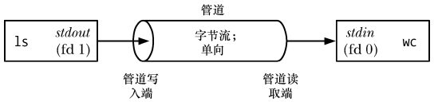
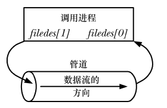
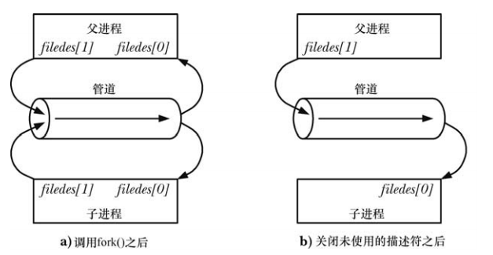
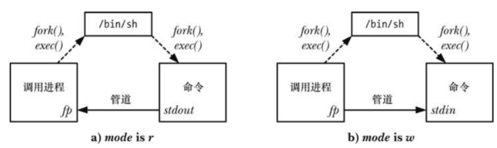
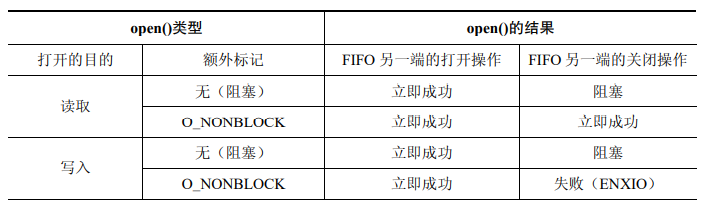
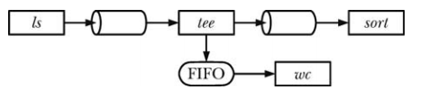

# 概述

管道最常见的地方是shell中，比如：

```
$ ls | wc -l
```

为了执行上面的命令，shell创建了两个进程来分别执行 `ls` 和 `wc` (通过 `fork()` 和 `exec()` 完成)，如下：



从上图可以看出，可以将管道看成是一组水管，它允许数据从一个进程流向另一个进程，这也是管道名称的由来。

从上图可以看出，由两个进程连接到了管道上，这样写入进程 `ls` 就将其标准输出(文件描述符为1)连接到来管道的写入段，读取进程 `wc` 就将其标准输入(文件描述符为0)连接到管道的读取端。实际上，这两个进程并不知道管道的存在，它们只是从标准文件描述符中读取和写入数据。shell 必须要完成相关的工作。

## 一个管道是一个字节流

管道是一个字节流，即在使用管道时是不存在消息或者消息边界的概念的：

- 从管道中读取数据的进程可以读取任意大小的数据块，而不管写入进程写入管道的数据块的大小是什么
- 通过管道传递的数据是顺序的，从管道中读取出来的字节的顺序与它们被写入管道的顺序是完全一样的，在管道中无法使用 `lseek()` 来随机的访问数据

如果需要在管道中实现离散消息的概念，那么就必须要在应用程序中完成这些工作。虽然这是可行的，但如果碰到这种需求的话最好使用其他 IPC 机制，如消息队列和数据报 socket。

## 从管道中读取数据

试图从一个当前为空的管道中读取数据将会被阻塞直至至少有一个字节被写入到管道中为止。

如果管道的写入端被关闭了，那么从管道中读取数据的进程在读完管道中剩余的所有数据之后将会看到文件结束（即 `read()` 返回 0）。

## 管道是单向的

在管道中数据的传递方向是单向的。管道的一端用于写入，另一端则用于读取。

在其他一些 UNIX 实现上，特别是那些从 System V Release 4 演化而来的系统，管道是双向的（所谓的流管道）。双向管道并没有在任何 UNIX 标准中进行规定，因此即使在提供了双向管道的实现上最好也避免依赖这种语义。作为替代方案，可以使用 UNIX domain 流 socket 对（通过 `socketpair()` 系统调用来创建），它提供了一种标准的双向通信机制，并且其语义与流管道是等价的。

## 可以确保写入不超过 PIPE_BUF 字节的操作是原子的

如果多个进程写入同一个管道，那么如果它们在一个时刻写入的数据量不超过 PIPE_BUF 字节，那么就可以确保写入的数据不会发生相互混合的情况。

SUSv3 要求 PIPE_BUF 至少为 `_POSIX_PIPE_BUF(512)`。一个实现应该定义 PIPE_BUF（在 `<limits.h>` 中）并/或允许调用 `fpathconf(fd,_PC_PIPE_BUF)` 来返回原子写入操作的实际上限。
不同 UNIX 实现上的 PIPE_BUF 不同，如在 FreeBSD 6.0 其值为 512 字节，在 Tru64 5.1 上其值为 4096 字节，在 Solaris 8 上其值为 5120 字节。在 Linux 上，PIPE_BUF 的值为 4096。

- 当写入管道的数据块的大小超过了 PIPE_BUF 字节，那么内核可能会将数据分割成几个较小的片段来传输，在读者从管道中消耗数据时再附加上后继的数据(`write()`调用会阻塞直到所有数据被写入到管道为止)
- 当只有一个进程向管道写入数据时（通常的情况），PIPE_BUF 的取值就没有关系了
- 但如果有多个写入进程，那么大数据块的写入可能会被分解成任意大小的段（可能会小于 PIPE_BUF 字节），并且可能会出现与其他进程写入的数据交叉的现象

只有在数据被传输到管道的时候 PIPE_BUF 限制才会起作用。当写入的数据达到 PIPE_BUF 字节时，`write()` 会在必要的时候阻塞知道管道中的可用空间足以原子的完成此操作。如果写入的数据大于 PIPE_BUF 字节，那么 `write()` 会尽可能的多传输数据以充满整个管道，然后阻塞直到一些读取进程从管道中移除了数据。如果此类阻塞的 `write()` 被一个信号处理器中断了，那么这个调用会被解除阻塞并返回成功传输到管道中的字节数，这个字节数会少于请求写入的字节数（所谓的部分写入）。

## 管道的容量是有限的

管道其实是一个在内核内存中维护的缓冲器，这个缓冲器的存储能力是有限的。一旦管道被填满之后，后继向管道的写入操作就会被阻塞直到读者从管道中移除了一些数据为止。

SUSv3 并没有规定管道的存储能力。在早于 2.6.11 的 Linux 内核中，管道的存储能力与系统页面的大小是一致的（如在 x86-32 上是 4096 字节），而从 Linux 2.6.11 起，管道的存储能力是 65,536 字节。其他 UNIX 实现上的管道的存储能力可能是不同的。

一般来讲，一个应用程序无需知道管道的实际存储能力。如果需要防止写者进程阻塞，那么从管道中读取数据的进程应该被设计成以尽可能快的速度从管道中读取数据。

# 创建和使用管道

```
#include <unistd.h>

int pipe(int fd[2]);    
```

- `pipe()` 创建一个新管道
- 成功的调用在数组 `fd` 中返回两个打开的文件描述符，一个表示管道的读取端 `fd[0]`，一个表示管道的写入端 `fd[1]`

调用 `pipe()` 函数时，首先在内核中开辟一块缓冲区用于通信，它有一个读端和一个写端，然后通过 `fd` 参数传出给用户进程两个文件描述符，`fd[0]` 指向管道的读端，`fd[1]` 指向管道的写段。

不要用 `fd[0]` 写数据，也不要用 `fd[1]` 读数据，其行为未定义的，但在有些系统上可能会返回 -1 表示调用失败。数据只能从 `fd[0]` 中读取，数据也只能写入到`fd[1]`，不能倒过来。

与所有文件描述符一样，可以使用 `read()` 和  `write()` 系统调用来在管道上执行 IO，一旦向管道的写入端写入数据之后立即就能从管道的读取端读取数据。管道上的 `read()`  调用会读取的数据量为所请求的字节数与管道中当前存在的字节数两者之间的较小值。当管道为空时，读取操作阻塞。

也可以在管道上使用 stdio 函数（`printf()`、`scanf()` 等），只需要首先使用 `fdopen()` 获取一个与 `filedes` 中的某个描述符对应的文件流即可。但在这样做的时候需要解决 `stdio` 缓冲问题。

管道可以用于进程内部自己通信：



管道可以用于亲缘关系(子进程会继承父进程中的文件描述符的副本)进程中通信：



不建议将单个 pipe 用作全双工的，或者不关闭用作半双工而不关闭相应的读端/写端，这样很可能导致死锁：如果两个进程同时试图从管道中读取数据，那么就无法确定哪个进程会首先读取成功，从而产生两个进程竞争数据了。要防止这种竞争情况的出现就需要使用某种同步机制。这时，就需要考虑死锁问题了，因为如果两个进程都试图从空管道中读取数据或者尝试向已满的管道中写入数据就可能会发生死锁。

如果我们想要一个双向数据流时，可以创建两个管道，每个方向一个。

## 管道允许相关进程间的通信

其实管道可以用于任意两个甚至更多相关进程之间的通信，只要在创建子进程的系列 `fork()` 调用之前通过一个共同的祖先进程创建管道即可。

## 关闭未使用管道文件描述符

关闭未使用管道文件描述符不仅仅是为了确保进程不会消耗尽其文件描述符的限制。

从管道中读取数据的进程会关闭其持有的管道的写入描述符，这样当其他进程完成输出并关闭其写入描述符之后，读者就能够看到文件结束。反之，如果读取的进程没有关闭管道的写入端，那么在其他进程关闭了写入描述符之后，即使读者已经读完了管道中的所有数据，也不会看到文件结束。因为此时内核知道至少还有一个管道的写入描述符打开着，从而导致 `read()` 阻塞。

当一个进程视图向一个管道中写入数据但没有任何进程拥有该管道的打开着的读取描述符时，内核会向写入进程发送一个 `SIGPIPE` 信号，默认情况下，这个信号将会杀死进程，但进程可以选择忽略或者设置信号处理器，这样 `write()` 将因为 `EPIPE` 错误而失败。收到 `SIGPIPE` 信号和得到 `EPIPE`  错误对于标识管道的状态是有意义的，这就是为什么需要关闭管道的未使用读取描述符的原因。如果写入进程没有关闭管道的读取端，那么即使在其他进程已经关闭了管道的读取端之后，写入进程仍然能够向管道写入数据，最后写入进程会将数据充满整个管道，后续的写入请求会将永远阻塞。

# 使用管道连接过滤器

当管道被创建之后，为管道的两端分配的文件描述符是可用描述符中数值最小的两个，由于通常情况下，进程已经使用了描述符 0,1,2,因此会为管道分配一些数值更大的描述符。如果需要使用管道连接两个过滤器(即从 `stdin` 读取和写入到 `stdout`)，使得一个程序的标准输出被重定向到管道中，就需要采用复制文件描述符技术。

```
int pfd[2];
pipe(pfd);

close(STDOUT_FILENO);
dup2(pfd[1]，STDOUT_FILENO);
```

上面这些调用的最终结果是进程的标准输出被绑定到管道的写入端，而对应的一组调用可以用来将进程的标准的输入绑定到管道的读取端上。

# 通过管道与 shell 命令进行通信: `popen()`

```
#include <stdio.h>

FILE *popen (const char *command, const char *mode);
```

- `pipe()` 和 `close()` 是最底层的系统调用，它的进一步封装是 `popen()` 和 `pclose()`
- `popen()`函数创建了一个管道，然后创建了一个子进程来执行 shell，而 shell 又创建了一个子进程来执行`command`字符串
- `mode` 参数是一个字符串：
  - 它确定调用进程是从管道中读取数据（`mode` 是 `r`）还是将数据写入到管道中（`mode` 是 `w`）
  - 由于管道是向的，因此无法在执行的 `command` 中进行双向通信
  - `mode`  的取值确定了所执行的命令的标准输出是连接到管道的写入端还是将其标准输入连接到管道的读取端



- `popen()` 在成功时会返回可供 `stdio` 库函数使用的文件流指针。当发生错误时，`popen()` 会返回 `NULL` 并设置 `errno` 以标示出发生错误的原因
- 在 `popen()` 调用之后，调用进程使用管道来读取 `command` 的输出或使用管道向其发送输入。与使用 `pipe()` 创建的管道一样，当从管道中读取数据时，调用进程在 `command` 关闭管道的写入端之后会看到文件结束；当向管道写入数据时，如果 `command` 已经关闭了管道的读取端，那么调用进程就会收到 `SIGPIPE` 信号并得到 `EPIPE` 错误

```
#include <stdio.h>

int pclose ( FILE * stream);
```

- 一旦IO结束之后可以使用  `pclose()` 函数关闭管道并等待子进程中的 shell 终止（不应该使用 `fclose()` 函数，因为它不会等待子进程。）
- `pclose()` 在成功时会返回子进程中 shell 的终止状态（即 shell 所执行的最后一条命令的终止状态，除非 shell 是被信号杀死的）
- 和 `system()` 一样，如果无法执行shell，那么 `pclose()` 会返回一个值就像子进程中的 shell 通过调用 `_exit(127)` 来终止一样
- 如果发生了其他错误，那么 `pclose()` 返回 −1。其中可能发生的一个错误是无法取得终止状态

当执行等待以获取子进程中 shell 的状态时，SUSv3 要求 `pclose()` 与 `system()` 一样，即在内部的 `waitpid()` 调用被一个信号处理器中断之后自动重启该调用。

与 `system()` 一样，在特权进程中永远都不应该使用 `popen()`。

`popen`优缺点：

- 优点： 在 Linux 中所有的参数扩展都是由 shell 来完成的。所以在启动 `command` 命令之前程序先启动 shell 来分析 `command` 字符串，就可以使用各种 shell 扩展(比如通配符)，这样我们可以通过 `popen()` 调用非常复杂的 shell 命令
- 缺点： 对于每个 `popen()` 调用，不仅要启动一个被请求的程序，还需要启动一个 shell。即每一个 `popen()` 将启动两个进程。从效率和资源的角度看，`popen()` 函数的调用比正常方式要慢一些

`pipe()` VS `popen()`

- `pipe()`是一个底层调用，`popen()` 是一个高级的函数
- `pipe()` 单纯的创建管道，而 `popen()` 创建管道的同时 `fork()` 子进程
- `popen()` 在两个进程中传递数据时需要调用 shell 来解释请求命令；`pipe()` 在两个进程中传递数据不需要启动 shell 来解释请求命令，同时提供了对读写数据的更多控制(`popen()` 必须时 shell 命令，`pipe()` 则无硬性要求)
- `popen()` 函数是基于文件流（FILE）工作的，而 `pipe()` 是基于文件描述符工作的，所以在使用 `pipe()` 后，数据必须要用底层的`read()` 和 `write()` 调用来读取和发送

# 管道和 stdio 缓冲

由于 `popen()` 调用返回的文件流指针没有引用一个终端，因此 stdio 库会对这种流应用块缓冲。这意味着当 mode 的值为 w 来调用 `popen()` 时，默认情况下只有当 stdio 缓冲区被充满或者使用 `pclose()` 关闭了管道之后才会被发送到管道的另一端的子进程。在很多情况下，这种处理方式是不存在问题的。但如果需要确保子进程能够立即从管道中接收数据，那么就需要定期调用 `fflush()` 或使用 `setbuf(fp, NULL)` 调用禁用  stdio  缓冲。当使用 `pipe()` 系统调用创建管道，然后使用 `fdopen()` 获取一个与管道的写入端对应的 stdio 流时也可以使用这项技术

如果调用 `popen()` 的进程正在从管道中读取数据（即 `mode` 是 `r`），那么事情就不是那么简单了。在这样情况下如果子进程正在使用 stdio 库，那么——除非它显式地调用了 `fflush()` 或 `setbuf()` ，其输出只有在子进程填满 stdio 缓冲器或调用了 `fclose()` 之后才会对调用进程可用。（如果正在从使用 `pipe()` 创建的管道中读取数据并且向另一端写入数据的进程正在使用 stdio 库，那么同样的规则也是适用的。）如果这是一个问题，那么能采取的措施就比较有限的，除非能够修改在子进程中运行的程序的源代码使之包含对 `setbuf()` 或  `fflush()`  调用。

如果无法修改源代码，那么可以使用伪终端来替换管道。一个伪终端是一个 IPC 通道，对进程来讲它就像是一个终端。其结果是 stdio 库会逐行输出缓冲器中的数据。

# 命名管道(FIFO)

上述管道虽然实现了进程间通信，但是它具有一定的局限性：

- 匿名管道只能是具有血缘关系的进程之间通信
- 它只能实现一个进程写另一个进程读，而如果需要两者同时进行时，就得重新打开一个管道

为了使任意两个进程之间能够通信，就提出了命名管道（named pipe 或 FIFO）：

- FIFO 与管道的区别：FIFO 在文件系统中拥有一个名称，并且其打开方式与打开一个普通文件一样，能够实现任何两个进程之间通信。而匿名管道对于文件系统是不可见的，它仅限于在父子进程之间的通信
- 一旦打开了 FIFO，就能在它上面使用与操作管道和其他文件的系统调用一样的 IO 系统调用 `read()`，`write()`，`close()`。与管道一样，FIFO 也有一个写入端和读取端，并且总是遵循先进先出的原则，即第一个进来的数据会第一个被读走
- 与管道一样，当所有引用  FIFO 的描述符都关闭之后，所有未被读取的数据都将被丢弃
- 使用 `mkfifo` 命令可以在 shell 中创建一个 FIFO：

```
mkfifo [-m mode] pathname
```

- `pathname` 是创建的 FIFO 的名称，`-m` 选项指定权限 `mode`，其工作方式与 `chmod` 命令一样
- `fstat()` 和 `stat()` 函数会在 `stat`  结构的 `st_mode` 字段返回 `S_IFIFO`，使用 `ls -l` 列出文件时，FIFO 文件在第一列的类型为 `p`，`ls -F` 会在 FIFO 路径名后面附加管道符 `|`

```
#include <sys/types.h>
#include <sys/stat.h>

int mkfifo(const char *pathname,mode_t mode);
```

- `mode` 参数指定了新 FIFO 的权限，这些权限会按照进程的  `umask` 值来取掩码

- 一旦创建了 FIFO，任何进程都能够打开它，只要它通过常规的文件权限检测

- 使用 FIFO 时唯一明智的做法是在两端分别设置一个读取进程和一个写入进程。这样在默认情况下，打开一个 FIFO 以便读取数据（`open() O_RDONLY` 标记）将会阻塞直到另一个进程打开 FIFO 以写入数（`open() O_WRONLY` 标记）为止。相应地，打开一个 FIFO 以写入数据将会阻塞直到另一个进程打开 FIFO 以读取数据为止。换句话说，打开一个 FIFO 会同步读取进程和写入进程。如果一个 FIFO 的另一端已经打开(可能是因为一对进程已经打开了 FIFO 的两端)，那么`open()` 调用会立即成功。

在大多数 Unix 实现上(包含 Linux)，当打开一个 FIFO 时可以通过指定 `O_RDWR` 标记来绕过打开 FIFO 时的阻塞行为。这样，`open()` 会立即返回，但无法使用返回的文件描述符在 FIFO 上读取和写入数据。这种做法破坏了 FIFO 的 IO 模型，SUSv3 明确指出以 `O_RDWR` 标记打开一个 FIFO 的结果是未知的，因此出于可移植性的原因，开发人员不应该使用这项技术。对于那些需要避免在打开 FIFO 时发生阻塞的需求，`open()` 的 `O_NONBLOCK` 标记提供了一种标准化的方法来完成这个任务：

  ```
  open(const char *path, O_RDONLY | O_NONBLOCK);
  open(const char *path, O_WRONLY | O_NONBLOCK); 
  ```

在打开一个 FIFO 时避免使用 `O_RDWR` 标记还有另外一个原因，当采用那种方式调用 `open()` 之后，调用进程在从返回的文件描述符中读取数据时永远都不会看到文件结束，因为永远都至少存在一个文件描述符被打开着以等待数据被写入 FIFO，即进程从中读取数据的那个描述符。

在 FIFO 上调用 `open()` 的语义总结如下：



## 使用  FIFO 和 `tee` 创建双重管道线

shell 管道线的其中一个特征是它们是线性的，管道线中的每个进程都能读取前一个进程产生的数据并将数据发送到其后一个进程中，使用 FIFO 就能够在管道线中创建子进程，这样除了将一个进程的输出发送给管道线中的后面一个进程之外，还可以复制进程的输出并将数据发送到另一个进程中，要完成这个任务就需要使用 `tee` 命令，它将其从标准输入中读取到的数据复制两份并输出：一份写入标准输出，另一份写入到通过命令行参数指定的文件中。

```
mkfifo myfifo
wc -l < myfifo &
ls -l | tee myfifo | sort -k5n
```




