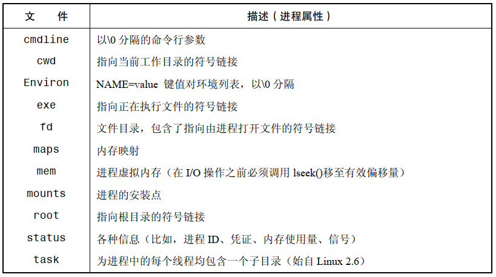
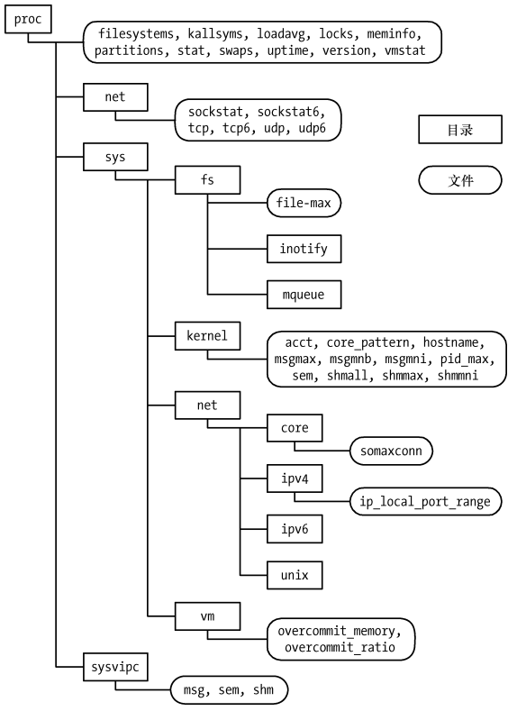

# `/proc` 文件系统

`/proc` 是一个虚拟文件系统，包含了各种用于展示内核信息的文件，并且允许进程通过常规文件 IO 系统调用方便地读取，有时还可以修改这些信息。

之所以称 `/proc`  为虚拟文件系统，是因为其包含的文件和子目录不是存储于磁盘上的，而是由内核在进程访问此类信息时动态创建的。

## 获取进程的有关信息

每个进程，内核都会提供一个相应的目录 `proc/PID`，其中 PID 是进程的 ID，此目录的各种文件和子目录包含了进程的相关信息。

```
cat /proc/1/status

Name:   systemd
Umask:  0000
State:  S (sleeping)
Tgid:   1
Ngid:   0
Pid:    1
PPid:   0
TracerPid:      0
Uid:    0       0       0       0
Gid:    0       0       0       0
FDSize: 256
Groups:
NStgid: 1
NSpid:  1
NSpgid: 1
NSsid:  1
VmPeak:   250780 kB
VmSize:   185496 kB
VmLck:         0 kB
VmPin:         0 kB
VmHWM:      5984 kB
VmRSS:      4732 kB
RssAnon:            1704 kB
RssFile:            3028 kB
RssShmem:              0 kB
VmData:    18476 kB
VmStk:       132 kB
VmExe:      1408 kB
VmLib:      3712 kB
VmPTE:       128 kB
VmSwap:      368 kB
HugetlbPages:          0 kB
CoreDumping:    0
Threads:        1
SigQ:   0/62897
SigPnd: 0000000000000000
ShdPnd: 0000000000000000
SigBlk: 7be3c0fe28014a03
SigIgn: 0000000000001000
SigCgt: 00000001800004ec
CapInh: 0000000000000000
CapPrm: 0000003fffffffff
CapEff: 0000003fffffffff
CapBnd: 0000003fffffffff
CapAmb: 0000000000000000
NoNewPrivs:     0
Seccomp:        0
Speculation_Store_Bypass:       thread vulnerable
Cpus_allowed:   ffff
Cpus_allowed_list:      0-15
Mems_allowed:   00000000,00000000,00000000,00000000,00000000,00000000,00000000,00000000,00000000,00000000,00000000,00000000,00000000,00000000,00000000,00000000,00000000,00000000,00000000,00000000,00000000,00000000,00000000,00000000,00000000,00000000,00000000,00000000,00000000,00000000,00000000,00000001
Mems_allowed_list:      0
voluntary_ctxt_switches:        1473385
nonvoluntary_ctxt_switches:     4167
```

`/proc/PID` 目录下的文件节选：



- `/proc/PID/fd` ： 为进程打开的每个文件描述符都包含一个符号链接，每个符号链接的名称都与描述符的数值相匹配
- `/proc/PID/task` ： 提供线程目录，每个目录中包含的子目录 `/proc/PID/task/TID` ，其中 TID 是线程 ID，即 `gettid()` 返回值

## `/proc` 目录下的系统信息



- `/proc` ： 各种系统信息
- `/proc/net` ： 有关网络和套接字的状态信息
- `/proc/sys/fs` ： 文件系统相关设置
- `/proc/sys/kernel` ： 各种常规的内核设置
- `/proc/sys/net` ： 网络和套接字的设置
- `/proc/sys/vm` ： 内存管理设置
- `/proc/sysvipc` ： 有关 System V IPC 对象的信息

## 访问 `/proc` 文件

通常使用 shell 脚本来访问 `/proc` 目录下的文件：

```
echo 100000 > /proc/sys/kernel/pid_max
cat /proc/sys/kernel/pid_max
```

也可以在程序中使用常规 IO 系统调用来访问 `/proc` 目录下的文件：

-  `/proc` 目录下的一些文件是只读的，即这些文件仅用于显示内核信息，无法对其进行修改， `/proc/PID` 目录下的大多数文件就属于此种类型 
-  `/proc` 目录下的一些文件仅能由文件拥有者或者特权级进程读取， `/proc/PID` 目录下的所有文件都是如此
- 除了  `/proc/PID` 子目录的文件， `/proc` 目录的其他文件大多属于 `root`  用户，并且也只能由 `root` 用户来修改这些文件

## 访问  `/proc/PID` 目录中的文件

`/proc/PID` 目录的内容变化不定，每个目录随着相应的进程 ID 的创建而生，又随着进程的终止而消灭。

# 系统标识

`uname()` 系统调用返回了一系列关于主机系统的标识信息，存储于 `utsbuf` 结构体中：

```
#include <sys/utsname.h>

int uname(struct utsname *buf);
```

-  `utsbuf` ：

```
 struct utsname {
               char sysname[];    /* Operating system name (e.g., "Linux") */
               char nodename[];   /* Name within "some implementation-defined
                                     network" */
               char release[];    /* Operating system release (e.g., "2.6.28") */
               char version[];    /* Operating system version */
               char machine[];    /* Hardware identifier */
           #ifdef _GNU_SOURCE
               char domainname[]; /* NIS or YP domain name */
           #endif
           };
```

- 在 Linux 中这些字段的长度都是 65，其中包括了空字节终止符所占用的空间
- `sysname`，`release`，`version`，`machine` 字段由内核自动设置


