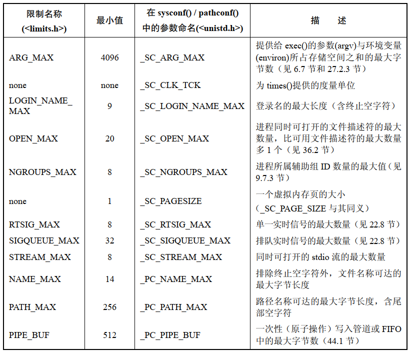
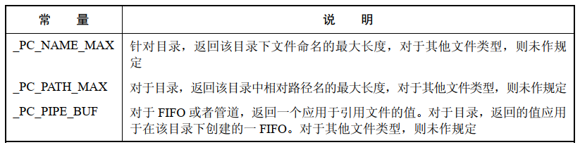

# 系统限制

规范一般会限制一个最小值，通常情况下将这些最小值定义为 `<limits.h>`， 命名冠以 `_POSIX_`，通常还包含 `_MAX`，常量的命名形式通常如 ：`_POSIX_XXX_MAX`。

特定系统上获取限制的方法，使用  `<limits.h>`， `sysconf()` 或者 `pathconf()`。

每个限制都有一个名称，与上述最小值的名称相对应，但没有 `_POSIX_` 前缀，实现时的相应限制可以记录在 `<limits.h>` 文件中，该限制值总是至少等同于前述最大值 `XXX_MAX >= _POSIX_XXX_MAX`。


## 运行时恒定值(可能不确定)

运行时恒定值指的是对于某一限制，若已然在 `<limits.h>` 文件中定义，则对于实现而言固定不变，然而该值可能是不确定的(因为该值可能依赖于可用的内存空间)，因而在 `<limits.h>` 文件中会忽略对其定义。在这种情况下，应用程序可以使用 `sysconf()` 来获取运行时的值。

`MQ_PRIO_MAX` 限制就是运行时恒定值的例子，SUSv3 定义了值为 32 的常量 `_POSIX_MQ_PRIO_MAX`，将其作为规范必须提供的限制最小值，一个 UNIX 实现可以为此限制设定更高的值，并将该值在 `<limits.h>` 文件中以常量 `MQ_PRIO_MAX`  加以定义，例如，Linux 将 `MQ_PRIO_MAX` 的值定义为 32678，运行时获取该值：

```
lim = sysconf(_SC_MQ_PRIO_MAX);
```

## 路径名变量值

路径名变量值是指与路径名(文件，目录，终端)相关的限制，每个限制可能是相对于某个系统实现的常量，也可能随文件系统的不同而不同。应用程序可以使用 `pathconf()` 或者 `fpathconf()` 来获取该值。

`NAME_MAX` 定义了在一个特定文件系统上文件名的最大长度，获取限制：

```
lim = pathconf(directory_path,_PC_NAME_MAX);
```

## 运行时可增加值

运行时系统至少都应该支持限制的最小值，但是在特定的系统上运行时可能会增加该值，应用程序可以使用 `sysconf()`  来获得系统所支持的实际值。

`NGROUPS_MAX` 定义了一个进程可以同时从属的辅助组 ID的最大数量。

## 对选定 SUSv3  限制的总结



- `gettablesize()` 是确定进程文件描述符(`OPEN_MAX`)限制的备选方法，已遭弃用
- `getpagesize()` 是确定页大小(`_SC_PAGESIZE`) 的备选方法，已遭弃用
- 定义于  `<stdio.h>` 文件中的常量 `FOPEN_MAX` 等同于 `STREAM_MAX`
- `NAME_MAX` 不包含终止符，`PATH_MAX` 则包含终止符

## 从 shell 中获取限制和选项 

`getconf`  命令可以获取特定 UNIX 系统中已然实现的限制和选项，一般形式：

```
getconf varibale-name [pathname]
```

- 但凡限制与路径名相关，则还需要指定一个路径名

例如：

```
getconf OPEN_MAX
1024

getconf NAME_MAX /root
255
```

# 运行时获取系统限制和选项

```
#include <unistd.h>

long sysconf(int name);
```

- `name` 为 `<unistd.h>` 文件中的  `_SC_` 系列常量之一
- 限制值作为结果返回，如果无法确定某个限制，则返回 -1，如果调用发生错误，也会返回 -1唯一指定的错误是 `EINVAL`,表示 `name`  无效，若要区别以上两种情况，必须在调用函数前将 `errno` 设置为 0，如果函数返回 -1，则调用后 `errno` 不是0，那么表示调用时发生了错误

# 运行时获取与文件相关的限制和选项

```
#include <unistd.h>

long fpathconf(int fd, int name);
long pathconf(const char *path, int name);
```

- `fpathconf()` 和 `pathconf()` 之间的唯一区别在于对文件或目录的指定方式，`fpathconf()` 使用文件描述父指定，`pathconf()` 使用路径名方式
- `name` 是定义在 `<unistd.h>` 中 `_PC_` 系列常量
- 限制值将最为结果返回，区分限定值不确定和发生错误的方法与 `sysconf()` 一致
- 和 `sysconf()` 不同的是，`fpathconf()` 和 `pathconf()` 的返回值在进程的生命周期内并不要求保持恒定，例如，进程运行期间可能会卸载一个文件系统，再以不同的特性重新装载该文件系统




