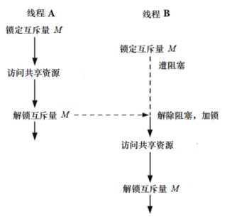

# 保护对共享变量的访问：互斥量

线程的主要优势在于能够通过全局变量共享信息，但是这种共享也是有代价的：必须确保多个线程不会同时修改同一变量，或者某一线程不会读取正由其他线程修改的变量。

临界区指的是访问某一共享资源的片段，并且该片段执行应为原子操作，亦即，同时访问同一共享资源的线程不应该中断该片段的执行。

为避免线程更新共享变量时所出现而问题，必须使用互斥量来确保同时仅有一个线程可以访问某项共享资源，更为全面的说法是，可以使用互斥量来保证对任意共享资源的原子访问。

互斥量有两种状态：已锁定和未锁定。任何时候，至多只有一个线程可以锁定该互斥量，视图对已经锁定的某一互斥量再次加锁，将可能阻塞线程或者报错失败，具体取决于加锁时使用的方法。

一旦线程锁定互斥量，随即成为该互斥量的所有者，只有所有者才能给互斥量解锁，每个线程在访问同一资源时采用如下步骤：

- 针对共享资源锁定互斥量
- 访问共享资源
- 对互斥量解锁



## 静态分配的互斥量

互斥量可以像静态变量那样分配，也可以在运行时动态创建。

```
pthread_mutex_t mtx = PTHREAD_MUTEX_INITIALIZER;
```

## 加锁和解锁互斥量

初始化之后，互斥量处于未锁定状态。

```
#include <pthread.h>

int pthread_mutex_lock(pthread_mutex_t *mutex);
int pthread_mutex_lock(pthread_mutex_t *mutex);
```


