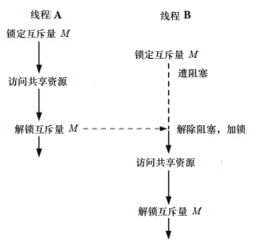

# 保护对共享变量的访问：互斥量

线程的主要优势在于能够通过全局变量共享信息，但是这种共享也是有代价的：必须确保多个线程不会同时修改同一变量，或者某一线程不会读取正由其他线程修改的变量。

临界区指的是访问某一共享资源的片段，并且该片段执行应为原子操作，亦即，同时访问同一共享资源的线程不应该中断该片段的执行。

为避免线程更新共享变量时所出现而问题，必须使用互斥量来确保同时仅有一个线程可以访问某项共享资源，更为全面的说法是，可以使用互斥量来保证对任意共享资源的原子访问。

互斥量有两种状态：已锁定和未锁定。任何时候，至多只有一个线程可以锁定该互斥量，视图对已经锁定的某一互斥量再次加锁，将可能阻塞线程或者报错失败，具体取决于加锁时使用的方法。

一旦线程锁定互斥量，随即成为该互斥量的所有者，只有所有者才能给互斥量解锁，每个线程在访问同一资源时采用如下步骤：

- 针对共享资源锁定互斥量
- 访问共享资源
- 对互斥量解锁



## 静态分配的互斥量

互斥量可以像静态变量那样分配，也可以在运行时动态创建。

```
pthread_mutex_t mtx = PTHREAD_MUTEX_INITIALIZER;
```

## 加锁和解锁互斥量

```
#include <pthread.h>

int pthread_mutex_lock(pthread_mutex_t *mutex);
int pthread_mutex_unlock(pthread_mutex_t *mutex);
```

- 初始化之后，互斥量处于未锁定状态
- 要锁定互斥量，需要指定互斥量，如果互斥量当前处于未锁定状态，该调用将锁定互斥量并立即返回，如果其他线程已经锁定了这一互斥量，`pthread_mutex_lock()` 将一直阻塞，直至该互斥量被解锁，到那时，调用将锁定互斥量并返回
- 如果发起 `pthread_mutex_lock()` 调用的线程自身之前已然将目标互斥量锁定，对于互斥量的默认类型而言，可能产生两种后果，视具体的实现而定：线程陷入死锁，因为视图锁定已为自己持有的互斥量而遭到阻塞；调用失败，返回 `EDEADLK`  错误，在默认情况下，Linux 上将为死锁
- `pthread_mutex_unlock()` 将解锁之前已遭调用线程锁定的互斥量，以下行为都是错误：对处于未锁定状态的互斥量进行解锁，解锁由其他线程锁定的互斥量
- 如果有不止一个线程在等待获取由 `pthread_mutex_unlock()` 解锁的互斥量，则无法判断究竟哪个线程将如愿以偿

### `pthread_mutex_trylock()` 和 `pthread_mutex_timedlock()`

如果信号量已然锁定，对其执行函数 `pthread_mutex_trylock()` 会失败并返回错误 `EBUSY`，除此之外，该函数与 `pthread_mutex_lock()` 行为相同。

除了调用者可以指定一个附加参数 `abstime` (设置线程等待获取互斥量时休眠的时间限制)外，函数 `pthread_mutex_timedlock()` 与 `pthread_mutex_lock()` 没有区别。如果参数 `abstime` 指定的时间间隔期满，而调用线程还没有获得对互斥量的所有权，那么函数 `pthread_mutex_timedlock()` 返回 `ETIMEDOUT` 错误。

函数 `pthread_mutex_trylock()` 和 `pthrtead_mutex_timedlock()`  比 `pthread_mutex_lock()` 的使用频率要低，在大多数经过良好设计的应用程序中，线程对互斥量的持有时间应尽可能短，以避免妨碍其他线程的并发执行。

## 互斥量的性能

对互斥量的加锁和解锁的开销并不是特别高，在通常情况下，线程会花费更多时间去做其他工作，对互斥量的加锁和解锁操作相对要少得多，因此使用互斥量对于大部分应用程序的性能并无显著影响。

## 互斥量的死锁

有时，一个线程需要同时访问两个或者更多的共享资源，而每个资源又都由不同的互斥量管理，当超过一个线程加锁同一组互斥量时，就有可能发生死锁。


要避免此类死锁问题，最简单的方法就是定义互斥量的层级关系，当多个线程对一组互斥量操作时，总是应该以相同的顺序对该组互斥量进行锁定。

另一种使用频率较低的方案是，尝试一下，然后恢复，即线程先使用 `pthread_mutex_lock()` 锁定第一个互斥量，然后使用 `pthread_mutex_trylock()` 来锁定其余互斥量，如果任一 `pthread_mutex_trylock()` 调用失败，那么该线程将释放所有互斥量，也许经过一段时间间隔，从头再试。相对于层级锁，这种方式效率相对较低。

## 动态初始化互斥量

静态初始化互斥量，互斥量带有的是默认属性。

```
#include <pthread.h>

int pthread_mutex_init(pthread_mutex_t *mutex,const pthread_mutexattr_t *attr);
int pthread_mutex_destroy(pthread_mutex_t* mutex);
```

- `attr` 指定互斥量的属性，如果是 `NULL` 则采用默认属性
- 动态初始化的互斥量，需要使用 `pthread_mutex_destroy()` 销毁，静态初始化则不需要
- 只有互斥量处于未锁定，且后续也无任何线程视图锁定它时，将其销毁才是安全的，若互斥量驻留在动态分配的一片内存区域，应在释放内存之前将其销毁，自动分配的互斥量，也应该在主函数返回前将其销毁

如下情况下，必须使用 `pthread_mutex_init()` 动态初始化互斥量，而不能静态初始化互斥量：

- 动态分配于堆中的互斥量
- 互斥量是在栈中分配的自动变量
- 初始化经由静态分配，且不使用默认属性的互斥量

## 互斥量的类型

默认情况下：

- 同一线程不应对同一互斥量加锁两次
- 线程不应对不为自己所拥有的互斥量加锁
- 线程不应对一尚未锁定的互斥量解锁

### PTHREAD_MUTEX_NORMAL

该类型的互斥量不具有死锁检测功能，如果视图对已由自己锁定的互斥量加锁，则发生死锁。

互斥量处于未锁定状态，或者已经由其他线程锁定，对其解锁将导致不确定的结果。

### PTHREAD_MUTEX_ERRORCHECK

此类互斥量会执行错误检查，上述的三种情况都会导致 Pthreads 函数错误返回，这类互斥量运行起来比一般类型慢，不过作为调试工具，可以发现程序在哪里违背了互斥量的使用原则。

### PTHREAD_MUTEX_RECURSIVE

递归互斥量维护一个锁计数器，同一线程每次加锁操作都会导致计数加1，而解锁将会导致计数减1，只有当锁计数器为0时，才会释放该互斥量。

解锁时如目标互斥量处于未锁定状态，或者是已由其他线程锁定，操作都会失败。

### PTHREAD_MUTEX_DEFAULT

使用 `PTHREAD_MUTEX_INITIALIZER` 初始化或者动态初始化时将 `attr`  参数指定为 `NULL` 都将得到此类型的互斥锁。Linux 上，`PTHREAD_MUTEX_DEFAULT` 与 `PTHREAD_MUTEX_NORMAL` 相似。

```
pthread_mutex_t mtx;
pthread_mutexatter_t mtxAttr;
int s,type;

s = pthread_mutexattr_init(&mtxAttr);
if(s != 0)
    errExit("pthread_mutexattr_init()");

s = pthread_mutex_settype(&mtxAttr,PTHREAD_MUTEX_ERRORCHECK);
if(s != 0)
    errExit("pthread_mutex_settype()");

s = pthread_mutex_init(mtx,&mtxAttr);
if(s != 0)
    errExit("pthread_mutex_init()");

s = pthread_mutexattr_destroy(&mtxAttr);
if(s != 0)
    errExit("pthread_mutexattr_destroy()");
```

# 通知状态的改变：条件变量 

互斥量防止多个线程同时访问同一共享变量，条件变量允许某个线程就某个共享变量的状态变化通知其他线程，并让其他线程等待这一通知。

```
static pthread_mutex_t mtx = PTHREAD_MUTEX_INITIALIZER;

static int avail = 0;

s = pthread_mutex_lock(&mtx);
if(s != 0)
	errExit("pthread_mutex_lock()");

avail ++;

s = pthread_mutex_unlock(&mtx);
if(s != 0)
	errExit("pthread_mutex_unlock()");

for(;;)
{
	s = pthread_mutex_lock(&mtx);
	if(s != 0)
		errExit("pthread_mutex_lock()"); 
	
	while(avail > 0)
	{
		avail--;
	}
	
	s = pthread_mutex_unlock(&mtx);
	if(s != 0)
		errExit("pthread_mutex_unlock()");
}
```

上面的代码虽然可行，但是主线程不停的查询 `avail` 的状态，造成 CPU 资源浪费，采用条件变量将解决此问题。

条件变量总是结合互斥量使用，条件变量就共享变量的状态发出通知，而互斥量则提供该共享变量的访问互斥。

## 由静态分配的条件变量

条件变量的分配也分为静态和动态。

```
pthread_cond_t cond = PTHREAD_COND_INITIALIZER;
```

## 通知和等待条件变量

条件变量的主要操作时发送信号和等待，发送信号通知一个或者多个处于等待状态的线程，否则处于等待状态的线程在收到通知之前一直处于阻塞。

```
#include <pthread.h>

int pthread_cond_signal(pthread_cond_t *cond);
int pthread_cond_broadcast(pthread_cond_t *cond);
int pthread_cond_wait(pthread_cond_t *cond,pthread_mutex_t* mutex);
```

- `pthread_cond_signal()` 只保证唤醒至少一条遭到阻塞的线程，`pthread_cond_broadcast()` 唤醒所有遭到阻塞的线程，`pthread_cond_broadcast()` 总能产生正确的结果，但 `pthread_cond_signal()` 更加高效：
  - 避免同时唤醒所有等待线程
  - 某一线程首先获得调度
  - 剩余的每个线程轮流锁定互斥量并检测共享变量的状态
- 条件变量并不保存状态信息，只是传递应用程序状态信息的一种通讯机制，发送信号时，若无任何线程在等待该条件变量，这个信号将不了了之

```
#include <pthread.h>

int pthread_cond_timedwait(pthread_cond_t *cond,pthread_mutex_t* mutex,const atruct timespec* abstime);
```

- `pthread_cond_timedwait()` 与 `pthread_cond_wait()` 功能几乎相同，但是可以指定线程等待条件变量通知休眠时间的上限
- 如果 `abstime`  指定的时间间隔到期，并且无相关条件变量的通知，则返回 `ETIMEOUT` 错误

### 生产者-消费者示例中使用条件变量

生产者：

```
static pthread_mutex_t mtx = PTHREAD_MUTEX_INITIALIZER;
static pthread_cond_t cond = PTHREAD_COND_INITIALIZER;

static int avail = 0;

s = pthread_mutex_lock(&mtx);
if(s != 0)
	errExit("pthread_mutex_lock()");

avail ++;

s = pthread_mutex_unlock(&mtx);
if(s != 0)
	errExit("pthread_mutex_unlock()");

s = pthread_cond_signal(&cond)
if(s != 0)
	errExit("pthread_cond_signal()");
```

消费者：

```
for(;;)
{
	s = pthread_mutex_lock(&mtx);
	if(s != 0)
		errExit("pthread_mutex_lock()");
	
	while(avail == 0)
	{
		s = pthread_cond_wait(&cond,&mutex);
		if(s != 0)
			errExit("pthread_cond_wait()");
	}
	
	while(avail > 0)
	{
		avail--;
	}
	
	s = pthread_mutex_unlock(&mtx);
	if(s != 0)
		errExit("pthread_mutex_unlock()");
}
```

- 线程在准备检查共享变量状态时锁定互斥量
- 检查共享变量的状态
- 如果共享变量未处于预期状态，线程应在等待条件变量并进入休眠前解锁互斥量，以便其他线程能够访问该共享变量
- 当线程因为条件变量的通知而再度被唤醒，必须对互斥变量再次加锁，因为在典型情况下，线程会立即访问共享变量

`pthread_cond_wait()` 会自动执行最后两步中对互斥量的解锁和加锁。

## 测试条件变量的判断条件

```
while(avail == 0)
{
    s = pthread_cond_wait(&cond,&mutex);
    if(s != 0)
    	errExit("pthread_cond_wait()");
}
```

这里使用 `while`  循环的原因是，当代码从 `pthread_cond_wait()`  返回时，并不能确定判断条件的状态，所以应该立即重新检查判断条件，在条件不满足的情况下继续休眠等待，之所以不能对判断条件的状态做任何假设的原因如下：

- 其他线程可能率先醒来，也许有多个线程在等待获取与条件变量相关的互斥量，其他线程可能率先获取互斥量并改变相关共享变量的状态，进而改变判断条件的状态
- 设计时设置 "宽松的" 判断条件或许更为简单，有时使用条件变量表征可能性而非确定性，在设计应用程序时会更为简单，换言之，就条件变量发送信号意味着 "可能有些事情" 需要接收信号的线程去响应，而不是 "一定有一些事情"要做，使用这种方法，接收信号的线程可以通过再次检查判断条件来确定是否真的需要做些什么
- 可能会发生虚假唤醒的情况，在一些实现中，即使没有任何其他线程真地就条件变量发出信号，等待此条件变量的线程仍有可能醒来

## 经由动态分配的条件变量

```
#include <pthread.h>

int pthread_cond_init(pthread_cond_t* cond,const pthread_condattr_t * attr);
int pthread_cond_destroy(pthread_cond_t* cond);
```

- `pthread_cond_init()` 对条件变量进行动态初始化，若将 `attr` 设置为  `NULL`，则使用一组缺省属性来设置条件变量
- 对某个条件变量而言，仅当没有任何线程在等待它时，将其销毁才是安全的，如果条件变量驻留于某片动态创建的内存区域，那么应在释放该内存区域前将其销毁，经由自动分配的条件变量应在宿主函数返回钱予以销毁


