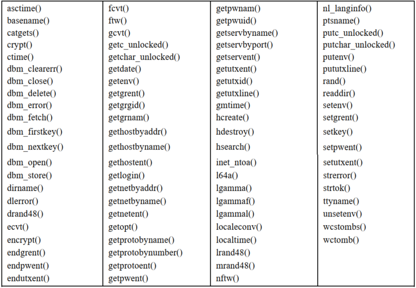
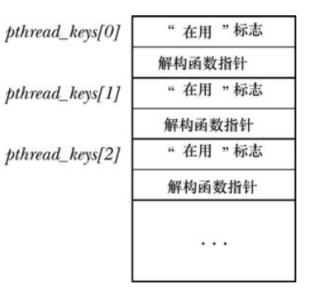
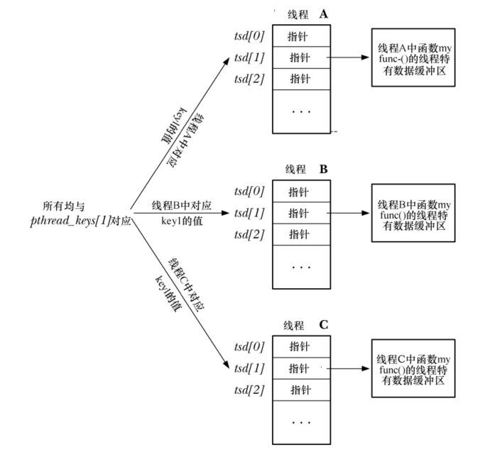

# 线程安全

若函数可同时供多个线程安全调用，则称之为线程安全函数；反之，如果函数不是线程安全的，则不能并发调用。

实现线程安全有多种方式：

- 将函数与互斥量关联使用，这种方法相对简单
- 同时只能有一个线程执行该函数，串行将丧失并发能力
- 将共享变量与互斥变量联合使用

## 非线程安全的函数

SUSv3 不要求下列的函数是线程安全的：



SUSv3 在上表的基础之上，增加了函数 `strsignal()` 和 `system()`。

## 可重入和不可重入函数

较之于对整个函数使用互斥量，使用临界区实现线程安全虽然有明显改进名，但是由于存在对互斥量加锁和解锁的开销，性能还是有少许降低。

可重入函数无需使用互斥量即可实现线程安全，其要诀在于避免对全局和静态变量的使用，需要返回给调用者的任何信息，亦或是需要在对函数的历次调用间维护的信息，都存储于由调用者分配的缓冲区内，一般的，可重入函数以 `_r` 结尾，与不可重入函数加以区分。

不是所有的函数都可以实现为可重入：

- 有些函数必须访问全局数据结构，例如 `malloc()` 需要访问一个全局链表
- 一些函数的接口本身就定义为不可重入，要么返回指针，指向函数自身静态分配的存储空间，要么利用静态存储对该函数历次调用信息加以维护，例如 `asctime()` 返回指向静态分配缓冲区的指针

# 一次性初始化

```
#include <pthread.h>

int pthread_once(pthread_once_t* once_control,void(*init)(void));
```

- 利用参数 `once_control` 的状态，函数 `pthread_once() ` 可以确保无论有多少线程对 `pthread_once()` 调用了多少次，也只会执行一次由 `init` 指向的函数
- `once_control` 必须是一个指针，指向初始化为 `PTHREAD_ONCE_INIT` 的静态变量：

```
pthread_once_t once_var = PTHREAD_ONCEC_INIT;
```

- `pthread_once()` 调用后将修改 `once_control` 指向的内容，以便对其后续调用不会再次执行 `init`

# 线程特有数据

使用线程特有数据技术，可以无需修改函数接口而实现已有函数的线程安全，较之于可重入函数，采用线程特有数据的函数效率可能要略低一些。

线程特有数据使得函数得以为每个调用线程分别维护一份变量的副本，线程特有数据是长期存在的，在同一线程对相同函数的历次调用间，每个线程的变量会持续存在，函数可以向每个调用线程返回各自结果的缓冲区。

## 库函数视角下的线程特有数据

线程特有数据的库函数角度需要考虑如下问题：

- 该函数必须为每个调用者线程分配单独的存储，且只需在线程初次调用此函数时分配一次即可
- 在同一线程对此函数的后续调用中，该函数都需要获取初次调用时线程分配的存储块地址，函数不能利用自动变量存放块指针，也不能将指针存放于静态变量中，因为静态变量在进程中只有一个实例
- 不同函数各自可能都需要使用线程特有数据，每个函数都需要方法来标识其自身的线程特有数据，以便与其他函数所使用的线程特有数据加以区分
- 当线程退出时，函数无法控制将要发生的情况，不过一定存在某些机制，在线程退出时会自动释放为该线程所分配的存储，若非如此，随着持续不断的创建线程，调用函数和终止线程，将会引发内存泄露

## 线程特有数据 API 概述

要使用线程特有数据，库函数执行的一般步骤为：

- 函数创建一个键(key)，用以将不同函数使用的线程也有数据项区分开来，调用函数 `pthread_key_create()` 可创建此键，且只需在首个调用该函数的线程中创建一次，函数 `pthread_once()` 正是出于此目的，键在创建时并未分配任何线程特有数据块

- 调用 `pthread_key_create()` 还可以指定一个自定义解构函数，用于释放为该键所分配的各个存储块，当使用线程持有数据的线程终止时，Pthreads API 会自动调用此解构函数

- 函数会为每个调用者线程创建线程特有数据块，这一分配通过调用 `malloc()` 或者类似的函数完成，每个线程只分配一次，且只会在线程初次调用此函数时分配

- 为了保存上一步所分配存储块的地址，函数会使用两个 Pthreads 函数：`pthread_setspecific()`  和 `pthread_getspecific()` ：

  - `pthread_setspecific()`   实际上是对 Pthreads 发起这样的请求：保存该指针，并记录其与特定键以及特定线程的关联性
  - `pthread_getspecific()` 返回之前保存的，与给定键以及调用线程相关联的指针，如果还没有指针与特定的键及线程相关联，那么将返回 `NULL`

  
## 线程特有数据 API 详述

```
#include <pthread.h>

int pthread_key_create(pthread_key_t *key,void(*destructor)(void*));
```

- 只要线程终止时与 `key` 的关联值不为 `NULL`，Pthreads API 会自动执行解构函数，并将与 `key` 关联值作为参数传入解构函数，如果无需解构，可将 `destructor` 设置为 `NULL`
- 如果一个线程有多个线程特有数据块，那么对各个结构函数的调用顺序是不确定的

一个进程范围数组，存放线程特有数据的键信息，每个线程包含一个数组，存有为每个线程分配的线程也有数据块的指针，在这一实现中，`pthread_create_key()` 返回的 `pthread_key_t` 类型值只是对全局数组的索引，标记为 `pthread_keys`：



- 第一个字段标记该数组元素是否在用
- 第二个字段用于存放针对此键、线程特有数据块的解构函数指针

```
#include <pthread.h>

int pthread_setspecific(pthread_key_t key,const void *value);
int *pthread_getspecific(pthread_key_t key);
```

- `pthread_setspecific()` 的参数 `value`  通常是一个指针，指向由调用者分配的一块内存，当线程终止时，会将该指针作为参数传递给与 key 对应的解构函数
- `value` 也可以不是一个指向内存区域的指针，而是任何可以赋值给  `void*` 的标量值，此时一般将 `destructor` 设置为 `NULL`



当线程刚刚创建时，会将所有线程特有数据的指针都初始化为 `NULL`。


