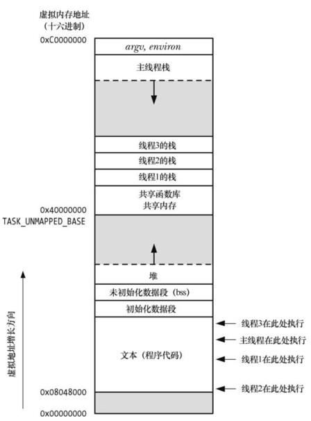
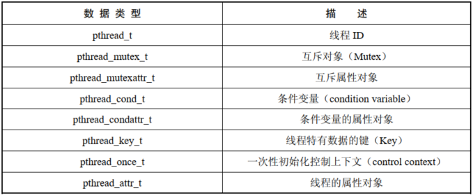

# 概述

一个进程可以包含多个线程，同一程序中的所有线程均会独立执行相同程序，且共享同一份全局内存区域，其中包括：初始化数据段，未初始化数据段，堆内存段。

同一进程中的多个线程可以并发执行，在多处理器环境中，多个线程可以同时并行。如果一个线程因等待 IO 操作而遭遇阻塞，那么其他线程依然可以继续执行。



线程相对于进程的优点：

- 进程间的信息难以共享，必须采用一些进程间通信的方式在进程间进行信息交换；线程可以方便、快速地共享本地信息，只需要将数据复制到全局或者堆中即可
- 调用 `fork()`  来创建进程的代价相对较高，尽管采用写时复制技术，仍然需要复制诸如内存页表和文件描述符表之类的诸多进程属性；线程创建的速度要比进程创建的速度快 10 倍甚至更多，在 linux 系统中是通过系统调用 `clone()` 来创建线程的

除了全局内存外，线程还共享了一干属性：

- 进程 ID 和父进程 ID
- 进程组 ID 和会话 ID
- 控制终端
- 进程凭证，即用户 ID 和组 ID
- 打开的文件描述符
- 由 `fcntl()` 创建的记录锁
- 信号处置
- 文件系统的相关信息：文件权限掩码，当前工作目录和根目录
- 间隔定时器和 POSIX 定时器
- system V 信号量撤销值
- 资源限制
- CPU 时间消耗
- 资源消耗
- nice 值

各个线程独有的属性：

- 线程 ID 
- 信号掩码
- 线程特有数据
- 备选信号栈
- errno 变量
- 浮点型环境
- 实时调度策略和优先级
- CPU 亲和力
- 能力
- 栈

# Pthreads API 的详细背景

## 线程数据类型



规范没有规定如何实现这些数据类型，程序应该避免对类数据类型变量的结构或内容产生任何依赖，尤其是，不能使用 C 语言的比较操作符 `==` 去比较这些类型的变量。

## 线程和 errno

如果线程调用的函数通过全局 `errno` 返回错误时，会与其他发起函数调用并检查 `erno` 的线程混淆在一起，换言之，这将引发竞争条件。因此，在多线程程序中，每个线程都有属于自己的 `errno`，在 Linux 中，线程特有 `errno` 的实现方式与大多数 UNIX 实现相类似：将 `errno` 定义为一个宏，可展开为函数调用，该函数返回一个可修改的左值，且为每个线程所独有。

## Pthreads 函数返回值

从系统调用和库函数返回状态，传统做法是：成功返回 0，失败返回 -1，并且设置 `errno`。Pthreads 函数返回 0 表示成功，返回一正值表示失败，这一失败的返回值与 `errno` 中的值含义相同。

## 编译 Pthreads 程序

程序会与 `libpthread` 进行链接，因而编译时需要指定 `-lpthread`。

# 创建线程

程序启动时，产生的进程只有单条线程，称之为初始线程或者主线程。

```
#include <pthread.h>

int pthread_create(pthread_t *thread, const pthread_attr_t *attr,void *(*start_routine) (void *), void *arg);
```


