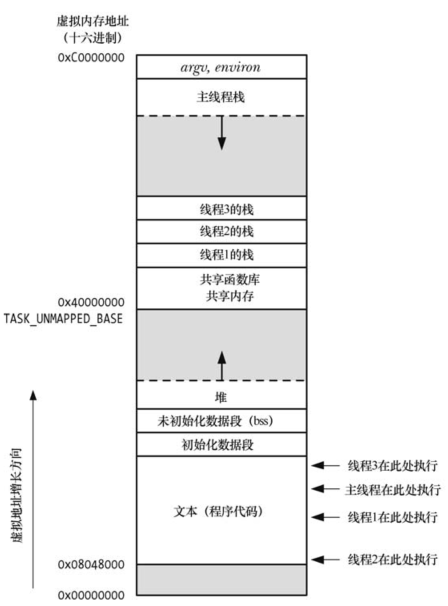
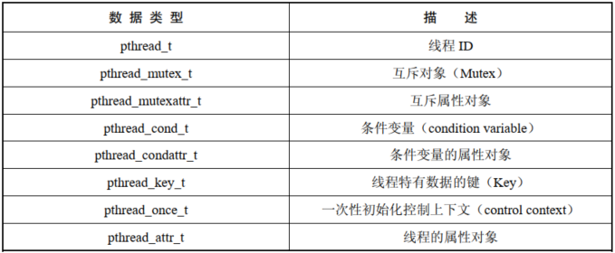

# 概述

一个进程可以包含多个线程，同一程序中的所有线程均会独立执行相同程序，且共享同一份全局内存区域，其中包括：初始化数据段，未初始化数据段，堆内存段。

同一进程中的多个线程可以并发执行，在多处理器环境中，多个线程可以同时并行。如果一个线程因等待 IO 操作而遭遇阻塞，那么其他线程依然可以继续执行。



线程相对于进程的优点：

- 进程间的信息难以共享，必须采用一些进程间通信的方式在进程间进行信息交换；线程可以方便、快速地共享本地信息，只需要将数据复制到全局或者堆中即可
- 调用 `fork()`  来创建进程的代价相对较高，尽管采用写时复制技术，仍然需要复制诸如内存页表和文件描述符表之类的诸多进程属性；线程创建的速度要比进程创建的速度快 10 倍甚至更多，在 linux 系统中是通过系统调用 `clone()` 来创建线程的

除了全局内存外，线程还共享了一干属性：

- 进程 ID 和父进程 ID
- 进程组 ID 和会话 ID
- 控制终端
- 进程凭证，即用户 ID 和组 ID
- 打开的文件描述符
- 由 `fcntl()` 创建的记录锁
- 信号处置
- 文件系统的相关信息：文件权限掩码，当前工作目录和根目录
- 间隔定时器和 POSIX 定时器
- system V 信号量撤销值
- 资源限制
- CPU 时间消耗
- 资源消耗
- nice 值

各个线程独有的属性：

- 线程 ID 
- 信号掩码
- 线程特有数据
- 备选信号栈
- errno 变量
- 浮点型环境
- 实时调度策略和优先级
- CPU 亲和力
- 能力
- 栈

# Pthreads API 的详细背景

## 线程数据类型



规范没有规定如何实现这些数据类型，程序应该避免对类数据类型变量的结构或内容产生任何依赖，尤其是，不能使用 C 语言的比较操作符 `==` 去比较这些类型的变量。

## 线程和 errno

如果线程调用的函数通过全局 `errno` 返回错误时，会与其他发起函数调用并检查 `erno` 的线程混淆在一起，换言之，这将引发竞争条件。因此，在多线程程序中，每个线程都有属于自己的 `errno`，在 Linux 中，线程特有 `errno` 的实现方式与大多数 UNIX 实现相类似：将 `errno` 定义为一个宏，可展开为函数调用，该函数返回一个可修改的左值，且为每个线程所独有。

## Pthreads 函数返回值

从系统调用和库函数返回状态，传统做法是：成功返回 0，失败返回 -1，并且设置 `errno`。Pthreads 函数返回 0 表示成功，返回一正值表示失败，这一失败的返回值与 `errno` 中的值含义相同。

## 编译 Pthreads 程序

程序会与 `libpthread` 进行链接，因而编译时需要指定 `-lpthread`。

# 创建线程

程序启动时，产生的进程只有单条线程，称之为初始线程或者主线程。

```
#include <pthread.h>

int pthread_create(pthread_t *thread, const pthread_attr_t *attr,void *(*start_routine) (void *), void *arg);
```

- `start_routine` 指定新线程的执行函数，`arg` 指定参数，可以指向全局变量或者堆变量，也可以设置为 `NULL`，调用 `pthread_create()` 的线程会继续执行该调用之后的语句
- `start_routine` 的返回值是  `void*`，对其使用方式与 `arg` 相同，后续可以通过 `pthread_join()` 来获取返回值，将经过强制转换的整型值作为线程 `start` 函数的返回值时要小心，因为取消线程的返回值是 `PTHREAD_CANCELED`，通常也是由实现多定义的整型值，从而对于执行 `pthread_join()` 的线程可能带来歧义
- `thread` 指向 `pthread_t` 类型的缓冲区，在  `pthread_create()` 返回前，会在此保存一个该线程的唯一标识，后续的 Pthreads 函数将使用该标识来引用此线程
- `attr` 指向 `pthread_attr_t`，该对象指定了新线程的各种属性，如果设置为 `NULL` 将采用默认属性
- 调用 `pthread_create()`  后，应用程序无法确定系统接着会调度哪一个线程来使用 CPU 资源，除非采用同步技术

# 终止线程

终止线程的方式：

- 线程 `start_routine` 函数执行 `return` 语句并返回指定值
- 线程调用 `pthread_exit()` 
- 调用 `pthread_cancel()` 取消线程
- 任意线程调用了 `exit()`，或者主线程执行了 `return` 语句，都会导致进程中的所有线程立即终止

```
#include <pthread.h>

void pthread_exit(void *retval);
```

- `pthread_exit()` 将终止调用线程，其返回值可以由另一线程调用 `pthread_join()` 来获取
- `retval` 指定了返回值，该值不能是分配于线程栈中，因为线程终止后，将无法确定线程栈的内容是否有效

# 线程 ID

线程内部的每个线程都有一个唯一标识符，称为线程 ID。线程 ID 会返回给 `pthread_create()` 的调用者。

```
#include <pthread.h>

pthread_t pthread_self(void);
```

- `pthread_self()` 可以获取自己的线程 ID

```
#include <pthread.h>

int pthread_equal(pthread_t t1, pthread_t t2);
```

- `pthread_equal()` 可以检查两个线程的 ID 是否相同

# join 已终止的线程

```
#include <pthread.h>

int pthread_join(pthread_t thread, void **retval);
```

- `pthread_join()` 等待 `thread` 标识的线程终止
- 若 `retval` 非空，则将会保存线程终止时返回值的拷贝，该返回值是线程调用 `return` 或者 `pthread_exit()` 是指定的值
- 多次对同一个线程执行 `pthread_join()`  将导致无法预知的行为
- 如果线程没有 `detach` 则必须使用 `pthread_join()` 来进行等待，如果没有 `join()`，线程将成为僵尸线程，除了导致资源浪费，僵尸线程积累过多，应用将再也无法创建新的线程
- 线程之间的关系是对等的，并无层次关系，进程中的任一线程均可以调用 `pthread_join()` 来等待任何一个其他的线程

# 线程的分离

默认情况下，线程是 `joinable`，也就是线程退出时，其他线程可以通过调用 `pthread_join()` 获取其返回状态。有时并不关心线程的返回状态，只是希望系统在线程终止时能够自动清理，此时可以调用 `pthread_detach()` 函数。

```
#include <pthread.h>

int pthread_detach(pthread_t thread);
```

- 一旦线程调用了 `pthread_detach()` ，那么就不能使用 `pthread_join()` 来获取其状态
- 其他线程调用了 `exit()` 或是主线程调用了 `return` 语句，即便遭到分离的线程也还是会受此影响，此时，不管线程处于 `joinable` 状态还是 `detach` 状态，进程的所有线程会立即终止，换言之，`pthread_detach()` 只是控制线程终止之后发生的事情，而非何时或如何终止线程。

# 线程属性

线程属性在线程创建时指定，一旦线程创建完成，就无需保留属性对象，可以将其销毁。

```
pthread_t thr;
pthread_attr_t attr;
int s;

s = pthread_attr_init(&attr);
if(s != 0)
    errExit("pthread_attr_init()");

s = pthread_attr_setdetachstate(&attr,PTHREAD_CREATE_DETACHED);
if(s != 0)
    errExit("pthread_attr_setdetachstate()");

s = pthread_create(&thr,&attr,threadFunc,(void*)1);
if(s != 0)
    errExit("pthread_create()");

s = pthread_destroy(&attr);
if(s != 0)
    errExit("pthread_destroy()");
```

# 线程 VS 进程

线程相对于进程的优点：

- 线程间的数据共享很简单，相比之下，进程间的数据共享需要投入更多
- 创建线程的速度要比创建进程更快
- 线程间的上下文切换耗时也要比进程短很多

线程相对于进程的缺点：

- 多线程编程时，需要确保线程安全的函数，或者以线程安全的方式调用函数，多线程无需关注这些
- 某个线程中的  bug 可能会危及进程的所有线程，因为它们共享着相同的地址空间和其他属性，相比之下，进程间的隔离更彻底
- 每个线程都在争用宿主进程中有限的虚拟地址空间，与之相反，每个进程都可以使用全部的有效虚拟内存，仅受制于实际内存和交换空间

影响选择的还有如下几点：

- 在多线程应用中处理信号时要特别小心，一般建议在多线程程序中避免使用信号
- 在多线程应用中，所有的线程必须运行于同一个程序，对于多进程应用，不同的进程可以运行于不同的程序
- 除了数据，线程还可以共享某些其他信息，例如：文件描述符，信号处理，当前工作目录，用户 ID 和组 ID


