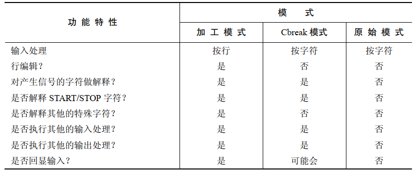
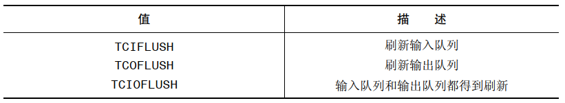
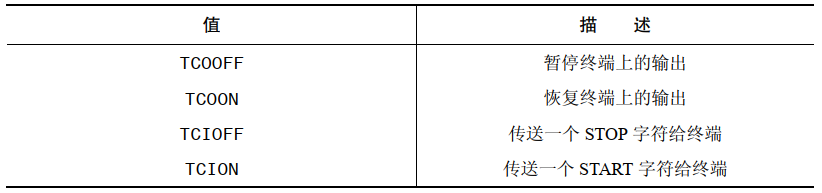

# 整体概览

传统型终端和终端模拟器都需要同终端驱动程序相关联，由驱动程序负责处理设备上的输入和输出。

当执行输入时，驱动程序可以工作在以下两种模式下：

- 规范模式：在这种模式下，终端的输入是按行来处理的，而且可进行行编辑操作。每一行都由换行符来结束，当用户按下回车键时可产生换行符。在终端上执行的 `read()` 调用只会在一行输入完成之后才会返回，且最多只会返回一行。这是默认的输入模式
- 非规范模式：终端输入不会被装配成行，像 `vi`，`more`，`less` 这样的程序会将终端置于非规范模式，这样不需要用户按下回车键它们就能读取到单个字符

终端驱动程序也能对一系列的特殊字符做解释，比如终端字符 `Ctrl+C` 以及文件结尾符 `Ctrl+D`。当有信号为前台进程组产生时，又或者是程序在从终端读取时出现某种类型的输入条件，此时就可能会出现这样的解释操作。将终端置于非规范模式下的程序通常也会禁止处理某些或者所有这些特殊字符。

终端驱动程序会对两个队列做操作：

- 一个用于从终端设备将输入字符传送到读取进程上
- 另一个用于将输出字符从进程传送到终端上

如果开启了终端回显功能，那么终端驱动程序会自动将任意的输入字符插入到输出队列的尾部，这样输入字符也会成为终端的输出：


# 获取和修改终端属性

函数 `tcgetattr()` 和 `tcsetattr()` 可以用来获取和修改终端的属性：

```
#include <termios.h>
#include <unistd.h>

int tcgetattr(int fd, struct termios *termios_p);
int tcsetattr(int fd, int optional_actions,const struct termios *termios_p);
```

- `fd` 是指向终端的文件描述符，如果 `fd` 不指向终端，调用这些函数就会失败，伴随错误码 `ENOTTY`
- `termios_p` 是一个指向 `struct termios` 的指针，用来记录终端的各项属性：

```
struct termios
{
    unsigned short c_iflag; 	/* Input flags */
    unsigned short c_oflag; 	/* Output flags */
    unsigned short c_cflag; 	/* control flags */
    unsigned short c_lflag; 	/* Local modes */
    unsigned char c_line; 		/* Line discipline (nonstandard) */
    unsigned char c_cc[NCCS];	 /* Terminal special characters */
    speed_t  c_ispeed;			/* Input speed (nonstandard;unused)*/
    speed_t c_ospeed;			/* Output speed (nonstandard;unused)*/
};
```

- `termios` 前 4 个字段都是位掩码，包含有可控制终端驱动程序各方面操作的标志：
  - `c_iflag` ： 包含控制终端输入的标志
  - `c_oflag` ： 包含控制终端输出的标志
  - `c_cflag` ： 包含与控制终端想速的硬件控制相关的标志
  - `c_lflag` ： 包含控制终端输入的用户界面的标志
- `c_line` 字段指定了终端的行规程，为了达到对终端模拟器编程的目的，行规程将一直设为 `N_TTY`，也就是所谓的新规程
- `c_cc` 包含着终端的特殊字符，以及用来控制非规范模式下输入操作的相关字段
- `c_ispeed` 和 `c_ospeed` 字段在 Linux 上没有使用到
- `optional_actions` 用来确定何时修改将生效，该参数可以被指定为下列的值：
  - `TCSANOW` ：修改立刻得到生效
  - `TCSADRAIN`：当所有当前处于排队中的输出已经传送到终端之后，修改得到生效。通常，该标志应该在修改影响终端的输出时才会指定，这样就不会影响到已经处于排队中，但是还没有显示出来的输出数据
  - `TCSAFLUSH` ：该标志的产生的效果同 `TCSADRAIN`，但是除此之外，当标志生效时那些仍然等待处理的输入数据都会被丢弃

通常修改终端属性的方法是调用 `tcgetadttr()` 来获取一个包含有当前设定的 `termios` 结构体，然后调用 `tcsetattr()` 将更新后的结构体传回给驱动程序：

```
struct termios tp;

if(tcpgetattr(STDIN_FILENO, &tp) == -1){
	errExit("tcpgetattr()");
}

tp.c_lflag &= ~ECHO;

if(tcsetattr(STDIN_FILENO, TCSAFLUSH, &tp) == -1){
	errExit("tcsetattr()");
}
```

如果任何一个对终端属性的修改请求可以执行的话，函数 `tcsetattr()` 将返回成功；它只会在没有任何修改请求能执行时才会返回失败。这意味着当我们修改多个属性时，有时可能有必要再调用一次 `tcgetattr()` 来获取新的终端属性，并同之前的修改请求做对比。

# stty 命令

`stty` 命令是以命令行的形式来模拟 `tcgetaddr()` 和 `tcsetaddr()` 的功能，允许我们在 shell 上检视和修改其属性。当我们监视、调试或者取消程序修改的终端属性时，这个工具非常有用。

可以采用如下的命令检视所有终端的当前属性：

```
stty -a
speed 38400 baud; rows 56; columns 206; line = 0;
intr = ^C; quit = ^\; erase = ^?; kill = ^U; eof = ^D; eol = <undef>; eol2 = <undef>; swtch = <undef>; start = ^Q; stop = ^S; susp = ^Z; rprnt = ^R; werase = ^W; lnext = ^V; discard = ^O; min = 1; time = 0;
-parenb -parodd -cmspar cs8 -hupcl -cstopb cread -clocal -crtscts
-ignbrk -brkint -ignpar -parmrk -inpck -istrip -inlcr -igncr icrnl ixon -ixoff -iuclc ixany -imaxbel -iutf8
opost -olcuc -ocrnl onlcr -onocr -onlret -ofill -ofdel nl0 cr0 tab0 bs0 vt0 ff0
isig icanon iexten echo echoe echok -echonl -noflsh -xcase -tostop -echoprt echoctl echoke -flusho -extproc
```

- 上述输出的第一行显示出了终端的线速（比特每秒）、终端的窗口大小以及以数值形式给出的行规程（0 代表 `N_TTY`，即新行规程）
- 接下来的 3 行显示出了有关各种终端特殊字符的设定。`^C`  表示 `Ctrl+C`，以此类推。字符串 `<undef>` 表示相应的终端特殊字符目前没有定义。`min` 和 `time` 的值与非规范模式下的输入有关
- 剩下的几行显示出了` termios` 结构体中 `c_cflag`、`c_iflag`、`c_oflag` 以及 `c_lflag` 字段中各个标志的设定（按顺序显示）。这里的标志名前带有一个连字符（`-`）的表示目前被禁用，否则表示当前已设定

如果输入命令时不加任何命令行参数，那么 `stty` 只会显示出线速、行规程以及任何其他偏离了正常值的设定：

```
stty
speed 38400 baud; line = 0;
-brkint ixany -imaxbel
```

# 终端特殊字符


## CR

`CR` 是回车符。这个字符会传递给正在读取输入的进程。在默认设定了 `ICRNL` 标志（在输入中）将 `CR` 映射为 `NL`）的规范模式下（设定 `ICANON` 标志），这个字符首先被转换为一个换行符，然后再传递给读取输入的进程。如果设定了 `IGNCR`（忽略 `CR` 标志），那么就在输入上忽略这个字符（此时必须用真正的换行符来作为一行的结束）。输出一个 `CR` 字符将导致终端将光标移到一行的开始处

## DISCARD

`DISCARD` 是丢弃输出字符。尽管这个字符定义在了数组 `c_cc` 中，但实际上在 Linux 上没有任何效果。在一些其他的 Unix 实现中，一旦输入这个字符将导致程序输出被丢弃。这个字符就像一个开关----再输入一次将重新打开输出显示。当程序产生大量输出而我们希望略过其中一些输出时这个功能就非常有用。（在传统的终端上这个功能更加有用，因为此时线速会更加缓慢，而且也不存在什么其他的“终端窗口”。）这个字符不会发送给读取进程

## EOF

`EOF` 是传统模式下的文件结尾字符（通常是 `Ctrl+D`）。在一行的开始处输入这个字符会导致在终端上读取输入的进程检测到文件结尾的情况（即，`read()` 返回 0）。如果不在一行的开始处，而在其他地方输入这个字符，那么该字符会立刻导致 `read()` 完成调用，返回这一行中目前为止读取到的字符数。在这两种情况下，`EOF` 字符本身都不会传递给读取的进程

## EOL 以及 EOL2

`EOL` 和 `EOL2` 是附加的行分隔字符，对于规范模式下的输入，其表现就如同换行（`NL`）符一样，用来终止一行输入并使该行对读取进程可见。默认情况下，这些字符是未定义的。如果定义了它们，它们是会被发送给读取进程的。`EOL2` 字符只有当设置了 `IEXTEN`（扩展输入处理）标志时（默认会设置）才能工作用到这些字符的机会很少。一种应用是在 telnet 中。通过将 `EOL` 或 `EOL2` 设定为 telnet 的换码符（通常是 `Ctrl+]`，或者如果工作在 `rlogin` 模式下时为`~`），telnet 能立刻捕获到字符，就算是正在规范模式下读取输入时也是如此

## ERASE

在规范模式下，输入 `ERASE` 字符会擦除当前行中前一个输入的字符。被擦除的字符以及 `ERASE` 字符本身都不会传递给读取输入的进程

## INTR

`INTR` 是中断字符。如果设置了 `ISIG` （开启信号）标志（默认会设置），输入这个字符会产生一个中断信号（`SIGINT`），并发送给终端的前台进程组。`INTR`字符本身是不会发送给读取输入的进程的

## KILL

`KILL` 是擦除行（也称为 `kill line`）字符。在规范模式下，输入这个字符使得当前这行输入被丢弃（即，到目前为止输入的字符连同 `KILL` 字符本身，都不会传递给读取输入的进程了）

## LNEXT

`LNEXT` 是下一个字符的字面化表示（literal next）。在某些情况下，我们可能希望将终端特殊字符的其他一个看作一个普通字符，将其作为输入传递给读取进程。输入 `LNEXT` 字符后（通常是 `Ctrl+V`）使得下一个字符将以字面形式来处理，避免终端驱动程序执行任何针对特殊字符的解释处理。因而，我们可以输入 `Ctrl+V ` 和 `Ctrl+C` 这样的 2 字符序列，提供一个真正的 `Ctrl+C` 字符（ASCII 码为 3）作为输入传递给读取进程。`LNEXT` 字符本身并不会传递给读取进程。这个字符只有在设定了 `IEXTEN` 标志（默认会设置）的规范模式下才会被解释

## NL

`NL` 是换行符。在规范模式下，该字符终结一行输入。`NL` 字符本身是会包含在行中返回给读取进程的（规范模式下，`CR` 字符通常会转换为 `NL`。）输出一个 `NL` 字符导致终端将光标移动到下一行。如果设置了 `OPOST` 和 `ONLCR`（将 `NL` 映射为 `CR-NL`）标志（默认会设置），那么在输出中，一个换行符就会映射为一个 2 字符序列— `CR` 加上 `NL`。（同时设定 `ICRNL` 和 `ONLCR` 标志意味着一个输入的 `CR` 字符会转换为 `NL`，然后回显为 `CR` 加上 `NL`

## QUIT

如果设置了 `ISIG` 标志（默认会设置），输入 `QUIT` 字符会产生一个退出信（`SIGQUIT`），并发送到终端的前台进程组中。`QUIT` 字符本身并不会传递给读取进程

## REPRINT

`REPRINT` 字符代表重新打印输入。在规范模式下，如果设置了 `IEXTEN` 标志（默认会设置），输入该字符会使得当前的输入行（还没有输入完全）重新显示在终端上。如果某个其他的程序（例如 `wall(1)` 或者 `write(1)`）输出已经使终端的显示变得混乱不堪，那么此时这个功能就特别有用了。`REPRINT` 字符本身是不会传递给读取进程的

## START 和 STOP

`START` 和 `STOP` 分别代表开始输出和停止输出字符。当设定了 `IXON` （启动开始/停止输出控制）标志时（默认会设定），这两个字符才能工作。（`START` 和 `STOP` 字符在一些终端模拟器中不会生效。

输入 `STOP` 字符会暂停终端输出。`STOP` 字符本身不会传递给读取进程。如果设定了 `IXOFF` 标志，而且终端的输入队列已满，那么终端驱动程序会自动发送一个`STOP` 字符来对输入进行字节流控制。

输入 `START` 字符会使得之前由 `STOP` 暂停的终端输出得到恢复。`START` 字符本身不会传递给读取进程。如果设定了 `IXOFF`（启动开始/停止输入控制）标志（默认是不会设定的），且终端驱动程序之前由于输入队列已满已经发送过了一个 `STOP` 字符，那么一旦当输入队列中又有了空间，此时终端驱动程序会自动发送一个 `START` 字符以恢复输出。

如果设定了 `IXANY` 标志，那么任何字符，不仅仅只是 `START`，都可以按顺序输入以重启输出（同样，这个字符也不会传递给读取进程）。

随着目前越来越普遍的高线速，软件流控已经被硬件流控（`RTS/CTS`）所取代了。在硬件流控中，通过串口上两条不同线缆上发送的信号来开启或关闭数据流。（`RTS` 代表请求发送，`CTS` 代表清除发送。

## SUSP

`SUSP` 代表暂停字符。如果设定了 `ISIG` 标志（默认会设定），输入这个字符会产生终端暂停信号（`SIGTSTP`），并发送给终端的前台进程组。`SUSP` 字符本身不会发送给读取进程。

## WERASE

`WERASE` 是擦除单词字符。在规范模式下，设定了 `IEXTEN` 标志（默认会设定）后输入这个字符会擦除前一个单词的所有字符。一个单词被看做是一串字符序列，可包含数字和下划线。（在某些 UNIX 实现中，单词被看做是由空格分隔的字符序列。

# 终端标志

`termios` 结构体中 4 个标志字段所控制的设置：


## BRKINT

- 如果设定了 `BRKINT`，且没有设定 `IGNBRK` 标志，那么当出现 `BREAK` 状态时会发送 `SIGINT` 信号到前台进程组
- 在许多 UNIX系统中，`BREAK` 状态就表现为一个发送给远端主机的信号，用来将线速（波特率）调整为适合于终端的数值
- 在虚拟控制台上，我们可以通过按下 `Ctrl+Break` 来产生一个 `BREAK` 状态

## ECHO

- 设置了 `ECHO` 标志将开启回显输入字符的功能。`ECHO` 标记在规范和非规范模式下都是有效的
- 当读取密码时，禁止回显是很有用的
- `vi` 的命令模式下回显也是被禁止的，此时由键盘产生的字符被解释为编辑命令而不是文本输入

## ECHOCTL

- 如果设置了 `ECHO` 标志，那么开启 `ECHOCTL` 标志会导致除了制表符、换行符、`START` 和 `STOP` 之外的控制字符都将以类似 `^A`（`Ctrl+A`）的形式回显出来
- 如果关闭 `ECHOCTL` 标志，控制字符将不再回显

## ECHOE

- 在规范模式下，设定ECHOE标识使得ERASE能以可视化的可视化执行，将退格-空格-退格格这样的序列输出到终端上。
- 如果关闭了 ECHOE 标志，那么 ERASE 字符本身就会回显出来（例如以^?的形式），但仍然会完成删除一个字符的功能

## ECHOK 和 ECHOKE

- `ECHOK` 和 `ECHOKE` 标志控制着在规范模式下使用 `KILL`（擦除行）字符时的可视化显示
- 在默认情况下（同时设置两个标志），一行文本以可视化的方式擦除（参见 `ECHOE`）
- 如果其中任一标志被关闭，那么就不会执行可视化的擦除（但输入行仍然会被丢弃），而 `KILL` 字符本身会被回显出来（例如以 `^U` 的形式）
- 如果设定了 `ECHOK` 而关闭了 `ECHOKE`，那么也会输出一个换行符

## ICANON

- 设定了 `ICANON` 标志将启动规范模式输入。
- 输入会集中成行，并且会打开对特殊字符 `EOF`、`EOL`、`EOL2`、`ERASE`、`LNEXT`、`KILL`、`REPRINT` 以及 `WERASE` 的解释处理（但需要注意下面描述到的 `IEXTEN` 标志所产生的效果）

## IEXTEN

- 设定 `IEXTEN` 标志将打开对输入字符的扩展处理功能
- 必须设定这个标志（同 `ICANON` 一样），才能正确解释 `EOL2`、`LNEXT`、`REPRINT` 以及 `WERASE` 这样的特殊字符
- 要使 `IUCLC` 标志生效，也必须要设定 `IEXTEN` 标志才行

## IMAXBEL

- Linux 上忽略了 `IMAXBEL` 标志的设定
- 在登录控制台上，当输入队列已满时总是会响起响铃声

## IUTF8

设定 `IUTF8` 标志将打开加工模式（cooked mode），以此当执行行编辑时能够正确地处理 UTF-8 输入

## NOFLSH

- 默认情况下，当输入 `INTR`、`QUIT` 或 `SUSP` 字符而产生信号时，任何在终端输入和输出队列中未处理完的数据都会被刷新（丢弃）
- 设定 `NOFLSH` 标志后将关闭这种刷新行为

## OPOST

- 设定 `OPOST` 标志后将打开输出的后续处理功能。
- 必须设定该标志才能使 `termios` 结构体中 `c_oflag` 字段中的标志生效。（相反，关闭 `OPOST` 标志将禁止对所有的输出做后续处理。）

## PARENB、IGNPAR、INPCK、PARMRK 以及 PARODD

`PARENB`、`IGNPAR`、`INPCK`、`PARMRK` 以及 `PARODD` 标志同奇偶校验生成和检查有关：

- `PARENB` 标志可为输出字符打开奇偶校验位，并为输入字符做奇偶校验检查
- 如果我们只希望生成输出的奇偶校验，那么我们可以通过关闭 `INPCK` 标志来禁止对输入做奇偶校验检查
- 如果设定了 `PARODD` 标志，那么在输入和输出上都会采用奇数奇偶校验，否则就会采用偶数奇偶校验

剩下的标志规定了当输入字符出现奇偶校验错误时应该如何处理。

- 如果设定了 `IGNPAR` 标志，那么字符将被丢弃（不会传递给读取进程）
- 否则，如果设定了 `PARMRK` 标志，那么该字符会传递给读取进程，但会在前面加上 2 字节的序列 0377 + 0。（如果设定了 `PARMRK` 标志，但关闭了 `ISTRIP` 标志，那么字符 0377 会加倍成 0377 + 0377。）
- 如果关闭 `PARMRK` 标志，但设定了 `INPCK` 标志，那么字符被丢弃，且不会传递给读取进程任何字节
- 如果 `IGNPAR`、`PARMRK` 或 `INPCK` 都没有设定，那么该字符会传递给读取进程

# 终端的 IO 模式

## 规范模式

我们可以通过设定 `ICANON` 标志来打开规范模式输入。可以通过如下几点区分是否为规范模式下的输入

- 输入被装配成行，通过如下几种行结束符来终结：`NL`、`EOL`、`EOL2`（如果设定了 `IEXTEN` 标志）、`EOF`（除了一行中的初始位置）或者 `CR`（如果打开了 `ICRNL` 标志）除了 `EOF` 之外，其他的行结束符都会传递给读取的进程（作为一行中的最后一个字符）
- 打开了行编辑功能，这样可以修改当前行中的输入。因此，下列字符是可用的：`ERASE`、`KILL`。如果设定了 `IEXTEN` 标志的话，`WERASE` 也是可用的
- 如果设定了 `IEXTEN` 标志，则 `REPRINT` 和 `LNEXT` 字符也都是可用的

在规范模式下，当存在有一行完整的输入时，终端上的 `read()` 调用才会返回。（如果请求的字节数比一行中所包含的字节小，那么 `read()` 只会获取到该行的一部分。剩余的字节只有在后序的 `read()` 调用中取得。）如果 `read()` 调用被信号处理例程中断，且该信号没有系统调用重启，此时 `read()` 也会终止执行。

## 非规范模式

一些应用程序，比如 `vi`、`less` 在用户没有提供行终止符时也需要从终端中读取字符。非规范模式正式用于这个目的。在非规范模式下（关闭 `ICANON` 标志）不会处理特殊的输入。特别的一点是：输入不再装配成行，相反会立即对程序可见。

在什么情况下一个非规范模式下的 `read()` 调用会完成？我们可以指定非规范模式下的 `read()` 调用在经历了一段特定的时间后，或者在读取了特定数量的字节后，又或者是两者兼有的情况下终止执行。`termios` 结构体中的 `c_cc` 数组里有两个元素可用于决定这种轻微：`TIME` 和 `MIN`。元素 `TIME`（通过常量 `VTIME` 来索引）以十分之一秒为单位来指定超时时间。元素 `MIN`（通过 `VMIN` 来索引）指定了被读取字节数的最小值。（`MIN` 和 `TIME` 的设置对规范模式下的终端 IO 不产生任何影响。)]

### MIN == 0，TIME == 0 (轮询读取)

如果在调用过程中有数据可用，那么 `read()` 将立刻返回可用的字节数和所请求的字节数中较小的那个值，如果没有数据可用，`read()` 将立刻返回 0。

这种情况可服务于一般的轮询请求，允许应用程序以非阻塞的方式检查输入是否存在，这种模式有些类似于为终端设定了 `O_NONBLOCK` 标志，但是设置了  `O_NONBLOCK` 标志以后，如果没有数据可读，那么 `read()` 将返回 -1，伴随的错误码是 `EAGAIN`。

### MIN > 0，TIME == 0 (阻塞式读取)

这种情况下，`read()` 将会阻塞，有可能永远阻塞下去。直到请求的字节数得到了满足或者读取了 `MIN` 个字节，此时就返回这两者中较小的那个。

### MIN  ==  0，TIME > 0 (带有超时机制的读操作)

这种情况下，调用 `read()` 将会启动一个定时器，当至少有 1 个字节可用，或者经历了 `TIME` 个十分之一秒后，`read()` 会立刻返回，在后一种情况下 `read()` 返回 0。

### MIN > 0，TIME == 0 (既有超时机制又有最小读取字节数的要求)

当输入的收割字节可用后，之后每接收到一个字节就重启定时器，如果满足读取到了 `MIN` 个字节，或者请求的字节数已经读取完毕，那么 `read()` 会返回两者之间较小的那个值。或者当接收连续字节之间的时间间隙超过了 `TIME` 个十分之一秒，此时 `read()` 会返回 。由于定时器只会在初始字节可用后才启动，因此至少可以返回 1 个字节。

## 加工模式、cbreak 模式以及原始模式



加工模式本质上就是带有处理默认特殊字符功能的规范模式（可以对 `CR`、`NL` 和 `EOF`进行解释；打开行编辑功能；处理可产生信号的字符；设定 `ICRNL`、`OCRNL` 标志等）。

原始模式则恰好相反，它属于非规范模式，所有的输入和输出都不能做任何处理，而且不能回显。（如果应用程序需要确保终端驱动程序绝对不会对传输的数据做任何修改，那就应该使用这种模式。

cbreak 模式处于加工模式和原始模式之间。输入是按照非规范的方式来处理的，但产生信号的字符会被解释，且仍然会出现各种输入和输出的转换（取决于个别标志的设定）。cbreak 模式并不会禁止回显，但采用这种模式的应用程序通常都会禁止回显功能。cbreak 模式在与屏幕处理相关的应用程序中很有用（比如 less），这类程序允许逐个字符的输入，但仍然需要对 `INTR`、`QUIT` 以及 `SUSP` 这样的字符做解释。

# 终端线速(比特率)

不同的终端之间(以及串行线)传输和接收的速率(位数每秒)是不同的。

```
#include <termios.h>
#include <unistd.h>

speed_t cfgetispeed(const struct termios *termios_p);
speed_t cfgetospeed(const struct termios *termios_p);
int cfsetispeed(struct termios *termios_p, speed_t speed);
int cfsetospeed(struct termios *termios_p, speed_t speed);
```

- `cfgetispeed()` 和 `cfsetispeed()` 用来获取和修改输入的线速
- `cfgetospeed()` 和 `cfsetospeed()` 用来获取和修改输出的线速

这里的每个 `struct termios` 都必须先使用 `tcgetattr()` 来初始化。

```
struct termios tp;
speed_t rate;

if(tcgetattr(fd,&tp) == -1)
	errExit("tcgetattr()");

rate = cfgetospeed(&tp);
if(rate == -1)
	errExit("cfgetospeed()");

if(cfsetospeed(&tp,B38400) == -1)
	errExit("cfsetospeed()");

if(tcsetattr(fd,TCSAFLUSH,&tp) == -1)
	errExit("tcsetattr()");
```

`<termios.h>` 中定义了一系列的离散值，例如 `B300`，`B2400`，`B9600`，`B38400`。


# 终端的行控制

```
#include <termios.h>
#include <unistd.h>

int tcsendbreak(int fd, int duration);
int tcdrain(int fd);
int tcflush(int fd, int queue_selector);
int tcflow(int fd, int action);
```

- 这些函数都是 POSIX 创建的，被用来取代各种 `ioctl()` 操作
- `fd` 表示文件描述符，它指向终端或者串行线上的其他远程设备
- `tcsendbreak()` 通过传输连续的 0 比特流产生一个`BREAK` 状态，`duration` 指定了传输的持续时间，如果为0，则将持续 0.25秒，如果大于0，则时间持续 `duration` 个毫秒
- `tcflush()` 刷新(丢弃)终端输入队列，终端输出队列或者两者中的数据，刷新输入队列将丢弃已经由终端驱动程序接收但还没有被任何进程读取的数据，刷新输出队列将丢弃已经传递给终端驱动程序但还没有传递给设备的数据，`queue_selector` 参数的取值：



- `tcflow()` 控制着数据在计算机和终端(或者其他的远程设备)之间的数据流方向，`action` 参数的取值：



# 终端窗口的大小

在一个窗口环境中，一个处理屏幕的应用程序需要能够监视终端窗口额度大小，内核对此提供了两种支持：

- 在终端窗口大小改变后发送一个 `SIGWINCH` 信号之后，进程可以使用 `ioctl()` 的 `TIOCGWINSZ` 操作来获取终端窗口的当前大小
- 在任意一个时刻，通常是接收到 `SIGWINCH` 信号之后，进程可以使用  `ioctl()` 的 `TIOCGWINSZ` 操作来获取终端窗口的当前大小

```
if(ioctl(fd,TIOCGWINSZ,&ws) == -1)
	errExit("ioctl() - TIOCGWINSZ");
```

- `fd` 指向终端窗口的文件描述符
-  `ws` 是一个  `winsize` 结构体：

```
struct winsize 
{
    unsigned short ws_row;    		/* rows， in character */
    unsigned short ws_col;        	/* columns, in characters */
    unsigned short ws_xpixel;    	/* horizontal size, pixels (unused) */
    unsigned short ws_ypixel;    	/* vertical size, pixels (unused) */
};
```

# 终端标识

```
#include <unistd.h>

int isatty(int fd);
```

- `isatty()` 判断文件描述符 `fd` 是否同一个终端相关联

```
#include <unistd.h>

char *ttyname(int fd);
```

- `ttyname()` 返回终端的名称


 


