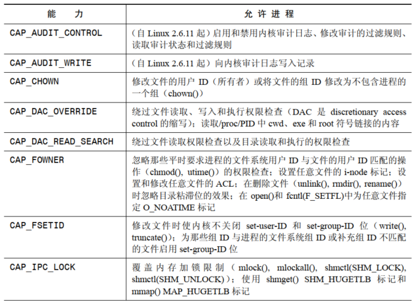
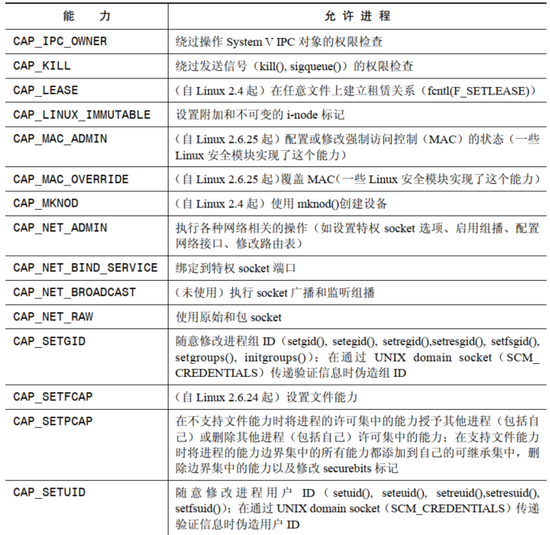
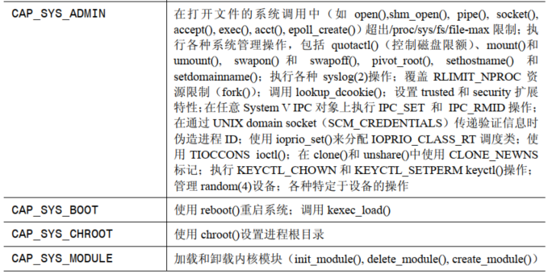
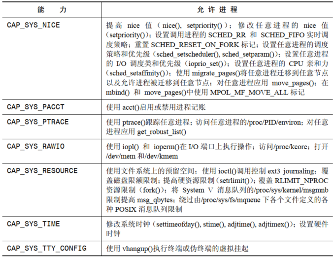

# 能力基本原理

传统的 UNIX 权限类型将进程分为两类：

- 能通过所有权限检测的有效用户 ID 为 0 的进程，即超级进程
- 其他所有需要根据用户和组 ID 进行权限检测的进程

Linux 能力模型进行了优化，内核在执行安全检测时不再使用单个权限，超级用户权限被划分成了不同的单元，这个单元成为能力。每个特权操作与一个特定的能力相关联，进程只有在拥有相应的能力的时候才能执行相应的操作。

大多数时候，Linux 能力模型对程序员是不可见的，其原因是当一个能力一无所知的应用程序的有效用户 ID 为 0 时，内核会赋予该进程所有能力。

# Linux 能力





# 进程和文件能力

每个进程拥有 3 个相关能力集：许可的，有效的，可继承的。每个文件也可以拥有 3 个相关能力集，其名称与进程的能力集名称一样。

## 进程能力

内核会为每个进程都维护 3 个能力集，实现方式为位掩码：

- 许可的，这些是一个进程可能使用的能力，许可的集合是能够被添加到有效的和可继承的集合中的能力的受限超集，如果一个进程从其许可集中删除了一个能力，那么将永远也无法再重新获取该能力
- 有效的，内核会使用这些能力来对进程执行权限检测，只有进程在其许可集中维护着一个能力，那么进程才能通过从有效集合中删除这个能力来临时禁用该能力，之后再将该能力还原到这个集合中
- 可继承的，当这个进程执行一个程序时可以将这些权限带入许可集中

Linux 下，通过 `/proc/PID/status` 文件中的 `CapInh`，`CapPrm`，`CapEff` 三个字段能够查看任意进程的 3 个能力集的 16 进制表示。实际上，能力是一个线程级的特性，进程中额度每个线程的能力都可以单独进行调整，`/proc/PID/task/TID/status` 文件中可以查看一个多线程进程中某个具体线程的能力，`/proc/PID/status` 显示的是主线程的能力。

通过 `fork()` 创建的子 进程会继承其父进程的能力集副本。

## 文件能力

如果一个文件拥有相关的能力集，那么这些集合会被用来确定赋给执行这个文件的进程的能力，文件的能力集：

- 许可的，在 `exec()` 调用中可以将这组能力添加到进程的许可集中，不管进程的既有能力是什么
- 有效的，这个只有一位，如果被占用了，那么在 `exec()` 调用中，进程的许可集中启用的能力在进程的新有效集合中也会被启用，如果文件有效位被禁用了，那么在 `exec()` 执行完之后，进程的有效集在一开始是空的
- 可继承的，这个集合将与进程的可继承集取掩码来确定在执行 `exec()`  之后进程的许可集中启用的能力集

##  进程许可和有效能力集的目的

进程的许可集定义了进程能够使用的能力。

进程的有效能力集定义了进程当前使用的能力，即内核会使用这组能力来检查进程是否拥有足够的权限来执行某个特定操作。

许可能力集为有效能力集定义了一个上限，进程只能将其许可能力集中的能力上升到有效集中。

## 文件许可和有效能力集的目的

文件许可能力集为可执行文件向进程赋予能力提供了一种机制，它指定了在 `exec()` 调用中被赋给进程的许可能力集的一组能力。

文件有效文件集是是一个可以被启用或禁用的标记(位)，考虑在程序被执行时发生的两种情况：

- 程序可能是一个能力哑元，表示它对能力一无所知，对于这样的程序来讲，`exec()` 应该将进程的新许可集中的所有能力自动加到其有效集中，这是通过启用文件有效位来完成的
- 系统可能是知道能力的，表示在设计程序的时候使用了能力框架，并且会使用合适的系统调用来在其有效集合中提升和删除能力，对于这样的程序，最小权限表示在 `exec()` 调用之后，进程的有效能力集中的所有能力一开始都是禁用的，这是通过禁用文件有效能力位来完成的

## 进程和文件可继承集的目的

如当一个执行 `exec()` 的进程想要在 `exec()` 调用期间保存其当前能力时该如何做呢？看起来，能力实现可以通过简单地在 `exec()` 调用之间保存进程的许可能力来实现这个特性，但这种方式无法处理下列情形：

- 执行 `exec()` 可能需要特定的权限，但在 `execve()` 调用之间可能不想要保存这种极限
- 假设显式地删除了一些无需在 `exec()`  调用之间保存的许可能力，但 `exec()` 调用失败了

基于以上原因，在 `exec()` 之间是不会保持进程的许可能力的，在这种情况下会适应另一种能力集：可继承集。可继承集为进程在 `exec()` 调用之间保持其部分能力提供了一种机制。

# 现代能力实现

能力的完整实现要求如下：

- 对于每个特权操作，内核应该检查进程是否拥有相应的能力，而不是检查有效用户 ID 是否为 0
- 内核必须要提供允许获取和修改进程能力的系统调用
- 内核必须支持将能力附加给可执行文件的概念，这样当文件被执行时进程会获取相应的能力

# 在 `exec()` 中转变进程能力

在 `exec()` 执行期间，内核会根据进程的当前能力以及被执行的文件的能力集来设置进程的新能力，内核会使用下面的规则来计算进程的新能力：

```
P'(permitted) = (P(inheritable) & F(inheritable)) | (F(permitted) & cap_bset)
P'(effective) = F(effective) ? P'(permitted) : 0
P'(inheritable) = P(inheritable)
```

`P` 表示在 `exec()` 调用之前进程的能力集的取值，`P'` 表示在调用 `exec()` 之后进程的能力集的取值，`F` 表示文件能力集，`cap_bset` 表示能力边界集的取值。

注意 `exec()` 调用不会改变进程的可继承能力集。

## 能力边界集

能力边界集是一种用于限制进程在 `exec()` 调用中能够获取的能力的安全机制，其用法如下：

- 在 `exec()` 调用中，能力边界集与文件许可能力取 `AND` 来确定将被授予新程序的许可能力，也就是说，当一个可执行文件的某个许可能力不在边界集中时就无法向进程授予该项能力
- 能力边界集是一个可以被添加到进程的可继承集中的能力的受限超集，这表示除非能力位于边界集中，否则进程就无法将其许可能力集中的某个能力添加到可继承集中

能力边界集是一个进程级特性，通过 `fork()` 创建的子进程会继承这个特性，并且在 `exec()` 调用中会保持这个特性。

如果一个进程具备了 `CAP_SETPCAP` 能力，那么它就可以使用 `prctl() PR_CAPBSET_DROP` 操作从其边界集中删除能力，可以使用 `prctl() PR_CAPBSET_READ` 来确定一个能力是否位于其边界集中。

Linux 的 `/proc/PID/task/TID/status` 文件的 `CapBnd` 字段显示了线程级别的能力边界集，`/proc/PID/status` 文件显示了主线程的边界集。

## 保持 root 语义

在执行一个文件时为了保持 root 用户的传统语义，与该文件相关联的所有能力集会被忽略。

在 `exec()` 期间文件能力集的定义如下：

- 如果执行l了一个 `set-user-ID-root` 程序或调用 `exec()` 的进程的真实或有效用户 ID 为 0，那么文件的可继承和许可集被定义为包含所有能力
- 如果执行了一个 `set-user-ID-root` 程序或调用 `exec()` 的进程的有效用户 ID 为 0，那么文件有效位被定义成设置状态

# 改变用户 ID 对进程能力的影响

为了与用户 ID 在 0 与非 0 之间切换的传统语义保持兼容，在改变进程的用户 ID 时，内核会完成下列操作：

- 如果真实用户 ID、有效用户 ID 或 `saved set-user-ID` 之前的值为 0，那么修改了用户 ID 之后，所有这三个 ID 的值都会变成非 0，并且进程的许可和有效能力集会被清除
- 


