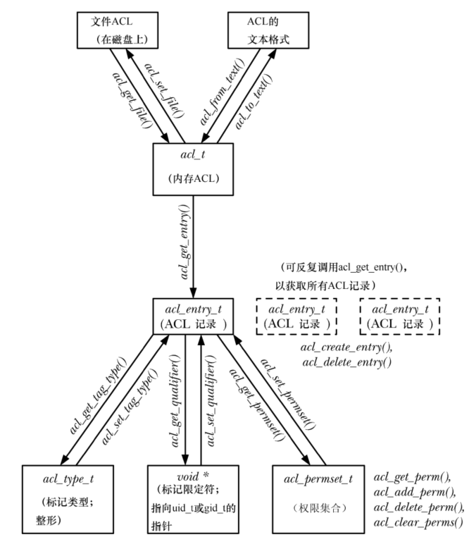

利用 ACL(访问控制列表)可以在任意数量的用户和组之中，为单个用户或组指定文件权限。

# 概述

一个 ACL 由一系列 ACL 记录(简称 ACE)组成，其中每条记录都针对单个用户或用户组定义了对文件的访问权限。


## ACL  记录

每条 ACE 都由 3 部分组成：

- 标记类型：该记录作用于一个用户、组，还是其他类别的用户
- 标记限定符(可选项)：标识特定的用户或组
- 权限集合：本字段包含所授予的权限信息(读、写及执行)

标记类型可以取值如下：

-  `ACL_USER_OBJ` ：带有该标记的 ACE 记录了授予文件属主的权限，每个 ACL 只能包含一条该类型标记的记录，该记录与传统的文件属主权限相对应
- `ACL_USER`：携带该值得 ACE 记录了授予某用户的权限，一个 ACL 可包含零条或多条此标记类型的记录，但针对一个特定用户最多只能定义一条此类记录
- `ACL_GROUP_OBJ`：包含该值得 ACE 记录了授予文件组的权限，每个 ACL 只会包含一条此标记类型的记录，除非 ACL 还包含类型为 "ACL_MASK" 的记录，否则此类记录对应于传统的文件组权限
- `ACL_GROUP` ：包含该值得 ACE 记录了授予某个组的权限，每个 ACL 可包含零条或多条此标记类型的记录，但针对一个特定组最多只能定义一条此类记录
- `ACL_MASK` ：包含该值的 ACE 记录了可由  `ACL_USER`, `ACL_GROUP_OBJ`, `ACL_GROUP` 型 ACE 所能授予的最高权限，一个 ACL 最多只能包含一条标记类型为 `ACL_MASK` 的 ACE，假如 ACL 含有标记类型为 `ACL_USER` 或 `ACL_GROUP`  的记录，那么就必须包含一条 `ACL_MASK`  型的 ACE
- `ACL_OTHER`：对于不匹配任何其他 ACE 的用户，由包含该值的 ACE 授予权限，每个 ACL 只能包含一条标记类型为 "ACL_OTHER" 的 ACE，该记录对应于传统的文件其他用户权限

## 最小 ACL 和扩展 ACL

最小化 ACL 语义上等同于传统的文件权限集合，恰好由 3 条记录组成，每条标记的类型分别是 ：`ACL_USER_OBJ`，`ACL_GROUP_OBJ`，`ACL_OTHER`。

扩展 ACL 则是除此之外，还包含标记类型为 `ACL_USER`，`ACL_GROUP`，`ACL_MASK` 的记录。

# ACL 权限检查算法

与传统的文件权限模型相比，对具有 ACL 的文件进行权限检查时，环境并没有什么不同，检查将按照下面的顺序执行，直到某个标准得到匹配：

- 若进程具有特权，则拥有所有访问权限
- 若某一进程的有效用户 ID 匹配文件的属主，则授予该进程标记类型为 `ACL_USER_OBJ`  的 ACE 所指定的权限
- 若进程的有效用户 ID 与某一  `ACL_USER` 类型记录的标记限定符相匹配，则授予该进程此记录所指定权限与 `ACL_MASK` 型记录值相与的结果
- 若进行的组 ID之一匹配于文件组型为 `ACL_GROUP_OBJ` 的 ACE，或者任一 `ACL_GROUP` 型记录的标记限定符，则会依次进行如下检查，直至发现匹配项：
  - 若进程组的 ID 之一匹配于文件组，且标记类型为 `ACL_GROUP_OBJ` 的 ACE 授予了所请求的权限，则会依据此记录来判定对文件的访问权限，则会依据此记录来判定对文件的访问权限，如果 ACL 中还包含来标记类型为 `ACL_MASK` 的 ACE，那么对该文件的访问权限将是两记录权限相与的结果
  - 若进程的组 ID 之一匹配于该文件所辖 `ACL_GROUP` 型 ACE 的标记限定符，且该 ACE 授予来所请求的权限，那么会依据此记录来判定对文件的访问权限，如果 ACL 中包含了 `ACL_MASK` 型  ACE，那么对该文件的访问权限应为两记录权限相与的结果
  - 否则，拒绝对该文件的访问
- 否则，将以 `ACL_OTHER` 型 ACE 所记录的权限授予进程

# ACL 的长、短文本格式

执行 `setfacl` 和 `getfacl` 命令，或是使用某些 ACL 库函数操纵 ACL 时，需指明 ACE 的文本表现形式，ACE 的文本格式有两种：

- 长文本格式的 ACL：每行包都包含一条 ACE，还可以包含注释，注释需以 `#`  开始，直至行尾结束
- 短文本格式的 ACL：包含一系列以 "," 分隔的 ACL 定义

无论是上述哪种格式，每条 ACE 都由 ":"  分隔的 3 部分组成：

```
tag-type:[tag-qualifier]:permissions
```

标记类型字段：


- 标记类型之后的标记限定符为可选项，采用名称或数字 ID 来标识用户或组，仅当标记类型为 `ACL_USER` 和 `ACL_GROUP` 时，才允许标记限定符的存在

# ACL_mask  型 ACE 和 ACL 组分类

如果一个 ACL 包含来标记类型为 `ACL_USER` 或 `ACL_GROUP` 的 ACE，那么也一定包含标记类型为 `ACL_MASK` 的 ACE，若 ACL 未包含任何标记类型为 `ACL_USER` 或 `ACL_GROUP` 的 ACE，那么标记类型为 `ACL_MASK`   的 ACE 则为可选项。

对于  `ACL_MASK` 标记类型的 ACE，其作用于是所谓 "组分类" 中 ACE 所能授予权限的上限，组分类是指在 ACL 中，由所有标记类型为 `ACL_USER`，`ACL_GROUP`，`ACL_GROUP_OBJ` 的 ACE 所组成的类型集合。

提供标记类型为 `ACL_MASK` 的 ACE，其目的在于即使运行并无 ACL 概念的应用程序，也能保障其行为的一致性。

# getfacl 和 setfacl 命令

`getfacl ` 命令可以查看应用于文件的 ACL。

`setfacl ` 命令可用来修改文件的 ACL。

# 默认 ACL 与文件创建

当进程访问与该 ACL 相关的文件时，将使用访问型 ACL 来判定进程对文件的访问权限。

针对目录，还可以创建第二种 ACL：默认型 ACL。访问目录时，默认型 ACL 并不参与判定所授予的权限，相反，默认型 ACL 的存在与否决定了在目录下所创建文件或子目录的 ACL 和权限。

查看和设置与目录相关的默认型 ACL，需要执行带有 `-d` 选项的 `getfacl` 和 `setfacl`。

执行 `setfacl -k` 可以删除针对目录而设置的默认型 ACL。

若针对目录设置了默认型 ACL，则：

- 新建与目录下的子目录会将该目录的默认型 ACL 继承为其默认型 ACL，即默认型 ACL 会随子目录的创建而沿目录树传播开来
- 新建于目录下的文件或子目录会将该目录的默认型 ACL 继承为其访问型 ACL

一旦目录拥有默认型 ACL，那么对于新建于该目录下的文件来说，进程的  `umask` 并不参与判定文件访问型 ACL 中所记录的权限。

# ACL 在实现方面的限制

各类文件系统都对一 ACL 中所包含记录的条数有所限制：

- 冗长的 ACL 将增加维护工作的复杂程序，且容易出错
- 扫描 ACL 寻找匹配记录所需的时间，将随记录条数的增长而增长

# ACL API

使用 ACL API 需要与 `libacl` 库链接，即编译时需要指定 `-lacl` 选项。

## 概述

_

## 将文件的 ACL 读入内存

 `acl_get_entry()` 返回一个句柄，指向内存 ACL 中的记录之一，句柄的返回位置由函数的最后一个参数指定：

```
acl_entry_t entry;
status = acl_get_entry(acl,entry_id,&entry);
```

- `entry_id` 参数决定了返回哪条记录的句柄：
  - `ACL_FIRST_ENTRY` ：返回的句柄指向 ACL 中的首条 ACE
  - `ACL_NEXT_ENTRY`：返回的句柄将指向上次获取记录之后的 ACE
- 成功获取一条 ACE， 返回 1，若无记录可取，则返回 0，失败返回 -1

## 获取并修改 ACL 记录中的属性

`acl_get_tag_type()` 和 `acl_set_tag_type()`  可分别用来获取和修改 ACL 记录中的标记类型：

```
acl_tag_t tag_type;

status = acl_get_tag_type(entry,&tag_type);
status = acl_set_tag_type(entry,&tag_type);
```

- `tag_type` 的取值可以是 `ACL_USER_OBJ`， `ACL_USER`， `ACL_GROUP_OBJ`， `ACL_GROUP`， `ACL_USER_OBJ`， `ACL_OTHER`， `ACL_MASK`

`acl_set_qualifier` 和 `acl_get_qualifier` 可以分别用来获取和修改 ACL 记录中的标记限定符：

```
uid_t* qualp;

qualp = acl_get_qualifier(entry);
qualp = acl_set_qualifier(entry,qualp);
```

- 仅当 ACE 的标记类型为 `ACL_USER` 或者 `ACL_GROUP` 时，标记限定符才有意义

`acl_get_permset()` 和  `acl_set_permset()` 可分别用来获取和修改 ACE 中的权限集合：

```
acl_permset permset;

status = acl_get_permset(entry,&permset);
status = acl_set_permset(entry,permset);
```

下列函数用来操纵某一权限集合中的内容：

```
int is_set;

is_set = acl_get_perm(permset,perm);
status = acl_add_perm(permset,perm);
status = acl_delete_perm(permset,perm);
status = acl_clear_perm(permset);
```

- `perm` 可以指定为 `ACL_READ`，`ACL_WRITE`，`ACL_EXECUTE`
- 若在权限集合中成功激活由 `perm`  参数指定的权限，`acl_get_perm()` 将返回1，否则返回0
- `acl_add_perm()` 用来向由 `permse` 参数所指定的权限集合中追加由 `perm` 参数指定的权限
- `acl_delete_perm()` 用来从 `permse` 参数所指代的权限集合中删除 `perm` 参数所指定的权限
- `acl_clear_perm()` 用来从 `permse` 参数所指代的权限集合中删除所有权限

## 创建和删除 ACE

`acl_create_entry()`  用来在现有 ACL 中新建一条记录，该函数会将一个指代新建 ACE 的句柄返回到由其第二个参数所指定的内存位置：

```
acl_entry_t entry;

status = acl_create_entry(&acl,&entry);
```

删除这一条 ACE 记录：

```
status = acl_delete_entry(acl,entry);
```

 ## 更新文件的 ACL

`acl_set_file()` 的作用与 `acl_get_file()` 相反，将使用驻留于内存的 ACL  内容来更新磁盘上的 ACL：

```
int status;
status = acl_set_file(pathname,type,acl);
```

如想更新访问型 ACL，则需将该函数的 `type`  参数指定为 `ACL_TYPE_ACCESS`；如果想要更新目录的默认型 ACL，则需将 `type` 指定为 `ACL_TYPE_DEFAULT`。

## ACL 在内存和文本格式之间的转换

`acl_from_text()` 可将包含文本格式的 ACL 的字符串转换为内存 ACL，并返回一个句柄，用以在后续函数调用中指代该 ACL：

```
acl = acl_from_text(acl_string);
```

`acl_to_text()` 则执行相反的转换，并同时返回对应于 ACL 的长文本格式字符串：

```
char* str;
ssize_t len;

str = acl_to_text(acl,&len);
```

## ACL API 中的其他函数

`acl_calc_mask(&acl)` 函数用来计算并设置内存 ACL 中的 `ACL_MASK` 型记录的权限。只要是修改或创建 ACL，就会用到该函数。

若参数 `acl`  所指定的 ACL 有效，`acl_valid(acl)` 函数将返回 0，否则返回 -1。

若以下所有条件成立，则可判定该 ACL 有效：

- `ACL_USER_OBJ`，`ACL_GROUP_OBJ`，`ACL_OTHER` 类型的记录都只能有一条
- 若有任一 `ACL_USER` 或者 `ACL_GROUP` 类型的记录存在，则必然存在一条 `ACL_MASK` 记录
- 标记类型为 `ACL_MASK`   的  ACE 至多有一条
- 每条标记类型为 `ACL_USER` 的记录都有唯一的用户 ID
- 每条标记类型为 `ACL_GROUP` 的记录都有唯一的组 ID

`acl_delete_def_file`  用来删除目录的默认型 ACL。

`acl_init(count)` 用来创建一个空的 ACL 结构，其空间足以容纳由参数 `count` 指定的记录数。

`acl_dup(acl)`  用来为由 `acl` 参数所指定的  ACL 创建副本，并以该 ACL 副本的句柄作为返回值。

`acl_free(handle)` 用来释放由其他 ACL 函数所分配的内存。


