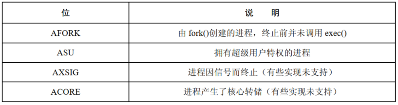
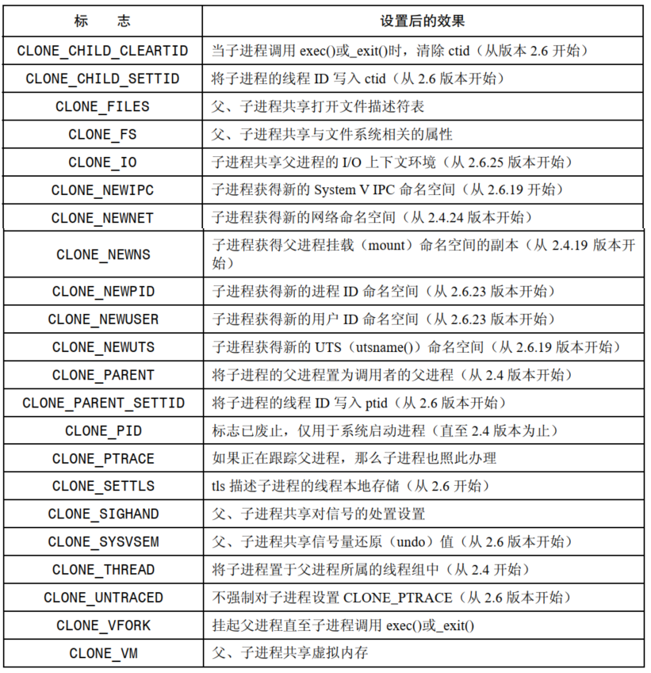

# 进程记账

打开进程记账功能后，内核会在每个进程终止时将一条记账信息写入系统级的进程记账文件。账单记录包含了内核为进程所维护的多种信息，包括终止状态以及进程消耗的 CPU 时间。

`sa` 工具可以对账单文件进行汇总，`lastcomm`  则就向前执行的命令列出相关信息或是定制应用，可以对记账文件进行分析。

## 打开和关闭进程记账功能

```
#define _BSD_SOURCE
#include <unistd.h>

int acct(const char *acctfile);
```

- 特权进程可以利用系统调用 `acct()` 来打开和关闭进程记账功能
- 为了打开进程记账单功能，需要在参数  `acctfile` 中指定一个现有常规文件的路径名，通常是：`/var/log/pacct` 或者 `/usr/account/pacct`，如果想关闭进程记账功能，指定 `acct`  为 `NULL` 即可

## 进程账单记录

一旦打开进程记账功能，每当一进程终止时，就会有一条 `acct` 记录写入记账文件，`acct`  结构定义于 `<sys/acct.h>` 中，具体如下：

```
struct acct
{
  char ac_flag;                        /* Flags.  */
  u_int16_t ac_uid;                /* Real user ID.  */
  u_int16_t ac_gid;                /* Real group ID.  */
  u_int16_t ac_tty;                /* Controlling terminal.  */
  
  u_int32_t ac_btime;                /* Beginning time.  */
  comp_t ac_utime;                /* User time.  */
  comp_t ac_stime;                /* System time.  */
  comp_t ac_etime;                /* Elapsed time.  */
  comp_t ac_mem;                /* Average memory usage.  */
  comp_t ac_io;                        /* Chars transferred.  */
  
  comp_t ac_rw;                        /* Blocks read or written.  */
  comp_t ac_minflt;                /* Minor pagefaults.  */
  comp_t ac_majflt;                /* Major pagefaults.  */
  comp_t ac_swaps;                /* Number of swaps.  */
  u_int32_t ac_exitcode;        /* Process exitcode.  */
  
  #define ACCT_COMM 16
  char ac_comm[ACCT_COMM+1];        /* Command name.  */
  char ac_pad[10];                /* Padding bytes.  */
};
```

- `ac_flag` 是为进程记录多种事件的位掩码：



- `ac_comm` 记录了该进程最后执行的命令名称
- 如果系统崩溃，不会为当前运行的进程记录任何记账信息

# 系统调用 `clone()`

`clone()` 是 Linux 特有的系统调用，用于创建一个新进程。

```
#define _GNU_SOURCE
#include <sched.h>

int clone(int (*fn)(void *), void *stack, int flags, void *arg, .../* pid_t *parent_tid, void *tls, pid_t *child_tid */ );
```

- `clone()` 生成的子进程将去调用 `fn` 指定的函数，`arg` 指定了函数的参数，当函数返回，此时其返回值就是进程的退出状态，或者调用  `exit()` 和 `_exit()` 使克隆的子进程终止，父进程可以使用 `wait()` 之类的函数等待克隆的子进程
- 因为克隆产生的子进程可能共享父进程的内存，所以不能使用父进程的栈，调用者需要动态分配大小合适的内存并置于 `stack` 参数中，供子进程使用，因为大多数硬件架构中，栈空间的增长的方向是向下的，所以 `stack` 应当指向所分配的内存块的高端
- 对于内核而言，`fork()`，`vfork()`，`clone()` 最终均由 `do_fork()`  提供支持
- `flags` 参数有两个作用：
  - 低字节存放着子进程的终止信号，子进程退出时其父进程将收到这一信号，如果该字节是0，将不会产生任何信号
  - 剩余的字节存放着位掩码，用于控制 `clone()` 操作：



-  `pod`，`tls`，`ctid` 这些参数与线程的实现有关，尤其是针对线程 ID 以及线程的本地存储

## `clone()` 的 `flags` 参数

### 共享文件描述符表：`CLONE_FILES`

如果指定了 `CLONE_FILES`，父子进程将会共享同一个打开文件描述表，POSIX 线程规范要求进程中的所有线程共享相同的打开文件描述符，如果没有设置，子进程获取的是父进程的文件描述表的一份拷贝。

### 共享文件系统相关的信息：`CLONE_FS`

如果指定了 `CLONE_FS`，那么父、子进程将共享文件系统相关的信息：权限掩码，根目录，以及当前工作目录。如果没有设置，那么父、子进程对此类信息各会持有一份。

### 共享对信号的处置设置：`CLONE_SIGHAND`

如果指定了 `CLONE_SIGHAND`，那么父、子进程将共享同一个信号处置表，如果没有设置，子进程将只是获取父进程信号处置表的一个副本。

### 共享父进程的虚拟内存：`CLONE_VM`

如果指定了 `CLONE_VM`，父、子进程将会共享同一份虚拟内存页，如果没有设置，子进程将得到父进程虚拟内存的拷贝，共享同一虚拟内存是线程的关键属性之一。

### 线程组 `CLONE_THREAD`


