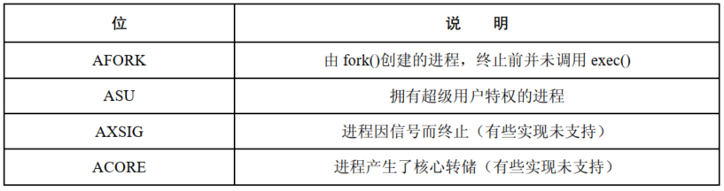
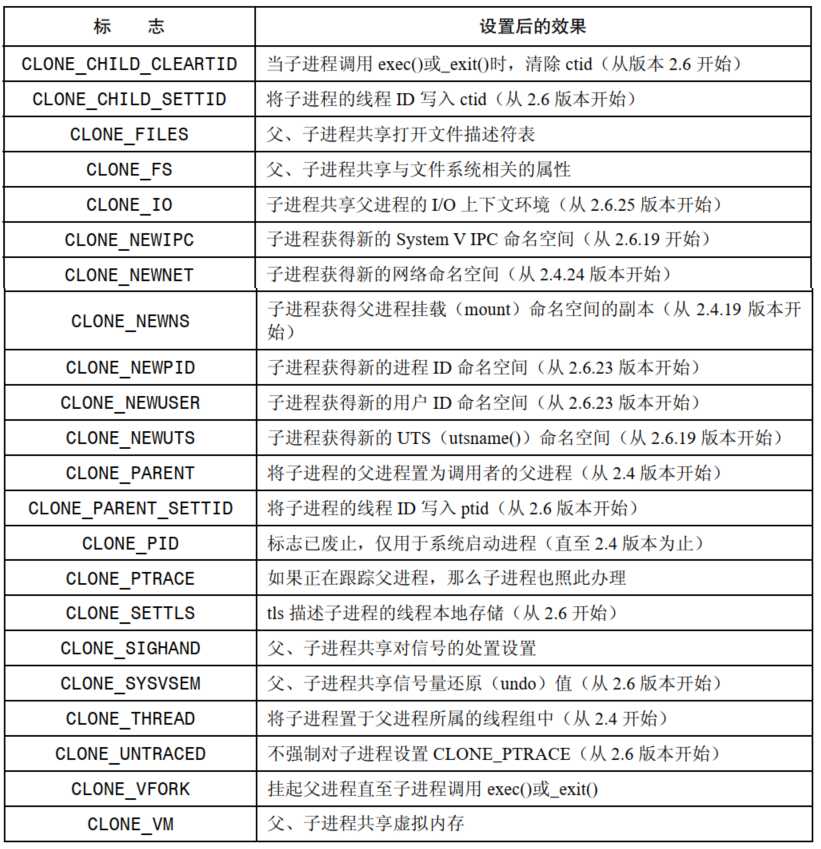

# 进程记账

打开进程记账功能后，内核会在每个进程终止时将一条记账信息写入系统级的进程记账文件。账单记录包含了内核为进程所维护的多种信息，包括终止状态以及进程消耗的 CPU 时间。

`sa` 工具可以对账单文件进行汇总，`lastcomm`  则就向前执行的命令列出相关信息或是定制应用，可以对记账文件进行分析。

## 打开和关闭进程记账功能

```
#define _BSD_SOURCE
#include <unistd.h>

int acct(const char *acctfile);
```

- 特权进程可以利用系统调用 `acct()` 来打开和关闭进程记账功能
- 为了打开进程记账单功能，需要在参数  `acctfile` 中指定一个现有常规文件的路径名，通常是：`/var/log/pacct` 或者 `/usr/account/pacct`，如果想关闭进程记账功能，指定 `acct`  为 `NULL` 即可

## 进程账单记录

一旦打开进程记账功能，每当一进程终止时，就会有一条 `acct` 记录写入记账文件，`acct`  结构定义于 `<sys/acct.h>` 中，具体如下：

```
struct acct
{
  char ac_flag;                        /* Flags.  */
  u_int16_t ac_uid;                /* Real user ID.  */
  u_int16_t ac_gid;                /* Real group ID.  */
  u_int16_t ac_tty;                /* Controlling terminal.  */
  
  u_int32_t ac_btime;                /* Beginning time.  */
  comp_t ac_utime;                /* User time.  */
  comp_t ac_stime;                /* System time.  */
  comp_t ac_etime;                /* Elapsed time.  */
  comp_t ac_mem;                /* Average memory usage.  */
  comp_t ac_io;                        /* Chars transferred.  */
  
  comp_t ac_rw;                        /* Blocks read or written.  */
  comp_t ac_minflt;                /* Minor pagefaults.  */
  comp_t ac_majflt;                /* Major pagefaults.  */
  comp_t ac_swaps;                /* Number of swaps.  */
  u_int32_t ac_exitcode;        /* Process exitcode.  */
  
  #define ACCT_COMM 16
  char ac_comm[ACCT_COMM+1];        /* Command name.  */
  char ac_pad[10];                /* Padding bytes.  */
};
```

- `ac_flag` 是为进程记录多种事件的位掩码：



- `ac_comm` 记录了该进程最后执行的命令名称
- 如果系统崩溃，不会为当前运行的进程记录任何记账信息

# 系统调用 `clone()`

`clone()` 是 Linux 特有的系统调用，用于创建一个新进程。

```
#define _GNU_SOURCE
#include <sched.h>

int clone(int (*fn)(void *), void *stack, int flags, void *arg, .../* pid_t *parent_tid, void *tls, pid_t *child_tid */ );
```

- `clone()` 生成的子进程将去调用 `fn` 指定的函数，`arg` 指定了函数的参数，当函数返回，此时其返回值就是进程的退出状态，或者调用  `exit()` 和 `_exit()` 使克隆的子进程终止，父进程可以使用 `wait()` 之类的函数等待克隆的子进程
- 因为克隆产生的子进程可能共享父进程的内存，所以不能使用父进程的栈，调用者需要动态分配大小合适的内存并置于 `stack` 参数中，供子进程使用，因为大多数硬件架构中，栈空间的增长的方向是向下的，所以 `stack` 应当指向所分配的内存块的高端
- 对于内核而言，`fork()`，`vfork()`，`clone()` 最终均由 `do_fork()`  提供支持
- `flags` 参数有两个作用：
  - 低字节存放着子进程的终止信号，子进程退出时其父进程将收到这一信号，如果该字节是0，将不会产生任何信号
  - 剩余的字节存放着位掩码，用于控制 `clone()` 操作：



-  `pod`，`tls`，`ctid` 这些参数与线程的实现有关，尤其是针对线程 ID 以及线程的本地存储

## `clone()` 的 `flags` 参数

### 共享文件描述符表：`CLONE_FILES`

如果指定了 `CLONE_FILES`，父子进程将会共享同一个打开文件描述表，POSIX 线程规范要求进程中的所有线程共享相同的打开文件描述符，如果没有设置，子进程获取的是父进程的文件描述表的一份拷贝。

### 共享文件系统相关的信息：`CLONE_FS`

如果指定了 `CLONE_FS`，那么父、子进程将共享文件系统相关的信息：权限掩码，根目录，以及当前工作目录。如果没有设置，那么父、子进程对此类信息各会持有一份。

### 共享对信号的处置设置：`CLONE_SIGHAND`

如果指定了 `CLONE_SIGHAND`，那么父、子进程将共享同一个信号处置表，如果没有设置，子进程将只是获取父进程信号处置表的一个副本。

### 共享父进程的虚拟内存：`CLONE_VM`

如果指定了 `CLONE_VM`，父、子进程将会共享同一份虚拟内存页，如果没有设置，子进程将得到父进程虚拟内存的拷贝，共享同一虚拟内存是线程的关键属性之一。

### 线程组 `CLONE_THREAD`

如果指定了 `CLONE_THREAD`，会将子进程置于父进程的线程组中，如果没有设置，那么将会把子进程置于新的线程组中。

Linux threads 曾将 POSIX 线程实现位共享了多种属性、进程 ID 又各不相同的进程：


一个线程组内的每个线程都拥有一个唯一的线程标识符：thread identifier(TID)，用以标识自身，可以通过 `gettid()` 获取该值，线程 ID 在整个系统中是唯一的，除了线程担当进程在线程组首线程的情况外，内核能够保证系统中不会出现线程 ID 与进程 ID 相同的情况。

线程组中首个线程的线程 ID 与其它线程组 ID 相同，也将该线程称之为线程组首线程，thread group leader。

线程组中所有线程拥有同一父进程 ID，即与线程组首线程 ID 相同，仅当线程组中的所有线程都终止后，其父进程才会收到 `SIGVHLD` 信号，或者其他信号。

当一个设置了 `CLONE_THREAD` 的线程终止时，并没有信号发送给该线程的创建者，即调用 `clone()` 创建终止线程的线程，相应的，也不能调用 `wait()` 来等待一个以 `CLONE_THREAD` 标志创建的线程，这与 POSIX 要求一致，POSIX 线程与进程不同，不能使用 `wait()`，必须调用 `pthread_join()`。

如果一个线程组中任一线程调用了 `exec()`，那么除了首线程之外的其他线程都会终止，新进程将在首线程中执行，如果线程组中的某个线程调用 `fork()` 或者 `vfork()` 创建了子进程，那么组中的任何线程都可以使用 `wait()` 或类似的函数来监控子进程。

### 线程库支持：`CLONE_PARENT_SETTID`、 `CLONE_CHILD_SETTID` 和 `CLONE_CHILD_CLEARTID`

这些标志将会影响 `clone()` 对参数 `ptid`  和 `ctid` 的处理。

如果设置了 `CLONE_PARENT_SETTID`，内核会将子线程的线程 ID 写入  `ptid` 所指向的位置，在对父进程的内存进行复制之前，会将线程 ID 复制到 `ptid` 所指位置。

如果设置了 `CLONE_CHILD_SETTID`，那么将会把子线程的线程 ID 写入指针 `ctid` 所指向的位置。

如果设置了 `CLONE_CHILD_CLEARTID`，那么会在子进程终止时将 `ctid` 所指向的内存内容清零。

内核将 `ctid` 指向的位置视同 `futex`，这是一种有效的同步机制，执行系统调用 `futex()` 来监测 `ctid` 的所指位置的内容变化，就可以获得线程终止的通知，这也是 `pthread_join()` 所做的幕后工作，内核在清除 `ctid` 的同时，也会唤醒那些调用了 `futex()` 来监控该地址内容变化的任一内核调度实体(即线程)，在 POSIX 线程层面上，这将导致 `pthread_join()` 调用去解除阻塞。

### 线程本地存储：`CLONE_SETTLS`

如果设置了 `CLONE_SETTLS`，那么参数 `tls` 指向的 `user_desc` 结构会对该线程所使用的线程本地存储缓冲区加以描述。

### 共享 System V 信号量的撤销值：`CLONE_SYSSEM`

如果设置了 `CLONE_SYSSEM`，父、子进程将共享同一个 System V 信号量撤销值列表。如果没有设置，父、子进程将各自持有取消列表，且子进程的列表初始为空。

### 每进程挂载命名空间：`CLONE_NEWNS`

挂载命名空间是由对  `mount()` 和 `umount()` 的调用来维护的一组挂载点，挂载命名空间会影响路径名解析为真实文件的过程，也会波及如 `chdir()` 和 `chroot()` 之类的系统调用。

默认情况下，父、子进程共享同一挂载命名空间，一个进程调用 `mount()` 或 `umount()` 对命名空间所做的改变，也会为其他进程所见。

无需也不允许在同一  `clone()` 调用中同时指定 `CLONE_NEWNS` 和  `CLONE_FS`。

### 将子进程的父进程置为调用者的父进程：`CLONE_PARENT`

默认情况下，`clone()` 创建新进程时，新进程的父进程就是调用  `clone()` 的进程，如果设置了 `CLONE_PARENT` 标志，那么调用者的父进程就成为子进程的父进程，也就是：子进程.PPID = 调用者.PPID，如果没有设置则 子进程.PPID = 调用者.PID。

### 将子进程的进程 ID 置为与父进程相同：`CLONE_PID`(已废止)

如果设置了 `CLONE_PID`，那么子进程就拥有与父进程相同的进程 ID，如果没有设置，则父、子进程的进程 ID 则不同。

### 进程跟踪：`CLONE_PTRACE`  和 `CLONE_UNTRACED`

如果设置了 `CLONE_PTRACE` 且正在跟踪调用进程，那么也会对子进程进行跟踪。

如果设置了 `CLONE_UNTRACED`，意味着跟踪进程不能强制将其子进程设置为 `CLONE_PTRACE`，`CLONE_UNTRACED` 标志供内核创建内核线程时内部使用。

### 挂起父进程直至子进程退出或调用 `exec()`:`CLONE_VFORK`

如果设置了 `CLONE_VFORK`，父进程将一直挂起，直至子进程调用 `exec()` 或者 `_exit()` 来释放虚拟内存资源为止。

### 支持容器的 `clone()` 新标志

`CLONE_IO`，`CLONE_NEWIPD`，`CLONE_NEWNET`，`CLONE_NEWPID`，`CLONE_NEWUSER`，`CLONE_NEWUTS` 这些标志中的大部分都是为容器的实现提供支持，容器是轻量级虚拟化的一种形式，将运行于同一内核的进程组从环境上彼此隔离，如同运行在不同机器上一样，容器可以嵌套，一个容器可以包含另一个容器。与完全虚拟化将每个虚拟环境运行于不同内核的手法相比，容器的运作方式可谓是大相径庭。

容器的用途：

- 控制系统的资源分配，诸如网络带宽或 CPU 时间
- 在单台主机上提供多个轻量级虚拟服务器
- 冻结某个容器，以此来挂起容器中所有进程的执行，并于稍后重启，可能是在迁移到另一台机器之后
- 允许转储应用程序的状态信息，记录于检查点，并于之后再行恢复，从检查点开始继续运行

### `clone()` 标志的使用

大体上 `fork()`  相当于仅设置了 `flags` 为 `SIGCHLD` 的 `clone()` 调用，而 `vfork()` 则对应于设置如下 `flags` 的 `clone()`：

```
CLONE_VM | CLONE_VFORK | SIGCHLD
```

LinuxThreads 线程实现使用 `clone()` 来创建线程，对 `flags` 的设置如下：

```
CLONE_VM | CLONE_FILES | CLONE_FS | CLONE_SIGHAND
```

NPTL 线程实现则使用 `clone()` 来创建线程，对 `flags` 的设置如下：

```
CLONE_SETTLS | CLONE_PARENT_SETTID | CLONE_CHILD_CLEARTID | CLONE_SYSVSEM
```

## 因克隆生成的子进程而对 `waitpid()` 进行的扩展

为等待由 `clone()` 产生的子进程，`waitpid()`，`wait3()`，`wait4()` 的位掩码参数 `options` 可以包含如下附加值：

- `__WCLONE`：一经设置，只会等待克隆子进程，如未设置，只会等待非克隆子进程。在这种情况下，克隆子进程终止时发送给其父进程的信号并非 `SIGCHLD`，如果同时还指定了 `__wALL`，那么将忽略 `__WCLONE`
- `__WALL`：等待所有子进程，无论类型(克隆或者非克隆)

- `__WNOTHREAD`：默认情况下，等待 `wait`  类调用所等待的子进程，其父进程的范围遍及与调用者隶属于同一线程组的任何进程，指定 `__WNOTHREAD`  标志则限制调用者只能等待自己的子进程

`waitid()` 不能使用上述标志。

# 进程的创建速度

不同方式创建 10 万个进程所需时间：


统计项：

- 第一项：执行 10 万次进程创建期间实际消耗的时间以及父进程所消耗的时间(括号内的值)，两者之间的差值应是测试期间创建子进程所消耗的时间总量
- 第二项：每秒实际创建的进程数，即创建速率，取自各种情况下运行 20 次的平均值
- 第三项：子进程在创建后立即退出，父进程等待子进程终止后再去创建下一个子进程的创建速率

进程创建方法的比较：

- `fork()` 进程占内存越大，所需时间也就越长，额外的时间花在了为子进程复制那些逐渐变大的页表，以及将数据段、堆段以及栈段的页记录标记为只读的工作上，因为子进程并未修改数据段或者栈段，所以也没有对页复制
- `vfork()` 尽管进程大小在增加，但所用时间保持不变，因为调用 `vfork()` 时并未复制页表或页，调用进程的虚拟内存大小并未造成影响，`fork()` 和 `vfork()` 在时间统计上的差值就是复制进程页表所需的时间总量
- `clone()` 采用的标志是 `CLONE_VM | CLONE_VFORK | CLONE_FS| CLONE_SIGHAND | CLONE_FILES `，`clone()` 和 `vfork()` 的差值代表了 `vfork()` 将这些信息拷贝到子进程的少量额外工作，拷贝文件系统属性和信号处置表的成本是固定的，不过，拷贝打开文件描述符表的开销则取决于描述符的数量

`fork()` 和 `vfork()` 的差别：

- 在大进程情况下，`vfork()` 要比 `fork()` 快 30 倍
- 因为进程的创建时间往往比 `exec()` 的执行时间要少得多，所以随后执行 `exec()` 两者之间的差异就不再那么明显

# `exec()` 和 `fork()` 对进程属性的影响


